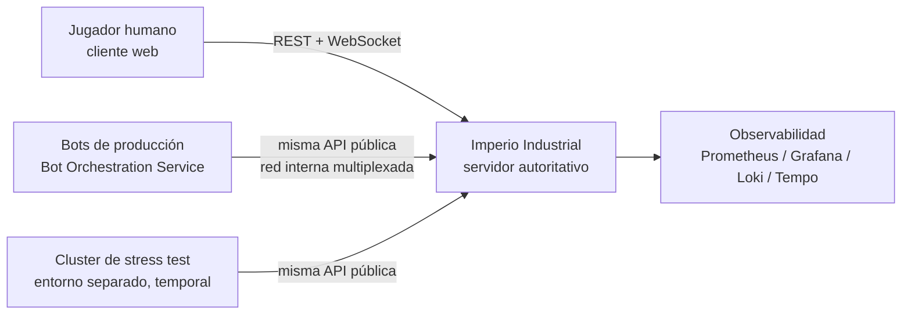
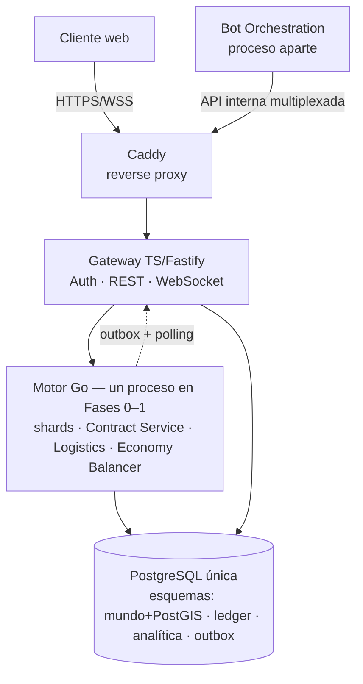
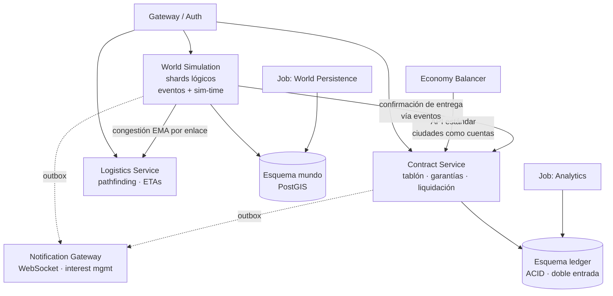

# Arquitectura del Proyecto – Imperio Industrial

## 1. Información General

**Proyecto:** Imperio Industrial — Simulación Económica MMO

**Versión del Documento:** 1.1 (derivada del GDD/SAD v1.2; alineada con la implementación v1)

**Fecha:** 2026-07-15

**Responsables:** Equipo de Arquitectura / Backend

**Changelog:**

| Versión | Fecha | Cambios |
|---|---|---|
| 1.1 | 2026-07-15 | Alineación con la implementación v1: PostgreSQL 18 + UUIDv7 nativo (ADR-IMPL-01), acceso a datos sin codegen (ADR-IMPL-04), reparto de procesos gateway/motor (ADR-IMPL-03), árbol real del monorepo, cabecera `Idempotency-Key` (openapi v1.1.0) y protocolo WS normativo (`specs/ws-protocol.md`); ADRs 016–021 añadidos. Registro completo de decisiones de implementación en `docs/desarrollo.md` |
| 1.0 | 2026-07-15 | Versión inicial, derivada del GDD/SAD v1.2 |

**Descripción General**
Este documento describe la arquitectura técnica del proyecto **Imperio Industrial**, un MMO de simulación económica, industrial y logística en un mundo único persistente, compartido por decenas de miles de jugadores humanos y una población permanente de bots. Incluye sus decisiones de diseño, estructura de componentes, flujos principales y estándares de desarrollo. El objetivo es servir como referencia técnica para el equipo, stakeholders y auditorías futuras.

Los tres invariantes arquitectónicos que gobiernan todo el diseño son:

1. **El valor económico nunca se pierde ni se duplica**: dinero, stock comprometido y contratos viven en un ledger de doble entrada con consistencia ACID estricta; las invariantes se garantizan en la base de datos, no en código de aplicación.
2. **El coste de simulación es proporcional a los eventos, no a las entidades**: motor event-driven sin tick global; las magnitudes continuas se derivan analíticamente bajo demanda.
3. **Las fronteras lógicas son firmes desde el día 1; la topología física es progresiva**: monolito modular en Fases 0–1, extracción a procesos separados solo cuando la medición lo exija.

---

## 2. Alcance del Documento

Este documento cubre:
- Arquitectura de software a nivel sistema (modelo C4, niveles 1–3)
- Principales decisiones arquitectónicas (ADR), consolidadas desde el Anexo B del GDD
- Estructura del proyecto y convenciones
- Patrones de diseño y principios técnicos
- Estrategia de escalabilidad y sus límites asumidos

Fuera de alcance:
- Diseño de gameplay y balance económico (ver GDD, secciones 2–13)
- Detalles de implementación de bajo nivel (algoritmos de pathfinding, fórmulas de demanda)
- Manuales de operación o despliegue (runbooks)

---

## 3. Contexto del Sistema (C4 – Nivel 1)

### 3.1 Descripción

Imperio Industrial es un sistema **cliente-servidor autoritativo**: el servidor es la única fuente de verdad y los clientes (web) solo envían intenciones y renderizan estado. Interactúan con el sistema tres tipos de actores:

- **Jugadores humanos**: acceden mediante un cliente web (REST para operaciones, WebSocket para eventos en tiempo real de su área de interés).
- **Bots de producción**: residentes permanentes del mundo, ejecutados por el Bot Orchestration Service como procesos externos que consumen **exactamente la misma API pública** que los humanos (igualdad de API literal, mismos rate limits lógicos). El motor no distingue el origen de un comando.
- **Cluster de stress test**: entorno efímero y separado que conecta cientos de miles de bots contra las mismas APIs para validar escalabilidad y balance antes de desplegar a producción. Nunca toca el mundo real.

No existen dependencias de sistemas externos de terceros en el camino crítico de juego: la economía es cerrada y endógena. Los únicos sistemas de soporte externos al dominio son autenticación/identidad y la plataforma de observabilidad.

### 3.2 Diagrama de Contexto



---

## 4. Contenedores del Sistema (C4 – Nivel 2)

### 4.1 Descripción de Contenedores

En Fases 0–1 la topología física es un **monolito modular**: pocas unidades desplegables con fronteras internas estrictas. Las cajas lógicas del diagrama **no** implican procesos separados desde el inicio (ver ADR-008 y sección 11 de este documento).

| Contenedor | Tecnología | Responsabilidad |
|-----------|------------|-----------------|
| Motor de simulación (shards + contratos + logística + balancer) | Go 1.22 + pgx/v5 (SQL explícito, sin sqlc — ADR-IMPL-04) | Simulación del mundo por shards lógicos dirigida por tiempo: sim-clock, producción, tránsito, sorteos y liquidaciones del CCRI, pathfinding, balance macroeconómico, outbox. Un solo proceso en Fases 0–1 con módulos tras fronteras estrictas (paquetes con interfaces, sin imports cruzados). |
| Gateway web / Auth / Presentación | TypeScript + Fastify 5 + pg/node-postgres (SQL explícito, sin Drizzle — ADR-IMPL-04) | API pública REST, autenticación y sesiones, Notification/Event Gateway (WebSocket con interest management). En v1 ejecuta además el camino de comando (transacciones `SERIALIZABLE` contra la base — ADR-IMPL-03, ver §5.1). |
| Bot Orchestration Service | Proceso aparte (consume la API como un cliente) | Ciclo de vida de la población de bots: modo mundo vivo, densidad dinámica, y aprovisionamiento del cluster de stress test. |
| Base de datos | PostgreSQL 18 (única instancia) + PostGIS | Persistencia de todo el sistema con esquemas separados por dominio: auth, mundo/espacial, ledger/contratos (ACID), analítica, outbox de eventos. Identificadores `uuid DEFAULT uuidv7()` nativos (ADR-IMPL-01). TimescaleDB solo si el volumen medido lo justifica. |
| Mensajería entre módulos | Outbox table + polling sobre PostgreSQL | Propagación asíncrona de eventos de dominio. Kafka (con schema registry) solo en Fase 2+ y solo si el volumen lo exige. |
| Reverse proxy | Caddy | Terminación TLS y enrutado. |
| Despliegue | Docker Compose sobre hosts administrados manualmente | Plataforma definitiva y asumida (no transitoria); impone el techo de capacidad explícito de la sección 11.2. |

*(v1 implementada — despliegue de desarrollo real: `infra/docker-compose.yml` levanta solo la base de datos (`postgis/postgis:18-3.6`) y el edge (`caddy:2`, `:8000` → `/api/*` y `/ws` al gateway `:8080`, resto al dev server del frontend `:3000`); motor, gateway, bots y frontend corren como procesos en el host, orquestados por el Makefile raíz. Smoke end-to-end reproducible: `make verify` (`infra/verify.sh`). Ver `docs/desarrollo.md`.)*

### 4.2 Diagrama de Contenedores



*(v1 implementada: la flecha Gateway → Motor es lógica, no una API interna — en v1 gateway y motor se comunican exclusivamente a través de PostgreSQL: el gateway escribe comandos con SQL `SERIALIZABLE` y lee la outbox por polling; el motor ejecuta lo dirigido por tiempo — ver ADR-IMPL-03 en `docs/desarrollo.md` y la nota de §5.1.)*

---

## 5. Componentes Principales (C4 – Nivel 3)

### 5.1 Organización Lógica

El sistema define **7 servicios lógicos y 2 jobs de plataforma** cuyas fronteras son firmes desde el día 1, independientemente de su materialización física:

| Componente lógico | Responsabilidad |
|-----|-----------------|
| Auth/Identity | Autenticación, sesiones, gestión de cuentas. Jugadores y bots comparten el mismo modelo de cuenta. |
| World Simulation Service (por shard lógico) | Física de edificios, producción, recursos naturales y **simulación de tránsito completa** (movimiento, averías, congestión) de los vehículos dentro de su macro-región. Cola de prioridad de eventos y sim-time propios por shard. |
| Contract Service | Tablón global de contratos, ventana de sorteo, bloqueo triple de garantías (stock reservado + garantía monetaria + escrow), verificación de entrega y liquidación pro-rata, para los dos tipos de contrato (CCRI de bienes y CCRI-Flete). Historial de contratos liquidados (OHLC). |
| Logistics Service | Planificación **sin estado de tránsito**: topología del grafo global, pathfinding jerárquico (HPA*-style), ETAs a partir de la congestión suavizada (EMA) que publican los shards. No simula vehículos. |
| Economy Balancer Service | Monitoreo macro (masa monetaria vs. PIB simulado), ajuste de impuestos/cánones dentro de rangos, curvas de demanda de ciudades, costo laboral regional por fórmula. Actúa como **agente decisor de las ciudades**, publicando sus solicitudes de compra por la API estándar del Contract Service (sin canal privilegiado). |
| Bot Orchestration Service | Población permanente de bots, densidad dinámica según actividad humana regional, aprovisionamiento del stress test. |
| Notification/Event Gateway | Distribución WebSocket de eventos por área de interés; el tablón global se consulta bajo demanda (pull), nunca por push mundial. |
| *Job:* World Persistence | Snapshots periódicos de shards y backups (RPO/RTO definidos; snapshot global consistente en la ventana de mantenimiento diaria). Aislado de cargas batch. |
| *Job:* Analytics | Agregación de métricas y estadísticas de mercado (batch de baja prioridad, nunca compite con Persistence). |

*(v1 implementada — reparto real de procesos, ver ADR-IMPL-03 en `docs/desarrollo.md`: las fronteras lógicas de esta tabla se conservan, pero su materialización física v1 es la siguiente. El **camino de comando** (publicar, aceptar, construir, comprar…) vive en el **gateway**, que lo ejecuta directamente contra SQL en transacciones `SERIALIZABLE` — las invariantes viven en la base (triggers/funciones), así que ningún proceso puede romper la contabilidad (ADR-005). El **motor Go** ejecuta todo lo dirigido por tiempo: avance del sim-clock, fin de lotes de producción, tránsito y averías, cierre de ventanas de sorteo, liquidación de vencimientos, balancer y emisión de eventos outbox. La frontera lógica del Contract Service no desaparece: su cara de comando se materializa en el gateway y su cara temporal (sorteo, liquidación — los flujos que mueven dinero por tiempo) sigue en Go. Además, la "cola de prioridad de eventos" por shard se materializa como scheduler dirigido por la base: consultas indexadas por vencimiento, mismo perfil de coste ∝ eventos y durabilidad gratis — ADR-IMPL-07.)*

### 5.2 Diagrama de Componentes



### 5.3 Flujos principales

**Ciclo de vida del CCRI (camino crítico del sistema):**

1. **Publicación** — la garantía propia se bloquea íntegramente al publicar (stock congelado del vendedor + 10% monetario, o 100% del pago del comprador en escrow). Invariante: *toda publicación visible en el tablón es ejecutable al 100%*, por construcción.
2. **Aceptación** — ventana de sorteo (30–60 s reales) con orden aleatorio entre aceptantes: la latencia no otorga ventaja (ni a bots ni a scripts). Aceptación total o parcial (K de N divide la publicación).
3. **Confirmación atómica** — bloqueo triple (stock reservado + garantía + escrow) en **una única transacción ACID local** del ledger, posible porque el inventario comprometible se modela como cuentas del mismo ledger que el dinero. Sin 2PC ni sagas.
4. **Ejecución logística** — el cargamento etiquetado con `contract_id` viaja físicamente; el shard confirma cada llegada parcial.
5. **Liquidación pro-rata** — se paga lo entregado a tiempo; sobre lo faltante, el escrow vuelve al comprador y la garantía del vendedor se reparte entre compensación y sink. El stock no entregado se libera **en su ubicación física actual** (nada se teletransporta, tampoco en los fallos).

*(v1 implementada: los pasos 1–2 — publicación y aceptación — son comandos y se ejecutan en el gateway (SQL `SERIALIZABLE`); los pasos 3–5 — cierre de ventana con sorteo, tránsito y liquidación — los ejecuta el motor Go invocando las funciones todo-o-nada del ledger (`ledger.confirm_contract`, `ledger.settle_contract_prorata`). Ver ADR-IMPL-03 en `docs/desarrollo.md`.)*

**Movimiento de un vehículo (motor event-driven):**

- Se almacena `(estado_inicial, t_inicio, función_de_avance)`; la posición se deriva analíticamente cuando alguien la observa. Solo los **hitos** (salida, llegada a nodo, cruce de frontera, avería) generan eventos y escrituras. Un vehículo en un tramo largo sin incidencias no consume CPU.
- El cruce de frontera entre shards es, en el plan base (proceso único), un traspaso local entre colas de eventos. El protocolo formal de handoff multi-proceso (SELLADO → COPIADO → ACTIVADO → PURGADO, con `transfer_id` idempotente y el ledger como árbitro contable) queda **especificado pero no construido** hasta la extracción medida.

---

## 6. Stack Tecnológico

### 6.1 Tecnologías Principales

- Runtime: procesos nativos Go 1.22 (motor) y Node.js (gateway), sobre Docker Compose (en desarrollo, compose levanta solo PostgreSQL y Caddy; los servicios corren en el host — ver §4.1)
- Lenguajes: **Go** (motor de simulación y la cara temporal del Contract Service — el código que mueve dinero por tiempo se decide explícitamente, no por descarte) y **TypeScript** (gateway, auth, presentación, camino de comando — ADR-IMPL-03)
- Frameworks: Fastify 5 + `pg` (node-postgres) con SQL explícito (TS); `pgx/v5` con SQL explícito (Go). *(v1 implementada: sin Drizzle ORM ni sqlc — el codegen se descartó porque el SQL del dominio ya vive en la base; ver ADR-IMPL-04 en `docs/desarrollo.md`)*
- Persistencia: **PostgreSQL 18, una sola instancia** con esquemas por dominio e identificadores `uuidv7()` nativos (ADR-IMPL-01); extensiones PostGIS (espacial; imagen dev `postgis/postgis:18-3.6`) y TimescaleDB (solo si el volumen lo justifica). Migraciones SQL manuales con tracking (`make db-migrate` — ADR-IMPL-02)
- Mensajería: **outbox table + polling sobre PostgreSQL** en Fases 0–1; Kafka con schema registry en Fase 2+ solo si el volumen lo exige
- Reverse proxy: Caddy (`caddy:2`; edge unificado de desarrollo en `:8000`)

**Regla de oro del ledger (independiente del lenguaje):** toda invariante de dinero/stock (no-negatividad, doble entrada balanceada, bloqueo triple atómico) vive **en la base de datos** — transacciones `SERIALIZABLE`, constraints y funciones SQL todo-o-nada. El código de aplicación orquesta; la base garantiza. Un bug de aplicación no puede romper la contabilidad.

**Explícitamente ausentes en Fases 0–1** (se adoptan solo contra medición): Kafka, Redis, Meilisearch, etcd, Kubernetes/orquestadores.

### 6.2 Herramientas de Soporte

- Testing: tests de invariantes del ledger a nivel SQL; el **modo stress test** con bots masivos actúa como banco de pruebas de carga y balance del camino real (los bots ejercitan la API pública literal)
- Linting / Formatting: los estándares de cada stack (gofmt/go vet; ESLint/Prettier)
- Observabilidad: Prometheus (métricas), Grafana (dashboards), Loki (logs), Tempo (trazas). Métricas de dominio críticas: carga por shard lógico (umbral de alerta con meses de margen para la extracción), masa monetaria vs. PIB simulado, ritmo de agotamiento global de recursos (proyección 6–12 meses para planificar expansiones de mapa)

---

## 7. Estructura del Proyecto

Estructura real del monorepo (**sin workspaces**), reflejando las fronteras lógicas de 18.1/18.4 del GDD:

```
imperio-industrial/
├── Makefile                     # orquestación de todos los comandos (infra, BD, build, test, verify)
├── backend/
│   ├── engine/                  # Go 1.22 — motor de simulación, un desplegable en Fases 0–1
│   │   ├── cmd/engine/          # main del proceso único del motor
│   │   └── internal/
│   │       ├── sim/             # shards: sim-time, producción, tránsito (scheduler dirigido por la base)
│   │       ├── contracts/       # cara temporal del Contract Service: sorteo, liquidación
│   │       ├── logistics/       # pathfinding, ETAs por congestión EMA (sin estado de tránsito)
│   │       ├── balancer/        # Economy Balancer + agente decisor de ciudades
│   │       ├── ledger/          # acceso al esquema ledger (pgx, SQL explícito); invariantes en SQL
│   │       ├── outbox/          # publicación de eventos sobre PostgreSQL
│   │       └── clock/ core/ db/ config/   # sim-clock, tipos comunes, pool pgx, configuración
│   ├── gateway/                 # TypeScript — Fastify 5
│   │   └── src/                 # routes/ (REST /api/v1), ws/ (Notification Gateway),
│   │                            # plugins/ (auth, idempotencia), lib/
│   ├── bots/                    # Bot Orchestration Service (proceso aparte, API pública real)
│   │   └── src/                 # archetypes/ (productor, transformador, arbitrajista) + orchestrator
│   ├── migrations/              # migraciones SQL canónicas 0001..0007 — aplicación MANUAL (make db-migrate)
│   └── seeds/                   # seed_world.sql: mundo inicial determinista e idempotente
├── frontend/                    # cliente web: Nuxt 4 + Vue 3 + Pinia + Phaser 3 + Sass (npm)
├── infra/                       # docker-compose.yml (postgis/postgis:18-3.6 + caddy:2), Caddyfile, verify.sh
├── docs/                        # documentación viva (GDD, este documento, desarrollo.md con ADR-IMPL)
└── specs/                       # openapi.yaml (REST v1.1.0), ws-protocol.md (WS), schemas/*.sql (DDL espejo)
```

*(v1 implementada: este árbol sustituye al propuesto en la v1.0 del documento — los servicios backend viven bajo `backend/`, `deploy/` se materializó como `infra/`, y `stress/` y `ops/` quedan diferidos a la fase que active el cluster de stress test y la observabilidad. Ver `docs/desarrollo.md` §1.)*

Regla estructural: dentro de `backend/engine/internal/`, los módulos se comunican **solo por interfaces y por la outbox** — sin imports cruzados entre `sim`, `contracts`, `logistics` y `balancer`. Esta disciplina es lo que convierte la extracción futura a procesos separados en una operación mecánica, no en un rediseño.

---

## 8. Convenciones de API

### 8.1 Convención de URLs

```
/api/v1/{modulo}/{recurso}
```

Ejemplos: `/api/v1/contracts/board` (tablón, consulta pull con filtros), `/api/v1/world/buildings`, `/api/v1/logistics/routes`.

Principios:
- **Una sola API pública para humanos y bots** — mismos endpoints, mismos rate limits lógicos. Los bots acceden por un camino de red interno barato (conexiones multiplexadas, sin TLS/edge por bot), pero la superficie de API es idéntica.
- **REST** para operaciones no urgentes (construcción, recetas, contratos); **WebSocket** para eventos en tiempo real del área de interés (movimiento de vehículos, alertas configuradas). El contrato REST es `specs/openapi.yaml` (v1.1.0); el contrato **normativo** del WebSocket es `specs/ws-protocol.md` (rooms `corp:`/`viewport:`/`alerts:`, snapshot + patch + message, `seq` por conexión y room — ADR-IMPL-08).
- **El tablón global es pull, no push**: se consulta bajo demanda con filtros (producto, ubicación, precio, plazo); las suscripciones push se limitan al área de interés y a alertas explícitas del jugador.
- **Sim-time en el contrato de API**: todo plazo (contratos, producción, viajes) se define y transmite en sim-time; la traducción a tiempo real es responsabilidad exclusiva de la UI.
- **Identificadores UUIDv7**, únicos globalmente, ordenables temporalmente e independientes del esquema donde residan; los genera PostgreSQL 18 con `uuidv7()` nativo y se serializan como `format: uuid`, **sin prefijos**. *(v1 implementada: sustituye a los ULID con espacio de nombres por tipo — `veh_…`, `ctr_…`, `crg_…` — del diseño original; el namespacing se compensa con tipado en aplicación. Ver ADR-IMPL-01 en `docs/desarrollo.md`.)*
- **Idempotencia de comandos**: los endpoints de comando aceptan la cabecera opcional `Idempotency-Key` (uuid) del contrato v1.1.0; ante una clave repetida el gateway reproduce la respuesta almacenada, de modo que los reintentos de red nunca causan doble ejecución (ADR-IMPL-09).

### 8.2 Estructura de Respuestas

**Respuesta Exitosa**
```json
{
  "data": {},
  "meta": {
    "sim_time": "360-045-12:30",
    "server_time": "2026-07-15T10:00:00Z"
  }
}
```

**Respuesta de Error**
```json
{
  "error": {
    "code": "INSUFFICIENT_COLLATERAL",
    "message": "La garantía disponible no cubre la publicación solicitada",
    "details": { "required": "1000", "available": "740" }
  }
}
```

Los importes monetarios y cantidades de stock se serializan como **enteros/punto fijo en strings** — nunca floats (invariante del ledger).

---

## 9. Seguridad

- **Autenticación**: sesiones gestionadas por Auth/Identity en el gateway; jugadores y bots comparten el mismo modelo de cuenta y credenciales por cuenta.
- **Autorización**: por propiedad de recursos (una corporación solo comanda sus edificios, vehículos y contratos). Cuentas de sistema (ciudades, banco central) operan por la misma API sin canal privilegiado.
- **Servidor autoritativo**: el cliente solo envía intenciones; toda validación (espacio, fondos, stock, plazos) ocurre server-side. Ninguna regla de juego confía en el cliente.
- **Rate limiting idéntico para humanos y bots** — es además una decisión de balance de juego, no solo de protección.
- **Anti-abuso económico por diseño, no por vigilancia**: la ventana de sorteo elimina la ventaja de latencia (no hace falta detección de automatización como sistema crítico); la garantía fija sin reputación elimina el incentivo al wash-trading; las garantías bloqueadas desde la publicación eliminan el spoofing del tablón; el cooldown anti-parpadeo impide el flickering especulativo.
- **Integridad financiera**: invariantes en SQL (`SERIALIZABLE`, constraints); el ledger de doble entrada hace que cualquier duplicación de valor sea una violación contable detectable de inmediato, no un bug silencioso.
- Principio de mínimo privilegio aplicado en la infraestructura (credenciales por servicio/esquema).

---

## 10. Manejo de Errores

| Código | Significado | Uso típico en el dominio |
|------|-------------|--------------------------|
| 400 | Bad Request | Comando malformado, unidades inválidas |
| 401 | Unauthorized | Sesión ausente o expirada |
| 403 | Forbidden | Comandar recursos de otra corporación; vehículo SELLADO durante handoff |
| 404 | Not Found | Entidad inexistente (UUID no resuelto) |
| 409 | Conflict | Aceptación sobre publicación agotada; cancelación dentro del cooldown; stock ya reservado |
| 422 | Validation Error | Garantía insuficiente, requisitos de emplazamiento no cumplidos, lote menor al mínimo de aceptación |
| 429 | Too Many Requests | Rate limit (idéntico para humanos y bots) |
| 500 | Internal Server Error | Error inesperado; nunca deja garantías a medio bloquear (transacciones todo-o-nada) |
| 503 | Service Unavailable | Ventana de mantenimiento diaria (sim-time congelado; respuesta con `Retry-After`) |

Principio transversal: **los fallos parciales nunca comprometen el valor económico**. Toda operación sobre dinero/stock es atómica en el ledger; los fallos de simulación física se recuperan por snapshot (RPO de minutos aceptado solo para estado físico) con reconciliación física↔contable posterior.

---

## 11. Principios Arquitectónicos

### 11.1 Principios de diseño

- **El ledger es la fuente de verdad del valor; el shard, de la física.** Dinero, garantías, escrow y stock comprometible viven en cuentas ACID; el shard posee posiciones, progresos y ocupación, con reconciliación periódica entre ambos planos.
- **Event-driven puro**: coste ∝ eventos ocurridos, no ∝ entidades existentes. Sin tick global; magnitudes continuas analíticas bajo demanda.
- **Fronteras lógicas firmes, materialización física progresiva**: monolito modular primero; extracción medida después. Nunca microservicios especulativos.
- **Simplicidad operacional sobre elasticidad**: Docker Compose sobre hosts manuales como destino, ventana de mantenimiento diaria con sim-time congelado (despliegues, migraciones, snapshots globales y rebalanceos sin ingeniería heroica). Se renuncia deliberadamente a migración en caliente y rebalanceo automático.
- **Igualdad de API literal**: los bots son el stress test permanente del camino real del sistema.
- **Diseñar contra el abuso eliminando el incentivo**, no construyendo maquinaria de vigilancia (sorteo vs. FIFO; garantía fija vs. reputación).
- **Sim-time como único reloj lógico** del dominio; wall-clock solo para sesiones, rate limiting y UI.
- Observabilidad desde el diseño: las métricas que disparan las decisiones de extracción y expansión de mapa son requisitos de primer nivel, no un añadido.

### 11.2 Techo de capacidad (restricción asumida)

La plataforma de despliegue definitiva (Compose, hosts manuales) impone un **techo consciente**: el mundo crece hasta lo que quepa en esos hosts (decenas de miles de agentes con holgura, dado el motor event-driven; "millones" queda condicionado). Válvulas dentro del techo, en orden: densidad de bots como válvula de carga principal → escalado vertical del proceso del motor → extracción de shards a procesos entre hosts (activando el handoff especificado). Si el juego desborda el techo de forma sostenida, lo que se revisita es la plataforma de despliegue — no la arquitectura, cuyas fronteras existen precisamente para mantener esa puerta abierta.

### 11.3 Riesgos técnicos principales (asumidos y registrados)

| Riesgo | Mitigación |
|---|---|
| Extracción multi-proceso tardía (handoff construido bajo presión) | Protocolo ya especificado (GDD 15.2); umbrales de alerta de carga por shard con meses de margen; ventana de mantenimiento simplifica la migración |
| Shard caliente sin subdivisión (región = unidad indivisible) | Escalado vertical; diseño de mapa que dispersa atractores; impuestos/canon como congestion pricing |
| Pérdida de minutos de estado físico tras caída (replay relajado) | Snapshots frecuentes; el valor económico vive en el ledger ACID y no pierde nada; reconciliación al recuperar |
| Agotamiento global acoplado al calendario de expansiones | Métrica de ritmo de agotamiento con proyección 6–12 meses en el Economy Balancer |
| Colapso económico por bots mal calibrados | Balancer con límites y alertas; stress test obligatorio antes de cambios mayores |

---

## 12. Architecture Decision Records (ADR)

Las decisiones arquitectónicas se documentan siguiendo el formato ADR. El GDD (Anexo B) mantiene el registro completo de las decisiones de diseño (37 en v1.1/v1.2) y `docs/desarrollo.md` §3 el registro completo de las **decisiones de implementación** (ADR-IMPL-01..14); aquí se consolidan las **estructurales para la arquitectura de software**, renumeradas para este documento con referencia al origen.

### 12.1 Formato ADR

| Campo | Descripción |
|-----|------------|
| ID | ADR-XXX |
| Fecha | YYYY-MM-DD |
| Estado | Propuesto / Aceptado / Deprecado |
| Contexto | Situación que motiva la decisión |
| Decisión | Decisión tomada |
| Consecuencias | Impactos positivos y negativos |

### 12.2 Registro de ADRs

| ID | Origen (GDD / ADR-IMPL) | Estado | Decisión | Trade-off asumido |
|----|-------|--------|----------|----------|
| ADR-001 | #1 | Aceptado | Motor **event-driven** por shard (cola de prioridad; magnitudes continuas analíticas), sin tick global | Mayor disciplina de diseño; coste ∝ eventos, no ∝ entidades |
| ADR-002 | #2 | Aceptado | Ratio de tiempo **24×**; todo plazo de dominio en **sim-time**; wall-clock solo para sesiones/UI | La UI traduce siempre; la pausa diaria es económicamente transparente |
| ADR-003 | #4 | Aceptado | **Ventana de mantenimiento diaria** con sim-time congelado y coordinado | 10–30 min/día de pausa a cambio de despliegues, migraciones, snapshots globales y rebalanceos triviales |
| ADR-004 | #8 | Aceptado | **Inventario comprometible como cuentas del ledger**: bloqueo triple del CCRI = 1 transacción ACID local | El shard cede la propiedad contable del stock; reconciliación física↔contable periódica |
| ADR-005 | #19 | Aceptado | **Contract Service en Go**; invariantes de dinero/stock **en SQL** (`SERIALIZABLE`, constraints, funciones todo-o-nada) | Dos stacks backend; la contabilidad no depende del lenguaje de aplicación |
| ADR-006 | #10 | Aceptado | **Los shards simulan tránsito; Logistics Service solo planifica** (sin estado de movimiento) | La congestión de enlaces fronterizos se simula por segmentos |
| ADR-007 | #13 | Aceptado | **Región de gameplay = unidad de sharding**, indivisible | Hotspots solo mitigables con escalado vertical, diseño de mapa y congestion pricing fiscal |
| ADR-008 | #17 | Aceptado | **Monolito modular** en Fases 0–1: un proceso Go, un PostgreSQL, outbox; sin Kafka/Redis/Meilisearch/etcd | La validación de la topología distribuida se pospone a la extracción medida |
| ADR-009 | #18 | Aceptado | **Docker Compose como destino final** (techo de capacidad explícito; sin orquestador ni autoescalado) | El pilar "masivo" queda acotado; revisitable solo si se desborda de forma sostenida |
| ADR-010 | #24, #25 | Aceptado | **Bots como procesos externos con la API real**; su capitalización es emisión contabilizada del banco central | Coste de red interno a cambio de igualdad de API literal; política monetaria y densidad de bots comparten libro |
| ADR-011 | #26 (deroga #7) | Aceptado | **Ventana de sorteo** en el tablón: orden aleatorio entre aceptantes; la latencia no vale nada | Se elimina la detección de automatización como sistema crítico de balance |
| ADR-012 | #32 (modifica #3) | Aceptado | **Replay bit a bit rebajado a aspiración**: snapshots periódicos + ledger ACID como respaldo del valor | RPO de minutos solo en estado físico; bugs de balance menos reproducibles |
| ADR-013 | #33 (modifica #11, #13) | Aceptado | **Todos los shards lógicos en un único proceso**; protocolo de handoff especificado pero no construido | Si el crecimiento desborda el proceso único, el multi-proceso se construye bajo presión (riesgo registrado) |
| ADR-014 | #28 (deroga #5) | Aceptado | **Una garantía íntegra por publicación** (sin reserva compartida N:M) | Explorar varias regiones exige más capital; la aceptación no arrastra cancelaciones en cascada en la ruta crítica |
| ADR-015 | #11 | Aceptado | **Handoff formal por evento** (SELLADO→COPIADO→ACTIVADO→PURGADO, `transfer_id` idempotente, ledger como árbitro) para el despliegue multi-proceso futuro | Protocolo por implementar y probar cuando la extracción se active |
| ADR-016 | ADR-IMPL-01 | Aceptado | **UUIDv7 nativo** de PostgreSQL 18 (`uuid DEFAULT uuidv7()`) como identificador universal; se eliminan el dominio `ulid_id` y los prefijos por tipo | Se pierde el namespacing por prefijo; se compensa con tipado en aplicación (branded types); la ordenabilidad temporal de ULID se conserva |
| ADR-017 | ADR-IMPL-02 | Aceptado | **Migraciones manuales**: ficheros numerados en `backend/migrations` + runner del Makefile (`make db-migrate`, psql `--single-transaction`, tabla `schema_migrations`); nada se aplica automáticamente al arrancar servicios | Un paso operativo explícito por despliegue, coherente con la ventana de mantenimiento diaria |
| ADR-018 | ADR-IMPL-03 | Aceptado | **Reparto de procesos v1**: el gateway ejecuta el camino de comando con SQL `SERIALIZABLE` (invariantes en la base); el motor Go ejecuta lo dirigido por tiempo (sorteos, liquidaciones, tránsito, producción, balancer) | Sin API interna engine↔gateway en Fases 0–1; la frontera lógica del Contract Service se conserva bajo otra materialización física |
| ADR-019 | ADR-IMPL-04 | Aceptado | **Acceso a datos sin codegen**: `pgx/v5` (Go) y `pg`/node-postgres (TS) con SQL explícito; sin sqlc ni Drizzle | Menos toolchain a cambio de SQL a mano; revisable cuando el volumen de queries lo pida |
| ADR-020 | ADR-IMPL-12 | Aceptado | **Emisión de stock por producto**: cuentas `emission` con `product_id` (génesis físico) para asentar producción y consumo respetando la doble entrada por activo | El saldo negativo de cada génesis = stock físico neto minteado, auditable como la masa monetaria |
| ADR-021 | ADR-IMPL-08 | Aceptado | **Protocolo WS definido y normativo** en `specs/ws-protocol.md`: rooms `corp:`/`viewport:`/`alerts:`, snapshot + patch + message, `seq` por conexión y room | El contrato WS vive fuera de `openapi.yaml`; resync por re-join en lugar de replay de huecos |

Toda nueva decisión estructural (adopción de Kafka, extracción de un módulo, particionado del ledger por cuenta) **debe** registrarse como ADR antes de implementarse, incluyendo la medición que la justifica. Las decisiones tomadas durante la implementación v1 se registran como ADR-IMPL en `docs/desarrollo.md`, que es su registro completo (aquí solo se consolidan las estructurales).

---

## 13. Notas y Consideraciones Finales

- **La arquitectura es inseparable del diseño de juego**: el pilar "economía físicamente restringida y persistente" depende directamente de decisiones de sharding, consistencia y del mercado como servicio. Cualquier iteración de gameplay (nuevas recetas, nuevos modos de transporte) debe evaluarse también por su impacto en la escalabilidad, y viceversa.
- **Disparadores de evolución medidos, no especulativos.** Los principales umbrales que activan cambios de topología: carga sostenida del proceso único del motor → extracción de shards (y construcción del handoff ADR-015); volumen de la outbox → Kafka con schema registry; latencia de consultas del tablón en PostgreSQL → motor de búsqueda dedicado; volumen del ledger → particionado por cuenta (transferencias entre particiones vía saga), ya diseñado conceptualmente.
- **Retención acotada en un mundo que nunca se resetea**: agregados permanentes (OHLC, índices de ciudades); detalle raw del ledger y contratos liquidados a almacenamiento frío tras ~1 año de juego (consultable para auditoría); snapshots con retención escalonada.
- **Elementos diseñados pero diferidos** (especificación conservada, activación por fase): red eléctrica regional (Fase 3), CCRI-Flete y slots de terminales (Fase 2), despacho logístico manual (v1: auto-despacho al confirmar contrato — ADR-IMPL-13), modelo completo de combustible in-situ y otras simplificaciones físicas v1 (ADR-IMPL-14), cluster de stress test y stack de observabilidad (`stress/`, `ops/`), extracción multi-proceso (medida). Las expansiones de la sección 22 del GDD (reputación, reserva compartida, futuros financieros, consorcios) son reintroducibles de forma aditiva sobre el CCRI sin rediseño.
- El roadmap técnico sigue las fases del GDD (sección 21): Fase 0 valida el loop económico con un shard y un producto; la Fase 1 entrega el vertical slice con el ciclo CCRI completo contra entrega física; las fases posteriores amplían mundo, modos de transporte y escala.

**Referencia normativa:** GDD/SAD v1.2 (`docs/gdd.md`) para el *diseño*; `docs/desarrollo.md` (guía de desarrollo + ADR-IMPL) y los contratos de `specs/` (`openapi.yaml` v1.1.0 para REST, `ws-protocol.md` para WebSocket) para *cómo está construido*. Ante discrepancia de diseño prevalece el GDD; ante discrepancia sobre la implementación prevalecen `docs/desarrollo.md` y los `specs/` — y este documento debe actualizarse.
