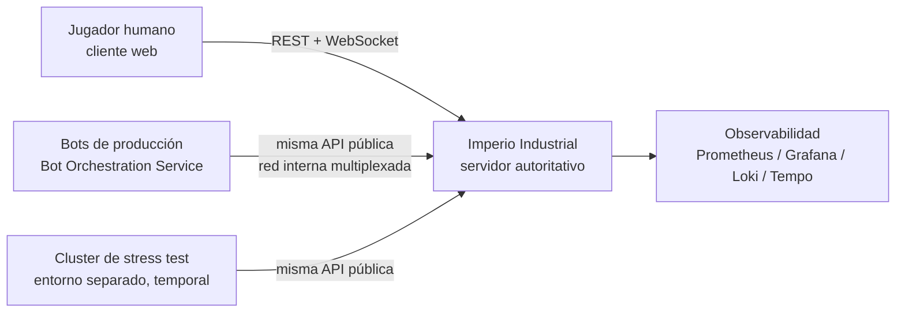
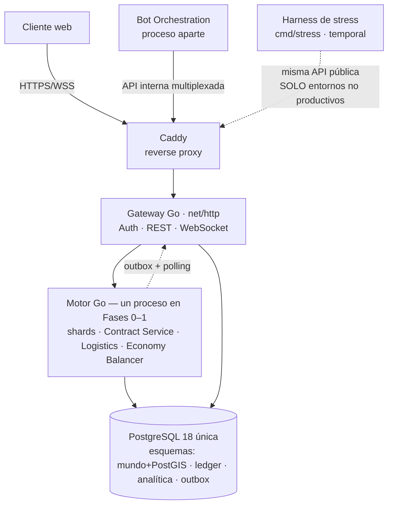
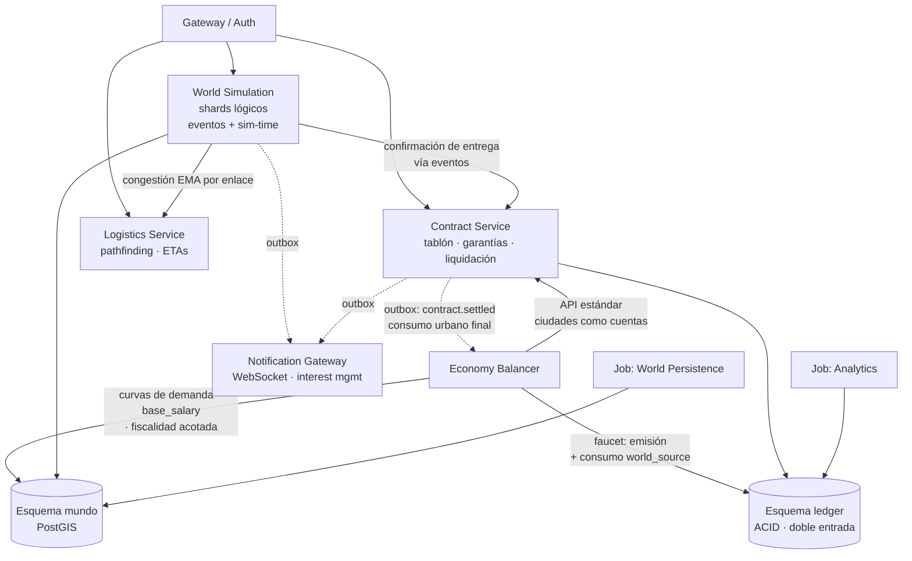

# Arquitectura del Proyecto – Imperio Industrial

## 1. Información General

**Proyecto:** Imperio Industrial — Simulación Económica MMO

**Versión del Documento:** 1.3 (derivada del GDD/SAD v1.3)

**Fecha:** 2026-07-17

**Responsables:** Equipo de Arquitectura / Backend

**Descripción General**
Este documento describe la arquitectura técnica del proyecto **Imperio Industrial**, un MMO de simulación económica, industrial y logística en un mundo único persistente, compartido por decenas de miles de jugadores humanos y una población permanente de bots. Incluye sus decisiones de diseño, estructura de componentes, flujos principales y estándares de desarrollo. El objetivo es servir como referencia técnica para el equipo, stakeholders y auditorías futuras.

Los tres invariantes arquitectónicos que gobiernan todo el diseño son:

1. **El valor económico nunca se pierde ni se duplica**: dinero, stock comprometido y contratos viven en un ledger de doble entrada con consistencia ACID estricta; las invariantes se garantizan en la base de datos, no en código de aplicación.
2. **El coste de simulación es proporcional a los eventos, no a las entidades**: motor event-driven sin tick global; las magnitudes continuas se derivan analíticamente bajo demanda.
3. **Las fronteras lógicas son firmes desde el día 1; la topología física es progresiva**: monolito modular en Fases 0–1, extracción a procesos separados solo cuando la medición lo exija.

---

## 2. Alcance del Documento

Este documento cubre:
- Arquitectura de software a nivel sistema (modelo C4, niveles 1–3)
- Principales decisiones arquitectónicas (ADR), consolidadas desde el Anexo B del GDD
- Estructura del proyecto y convenciones
- Patrones de diseño y principios técnicos
- Estrategia de escalabilidad y sus límites asumidos

Fuera de alcance:
- Diseño de gameplay y balance económico (ver GDD, secciones 2–13)
- Detalles de implementación de bajo nivel (algoritmos de pathfinding, fórmulas de demanda)
- Manuales de operación o despliegue (runbooks)

---

## 3. Contexto del Sistema (C4 – Nivel 1)

### 3.1 Descripción

Imperio Industrial es un sistema **cliente-servidor autoritativo**: el servidor es la única fuente de verdad y los clientes (web) solo envían intenciones y renderizan estado. Interactúan con el sistema tres tipos de actores:

- **Jugadores humanos**: acceden mediante un cliente web (REST para operaciones, WebSocket para eventos en tiempo real de su área de interés).
- **Bots de producción**: residentes permanentes del mundo, ejecutados por el Bot Orchestration Service como procesos externos que consumen **exactamente la misma API pública** que los humanos (igualdad de API literal, mismos rate limits lógicos). El motor no distingue el origen de un comando.
- **Cluster de stress test**: entorno efímero y separado que conecta cientos de miles de bots contra las mismas APIs para validar escalabilidad y balance antes de desplegar a producción. Nunca toca el mundo real. **Materializado en el Incremento 9** como el harness `cmd/stress` + `internal/stress`, con una salvaguarda que le impide apuntar a producción (ver §5.12).

No existen dependencias de sistemas externos de terceros en el camino crítico de juego: la economía es cerrada y endógena. Los únicos sistemas de soporte externos al dominio son autenticación/identidad y la plataforma de observabilidad.

### 3.2 Diagrama de Contexto



---

## 4. Contenedores del Sistema (C4 – Nivel 2)

### 4.1 Descripción de Contenedores

En Fases 0–1 la topología física es un **monolito modular**: pocas unidades desplegables con fronteras internas estrictas. Las cajas lógicas del diagrama **no** implican procesos separados desde el inicio (ver ADR-008, ADR-013 y ADR-017, y la sección 11 de este documento).

| Contenedor | Tecnología | Responsabilidad |
|-----------|------------|-----------------|
| Motor de simulación (shards + contratos + logística + balancer) | Go + sqlc | Simulación del mundo por shards lógicos, ciclo de vida del CCRI, pathfinding jerárquico, balance macroeconómico. Un solo proceso en Fases 0–1 con módulos tras fronteras estrictas (paquetes con interfaces, sin imports cruzados). |
| Gateway web / Auth / Presentación | Go + net/http | API pública REST, autenticación y sesiones, Notification/Event Gateway (WebSocket con interest management). |
| Bot Orchestration Service | Proceso aparte (consume la API como un cliente) | Ciclo de vida de la población de bots: modo mundo vivo, densidad dinámica, y aprovisionamiento del cluster de stress test. **Materializado por completo en el Incremento 9** (`cmd/bots`: 5 arquetipos + `DensityController`). |
| Cluster de stress test | Proceso aparte y **temporal**, en un entorno separado (consume la API como un cliente) | Carga masiva contra las mismas APIs públicas para medir escalabilidad y balance antes de desplegar. **Materializado en el Incremento 9** como `cmd/stress` (`:8083`), escalable horizontalmente lanzando varias instancias. Nunca se despliega junto al mundo de producción. |
| Base de datos | PostgreSQL 18 (única instancia) + PostGIS 3.6 | Persistencia de todo el sistema con esquemas separados por dominio: mundo/espacial, ledger/contratos (ACID), analítica, outbox de eventos. TimescaleDB solo si el volumen medido lo justifica. |
| Mensajería entre módulos | Outbox table + polling sobre PostgreSQL | Propagación asíncrona de eventos de dominio. Kafka (con schema registry) solo en Fase 2+ y solo si el volumen lo exige. |
| Reverse proxy | Caddy | Terminación TLS y enrutado. |
| Despliegue | Docker Compose sobre hosts administrados manualmente | Plataforma definitiva y asumida (no transitoria); impone el techo de capacidad explícito de la sección 11.2. |

### 4.2 Diagrama de Contenedores



---

## 5. Componentes Principales (C4 – Nivel 3)

### 5.1 Organización Lógica

El sistema define **7 servicios lógicos y 2 jobs de plataforma** cuyas fronteras son firmes desde el día 1, independientemente de su materialización física:

| Componente lógico | Responsabilidad |
|-----|-----------------|
| Auth/Identity | Autenticación, sesiones, gestión de cuentas. Jugadores y bots comparten el mismo modelo de cuenta. |
| World Simulation Service (por shard lógico) | Física de edificios, producción, recursos naturales, **simulación de tránsito completa** (movimiento, averías, congestión) de los vehículos y **consecuencias físicas de la insolvencia** (degradación, abandono, embargo, reversión de suelo) dentro de su macro-región. Cola de prioridad de eventos y sim-time propios por shard. **Materializado en el Incremento 2** como `internal/world` en su parte industrial (`catalog`/`land`/`buildings`/`production`), **completado en el Incremento 3** con el subpaquete `world/fleet` (flota, cargamentos y el `TransitWorker`) y **ampliado en el Incremento 6a** con `world/enforcement`, el motor de la cascada de insolvencia (mantenimiento, degradación, embargo). Ver §5.5, §5.6 y §5.8. |
| Contract Service | Tablón global de contratos, ventana de sorteo, bloqueo triple de garantías (stock reservado + garantía monetaria + escrow), verificación de entrega y liquidación pro-rata, para los dos tipos de contrato (CCRI de bienes y CCRI-Flete). Historial de contratos liquidados (OHLC). |
| Logistics Service | Planificación **sin estado de tránsito**: topología del grafo global, pathfinding ponderado por congestión suavizada (EMA), ETAs y definición de rutas propietarias. No simula vehículos. **Materializado en el Incremento 3** como `internal/logistics` (Dijkstra ponderado; HPA* jerárquico diferido como optimización por escala — ver §5.6). |
| Economy Balancer Service | Monitoreo macro (masa monetaria vs. PIB simulado), ajuste de impuestos/cánones dentro de rangos, curvas de demanda de ciudades, costo laboral regional por fórmula. Actúa como **agente decisor de las ciudades**, publicando sus solicitudes de compra por la API estándar del Contract Service (sin canal privilegiado). **Materializado en el Incremento 6b** como `internal/balancer`: las ciudades son el **único consumidor final** (faucet) y el Balancer cierra el bucle macro faucet/sink frente a los sinks del 6a. Ver §5.9. |
| Bot Orchestration Service | Población permanente de bots, densidad dinámica según actividad humana regional, aprovisionamiento del stress test **y retiro de bots insolventes-inactivos** (liquidación + absorción monetaria, ADR-024). **Materializado en el Incremento 4** como `cmd/bots` + `internal/bots` sobre el SDK público `pkg/botsdk` (ADR-024): proceso aparte que aprovisiona el ciclo de vida por paquetes internos y juega exclusivamente por la API pública; **ampliado en el Incremento 6a** con el `RetirementJob` (absorción `cash`→`emission`, evento `bot.retired`) y **completado en el Incremento 9** con los **cinco arquetipos** del GDD §13.2 y los **tres modos de operación** del GDD §13.4 (mundo vivo, densidad dinámica como válvula de carga, y stress test en entorno separado con el harness `cmd/stress`). Ver §5.7, §5.8 y §5.12. |
| Notification/Event Gateway | Distribución WebSocket de eventos por área de interés; el tablón global se consulta bajo demanda (pull), nunca por push mundial. **Materializado en el Incremento 4** como `internal/notify` dentro del proceso gateway (protocolo ADR-023, referencia de uso en `docs/api/ws-protocol.md`). Ver §5.7. |
| *Job:* World Persistence | Snapshots periódicos de shards y backups (RPO/RTO definidos; snapshot global consistente en la ventana de mantenimiento diaria). Aislado de cargas batch. |
| *Job:* Analytics | Agregación de métricas y estadísticas de mercado (batch de baja prioridad, nunca compite con Persistence). **Materializado en el Incremento 6b** como el `AnalyticsWorker` del Balancer: `analytics.region_stats`/`city_snapshots`/`economy_indicators` bucketizados por sim-time (monitoreo/regulación de parámetros, no mueve valor del ledger). Ver §5.9. |

### 5.2 Diagrama de Componentes



### 5.3 Flujos principales

**Ciclo de vida del CCRI (camino crítico del sistema):**

1. **Publicación** — la garantía propia se bloquea íntegramente al publicar (stock congelado del vendedor + 10% monetario, o 100% del pago del comprador en escrow). Invariante: *toda publicación visible en el tablón es ejecutable al 100%*, por construcción.
2. **Aceptación** — ventana de sorteo (30–60 s reales) con orden aleatorio entre aceptantes: la latencia no otorga ventaja (ni a bots ni a scripts). Aceptación total o parcial (K de N divide la publicación).
3. **Confirmación atómica** — bloqueo triple (stock reservado + garantía + escrow) en **una única transacción ACID local** del ledger, posible porque el inventario comprometible se modela como cuentas del mismo ledger que el dinero. Sin 2PC ni sagas.
4. **Ejecución logística** — el cargamento etiquetado con `contract_id` viaja físicamente; el shard confirma cada llegada parcial.
5. **Liquidación pro-rata** — se paga lo entregado a tiempo; sobre lo faltante, el escrow vuelve al comprador y la garantía del vendedor se reparte entre compensación y sink. El stock no entregado se libera **en su ubicación física actual** (nada se teletransporta, tampoco en los fallos).

**Movimiento de un vehículo (motor event-driven):**

- Se almacena `(estado_inicial, t_inicio, función_de_avance)`; la posición se deriva analíticamente cuando alguien la observa. Solo los **hitos** (salida, llegada a nodo, cruce de frontera, avería) generan eventos y escrituras. Un vehículo en un tramo largo sin incidencias no consume CPU.
- El cruce de frontera entre shards es, en el plan base (proceso único), un traspaso local entre colas de eventos. El protocolo formal de handoff multi-proceso (SELLADO → COPIADO → ACTIVADO → PURGADO, con `transfer_id` idempotente y el ledger como árbitro contable) queda **especificado pero no construido** hasta la extracción medida.

### 5.4 Nota de materialización (Incremento 1 — núcleo CCRI)

El primer incremento del backend hace explícitas dos consecuencias del monolito modular que conviene registrar aquí:

- **Rol dual del módulo `contracts` en runtime.** El Contract Service es un único módulo lógico (fronteras firmes, sin imports cruzados) pero se materializa en **dos superficies de ejecución** dentro del monolito: sus **handlers HTTP** los monta el proceso *gateway* (publicar, aceptar, consultar el tablón y los contratos propios), mientras que sus **barridos periódicos** —resolución de la ventana de sorteo, expiración de publicaciones por TTL de sim-time y liquidación de contratos al vencer— los ejecuta el proceso *engine* como un *worker* (`II_CONTRACTS_SWEEP_INTERVAL`). Ambos comparten el mismo esquema `ledger` y las mismas invariantes en SQL; la partición es de *dónde corre cada entrada*, no de propiedad. Es exactamente la disciplina que hace mecánica la extracción futura: el día que gateway y engine sean procesos separados, este reparto ya está hecho.
- **Patrón outbox ya materializado.** La mensajería entre módulos deja de ser solo diseño: `outbox.Emit(ctx, tx, …)` inserta el evento **en la misma transacción** que el cambio de estado que lo causa (nunca divergen), y `outbox.NewConsumer(name, eventTypes).Run(…)` procesa los eventos **en orden de `seq` avanzando su cursor dentro de la misma transacción del handler** — *exactly-once por consumidor*, reejecutar un lote no duplica su efecto. El **primer consumidor real es `ohlc_aggregator`** (módulo `market`), suscrito a `contract.settled`, que construye las velas OHLC por región de destino. El resto de módulos (Notification Gateway, Balancer) se enganchan al mismo mecanismo sin tocar a los emisores.

### 5.5 Nota de materialización (Incremento 2 — mundo y producción)

El segundo incremento **materializa el World Simulation Service** como el bounded context `internal/world`, cerrando el lazo **construir→producir→vender** contra el ledger y el CCRI del Incremento 1. Confirma tres consecuencias del monolito modular:

- **El World Simulation Service ya es código, no diagrama.** Se organiza en cuatro subpaquetes cohesivos que **comparten un único paquete sqlc del contexto** (`internal/world/sqlcgen`, una sola entrada en `sqlc.yaml`): `world/catalog` (lectura del mundo estático: regiones, productos, tipos de edificio, recetas, yacimientos, ciudades y demanda), `world/land` (concesiones y su mercado secundario de traspasos), `world/buildings` (construcción con validación de emplazamiento server-side, configuración, mejora e inventario físico) y `world/production` (cola de lotes, motor y reconciliación). La **física de tránsito** (vehículos, congestión, averías) del enunciado lógico del servicio **no** entra en este incremento (Fase 1 industrial); su especificación se conserva intacta.
- **Rol dual gateway↔engine, igual que `contracts`.** El mismo módulo lógico se materializa en dos superficies de ejecución: sus **handlers HTTP** los monta el proceso *gateway* (catálogos, concesiones y traspasos, edificios/mejora/inventario, cola de producción con progreso analítico derivado por consulta), mientras que su **motor event-driven y la reconciliación** los ejecuta el proceso *engine* como *workers* — barrido de construcción diferida (`II_BUILD_SIM_SECONDS`), barrido de producción analítica (`II_PRODUCTION_SWEEP_INTERVAL`, `FOR UPDATE SKIP LOCKED`) y job de reconciliación física↔contable (`II_RECONCILE_INTERVAL`, gauge `ii_reconciliation_discrepancies`, esperado 0). La partición es de *dónde corre cada entrada*, no de propiedad del esquema.
- **Fronteras firmes y consumo del ledger por el patrón existente.** `world` **no importa** `contracts`/`market`/`auth` ni viceversa (SAD §7); solo `platform` y `sim` son plataforma compartida. El substrato de valor (ledger) se consume **exactamente como en `contracts`**: queries sqlc propias del contexto contra las tablas `ledger.*` (la frontera de módulo es de código Go, no de esquema), con toda operación que mueve valor en `db.RunSerializable` + `outbox.Emit` **en la misma tx**. El dinero estructural va al `sink` del banco central (`build_cost`/`upgrade_cost` como `maintenance`, `canon`, `wage`; la `system_fee` del traspaso), y la producción asienta `production_output`/`consumption` contra `world_source` (ADR-022) moviendo el plano físico (`building_inventories`, `resource_deposits`) y el contable juntos.
- **Nuevos eventos de dominio por la outbox del mundo:** `concession.granted` / `concession.renewed` / `concession.transferred`; `building.created` / `building.updated` / `building.upgraded` / `building.constructed`; `batch.queued` / `batch.completed` / `batch.paused` / `batch.cancelled`. Los consumidores (Notification Gateway, Balancer) se enganchan sin tocar a los emisores, como con el CCRI. El detalle contable y operativo vive en la sección *v1.3* de `documentacion_base_de_datos.md`.

### 5.6 Nota de materialización (Incremento 3 — logística física, Fase 1 terrestre)

El tercer incremento materializa el pilar **ningún bien se mueve sin transporte físico; nada se teletransporta, tampoco en los fallos** (GDD 7.1/5.3), separando explícitamente las dos responsabilidades logísticas del §5.1 en dos bounded contexts que **no se importan** entre sí y se integran **solo por la outbox**:

- **Logistics Service ⇒ `internal/logistics` (planificación SIN estado de tránsito).** Materializa ADR-006 / GDD 15.1: lee el grafo del mundo (`world.network_*`), planifica rutas con **Dijkstra ponderado por la congestión EMA** (POST `/logistics/route-plans`, cálculo puro que no persiste; minimiza tiempo o coste aproximado) y define rutas propietarias como secuencia contigua de enlaces (`world.routes`/`route_legs`, el ÚNICO estado que escribe). No simula nada; aquí se decide *por dónde*. El **pathfinding jerárquico HPA*** (GDD 7.4) queda **diferido como optimización por escala**: a la escala de la Fase 1 (una región, pocos nodos) el Dijkstra plano es correcto y suficiente, y la interfaz `Planner` deja HPA* listo para insertar **sin cambiar la arquitectura**. Por eso la elección Dijkstra vs. HPA* **no requiere ADR** (el GDD ya la enmarca como optimización medida, no como decisión estructural).
- **World Simulation Service ⇒ `internal/world/fleet` (simulación de tránsito).** Completa el enunciado lógico del §5.1: el shard simula el movimiento. Su motor `TransitWorker` (proceso *engine*, event-driven, barrido `II_TRANSIT_SWEEP_INTERVAL` con `FOR UPDATE SKIP LOCKED`, cada vehículo en su tx serializable) procesa los segmentos vencidos —combustible, desgaste, **avería probabilística** (la carga espera a bordo, GDD 7.3), avance/llegada y **entrega física**—, reanuda averías y recalcula la **congestión por segmento (EMA)**. La posición del vehículo es **analítica** (`segmento + t_entrada + advance_fn`, derivada bajo demanda; solo los hitos escriben), coherente con el invariante nº 2. Los handlers HTTP de flota/cargamentos los monta el *gateway*: el mismo rol dual gateway↔engine ya visto en `contracts` y `world`.
- **Integración CCRI↔Logística: el patrón event-driven entre bounded contexts.** Es el ejemplo canónico de fronteras firmes sin imports cruzados (SAD §7). `contracts` emite `contract.confirmed` **enriquecido** (payload fijo con `kind`/origen/destino/`deadline_sim`); el consumidor `world` **`shipment_creator`** materializa el cargamento de las **compras cross-node** (mueve el stock físico fuera del almacén) y omite las ventas in situ. Al llegar el cargamento, `world` emite `shipment.arrived`, que el consumidor `contracts` **`delivery_confirmer`** consume para asentar la entrega (idempotente por `shipment_id`), acumular lo entregado a tiempo y **liquidar** al completarse. El vencimiento con cantidad sin entregar viaja como `contract.expired_undelivered` para coordinar la **liberación in situ** del lado físico. Nuevos eventos de outbox: `vehicle.*` (`purchased`/`updated`/`arrived`/`broken`/`stranded`), `shipment.*` (`created`/`dispatched`/`arrived`). El detalle contable, los payloads y la coherencia física↔contable ampliada (stock físico = `building_inventories` + cargamentos en vuelo) viven en la sección *v1.4* de `documentacion_base_de_datos.md`.

### 5.7 Nota de materialización (Incremento 4 — Notification Gateway, SDK de bots y Bot Orchestration Service)

El cuarto incremento materializa los dos servicios lógicos del §5.1 que faltaban para cerrar la Fase 0 del GDD (bots de reglas fijas validando el loop económico en tiempo real):

- **Notification/Event Gateway ⇒ `internal/notify` (en el proceso gateway).** Materializa ADR-023: el endpoint `GET /api/v1/ws` (librería `github.com/coder/websocket`), un **hub** de conexiones con suscripción por rooms (v1: solo `corp`, con buffer de envío acotado por conexión y cierre `1013` al consumidor lento) y un **router** que es un consumidor de outbox más (`notification_gateway`, mismo patrón del §5.4) con una diferencia deliberada: su cursor **avanza siempre** tras el fan-out — los sockets son efímeros y un cliente ausente re-sincroniza por REST; la entrega hacia clientes es at-least-once desde el `watermark`, no exactly-once. El protocolo es frames JSON con autenticación **en banda** (primer frame `auth`, cierre `4401` al vencer el plazo), `joined` con watermark para el bootstrap REST + deltas, y enrutado por interés resolviendo titularidades con lecturas puntuales a la BD (el paquete pertenece al contexto del gateway: puede leer la BD, pero no importa `internal/auth` — la validación de tokens llega por la interfaz `TokenValidator` del composition root). **No hay snapshots ni replay por el socket**: coherente con "el tablón es pull" (C10 del FAD) y con el modelo snapshot(REST)+deltas(WS) de ADR-FE-004. Referencia para integradores: `docs/api/ws-protocol.md`. Config `II_WS_*`; métricas `ii_ws_*`.
- **Bot Orchestration Service ⇒ `cmd/bots` + `internal/bots` + `pkg/botsdk` (proceso aparte, ADR-010/024).** El SDK `pkg/botsdk` es la **única vía soportada** para construir bots y en runtime consume **solo la API pública** (REST del contrato v1.3.0 + WS de ADR-023): sesión bearer, reintentos con `Idempotency-Key` estable por mutación, backoff ante 429 respetando `Retry-After`, paginación por cursor, cliente WS con re-join automático y watermark, y dinero/stock **como strings del contrato** (tipo propio, jamás float). Prohibido importar `internal/*` desde su runtime. El orquestador (`cmd/bots`, binario propio con `/healthz`, `/readyz` y `/metrics` en `II_BOTS_ADDR`) tiene la doble naturaleza asumida en ADR-024 con frontera nítida: el **ciclo de vida** (cuentas `kind=bot` con secreto derivado de `II_BOTS_SECRET_SEED`, `bot_profiles`, capitalización única `bot_capitalization`: +cash/−emission del banco central) va por paquetes internos y BD porque es operación monetaria, no comando de juego; **todo el gameplay** pasa por el SDK — mismos endpoints y rate limits que un humano (igualdad de API literal). Los **arquetipos** (`internal/bots`: `coal_producer`, `iron_producer`, `trader`, `industrial_transformer` y `freighter` — el §13.2 del GDD completo desde el Incremento 9) implementan la interfaz `Behavior` con reglas fijas **auditables**: cada decisión emite un log slog estructurado (bot, arquetipo, decisión, motivo, ids) y la métrica `ii_bot_decisions_total`. El **transformador industrial** compra insumos por el tablón, funde y vende con margen sobre el coste unitario estimado desde la receta y el precio de mercado (OHLC), y **para la cola** cuando el margen esperado es negativo; el **transportista** no toca mercancía: valora las solicitudes `kind=freight` (ingreso de la tarifa contra combustible + opex + riesgo de la garantía y ETA contra plazo), acepta las rentables, despacha su vehículo y cobra al entregar (CCRI-Flete). La densidad de población es la válvula de carga del GDD §19 (`II_BOTS_COAL_PRODUCERS`/`IRON_PRODUCERS`/`TRADERS`/`TRANSFORMERS`/`FREIGHTERS`, con `II_BOTS_TRANSFORMER_MARGIN_BP` e `II_BOTS_FREIGHTER_MARGIN_BP` como umbrales de sus heurísticas); el **retiro de bots** (liquidación + absorción monetaria) se materializa en el Incremento 6a (ver §5.8).

### 5.8 Nota de materialización (Incremento 6a — cascada de insolvencia)

El sexto incremento (parte a) materializa los **dos últimos escalones** de la cascada *saldo = 0, nunca deuda* (GDD 5.9) y el ciclo *abandono → embargo → subasta* (GDD 11.2) que el Incremento 2 había dejado como pausas de producción. La regla que gobierna todo el incremento: el `cash` **jamás baja de 0** (invariante del ledger, trigger `ck_accounts_non_negative`); el código cobra **solo lo disponible** y las obligaciones impagadas se saldan con el **patrimonio** o se **condonan**, nunca como deuda. Tres piezas, en tres superficies de ejecución, integradas por el patrón event-driven ya establecido (§5.4):

- **Motor de consecuencias físicas ⇒ `internal/world/enforcement` (en el proceso *engine*).** Subpaquete de `world` (usa `world/sqlcgen`), es el **rol dual gateway↔engine** llevado al extremo: no tiene handlers HTTP, es **solo motor**. Corre dos barridos event-driven (`II_MAINTENANCE_INTERVAL` para mantenimiento de edificios/flota y canon; `II_ENFORCEMENT_INTERVAL` para el embargo), cada entidad en su **propia tx serializable** con `FOR UPDATE SKIP LOCKED` (varias instancias pueden barrer en paralelo; la idempotencia se apoya en los **estados** como guarda). Materializa las dos máquinas de estado —edificio `operational`→`damaged`→`abandoned`→`seized` (degradación por mantenimiento impagado, umbrales `II_DEGRADE_PCT_PER_SIM_DAY`/`II_ABANDON_CONDITION_PCT`) y concesión `active`→`delinquent`→`grace`→`reverted` (canon impagado, gracia `II_SEIZE_GRACE_SIM_SECONDS`)— cobrando `maintenance`/`canon` al `sink` (**solo lo disponible**) exactamente como `land`/`production` consumen el ledger: queries sqlc propias del contexto contra `ledger.*`, sin importar `contracts`/`market`/`auth`. Al embargar **emite `building.seized`** (con el stock libre y el nodo de origen del edificio) y `concession.reverted` por la outbox, **en la misma tx** que congela el edificio y revierte el suelo. El stock **no se mueve aquí**: la retirada in situ es dominio de `contracts`.
- **Subasta del stock ⇒ consumidor `contracts`/`system_liquidator` (en el proceso *engine*).** Es el ejemplo canónico de fronteras firmes sin imports cruzados (SAD §7 / ADR-006), gemelo del `shipment_creator`↔`delivery_confirmer` del §5.6: `contracts` **consume** `building.seized` (declara el tipo de evento como string; nunca importa `internal/world`) y, en la misma tx del lote (exactly-once por cursor + idempotencia por `building_id` en `ledger.system_liquidations`), transfiere el stock embargado al banco central (asiento `auction`) y lo **publica como oferta `sell` del sistema** por el **mismo camino que cualquier venta del CCRI** (precio de remate `II_LIQUIDATION_PRICE_BP`). Cuando se vende, los proceeds los absorbe la caja del banco central (efecto **sink**). El **traspaso del edificio en pie con pujas** (GDD 11.2) es refinamiento de **Fase 2**; en 6a el embargo congela el edificio, liquida su stock y revierte el suelo.
- **Retiro de bots ⇒ `RetirementJob` en el orquestador (`cmd/bots` + `internal/bots`).** Cierra ADR-024 (*retiro = liquidación + absorción monetaria*), materializado en la raíz de composición del orquestador —no en el SDK— porque es **operación monetaria interna**, no comando de juego (misma frontera nítida que el provisioning). Barre las cuentas `kind=bot` activas (`II_BOTS_RETIRE_INTERVAL`) y retira las **insolventes-inactivas sostenidas** (`II_BOTS_RETIRE_CASH_FLOOR` + `II_BOT_RETIRE_IDLE_SIM_SECONDS`, sin edificios no embargados ni contratos/publicaciones vivos): **absorbe toda su caja** al banco central (`bot_retirement`, `cash`→`emission`, inverso de la capitalización), marca la cuenta retirada y emite `bot.retired` — todo en una tx serializable. Usa `internal/ledger` + `internal/auth` directamente, como ya hace para el provisioning.

Nuevos eventos de dominio por la outbox: `building.seized` (emite `world/enforcement`, consume `contracts/system_liquidator`), `concession.reverted` (informativo/WS) y `bot.retired` (emite `cmd/bots`, informativo/WS). Sus payloads son contratos de evento **fijos**; el detalle contable, las máquinas de estado y el invariante `saldo ≥ 0` viven en la sección *v1.5* de `documentacion_base_de_datos.md`. **Sin ADR nuevo**: el incremento materializa diseño ya acordado (GDD 5.9/11.2, ADR-006/022/024) sin desviarse de él.

### 5.9 Nota de materialización (Incremento 6b — Economy Balancer, ciudades como consumidor final)

El sexto incremento (parte b) **materializa el Economy Balancer Service** como `internal/balancer` y cierra el **bucle macro faucet/sink**: si el 6a construyó los **sinks** (mantenimiento, canon, sanciones, liquidaciones), el 6b construye el **faucet principal** —las **ciudades como único consumidor final** (GDD 5.6): pagan a sus vendedores con dinero **nuevo** emitido por el banco central—. El Balancer es el **agente decisor de las ciudades** (GDD 18.1): decide cuándo, cuánto y a qué precio compra cada ciudad, y lo publica por la **API estándar del Contract Service, sin canal privilegiado**. Tres piezas, integradas por el patrón event-driven ya establecido (§5.4), más un job macro:

- **Motor de ciudades ⇒ `DemandWorker` (en el proceso *engine*).** En cada barrido (`II_BALANCER_DEMAND_INTERVAL`) recalcula **cada ciudad en su propia tx serializable** (`FOR UPDATE`): corre la **máquina de niveles** (`supply_index` histórico → sube/baja de nivel con histéresis, desbloquea categorías por `unlocked_at_level`, decae por abandono logístico), recalcula la **curva de demanda** (`world.city_demand`) con **todos los clamps obligatorios** (`supply_ema` con suelo `> 0`, `saturation_factor` acotado, `current_price` clampado en `[price_floor, price_ceiling]`; dos clases de elasticidad basic/luxury, GDD 5.6) y publica las **buys de ciudad**. Emite `city.level_up`/`city.level_down` por la outbox **en la misma tx** que el cambio de nivel.
- **Faucet por la API estándar ⇒ el PORT `PublicationCreator`.** El paquete `balancer` **no importa** `internal/contracts`: define un PORT (`CreateCityBuy`) que el **composition root** (`cmd/engine`, `cityBuyCreator`) implementa con `contracts.CreatePublication`. La dependencia dirigida `balancer → contracts` es la de un **CLIENTE del Contract Service** (GDD 18.1: una ciudad es una cuenta de mercado más), **no** un peer prohibido por SAD §7 —la buy pasa por la **misma** validación, escrow y ventana de sorteo que cualquier otra—. Antes de publicar, el Balancer **pre-fondea** la caja de la ciudad por **emisión** (`seed_capital`, `+cash/−emission`) si no cubre el escrow: una ciudad **nunca incumple el pago** (este es el faucet, GDD 5.5). Mantiene **una sola buy viva** por `(ciudad, producto)` (dedup en el tablón).
- **Consumo urbano final ⇒ `Consumer` `city_consumer` (en el proceso *engine*).** Consumidor del outbox sobre `contract.settled` con **cursor propio** (distinto del `ohlc_aggregator`, gemelo del patrón `shipment_creator`↔`delivery_confirmer` del §5.6): consume **solo** las entregas cuyo comprador es una ciudad (`auth.accounts.kind='city'`), reeleyendo el contrato (el evento no lleva comprador/destino). En la misma tx del lote **consume** lo entregado (`city stock_free → world_source`, asiento `consumption`, ADR-022), **descuenta el inventario físico** del centro de distribución (físico↔contable, ADR-004) y alimenta `supply_ema` (`recent_supply`) y `supply_index` (ponderado por variedad). Así la ciudad es **sumidero final real** y **no acumula inventario**.
- **Modelo de entrega ⇒ centro de distribución por ciudad.** Para que la entrega estándar del CCRI deposite el stock como `stock_free` de la ciudad (que requiere un `warehouse_building_id`), **cada ciudad tiene su propio edificio `distribution_center`** (`owner = ciudad`) sobre una **concesión del sistema**, sembrado por `internal/seed/cities.go` (idempotente); es el **destino** de sus buys. Decisión de implementación vinculante, documentada en la sección *v1.6* de `documentacion_base_de_datos.md` y como nota en `gdd.md` 5.6.
- **Job macro ⇒ `AnalyticsWorker` (en el proceso *engine*, su propio bucle `II_BALANCER_ANALYTICS_INTERVAL`).** Materializa el *Job: Analytics* del §5.1 en **tres pasos ordenados, cada uno en su tx serializable**: (1) **analítica** —`analytics.region_stats`/`city_snapshots`/`economy_indicators` bucketizados por sim-time (ocupación industrial, PIB simulado, masa monetaria, emisión vs. absorción, agotamiento de finitos)—; (2) **fórmula laboral** (GDD 5.7) —recalcula `world.cities.base_salary` = salario efectivo `salario_base(nivel) · factor_saturación(ocupación regional)`; el Balancer es su **única autoridad**—; (3) **ajuste fiscal** (banco central algorítmico, GDD 5.5) —mueve `tax_rate_bp`/`canon_base` un paso **acotado** según la tendencia masa monetaria vs. PIB, **nunca fuera de rango**—. Es **monitoreo y regulación de parámetros, no movimiento de valor** (nunca asienta en el ledger).

**El bucle macro, ahora completo.** La coherencia es contable y auditable: por la doble entrada del ledger, **`emisión − absorción = Δmasa monetaria`** por bucket (`money_supply = cash+escrow+guarantee`, `custody` excluido por ser stock). Los sinks del 6a (mantenimiento/canon/sanciones/liquidaciones = absorción) y el faucet del 6b (pago de las ciudades a sus vendedores por emisión = emisión) son las **dos caras** que el banco central algorítmico vigila para regular la fiscalidad. Nuevos eventos de dominio por la outbox: `city.level_up`/`city.level_down` (emite `balancer/DemandWorker`, informativo/WS); el Balancer **consume** `contract.settled` con el cursor `city_consumer`. **Sin ADR nuevo ni cambio de diseño del GDD**: el incremento materializa diseño ya acordado (GDD 5.5/5.6/5.7/18.1, ADR-022) sin desviarse de él. El detalle contable, las fórmulas de la curva, la máquina de niveles, los parámetros `II_*` y los payloads de evento viven en la sección *v1.6* de `documentacion_base_de_datos.md`.

### 5.10 Nota de materialización (Incremento 7 — mundo Fase 2: multi-región procedural + transporte ferroviario/marítimo)

El séptimo incremento abre la **Fase 2 del mundo**: materializa la **generación procedural** (GDD 9) y el **transporte multimodal** (GDD 7.2/7.3) sobre el esquema `world` que ya existía desde `0003_world`, **sin migraciones nuevas** (como el Incremento 2, opera tablas ya definidas). Aparece un **generador** nuevo y se **extienden** el motor de tránsito y el planificador de rutas:

- **`internal/worldgen` ⇒ el generador procedural (binario `cmd/worldgen`, `make worldgen`).** Es una **biblioteca de composición** —como `internal/seed`, la única capa que conoce a la vez `auth`, `ledger`, `world` y el reloj— que construye el mundo multi-región de forma **determinista, idempotente y ADITIVA**: a partir de una semilla (`II_WORLD_SEED`) y una grilla de macro-regiones (`II_WORLD_GRID`, impar, centrada en (0,0)) **conserva intacta** Askadia (0,0) y su seed —los ~30 paquetes de test siguen viendo el mismo mundo mínimo— y **añade** las regiones que la rodean. El determinismo es duro (GDD 1.1/9): un **value-noise 2D propio** (código del proyecto, hash splitmix64 + fade quíntico + fractal, **sin dependencias nuevas**) decide elevación/humedad → **biomas**; un **RNG sembrado por celda** `(semilla, gx, gy)` decide conteos y posiciones — **jamás** `time`/entropía —, de modo que misma semilla ⇒ mismo mundo. Cada región terrestre recibe 1-2 **ciudades** (réplica del patrón del Balancer: cuenta `kind=city`, caja prefondeada por emisión, centro de distribución propio, demanda base) y 2-4 **yacimientos** finitos con recurso **correlado al bioma** (solo `iron_ore`/`coal`: madera/petróleo del GDD 10 aún no están en el catálogo). Es **idempotente por clave natural** (`(grid_x,grid_y)` de región, nombres, `code`s): re-ejecutar `make worldgen` nunca duplica. Exige que el seed haya corrido antes (banco central, reloj, catálogo mínimo).
- **El mundo multi-región en un único proceso (región = shard lógico).** Coherente con GDD 15.1 y ADR-013: cada región es un **shard lógico** (jurisdicción de juego + unidad de particionamiento) pero **todos corren en un proceso** hasta que la medición exija extraerlos. El modelo de datos ya está preparado para esa extracción: los enlaces **inter-región** `rail`/`sea` que el generador tiende entre junctions adyacentes se **parten en la frontera** en **dos `link_segments`** —uno por región, con su `region_id`—, de modo que **cada shard simulará la congestión de su lado** (GDD 15.1); mientras conviven en un proceso, el cruce de frontera es un **traspaso local** (ADR-013/015), no un protocolo de red.
- **Transporte multimodal (extensión de `internal/world/fleet` + `internal/logistics`).** El catálogo suma los tipos `freight_train` (rail) y `cargo_ship` (sea), combustible `coal`, con una **matriz coste/velocidad/volumen** que decrece en coste/unidad camión→tren→barco (el eje de decisión modal, GDD 8). El motor de tránsito recorre una ruta multimodal por **tramos de un solo modo** con **transbordo explícito** en **terminales intermodales** (owner = banco central, creadas por el generador donde coinciden road y rail/sea): un vehículo solo circula por enlaces de su modo; la carga con destino más allá del fin de tramo espera en la terminal (`shipment.at_terminal`) hasta consumir el tiempo de transbordo y ser re-despachada en otro modo. El planificador resuelve **Dijkstra sobre un grafo expandido por `(nodo, modo)`** donde el **cambio de modo solo es transitable en un nodo con terminal**, sumando el transbordo a la ETA. **El pathfinding sigue siendo Dijkstra plano** ponderado por congestión: la jerarquía **HPA*** (GDD 7.4) sigue diferida como optimización por escala **incluso con el grafo multi-región** —se activa por **medición** a mayor escala, sin cambiar la arquitectura (la interfaz `Planner` la deja lista)—.

Único evento de dominio nuevo por la outbox: **`shipment.at_terminal`** (emite `world/fleet`, informativo/WS; hito de transbordo). El `shipment.arrived` que consume `contracts`/`delivery_confirmer` **no cambia** (solo se emite en el destino final), así que la integración CCRI↔Logística es idéntica. **Sin ADR nuevo, sin migración y sin cambio de diseño del GDD**: el incremento materializa diseño ya acordado (GDD 7/9/15.1, ADR-013/018/019) —la grilla 3×3 inicial y el transbordo explícito por tramo son notas de implementación—. El detalle vive en la sección *v1.7* de `documentacion_base_de_datos.md` y en la nota de implementación de `gdd.md` §9.

### 5.11 Nota de materialización (Incremento 8 — CCRI-Flete + slots de prioridad de terminal: logística como servicio)

El octavo incremento activa la **"logística como servicio"** prometida (GDD 12/13.2): el **segundo tipo de contrato** —el **CCRI-Flete** (GDD 5.3.2)— y la **venta de slots de prioridad** en terminales (GDD 7.3), sobre el esquema ya definido en `0003_world`/`0004_ledger`. Dos migraciones aditivas (`0014_freight`, `0015_transship_queue`), **sin enums ni tablas de dominio nuevas** salvo la idempotencia de la entrega:

- **El CCRI-Flete = segundo tipo de contrato del Contract Service (`internal/contracts`).** No es un módulo nuevo: **reutiliza íntegra** la maquinaria del tablón del Incremento 1 (ventana de sorteo, aceptación parcial, cursor keyset, garantías, liquidación pro-rata) para un nuevo `publication_kind = freight`. El **cargador** publica la solicitud de flete y **bloquea su escrow** (precio del flete, como una compra) declarando el valor de la carga; el **transportista** la acepta depositando una **garantía** proporcional a ese valor declarado (`II_FREIGHT_GUARANTEE_BP`, default 10 %). Al servirse la aceptación, `ledger.confirm_freight` mueve —en un solo asiento `custody_load`— escrow + garantía a las cuentas espejo del `ledger.freight_contracts` y **la carga a una cuenta `custody`** del contrato: el transportista la lleva físicamente pero el ledger le impide **contablemente** venderla (no está en su `stock_free`), que es lo que permite componer fletes con CCRI de venta de terceros sin romper garantías. La entrega la liquida el consumidor **`freight_settler`** (sobre `shipment.arrived` con `freight_contract_id`; la custodia va al cargador en el destino, el transportista cobra y recupera garantía por lo entregado **a tiempo**); el **fallo por vencimiento** lo liquida un barrido (custodia liberada in situ en el origen, garantía repartida compensación/sink con `II_FREIGHT_COMPENSATION_BP`) que emite `freight.expired_undelivered`. La liquidación es una función SQL análoga a la del CCRI de bienes: `ledger.settle_freight_prorata`.
- **`world`/`fleet` no toca cuentas del flete: integra solo por outbox.** El `freight_shipment_creator` consume `freight.confirmed` y **materializa el cargamento del cargador** en el origen descontando `building_inventories`; el **despacho estándar** (`POST /world/shipments/{id}/dispatch`) se **autoriza por el transportista** (lee `ledger.freight_contracts.carrier_account_id` cross-schema, sin importar `contracts`) y mueve la carga —ya en custodia— en el vehículo del carrier con todo el tránsito multimodal de v1.7; el `shipment_releaser` reintegra in situ los cargamentos de flete vencidos. **Alcance materializado:** el flete **standalone** (el cargador mueve stock propio) por completo; la **composición plena** con un CCRI de venta de un tercero es un **camino aditivo** (un cargamento con `contract_id` **y** `freight_contract_id` dispara ambos liquidadores en su destino final, cada uno con su idempotencia).
- **Slots de terminal = "infraestructura como servicio" en los nodos.** Las terminales (owner = banco central desde v1.7) **venden slots de prioridad**: `internal/worldgen` crea `terminalSlotTiers` (default 3) `world.terminal_slots` a la venta por terminal (precio creciente con la prioridad); `POST /world/terminal-slots/{slotId}/purchase` cobra `price` al **dueño de la terminal** (`cash→cash`) y fija `holder_account_id`+`valid_until_sim` (`II_SLOT_VALIDITY_SIM`, default 30 días-sim). En el **transbordo**, el barrido `sweepTransship` del `TransitWorker` sirve la **cola** de cada terminal con un **servidor único** a `transshipment_per_hour`, ordenada por **prioridad** (dueños con slot vigente primero, `priority_tier` ascendente; el resto FIFO por llegada): un cargamento con slot **queda listo antes** que uno sin slot llegado a la vez. Es la mecánica de colas/transbordo que el GDD 7.3 anticipa ("los transbordos consumen tiempo/capacidad y pueden generar colas"), sin reservas exclusivas de vía (los enlaces siguen siendo de uso común, FIFO + congestión).
- **Endurecimiento de la reconciliación física↔contable.** El job (`internal/world/production`, motor del engine) ahora **cuadra la custodia**: la cuenta `custody` cuenta en el lado contable (`stock_free+stock_reserved+custody`) y el cargamento de flete en vuelo en el físico (atribuido al almacén de origen de la custodia), de modo que un flete en tránsito no genera divergencia. Y **solo escala a ERROR** una divergencia que **persiste `II_RECONCILE_GRACE` pasadas consecutivas** (default 2), tratando la transitoria (~250 ms entre la entrega física y su asiento) como DEBUG/esperada — en reposo sigue dando 0. **No cambia la semántica** de la reconciliación, solo el ruido del log y el conteo de cargamentos en vuelo.

Eventos de dominio nuevos por la outbox: **`freight.confirmed`** (consume `world`/`freight_shipment_creator`), **`freight.settled`** (informativo/WS), **`freight.expired_undelivered`** (consume `world`/`shipment_releaser`) y **`slot.purchased`** (informativo/WS); `shipment.arrived` gana el campo `freight_contract_id` (vacío en los cargamentos de solo-bienes), sin alterar el consumo del CCRI de bienes. **Sin ADR nuevo y sin cambio de diseño del GDD**: el CCRI-Flete y los slots ya estaban especificados en GDD 5.3.2/7.3 (la cola de transbordo con servidor único y prioridad por `priority_tier`, y el flete standalone con composición aditiva, son notas de implementación). El detalle vive en la sección *v1.8* de `documentacion_base_de_datos.md` y en la nota de implementación de `gdd.md` §5.3.2.

### 5.12 Nota de materialización (Incremento 9 — Fase 3: escala y validación medida)

El noveno incremento **completa el Bot Orchestration Service** del §5.1 —el último servicio lógico que quedaba a medias— y convierte los **disparadores de evolución del §13 de este documento** en una **medición reproducible**: dejan de ser una intención («cuando la carga lo exija») para tener un instrumento que produce sus cifras. Cuatro piezas, con **una única migración aditiva** (`0016_outbox_consumer_interest`: la columna `outbox.consumer_cursors.event_types`, sin la cual el retraso de un consumidor se mide contra la historia entera del mundo y la válvula de carga se clava en el suelo — ver `documentacion_base_de_datos.md` §v1.9) y sin reglas económicas nuevas:

- **Los cinco arquetipos del GDD §13.2 ⇒ `internal/bots` (juegan SOLO por `pkg/botsdk`).** A `coal_producer`, `iron_producer` y `trader` (Incremento 4) se suman los dos que faltaban, ya posibles: **`industrial_transformer`** —bot *intermedio* del GDD §13.3: compra insumos por el tablón, funde y vende con margen sobre el **coste unitario estimado** derivado de la receta y del precio de referencia OHLC, y **para la cola** cuando el margen esperado es negativo— y **`freighter`** —bot que **no toca mercancía**: vende capacidad de transporte valorando las solicitudes `kind=freight` del tablón (ingreso de la tarifa contra combustible + opex + coste de oportunidad de la garantía, y ETA contra plazo), acepta las rentables, despacha su vehículo y cobra al entregar—. El transportista es el agente que **ejerce** la «logística como servicio» que el Incremento 8 abrió como API (§5.11): sin él, el CCRI-Flete existía pero no tenía contraparte permanente. La frontera de ADR-010/024 no se toca: los arquetipos **no importan ningún paquete de dominio**, cada decisión emite su log slog estructurado (bot, arquetipo, decisión, motivo, ids) y la métrica `ii_bot_decisions_total`, y sus umbrales viven como `behavior` JSON en `auth.bot_profiles` (auditables sin leer código).
- **Modo «densidad dinámica» (GDD §13.4 nº 2) ⇒ `DensityController` (en `cmd/bots`).** Es la **válvula de carga principal** del techo de capacidad (GDD §19, ADR-009) hecha código: ajusta continuamente **cuántos bots de cada arquetipo están ACTIVOS**, pausando y reanudando en caliente el bucle `Decide` de bots **ya aprovisionados** —conservando cuenta, capital, activos y contratos—. **No retira** (eso es exclusivo del `RetirementJob` y solo por insolvencia) y **no crea** población (el techo nunca supera lo aprovisionado). Vive en el orquestador y **lee la BD directamente** porque es *lifecycle*, no gameplay: la misma frontera nítida que el provisioning y la capitalización (§5.7). Sus **señales** (una sola ida y vuelta a la BD por ciclo, `II_BOTS_DENSITY_INTERVAL`, default 30 s) y su **fórmula** —enteros en basis points, sin punto flotante, para que la decisión sea reproducible desde el log— son:

  ```text
  señales:  sesiones humanas vivas · comandos humanos en la ventana (publicaciones y
            contratos con un humano en algún lado) · lag de la outbox (eventos pendientes
            del consumidor más retrasado, medidos contra los tipos que ESE consumidor
            declara consumir) · cola de transbordo sin servir · publicaciones vivas

  base        = max(1, aprovisionados × BASE_BP / 10000)
  f_actividad = 1 + GAIN_ACT × min(1, max(sesiones/SESSIONS_REF, comandos/COMMANDS_REF))
  f_carga     = min(rampa(lag_outbox), rampa(cola_transbordo))        [1 → LOAD_FLOOR_BP]
  f_cobertura = 1 + GAIN_COB × (COVERAGE_MIN − vivas)/COVERAGE_MIN    (solo backstop de liquidez)

  si f_carga < 1:  objetivo = clamp(base × f_carga, min, max)     ← la CARGA manda
  si no:           objetivo = clamp(base × f_actividad × f_cobertura, min, max)
  ```

  La **prioridad es explícita y auditable**: en cuanto el sistema se degrada, los bonos de actividad y cobertura se **descartan** y solo actúa el recorte por carga — *se reduce población de bots antes que degradar la experiencia humana* (GDD §19). El bono de cobertura solo se aplica a los arquetipos de **backstop de liquidez** (productores y comerciante, GDD §5.3.1): el transformador y el transportista no crean mercado, lo necesitan. El ajuste va **suavizado** (`MAX_STEP` bots por arquetipo y ciclo) con **banda muerta asimétrica** (subir exige superar `HYSTERESIS`; bajar es inmediato). La banda **no se aplica desde 0 activos**: la válvula que el recorte cierra tiene que poder **reabrirse** aunque el objetivo sea un solo bot —si no, en poblaciones pequeñas (`base >= 1`, `MIN=0`) el arquetipo quedaría apagado para siempre y el mundo sin contrapartes. Los ciclos **sin ajuste con la población fuera del objetivo** también se registran en INFO (`densidad retenida`): el estancamiento nunca es silencioso. Cada ajuste se registra con sus señales y sus factores intermedios, y se publica en `ii_bots_density_target{archetype}`, `ii_bots_density_adjustments_total{direction}`, `ii_bots_density_signal{signal}` e `ii_outbox_lag_observed`. Configuración `II_BOTS_DENSITY_*` (`ENABLED=false` deja la población fija = modo «mundo vivo» puro).
- **Modo «stress test» (GDD §13.4 nº 3, §15.4) ⇒ `cmd/stress` + `internal/stress`: cluster desacoplado contra las MISMAS APIs.** Es un binario **temporal** que no forma parte del mundo: aprovisiona N cuentas, las hace jugar en paralelo con comportamientos **ligeros y de alta frecuencia** (no juegan *bien*: ejercitan los caminos calientes — tablón con filtros, publicación/cancelación, aceptación, ledger, catálogo del mundo, red y planificación de rutas — con mezcla parametrizable de lectura/escritura), mide y emite un informe. **Todo el gameplay pasa por `pkg/botsdk`** contra la API pública, igual que un humano (ADR-010, GDD §15.4): el harness no importa ningún paquete de dominio para jugar. La **única** excepción documentada es el `Provisioner` —el contrato no expone endpoint de registro, así que las cuentas se crean por BD con el mismo patrón del orquestador (cuenta `kind=bot`, credencial argon2id derivada, `bot_profile`, capitalización contabilizada por el banco central) **sin importar `internal/bots`**—: es *admin del entorno de pruebas*, no un canal privilegiado de juego. Escala **horizontalmente** lanzando varias instancias (una corrida se acota a 200 000 bots por proceso: por encima, el cuello de botella sería el propio harness y la medición dejaría de ser honesta). Observabilidad propia en `II_STRESS_ADDR` (`:8083`, métricas `ii_stress_*`), que no se mezcla con la del sistema bajo prueba.
- **Salvaguarda anti-producción (requisito duro del GDD §13.4).** «El modo stress test corre en un entorno de pruebas independiente y **nunca toca el mundo de producción**» es una invariante ejecutable, no una advertencia del runbook. El harness **rehúsa arrancar** —antes de abrir siquiera el pool de BD— si: (1) `II_STRESS_API_URL` no está definida (**no tiene default**: elegir el objetivo es siempre una decisión consciente del operador); (2) `II_ENV` declara producción (`prod`/`production`/`prd`/`live`); (3) el host de la API **o el de la base de datos del provisioner** no casan la allowlist de entornos no productivos (`II_STRESS_ALLOW_HOSTS`; por defecto `localhost`, `127.0.0.1`, `::1`, `host.docker.internal`, `*.stress.*`, `staging.*`). La BD se comprueba con la **misma** allowlist porque apuntar el provisioner a una base de producción sería tan grave como apuntar la API. Cada rechazo cita la regla del GDD que lo motiva. Como red de seguridad adicional, **toda** cuenta creada lleva el prefijo reconocible `stress-<run_id>-…` (identificable y limpiable sin ambigüedad) y la corrida las **retira** al terminar (`II_STRESS_CLEANUP`, default `true`) sin borrar nada del ledger, que es append-only.

**Los disparadores del §13 de este documento, ahora MEDIDOS.** El informe de una corrida (`II_STRESS_REPORT`, JSON + tabla por consola, con veredicto y código de salida 2 si hubo 5xx o errores inesperados) combina **dos fuentes independientes**: lo que el harness observó *desde fuera* (latencias p50/p95/p99 y throughput por operación, errores clasificados por status y por código de dominio) y lo que el sistema publica *de sí mismo* — raspado de `/metrics` del gateway y del engine, más un sondeo de solo lectura a la BD del entorno de pruebas. **El veredicto cruza las dos**: los contadores del target se raspan también ANTES de la carga (línea base) y lo que cuenta es el **delta de la corrida** (`system.targets[].http_5xx_delta`, `http_requests_delta`), porque los contadores de Prometheus son acumulados desde el arranque del proceso; un 5xx que el sistema registró y el harness no llegó a recibir —otra ruta, otro cliente— tumba la corrida igual (`verdict.target_server_errors` > 0 ⇒ `verdict.ok = false` ⇒ salida 2). Sin línea base accesible el acumulado se reporta como *no atribuible* y no sostiene el veredicto. La misma partida doble se aplica a la **contención SERIALIZABLE** (`ii_tx_serialization_retries_total` / `_exhausted_total`): un trabajo de fondo que se cae porque agotó su presupuesto de reintentos **no llega a ningún cliente** —el harness no puede verlo desde fuera—, así que el informe lo lee de las métricas del proceso y lo dice; enterarse no puede depender de abrir el log del engine a mano. De ahí salen, literalmente, las cifras que gobiernan las extracciones futuras:

| Disparador (§13) | Qué leer del informe | Decisión que habilita |
|---|---|---|
| **Carga sostenida del proceso del motor** | `system.targets[].go_goroutines`, `process_cpu_seconds_total` y `process_resident_memory_bytes` del engine, contra los bots activos y las ops/s de la corrida | **Extracción de shards a procesos separados** y construcción del handoff de ADR-015 |
| **Volumen y lag de la outbox** | `system.database.outbox_pending` (lag real en la fuente: eventos pendientes del consumidor más retrasado **de los tipos que él consume** —`outbox.consumer_cursors.event_types`, migración `0016`—, nunca la resta a `max(seq)`, que mediría la historia entera del mundo) y `outbox_emitted_during_run`; contrastados con `ii_outbox_consumer_lag` por consumidor | **Adopción de Kafka** con schema registry (en lugar de outbox + polling) |
| **Latencia de consulta del tablón** | `operations[]` con `op="board_read"` → `latency.p50_ms/p95_ms/p99_ms` (medida por el harness) **y** `board_p95_ms`/`board_requests_total` del target (medidos por el propio gateway sobre su etiqueta `route`) | **Motor de búsqueda dedicado** para el tablón (Meilisearch u otro), hoy PostgreSQL con índices |
| **Contención SERIALIZABLE** (techo de escritura del PostgreSQL único) | `system.targets[].tx_serialization_retries_delta` y `tx_serialization_exhausted_delta` por proceso (delta contra la línea base de `ii_tx_serialization_*`), agregados en `verdict.target_tx_serialization_retries/_exhausted` | **Reparto de la carga de escritura**: escalado vertical primero y, sostenida, extracción de shards / particionado del ledger. Los reintentos son ruido normal bajo carga; cada presupuesto **agotado** es una transacción revertida entera —una operación devuelta como reintentable o un trabajo de fondo caído hasta el barrido siguiente— y el veredicto lo saca como **ADVERTENCIA** explícita, nunca como una línea de log que haya que ir a buscar |

La lectura correcta exige las dos fuentes: si el p95 del harness sube pero el p95 servido por el gateway no, el cuello está en el camino de red o en el propio harness, no en el tablón. Un `429` **no** es una degradación: es la válvula de backpressure funcionando, y el informe lo cuenta aparte de los errores inesperados (igual que el cooldown anti-parpadeo o un `NO_ROUTE_FOUND`). Con estas cifras, la regla del §12 se cumple sin especulación: **ninguna adopción estructural nueva se registra como ADR sin la medición que la justifica**, y ahora esa medición tiene procedimiento y formato.

**Ampliación consciente del contrato (v1.4.0 → v1.4.1 → v1.5.0).** El incremento se planteó **sin cambios de contrato** y los dos arquetipos nuevos forzaron dos excepciones, ambas registradas en **ADR-024** y **todas aditivas y retrocompatibles** (ninguna respuesta pierde campos ni cambia de forma):

- **v1.4.1 — visibilidad del transportista (ADR-024 decisión 6, sube el *patch*: sin endpoints nuevos).** El `freighter` acepta un CCRI-Flete cuyo cargamento pertenece al **cargador**, así que sin verlo no podía despachar el flete que ya había aceptado —el arquetipo no era construible solo con la API pública, y leer la BD violaría ADR-010—. `GET /world/shipments` y su detalle sirven además los cargamentos que la corporación transporta como transportista, con el filtro `freight_contract_id`; se emiten `declared_value` y `freight_contract_id`, dos campos que el contrato **ya documentaba** y la implementación no poblaba; y el 503 `Maintenance` ya existente gana el código `SERIALIZATION_CONFLICT`, que el harness de stress hizo observable.
- **v1.5.0 — viaje en vacío (ADR-024 decisión 7, sube el *minor*: endpoint nuevo).** El nuevo `POST /world/vehicles/{vehicleId}/reposition` pone en ruta un vehículo propio `idle` **sin carga a bordo**, con las mismas reglas físicas del despacho (modo, ruta que empieza en su nodo actual, combustible para toda la distancia) y el hito `vehicle.repositioned`. No era un hueco del arquetipo sino del **mundo**: un vehículo solo podía moverse llevando carga y la entrega lo deja `idle` en el nodo destino, donde no nace carga nueva, así que quedaba varado tras su primera entrega —bot o humano, aceptaba contratos que ya no podía cumplir y quemaba la garantía—.

El changelog de `docs/api/openapi.yaml` (v1.5.0) es el detalle normativo.

**Sin ADR nuevo y sin cambio de diseño del GDD** (con **una** migración aditiva, `0016_outbox_consumer_interest`, y los añadidos **aditivos** de contrato v1.5.0 que los dos arquetipos nuevos exigen: `POST /world/vehicles/{id}/reposition` —viaje en vacío, sin el cual un vehículo queda varado en el destino de su última entrega— y la visibilidad de `GET /world/shipments` para el **transportista** de un CCRI-Flete): el incremento materializa diseño ya acordado (GDD §13.2/13.3/13.4, §15.4, §19; ADR-009/010/024). Son **notas de implementación** —no de diseño— la fórmula concreta de la densidad y sus umbrales por defecto, el alcance **global** (no por región) del controlador en esta fase, y el perfil de carga ligero del harness. Los defaults, las variables `II_BOTS_DENSITY_*` / `II_STRESS_*` y el procedimiento operativo viven en `docs/guias/desarrollo.md` y `docs/runbooks/local.md`.

---

## 6. Stack Tecnológico

### 6.1 Tecnologías Principales

- Runtime: procesos nativos Go (gateway y motor), sobre Docker Compose
- Lenguajes: **Go** para todo el backend — gateway, auth, motor de simulación, Contract Service, bots y su SDK (ADR-017; el código que mueve dinero se decide explícitamente, no por descarte). TypeScript existe **solo en el cliente web**
- Stack Go: `net/http` de la librería estándar (Go ≥1.22, sin framework web; middleware propio), `log/slog` con salida JSON, `pgx/v5` como driver de PostgreSQL, `prometheus/client_golang` para métricas, `golang.org/x/crypto` (argon2id) para credenciales y `github.com/coder/websocket` para el Notification Gateway (ADR-023); **sqlc solo como codegen de queries SQL escritas a mano, nunca de esquema** (ADR-020)
- Persistencia: **PostgreSQL 18, una sola instancia** con esquemas por dominio; extensiones PostGIS 3.6 (espacial) y TimescaleDB (solo si el volumen lo justifica)
- Migraciones: SQL escritas a mano en `backend/db/migrations`, aplicadas por un **runner propio** (`cmd/migrate`, targets `make migrate-*`) — ADR-020
- Mensajería: **outbox table + polling sobre PostgreSQL** en Fases 0–1; Kafka con schema registry en Fase 2+ solo si el volumen lo exige
- Reverse proxy: Caddy

**Regla de oro del ledger (independiente del lenguaje):** toda invariante de dinero/stock (no-negatividad, doble entrada balanceada, bloqueo triple atómico) vive **en la base de datos** — transacciones `SERIALIZABLE`, constraints y funciones SQL todo-o-nada. El código de aplicación orquesta; la base garantiza. Un bug de aplicación no puede romper la contabilidad.

**Explícitamente ausentes en Fases 0–1** (se adoptan solo contra medición): Kafka, Redis, Meilisearch, etcd, Kubernetes/orquestadores.

### 6.2 Herramientas de Soporte

- Testing: tests de invariantes del ledger a nivel SQL; el **modo stress test** con bots masivos actúa como banco de pruebas de carga y balance del camino real (los bots ejercitan la API pública literal). Materializado en `cmd/stress` (`make stress`, §5.12): corrida parametrizable con informe JSON + consola y salvaguarda que impide apuntar a producción
- Linting / Formatting: los estándares de cada stack (gofmt/go vet en el backend; ESLint/Prettier en el frontend)
- Observabilidad: Prometheus (métricas), Grafana (dashboards), Loki (logs), Tempo (trazas). Métricas de dominio críticas: carga por shard lógico (umbral de alerta con meses de margen para la extracción), masa monetaria vs. PIB simulado, ritmo de agotamiento global de recursos (proyección 6–12 meses para planificar expansiones de mapa), lag de la outbox y latencia servida del tablón (los tres disparadores del §13, que el harness de stress también mide bajo carga controlada)

---

## 7. Estructura del Proyecto

Monorepo con **raíz fija e inmutable** (ADR-016): carpetas de primer nivel completamente independientes entre sí, con el **Makefile como único punto de entrada** de tareas (`build`, `test`, `lint`, `generate`, `migrate-*`, `dev`, …). El único acoplamiento permitido entre `/backend` y `/frontend` es *contract-first*: ambos derivan del contrato `docs/api/openapi.yaml` en tiempo de generación, nunca en runtime.

```
global-market/
├── backend/                     # todo el código de servidor — Go (módulo github.com/lokiteitor/global-market/backend)
│   ├── cmd/
│   │   ├── gateway/             # main del gateway: API REST pública, auth/sesiones, Notification Gateway (WebSocket)
│   │   ├── engine/              # main del proceso único del motor (shards, contratos, logística, balancer)
│   │   ├── bots/                # main del Bot Orchestration Service (Incremento 4, ADR-024): lifecycle interno + gameplay por pkg/botsdk + RetirementJob (Incremento 6a) + DensityController (Incremento 9)
│   │   ├── stress/              # main del harness de stress test (Incremento 9, GDD §13.4/§15.4): cluster desacoplado y TEMPORAL contra las mismas APIs; salvaguarda anti-producción (make stress, :8083)
│   │   ├── migrate/             # runner propio de migraciones (ADR-020)
│   │   ├── seed/                # datos semilla (mundo mínimo Askadia + catálogo Fase 1)
│   │   └── worldgen/            # generador procedural del mundo Fase 2 (Incremento 7): aditivo sobre el seed, determinista por II_WORLD_SEED (make worldgen)
│   ├── internal/
│   │   ├── auth/                # identidad y sesiones (humanos y bots); propietario del esquema auth
│   │   ├── sim/                 # simtime + reloj: cola de eventos y sim-time compartidos
│   │   ├── world/               # World Simulation Service: catalog/land/buildings/production (Incremento 2) + fleet (Incremento 3: flota, cargamentos, motor de tránsito; Incremento 7: tránsito multimodal rail/sea con transbordo en terminal) + enforcement (Incremento 6a: cascada de insolvencia — mantenimiento, degradación, embargo) + sqlcgen del contexto
│   │   ├── contracts/           # Contract Service: tablón, sorteo, garantías, liquidación + system_liquidator (Incremento 6a: subasta del stock embargado)
│   │   ├── market/              # consumidores de outbox del CCRI (ohlc_aggregator) — Incremento 1
│   │   ├── logistics/           # Logistics Service (Incremento 3): planificación de rutas (Dijkstra ponderado por congestión), ETAs — sin estado de tránsito + sqlcgen propio; multimodal (Incremento 7): Dijkstra por (nodo,modo), cambio de modo solo en terminal
│   │   ├── worldgen/            # generador procedural del mundo Fase 2 (Incremento 7): biblioteca de composición (value-noise propio, biomas, ciudades, yacimientos, red rail/sea partida por frontera, terminales); aditivo e idempotente sobre Askadia
│   │   ├── balancer/            # Economy Balancer Service (Incremento 6b): agente decisor de ciudades (DemandWorker: curvas de demanda + niveles + buys por PORT), Consumer city_consumer (consumo urbano final) y AnalyticsWorker (analítica macro + fórmula laboral + lazo fiscal) + sqlcgen propio
│   │   ├── notify/              # Notification/Event Gateway (Incremento 4, ADR-023): hub WS, router sobre outbox — contexto del proceso gateway
│   │   ├── bots/                # arquetipos de bots (Incremento 4, ADR-024): reglas fijas auditables; juegan SOLO vía pkg/botsdk + RetirementJob (Incremento 6a: retiro = absorción de caja) + los 5 arquetipos del GDD §13.2 y el DensityController (Incremento 9: densidad dinámica = válvula de carga, lifecycle)
│   │   ├── stress/              # harness de stress test (Incremento 9): perfil de carga, provisioning del entorno de pruebas, salvaguarda, sondeo del sistema bajo prueba e informe con los disparadores medidos del §13
│   │   ├── ledger/              # acceso al esquema ledger (sqlc); invariantes en SQL
│   │   ├── outbox/              # publicación/consumo de eventos sobre PostgreSQL
│   │   └── platform/            # transversales: middleware HTTP, config, logging (slog), métricas
│   ├── pkg/
│   │   └── botsdk/              # SDK público de bots (ADR-010/024): consume exclusivamente la API pública (REST + WS); sin imports de internal/*
│   └── db/
│       └── migrations/          # migraciones SQL escritas a mano: NNNN_nombre.up.sql / NNNN_nombre.down.sql
├── frontend/                    # cliente web autónomo: Nuxt 4 + Vue 3 + TS estricto + Pinia + Sass (npm, sin workspaces)
├── infra/                       # Dockerfiles, Docker Compose, Caddy, Prometheus, Grafana
├── docs/                        # documentación viva: GDD, este documento, ADRs (docs/adr/), contrato OpenAPI (docs/api/openapi.yaml)
├── scripts/                     # scripts de apoyo (shell) invocados desde el Makefile
├── tools/                       # herramientas de desarrollo (lint de contrato, utilidades de generación)
├── Makefile                     # ÚNICO punto de entrada para tareas comunes
└── README.md
```

La antigua carpeta `specs/` se disuelve (ADR-016): el contrato OpenAPI vive en `docs/api/openapi.yaml` y los DDL de `specs/schemas/` se convierten en las migraciones reales de `backend/db/migrations` (fuente única de verdad del esquema).

Regla estructural: dentro de `backend/internal/`, los módulos se comunican **solo por interfaces y por la outbox** — sin imports cruzados entre `world`, `contracts`, `market`, `logistics` y `balancer` (SAD §7: `world` no importa `contracts`/`market`/`auth` ni viceversa; solo `platform` y `sim` son plataforma compartida importable por todos). El substrato de valor (ledger) se consume con queries sqlc propias de cada contexto contra las tablas `ledger.*`, no por imports cruzados. Esta disciplina es lo que convierte la extracción futura a procesos separados en una operación mecánica, no en un rediseño.

---

## 8. Convenciones de API

### 8.1 Convención de URLs

```
/api/v1/{modulo}/{recurso}
```

Ejemplos: `/api/v1/contracts/board` (tablón, consulta pull con filtros), `/api/v1/world/buildings`, `/api/v1/logistics/routes`.

Principios:
- **Una sola API pública para humanos y bots** — mismos endpoints, mismos rate limits lógicos. Los bots acceden por un camino de red interno barato (conexiones multiplexadas, sin TLS/edge por bot), pero la superficie de API es idéntica.
- **REST** para operaciones no urgentes (construcción, recetas, contratos); **WebSocket** para eventos en tiempo real del área de interés (movimiento de vehículos, alertas configuradas).
- **El tablón global es pull, no push**: se consulta bajo demanda con filtros (producto, ubicación, precio, plazo); las suscripciones push se limitan al área de interés y a alertas explícitas del jugador.
- **Sim-time en el contrato de API**: todo plazo (contratos, producción, viajes) se define y transmite en sim-time; la traducción a tiempo real es responsabilidad exclusiva de la UI.
- **Identificadores UUIDv7 planos, sin prefijos** (`type: string, format: uuid` en el contrato; `DEFAULT uuidv7()` en la base — ADR-018), únicos globalmente e independientes del esquema donde residan. El contrato conserva los schemas nominales (`AccountId`, `ContractId`, `VehicleId`, …) para que el codegen produzca tipos distinguibles.

### 8.2 Estructura de Respuestas

**Respuesta Exitosa**
```json
{
  "data": {},
  "meta": {
    "sim_time": "360-045-12:30",
    "server_time": "2026-07-15T10:00:00Z"
  }
}
```

**Respuesta de Error**
```json
{
  "error": {
    "code": "INSUFFICIENT_COLLATERAL",
    "message": "La garantía disponible no cubre la publicación solicitada",
    "details": { "required": "1000", "available": "740" }
  }
}
```

Los importes monetarios y cantidades de stock se serializan como **enteros/punto fijo en strings** — nunca floats (invariante del ledger).

---

## 9. Seguridad

- **Autenticación**: sesiones gestionadas por Auth/Identity en el gateway; jugadores y bots comparten el mismo modelo de cuenta y credenciales por cuenta.
- **Autorización**: por propiedad de recursos (una corporación solo comanda sus edificios, vehículos y contratos). Cuentas de sistema (ciudades, banco central) operan por la misma API sin canal privilegiado.
- **Servidor autoritativo**: el cliente solo envía intenciones; toda validación (espacio, fondos, stock, plazos) ocurre server-side. Ninguna regla de juego confía en el cliente.
- **Rate limiting idéntico para humanos y bots** — es además una decisión de balance de juego, no solo de protección.
- **Anti-abuso económico por diseño, no por vigilancia**: la ventana de sorteo elimina la ventaja de latencia (no hace falta detección de automatización como sistema crítico); la garantía fija sin reputación elimina el incentivo al wash-trading; las garantías bloqueadas desde la publicación eliminan el spoofing del tablón; el cooldown anti-parpadeo impide el flickering especulativo.
- **Integridad financiera**: invariantes en SQL (`SERIALIZABLE`, constraints); el ledger de doble entrada hace que cualquier duplicación de valor sea una violación contable detectable de inmediato, no un bug silencioso.
- Principio de mínimo privilegio aplicado en la infraestructura (credenciales por servicio/esquema).

---

## 10. Manejo de Errores

| Código | Significado | Uso típico en el dominio |
|------|-------------|--------------------------|
| 400 | Bad Request | Comando malformado, unidades inválidas |
| 401 | Unauthorized | Sesión ausente o expirada |
| 403 | Forbidden | Comandar recursos de otra corporación; vehículo SELLADO durante handoff |
| 404 | Not Found | Entidad inexistente (UUID no resuelto) |
| 409 | Conflict | Aceptación sobre publicación agotada; cancelación dentro del cooldown; stock ya reservado |
| 422 | Validation Error | Garantía insuficiente, requisitos de emplazamiento no cumplidos, lote menor al mínimo de aceptación |
| 429 | Too Many Requests | Rate limit (idéntico para humanos y bots) |
| 500 | Internal Server Error | Error inesperado; nunca deja garantías a medio bloquear (transacciones todo-o-nada) |
| 503 | Service Unavailable | Ventana de mantenimiento diaria (sim-time congelado; respuesta con `Retry-After`) |

Principio transversal: **los fallos parciales nunca comprometen el valor económico**. Toda operación sobre dinero/stock es atómica en el ledger; los fallos de simulación física se recuperan por snapshot (RPO de minutos aceptado solo para estado físico) con reconciliación física↔contable posterior.

---

## 11. Principios Arquitectónicos

### 11.1 Principios de diseño

- **El ledger es la fuente de verdad del valor; el shard, de la física.** Dinero, garantías, escrow y stock comprometible viven en cuentas ACID; el shard posee posiciones, progresos y ocupación, con reconciliación periódica entre ambos planos.
- **Event-driven puro**: coste ∝ eventos ocurridos, no ∝ entidades existentes. Sin tick global; magnitudes continuas analíticas bajo demanda.
- **Fronteras lógicas firmes, materialización física progresiva**: monolito modular primero; extracción medida después. Nunca microservicios especulativos.
- **Simplicidad operacional sobre elasticidad**: Docker Compose sobre hosts manuales como destino, ventana de mantenimiento diaria con sim-time congelado (despliegues, migraciones, snapshots globales y rebalanceos sin ingeniería heroica). Se renuncia deliberadamente a migración en caliente y rebalanceo automático.
- **Igualdad de API literal**: los bots son el stress test permanente del camino real del sistema.
- **Diseñar contra el abuso eliminando el incentivo**, no construyendo maquinaria de vigilancia (sorteo vs. FIFO; garantía fija vs. reputación).
- **Sim-time como único reloj lógico** del dominio; wall-clock solo para sesiones, rate limiting y UI.
- Observabilidad desde el diseño: las métricas que disparan las decisiones de extracción y expansión de mapa son requisitos de primer nivel, no un añadido.

### 11.2 Techo de capacidad (restricción asumida)

La plataforma de despliegue definitiva (Compose, hosts manuales) impone un **techo consciente**: el mundo crece hasta lo que quepa en esos hosts (decenas de miles de agentes con holgura, dado el motor event-driven; "millones" queda condicionado). Válvulas dentro del techo, en orden: densidad de bots como válvula de carga principal → escalado vertical del proceso del motor → extracción de shards a procesos entre hosts (activando el handoff especificado). La primera válvula está **materializada y es automática** desde el Incremento 9 (`DensityController`, §5.12): recorta población de bots en cuanto el lag de la outbox o la cola de transbordo se degradan, antes de que la experiencia humana lo note. Si el juego desborda el techo de forma sostenida, lo que se revisita es la plataforma de despliegue — no la arquitectura, cuyas fronteras existen precisamente para mantener esa puerta abierta.

### 11.3 Riesgos técnicos principales (asumidos y registrados)

| Riesgo | Mitigación |
|---|---|
| Extracción multi-proceso tardía (handoff construido bajo presión) | Protocolo ya especificado (GDD 15.2); umbrales de alerta de carga por shard con meses de margen; ventana de mantenimiento simplifica la migración |
| Shard caliente sin subdivisión (región = unidad indivisible) | Escalado vertical; diseño de mapa que dispersa atractores; impuestos/canon como congestion pricing |
| Pérdida de minutos de estado físico tras caída (replay relajado) | Snapshots frecuentes; el valor económico vive en el ledger ACID y no pierde nada; reconciliación al recuperar |
| Agotamiento global acoplado al calendario de expansiones | Métrica de ritmo de agotamiento con proyección 6–12 meses en el Economy Balancer |
| Colapso económico por bots mal calibrados | Balancer con límites y alertas; stress test obligatorio antes de cambios mayores (`make stress` contra un entorno de pruebas, §5.12: informe con veredicto y salida ≠ 0 si el sistema rompió) |
| Extracción/adopción estructural decidida "por intuición" | Los tres disparadores del §13 se **miden** con el harness y se leen del informe (§5.12); ningún ADR estructural nuevo sin sus cifras |

---

## 12. Architecture Decision Records (ADR)

Las decisiones arquitectónicas se documentan siguiendo el formato ADR. El GDD (Anexo B, v1.3) mantiene el registro histórico completo; aquí se consolidan las **estructurales para la arquitectura de software**. ADR-001 a ADR-015 están renumeradas para este documento con referencia a su origen en el GDD; **ADR-016 a ADR-024** son documentos ADR de pleno derecho cuyo detalle íntegro (contexto, decisión, consecuencias) vive en `docs/adr/`.

### 12.1 Formato ADR

| Campo | Descripción |
|-----|------------|
| ID | ADR-XXX |
| Fecha | YYYY-MM-DD |
| Estado | Propuesto / Aceptado / Deprecado |
| Contexto | Situación que motiva la decisión |
| Decisión | Decisión tomada |
| Consecuencias | Impactos positivos y negativos |

### 12.2 Registro de ADRs

| ID | Origen | Estado | Decisión | Trade-off asumido |
|----|-------|--------|----------|----------|
| ADR-001 | #1 | Aceptado | Motor **event-driven** por shard (cola de prioridad; magnitudes continuas analíticas), sin tick global | Mayor disciplina de diseño; coste ∝ eventos, no ∝ entidades |
| ADR-002 | #2 | Aceptado | Ratio de tiempo **24×**; todo plazo de dominio en **sim-time**; wall-clock solo para sesiones/UI | La UI traduce siempre; la pausa diaria es económicamente transparente |
| ADR-003 | #4 | Aceptado | **Ventana de mantenimiento diaria** con sim-time congelado y coordinado | 10–30 min/día de pausa a cambio de despliegues, migraciones, snapshots globales y rebalanceos triviales |
| ADR-004 | #8 | Aceptado | **Inventario comprometible como cuentas del ledger**: bloqueo triple del CCRI = 1 transacción ACID local | El shard cede la propiedad contable del stock; reconciliación física↔contable periódica |
| ADR-005 | #19 | Aceptado | **Contract Service en Go**; invariantes de dinero/stock **en SQL** (`SERIALIZABLE`, constraints, funciones todo-o-nada) | La contabilidad no depende del lenguaje de aplicación (su parte de «dos stacks backend» queda derogada por ADR-017; la regla de oro del ledger permanece intacta) |
| ADR-006 | #10 | Aceptado | **Los shards simulan tránsito; Logistics Service solo planifica** (sin estado de movimiento) | La congestión de enlaces fronterizos se simula por segmentos |
| ADR-007 | #13 | Aceptado | **Región de gameplay = unidad de sharding**, indivisible | Hotspots solo mitigables con escalado vertical, diseño de mapa y congestion pricing fiscal |
| ADR-008 | #17 | Aceptado | **Monolito modular** en Fases 0–1: un proceso Go, un PostgreSQL, outbox; sin Kafka/Redis/Meilisearch/etcd | La validación de la topología distribuida se pospone a la extracción medida |
| ADR-009 | #18 | Aceptado | **Docker Compose como destino final** (techo de capacidad explícito; sin orquestador ni autoescalado) | El pilar "masivo" queda acotado; revisitable solo si se desborda de forma sostenida |
| ADR-010 | #24, #25 | Aceptado | **Bots como procesos externos con la API real**; su capitalización es emisión contabilizada del banco central | Coste de red interno a cambio de igualdad de API literal; política monetaria y densidad de bots comparten libro |
| ADR-011 | #26 (deroga #7) | Aceptado | **Ventana de sorteo** en el tablón: orden aleatorio entre aceptantes; la latencia no vale nada | Se elimina la detección de automatización como sistema crítico de balance |
| ADR-012 | #32 (modifica #3) | Aceptado | **Replay bit a bit rebajado a aspiración**: snapshots periódicos + ledger ACID como respaldo del valor | RPO de minutos solo en estado físico; bugs de balance menos reproducibles |
| ADR-013 | #33 (modifica #11, #13) | Aceptado | **Todos los shards lógicos en un único proceso**; protocolo de handoff especificado pero no construido | Si el crecimiento desborda el proceso único, el multi-proceso se construye bajo presión (riesgo registrado) |
| ADR-014 | #28 (deroga #5) | Aceptado | **Una garantía íntegra por publicación** (sin reserva compartida N:M) | Explorar varias regiones exige más capital; la aceptación no arrastra cancelaciones en cascada en la ruta crítica |
| ADR-015 | #11 | Aceptado | **Handoff formal por evento** (SELLADO→COPIADO→ACTIVADO→PURGADO, `transfer_id` idempotente, ledger como árbitro) para el despliegue multi-proceso futuro | Protocolo por implementar y probar cuando la extracción se active |
| ADR-016 | `docs/adr/` | Aceptado | **Raíz de monorepo fija** (`/backend /frontend /infra /docs /scripts /tools` + Makefile como único punto de entrada); `specs/` se disuelve: contrato → `docs/api/openapi.yaml`, DDL → migraciones reales | Reescritura de las secciones de estructura de los documentos, a cambio de una raíz estable con fronteras físicas alineadas con las lógicas |
| ADR-017 | `docs/adr/` (deroga GDD #19) | Aceptado | **Backend 100% Go, gateway incluido** (`net/http` estándar, Go ≥1.22, middleware propio); Fastify y Drizzle desaparecen; TypeScript solo en el cliente web | Se pierde la afinidad natural TS↔Fastify para el fan-out WebSocket; Go la cubre con goroutines/canales |
| ADR-018 | `docs/adr/` (deroga GDD §17.2) | Aceptado | **PostgreSQL 18 + PostGIS 3.6**; identificadores **UUIDv7 planos** (`DEFAULT uuidv7()` en BD, `format: uuid` en la API), sin prefijos ni dominio `ulid_id`; schemas nominales conservados en el contrato | Se pierde la legibilidad del tipo a simple vista en logs/URLs; se compensa con tipos nominales/wrapper y logging estructurado |
| ADR-019 | `docs/adr/` (deroga GDD §1) | Aceptado | **Vista top-down cenital (90°)**, sin isométrico; geometría PostGIS planar **SRID 0** (unidad = metro de mundo); formas GeoJSON-like con coordenadas planas `[x_m, y_m]` en la API | Se renuncia al atractivo visual isométrico a cambio de legibilidad, densidad de información y render/matemática más simples |
| ADR-020 | `docs/adr/` | Aceptado | **Migraciones SQL a mano** en `backend/db/migrations` (`NNNN_nombre.up/down.sql`) con **runner propio** (`cmd/migrate`: transacciones, checksums SHA-256); sqlc solo como codegen de queries | Coste de mantener el runner y escribir el `down` de cada migración, a cambio de reproducibilidad total y cero magia |
| ADR-021 | `docs/adr/` | Aceptado | **Frontend autónomo** (npm, sin workspaces); tipos generados con `openapi-typescript` desde `docs/api/openapi.yaml` vía `make generate`; prohibidas las librerías de componentes/CSS utilitario | Sin paquete compartido de tipos entre cliente y servidor: la coherencia la garantiza el contrato, no un paquete común |
| ADR-022 | `docs/adr/` | Aceptado | **Cuentas `world_source`**: contrapartida física del ledger para el alta (`production_output`) y baja (`consumption`) de stock — cuenta de stock por producto del banco central, única de stock que puede ser negativa (masa física emitida), simétrica a `emission` para el dinero | Una fila de cuenta por producto; la doble entrada por activo se mantiene estricta sin excepciones al trigger |
| ADR-023 | `docs/adr/` (resuelve FAD §27.5 nº1; completa ADR-017 §5) | Aceptado | **Protocolo del Notification/Event Gateway (WebSocket)**: `GET /api/v1/ws` con `github.com/coder/websocket`; frames JSON con auth en banda, room `corp`, `joined` con watermark y bootstrap por REST + deltas at-least-once; router = consumidor outbox `notification_gateway` cuyo cursor avanza siempre. Referencia de uso: `docs/api/ws-protocol.md` | Sin replay histórico: reconectar implica re-pull REST (asumido: es el patrón snapshot+deltas del propio backend) |
| ADR-024 | `docs/adr/` (desarrolla ADR-010, GDD §13/§15.4) | Aceptado | **SDK oficial de bots (`pkg/botsdk`) como única vía soportada** (runtime solo API pública, sin `internal/*`) **y Bot Orchestration Service (`cmd/bots`)**: lifecycle (cuentas bot, perfiles, capitalización = emisión contabilizada) por paquetes internos; todo el gameplay por el SDK; arquetipos de reglas fijas auditables (`coal_producer`, `iron_producer`, `trader`, `industrial_transformer`, `freighter`) tras la interfaz `Behavior` | Doble naturaleza del orquestador (admin por BD + jugador por API) con frontera nítida: lifecycle=interno, gameplay=SDK |

Toda nueva decisión estructural (adopción de Kafka, extracción de un módulo, particionado del ledger por cuenta) **debe** registrarse como ADR antes de implementarse, incluyendo la medición que la justifica.

---

## 13. Notas y Consideraciones Finales

- **La arquitectura es inseparable del diseño de juego**: el pilar "economía físicamente restringida y persistente" depende directamente de decisiones de sharding, consistencia y del mercado como servicio. Cualquier iteración de gameplay (nuevas recetas, nuevos modos de transporte) debe evaluarse también por su impacto en la escalabilidad, y viceversa.
- **Disparadores de evolución medidos, no especulativos.** Los principales umbrales que activan cambios de topología: carga sostenida del proceso único del motor → extracción de shards (y construcción del handoff ADR-015); volumen de la outbox → Kafka con schema registry; latencia de consultas del tablón en PostgreSQL → motor de búsqueda dedicado; volumen del ledger → particionado por cuenta (transferencias entre particiones vía saga), ya diseñado conceptualmente. **Desde el Incremento 9 los tres primeros se miden con instrumento propio** (§5.12): una corrida de `make stress` contra un entorno de pruebas deja en el informe la carga del proceso del engine (goroutines/CPU/RSS), el lag real de la outbox (`outbox_pending` en la fuente y `ii_outbox_consumer_lag` por consumidor) y la latencia del tablón por partida doble (p95 observado por el harness y p95 servido por el gateway). En producción, el `DensityController` publica continuamente la misma señal de lag (`ii_outbox_lag_observed`). El procedimiento y los umbrales a vigilar están en `docs/guias/desarrollo.md` (sección *Stress test*); la regla del §12 no cambia: la medición precede al ADR.
- **Retención acotada en un mundo que nunca se resetea**: agregados permanentes (OHLC, índices de ciudades); detalle raw del ledger y contratos liquidados a almacenamiento frío tras ~1 año de juego (consultable para auditoría); snapshots con retención escalonada.
- **Elementos diseñados pero diferidos** (especificación conservada, activación por fase): red eléctrica regional (Fase 3), extracción multi-proceso (medida), y el **pathfinding jerárquico HPA*** del Logistics Service (optimización por escala, no cambio de arquitectura: la interfaz `Planner` lo deja listo; el Dijkstra plano ponderado por congestión de la Fase 1 lo hace innecesario mientras el grafo sea pequeño — sin ADR). El **CCRI-Flete y los slots de prioridad de terminales** (Fase 2) ya están **materializados** en el Incremento 8 (ver §5.11); su composición plena con el CCRI de venta queda como camino aditivo documentado. Las expansiones de la sección 22 del GDD (reputación, reserva compartida, futuros financieros, consorcios) son reintroducibles de forma aditiva sobre el CCRI sin rediseño.
- El roadmap técnico sigue las fases del GDD (sección 21): Fase 0 valida el loop económico con un shard y un producto; la Fase 1 entrega el vertical slice con el ciclo CCRI completo contra entrega física; las fases posteriores amplían mundo, modos de transporte y escala.

**Referencia normativa:** GDD/SAD v1.3 (`gdd.md`) y los ADR de `docs/adr/`. Ante discrepancia entre ambos documentos, prevalece el GDD y este documento debe actualizarse.
