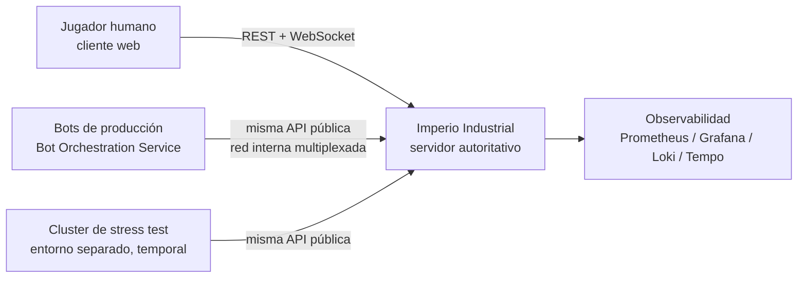
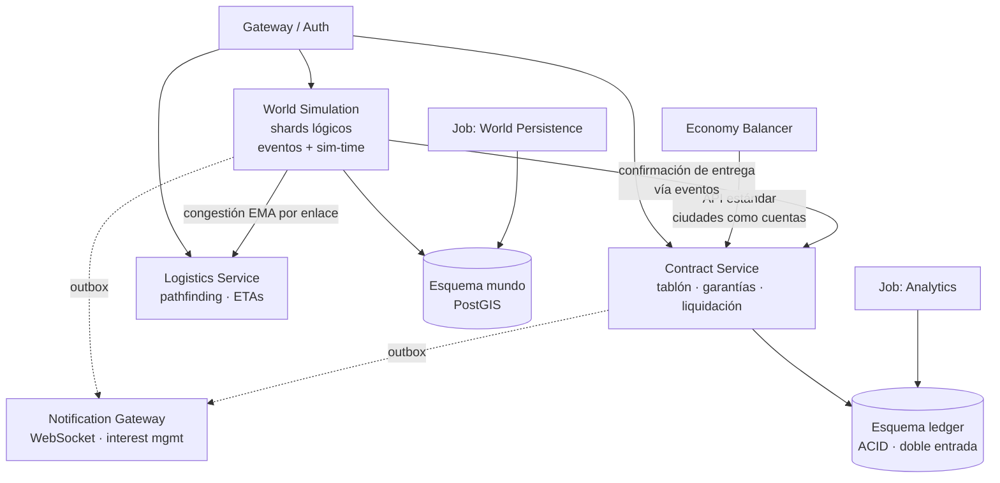

# Arquitectura del Proyecto – Imperio Industrial

## 1. Información General

**Proyecto:** Imperio Industrial — Simulación Económica MMO

**Versión del Documento:** 1.3 (derivada del GDD/SAD v1.3)

**Fecha:** 2026-07-17

**Responsables:** Equipo de Arquitectura / Backend

**Descripción General**
Este documento describe la arquitectura técnica del proyecto **Imperio Industrial**, un MMO de simulación económica, industrial y logística en un mundo único persistente, compartido por decenas de miles de jugadores humanos y una población permanente de bots. Incluye sus decisiones de diseño, estructura de componentes, flujos principales y estándares de desarrollo. El objetivo es servir como referencia técnica para el equipo, stakeholders y auditorías futuras.

Los tres invariantes arquitectónicos que gobiernan todo el diseño son:

1. **El valor económico nunca se pierde ni se duplica**: dinero, stock comprometido y contratos viven en un ledger de doble entrada con consistencia ACID estricta; las invariantes se garantizan en la base de datos, no en código de aplicación.
2. **El coste de simulación es proporcional a los eventos, no a las entidades**: motor event-driven sin tick global; las magnitudes continuas se derivan analíticamente bajo demanda.
3. **Las fronteras lógicas son firmes desde el día 1; la topología física es progresiva**: monolito modular en Fases 0–1, extracción a procesos separados solo cuando la medición lo exija.

---

## 2. Alcance del Documento

Este documento cubre:
- Arquitectura de software a nivel sistema (modelo C4, niveles 1–3)
- Principales decisiones arquitectónicas (ADR), consolidadas desde el Anexo B del GDD
- Estructura del proyecto y convenciones
- Patrones de diseño y principios técnicos
- Estrategia de escalabilidad y sus límites asumidos

Fuera de alcance:
- Diseño de gameplay y balance económico (ver GDD, secciones 2–13)
- Detalles de implementación de bajo nivel (algoritmos de pathfinding, fórmulas de demanda)
- Manuales de operación o despliegue (runbooks)

---

## 3. Contexto del Sistema (C4 – Nivel 1)

### 3.1 Descripción

Imperio Industrial es un sistema **cliente-servidor autoritativo**: el servidor es la única fuente de verdad y los clientes (web) solo envían intenciones y renderizan estado. Interactúan con el sistema tres tipos de actores:

- **Jugadores humanos**: acceden mediante un cliente web (REST para operaciones, WebSocket para eventos en tiempo real de su área de interés).
- **Bots de producción**: residentes permanentes del mundo, ejecutados por el Bot Orchestration Service como procesos externos que consumen **exactamente la misma API pública** que los humanos (igualdad de API literal, mismos rate limits lógicos). El motor no distingue el origen de un comando.
- **Cluster de stress test**: entorno efímero y separado que conecta cientos de miles de bots contra las mismas APIs para validar escalabilidad y balance antes de desplegar a producción. Nunca toca el mundo real.

No existen dependencias de sistemas externos de terceros en el camino crítico de juego: la economía es cerrada y endógena. Los únicos sistemas de soporte externos al dominio son autenticación/identidad y la plataforma de observabilidad.

### 3.2 Diagrama de Contexto



---

## 4. Contenedores del Sistema (C4 – Nivel 2)

### 4.1 Descripción de Contenedores

En Fases 0–1 la topología física es un **monolito modular**: pocas unidades desplegables con fronteras internas estrictas. Las cajas lógicas del diagrama **no** implican procesos separados desde el inicio (ver ADR-008, ADR-013 y ADR-017, y la sección 11 de este documento).

| Contenedor | Tecnología | Responsabilidad |
|-----------|------------|-----------------|
| Motor de simulación (shards + contratos + logística + balancer) | Go + sqlc | Simulación del mundo por shards lógicos, ciclo de vida del CCRI, pathfinding jerárquico, balance macroeconómico. Un solo proceso en Fases 0–1 con módulos tras fronteras estrictas (paquetes con interfaces, sin imports cruzados). |
| Gateway web / Auth / Presentación | Go + net/http | API pública REST, autenticación y sesiones, Notification/Event Gateway (WebSocket con interest management). |
| Bot Orchestration Service | Proceso aparte (consume la API como un cliente) | Ciclo de vida de la población de bots: modo mundo vivo, densidad dinámica, y aprovisionamiento del cluster de stress test. |
| Base de datos | PostgreSQL 18 (única instancia) + PostGIS 3.6 | Persistencia de todo el sistema con esquemas separados por dominio: mundo/espacial, ledger/contratos (ACID), analítica, outbox de eventos. TimescaleDB solo si el volumen medido lo justifica. |
| Mensajería entre módulos | Outbox table + polling sobre PostgreSQL | Propagación asíncrona de eventos de dominio. Kafka (con schema registry) solo en Fase 2+ y solo si el volumen lo exige. |
| Reverse proxy | Caddy | Terminación TLS y enrutado. |
| Despliegue | Docker Compose sobre hosts administrados manualmente | Plataforma definitiva y asumida (no transitoria); impone el techo de capacidad explícito de la sección 11.2. |

### 4.2 Diagrama de Contenedores


---

## 5. Componentes Principales (C4 – Nivel 3)

### 5.1 Organización Lógica

El sistema define **7 servicios lógicos y 2 jobs de plataforma** cuyas fronteras son firmes desde el día 1, independientemente de su materialización física:

| Componente lógico | Responsabilidad |
|-----|-----------------|
| Auth/Identity | Autenticación, sesiones, gestión de cuentas. Jugadores y bots comparten el mismo modelo de cuenta. |
| World Simulation Service (por shard lógico) | Física de edificios, producción, recursos naturales y **simulación de tránsito completa** (movimiento, averías, congestión) de los vehículos dentro de su macro-región. Cola de prioridad de eventos y sim-time propios por shard. **Materializado en el Incremento 2** como `internal/world` en su parte industrial (`catalog`/`land`/`buildings`/`production`) y **completado en el Incremento 3** con el subpaquete `world/fleet`: flota, cargamentos y el `TransitWorker` (motor de tránsito event-driven con congestión, averías y entrega física). Ver §5.5 y §5.6. |
| Contract Service | Tablón global de contratos, ventana de sorteo, bloqueo triple de garantías (stock reservado + garantía monetaria + escrow), verificación de entrega y liquidación pro-rata, para los dos tipos de contrato (CCRI de bienes y CCRI-Flete). Historial de contratos liquidados (OHLC). |
| Logistics Service | Planificación **sin estado de tránsito**: topología del grafo global, pathfinding ponderado por congestión suavizada (EMA), ETAs y definición de rutas propietarias. No simula vehículos. **Materializado en el Incremento 3** como `internal/logistics` (Dijkstra ponderado; HPA* jerárquico diferido como optimización por escala — ver §5.6). |
| Economy Balancer Service | Monitoreo macro (masa monetaria vs. PIB simulado), ajuste de impuestos/cánones dentro de rangos, curvas de demanda de ciudades, costo laboral regional por fórmula. Actúa como **agente decisor de las ciudades**, publicando sus solicitudes de compra por la API estándar del Contract Service (sin canal privilegiado). |
| Bot Orchestration Service | Población permanente de bots, densidad dinámica según actividad humana regional, aprovisionamiento del stress test. **Materializado en el Incremento 4** como `cmd/bots` + `internal/bots` sobre el SDK público `pkg/botsdk` (ADR-024): proceso aparte que aprovisiona el ciclo de vida por paquetes internos y juega exclusivamente por la API pública. Ver §5.7. |
| Notification/Event Gateway | Distribución WebSocket de eventos por área de interés; el tablón global se consulta bajo demanda (pull), nunca por push mundial. **Materializado en el Incremento 4** como `internal/notify` dentro del proceso gateway (protocolo ADR-023, referencia de uso en `docs/api/ws-protocol.md`). Ver §5.7. |
| *Job:* World Persistence | Snapshots periódicos de shards y backups (RPO/RTO definidos; snapshot global consistente en la ventana de mantenimiento diaria). Aislado de cargas batch. |
| *Job:* Analytics | Agregación de métricas y estadísticas de mercado (batch de baja prioridad, nunca compite con Persistence). |

### 5.2 Diagrama de Componentes



### 5.3 Flujos principales

**Ciclo de vida del CCRI (camino crítico del sistema):**

1. **Publicación** — la garantía propia se bloquea íntegramente al publicar (stock congelado del vendedor + 10% monetario, o 100% del pago del comprador en escrow). Invariante: *toda publicación visible en el tablón es ejecutable al 100%*, por construcción.
2. **Aceptación** — ventana de sorteo (30–60 s reales) con orden aleatorio entre aceptantes: la latencia no otorga ventaja (ni a bots ni a scripts). Aceptación total o parcial (K de N divide la publicación).
3. **Confirmación atómica** — bloqueo triple (stock reservado + garantía + escrow) en **una única transacción ACID local** del ledger, posible porque el inventario comprometible se modela como cuentas del mismo ledger que el dinero. Sin 2PC ni sagas.
4. **Ejecución logística** — el cargamento etiquetado con `contract_id` viaja físicamente; el shard confirma cada llegada parcial.
5. **Liquidación pro-rata** — se paga lo entregado a tiempo; sobre lo faltante, el escrow vuelve al comprador y la garantía del vendedor se reparte entre compensación y sink. El stock no entregado se libera **en su ubicación física actual** (nada se teletransporta, tampoco en los fallos).

**Movimiento de un vehículo (motor event-driven):**

- Se almacena `(estado_inicial, t_inicio, función_de_avance)`; la posición se deriva analíticamente cuando alguien la observa. Solo los **hitos** (salida, llegada a nodo, cruce de frontera, avería) generan eventos y escrituras. Un vehículo en un tramo largo sin incidencias no consume CPU.
- El cruce de frontera entre shards es, en el plan base (proceso único), un traspaso local entre colas de eventos. El protocolo formal de handoff multi-proceso (SELLADO → COPIADO → ACTIVADO → PURGADO, con `transfer_id` idempotente y el ledger como árbitro contable) queda **especificado pero no construido** hasta la extracción medida.

### 5.4 Nota de materialización (Incremento 1 — núcleo CCRI)

El primer incremento del backend hace explícitas dos consecuencias del monolito modular que conviene registrar aquí:

- **Rol dual del módulo `contracts` en runtime.** El Contract Service es un único módulo lógico (fronteras firmes, sin imports cruzados) pero se materializa en **dos superficies de ejecución** dentro del monolito: sus **handlers HTTP** los monta el proceso *gateway* (publicar, aceptar, consultar el tablón y los contratos propios), mientras que sus **barridos periódicos** —resolución de la ventana de sorteo, expiración de publicaciones por TTL de sim-time y liquidación de contratos al vencer— los ejecuta el proceso *engine* como un *worker* (`II_CONTRACTS_SWEEP_INTERVAL`). Ambos comparten el mismo esquema `ledger` y las mismas invariantes en SQL; la partición es de *dónde corre cada entrada*, no de propiedad. Es exactamente la disciplina que hace mecánica la extracción futura: el día que gateway y engine sean procesos separados, este reparto ya está hecho.
- **Patrón outbox ya materializado.** La mensajería entre módulos deja de ser solo diseño: `outbox.Emit(ctx, tx, …)` inserta el evento **en la misma transacción** que el cambio de estado que lo causa (nunca divergen), y `outbox.NewConsumer(name, eventTypes).Run(…)` procesa los eventos **en orden de `seq` avanzando su cursor dentro de la misma transacción del handler** — *exactly-once por consumidor*, reejecutar un lote no duplica su efecto. El **primer consumidor real es `ohlc_aggregator`** (módulo `market`), suscrito a `contract.settled`, que construye las velas OHLC por región de destino. El resto de módulos (Notification Gateway, Balancer) se enganchan al mismo mecanismo sin tocar a los emisores.

### 5.5 Nota de materialización (Incremento 2 — mundo y producción)

El segundo incremento **materializa el World Simulation Service** como el bounded context `internal/world`, cerrando el lazo **construir→producir→vender** contra el ledger y el CCRI del Incremento 1. Confirma tres consecuencias del monolito modular:

- **El World Simulation Service ya es código, no diagrama.** Se organiza en cuatro subpaquetes cohesivos que **comparten un único paquete sqlc del contexto** (`internal/world/sqlcgen`, una sola entrada en `sqlc.yaml`): `world/catalog` (lectura del mundo estático: regiones, productos, tipos de edificio, recetas, yacimientos, ciudades y demanda), `world/land` (concesiones y su mercado secundario de traspasos), `world/buildings` (construcción con validación de emplazamiento server-side, configuración, mejora e inventario físico) y `world/production` (cola de lotes, motor y reconciliación). La **física de tránsito** (vehículos, congestión, averías) del enunciado lógico del servicio **no** entra en este incremento (Fase 1 industrial); su especificación se conserva intacta.
- **Rol dual gateway↔engine, igual que `contracts`.** El mismo módulo lógico se materializa en dos superficies de ejecución: sus **handlers HTTP** los monta el proceso *gateway* (catálogos, concesiones y traspasos, edificios/mejora/inventario, cola de producción con progreso analítico derivado por consulta), mientras que su **motor event-driven y la reconciliación** los ejecuta el proceso *engine* como *workers* — barrido de construcción diferida (`II_BUILD_SIM_SECONDS`), barrido de producción analítica (`II_PRODUCTION_SWEEP_INTERVAL`, `FOR UPDATE SKIP LOCKED`) y job de reconciliación física↔contable (`II_RECONCILE_INTERVAL`, gauge `ii_reconciliation_discrepancies`, esperado 0). La partición es de *dónde corre cada entrada*, no de propiedad del esquema.
- **Fronteras firmes y consumo del ledger por el patrón existente.** `world` **no importa** `contracts`/`market`/`auth` ni viceversa (SAD §7); solo `platform` y `sim` son plataforma compartida. El substrato de valor (ledger) se consume **exactamente como en `contracts`**: queries sqlc propias del contexto contra las tablas `ledger.*` (la frontera de módulo es de código Go, no de esquema), con toda operación que mueve valor en `db.RunSerializable` + `outbox.Emit` **en la misma tx**. El dinero estructural va al `sink` del banco central (`build_cost`/`upgrade_cost` como `maintenance`, `canon`, `wage`; la `system_fee` del traspaso), y la producción asienta `production_output`/`consumption` contra `world_source` (ADR-022) moviendo el plano físico (`building_inventories`, `resource_deposits`) y el contable juntos.
- **Nuevos eventos de dominio por la outbox del mundo:** `concession.granted` / `concession.renewed` / `concession.transferred`; `building.created` / `building.updated` / `building.upgraded` / `building.constructed`; `batch.queued` / `batch.completed` / `batch.paused` / `batch.cancelled`. Los consumidores (Notification Gateway, Balancer) se enganchan sin tocar a los emisores, como con el CCRI. El detalle contable y operativo vive en la sección *v1.3* de `documentacion_base_de_datos.md`.

### 5.6 Nota de materialización (Incremento 3 — logística física, Fase 1 terrestre)

El tercer incremento materializa el pilar **ningún bien se mueve sin transporte físico; nada se teletransporta, tampoco en los fallos** (GDD 7.1/5.3), separando explícitamente las dos responsabilidades logísticas del §5.1 en dos bounded contexts que **no se importan** entre sí y se integran **solo por la outbox**:

- **Logistics Service ⇒ `internal/logistics` (planificación SIN estado de tránsito).** Materializa ADR-006 / GDD 15.1: lee el grafo del mundo (`world.network_*`), planifica rutas con **Dijkstra ponderado por la congestión EMA** (POST `/logistics/route-plans`, cálculo puro que no persiste; minimiza tiempo o coste aproximado) y define rutas propietarias como secuencia contigua de enlaces (`world.routes`/`route_legs`, el ÚNICO estado que escribe). No simula nada; aquí se decide *por dónde*. El **pathfinding jerárquico HPA*** (GDD 7.4) queda **diferido como optimización por escala**: a la escala de la Fase 1 (una región, pocos nodos) el Dijkstra plano es correcto y suficiente, y la interfaz `Planner` deja HPA* listo para insertar **sin cambiar la arquitectura**. Por eso la elección Dijkstra vs. HPA* **no requiere ADR** (el GDD ya la enmarca como optimización medida, no como decisión estructural).
- **World Simulation Service ⇒ `internal/world/fleet` (simulación de tránsito).** Completa el enunciado lógico del §5.1: el shard simula el movimiento. Su motor `TransitWorker` (proceso *engine*, event-driven, barrido `II_TRANSIT_SWEEP_INTERVAL` con `FOR UPDATE SKIP LOCKED`, cada vehículo en su tx serializable) procesa los segmentos vencidos —combustible, desgaste, **avería probabilística** (la carga espera a bordo, GDD 7.3), avance/llegada y **entrega física**—, reanuda averías y recalcula la **congestión por segmento (EMA)**. La posición del vehículo es **analítica** (`segmento + t_entrada + advance_fn`, derivada bajo demanda; solo los hitos escriben), coherente con el invariante nº 2. Los handlers HTTP de flota/cargamentos los monta el *gateway*: el mismo rol dual gateway↔engine ya visto en `contracts` y `world`.
- **Integración CCRI↔Logística: el patrón event-driven entre bounded contexts.** Es el ejemplo canónico de fronteras firmes sin imports cruzados (SAD §7). `contracts` emite `contract.confirmed` **enriquecido** (payload fijo con `kind`/origen/destino/`deadline_sim`); el consumidor `world` **`shipment_creator`** materializa el cargamento de las **compras cross-node** (mueve el stock físico fuera del almacén) y omite las ventas in situ. Al llegar el cargamento, `world` emite `shipment.arrived`, que el consumidor `contracts` **`delivery_confirmer`** consume para asentar la entrega (idempotente por `shipment_id`), acumular lo entregado a tiempo y **liquidar** al completarse. El vencimiento con cantidad sin entregar viaja como `contract.expired_undelivered` para coordinar la **liberación in situ** del lado físico. Nuevos eventos de outbox: `vehicle.*` (`purchased`/`updated`/`arrived`/`broken`/`stranded`), `shipment.*` (`created`/`dispatched`/`arrived`). El detalle contable, los payloads y la coherencia física↔contable ampliada (stock físico = `building_inventories` + cargamentos en vuelo) viven en la sección *v1.4* de `documentacion_base_de_datos.md`.

### 5.7 Nota de materialización (Incremento 4 — Notification Gateway, SDK de bots y Bot Orchestration Service)

El cuarto incremento materializa los dos servicios lógicos del §5.1 que faltaban para cerrar la Fase 0 del GDD (bots de reglas fijas validando el loop económico en tiempo real):

- **Notification/Event Gateway ⇒ `internal/notify` (en el proceso gateway).** Materializa ADR-023: el endpoint `GET /api/v1/ws` (librería `github.com/coder/websocket`), un **hub** de conexiones con suscripción por rooms (v1: solo `corp`, con buffer de envío acotado por conexión y cierre `1013` al consumidor lento) y un **router** que es un consumidor de outbox más (`notification_gateway`, mismo patrón del §5.4) con una diferencia deliberada: su cursor **avanza siempre** tras el fan-out — los sockets son efímeros y un cliente ausente re-sincroniza por REST; la entrega hacia clientes es at-least-once desde el `watermark`, no exactly-once. El protocolo es frames JSON con autenticación **en banda** (primer frame `auth`, cierre `4401` al vencer el plazo), `joined` con watermark para el bootstrap REST + deltas, y enrutado por interés resolviendo titularidades con lecturas puntuales a la BD (el paquete pertenece al contexto del gateway: puede leer la BD, pero no importa `internal/auth` — la validación de tokens llega por la interfaz `TokenValidator` del composition root). **No hay snapshots ni replay por el socket**: coherente con "el tablón es pull" (C10 del FAD) y con el modelo snapshot(REST)+deltas(WS) de ADR-FE-004. Referencia para integradores: `docs/api/ws-protocol.md`. Config `II_WS_*`; métricas `ii_ws_*`.
- **Bot Orchestration Service ⇒ `cmd/bots` + `internal/bots` + `pkg/botsdk` (proceso aparte, ADR-010/024).** El SDK `pkg/botsdk` es la **única vía soportada** para construir bots y en runtime consume **solo la API pública** (REST del contrato v1.3.0 + WS de ADR-023): sesión bearer, reintentos con `Idempotency-Key` estable por mutación, backoff ante 429 respetando `Retry-After`, paginación por cursor, cliente WS con re-join automático y watermark, y dinero/stock **como strings del contrato** (tipo propio, jamás float). Prohibido importar `internal/*` desde su runtime. El orquestador (`cmd/bots`, binario propio con `/healthz`, `/readyz` y `/metrics` en `II_BOTS_ADDR`) tiene la doble naturaleza asumida en ADR-024 con frontera nítida: el **ciclo de vida** (cuentas `kind=bot` con secreto derivado de `II_BOTS_SECRET_SEED`, `bot_profiles`, capitalización única `bot_capitalization`: +cash/−emission del banco central) va por paquetes internos y BD porque es operación monetaria, no comando de juego; **todo el gameplay** pasa por el SDK — mismos endpoints y rate limits que un humano (igualdad de API literal). Los **arquetipos v1** (`internal/bots`: `coal_producer`, `iron_producer`, `trader`) implementan la interfaz `Behavior` con reglas fijas **auditables**: cada decisión emite un log slog estructurado (bot, arquetipo, decisión, motivo, ids) y la métrica `ii_bot_decisions_total`. La densidad de población es la válvula de carga del GDD §19 (`II_BOTS_COAL_PRODUCERS`/`IRON_PRODUCERS`/`TRADERS`); el retiro de bots (liquidación + absorción monetaria) queda para el ciclo de embargo (Incremento 6).

---

## 6. Stack Tecnológico

### 6.1 Tecnologías Principales

- Runtime: procesos nativos Go (gateway y motor), sobre Docker Compose
- Lenguajes: **Go** para todo el backend — gateway, auth, motor de simulación, Contract Service, bots y su SDK (ADR-017; el código que mueve dinero se decide explícitamente, no por descarte). TypeScript existe **solo en el cliente web**
- Stack Go: `net/http` de la librería estándar (Go ≥1.22, sin framework web; middleware propio), `log/slog` con salida JSON, `pgx/v5` como driver de PostgreSQL, `prometheus/client_golang` para métricas, `golang.org/x/crypto` (argon2id) para credenciales y `github.com/coder/websocket` para el Notification Gateway (ADR-023); **sqlc solo como codegen de queries SQL escritas a mano, nunca de esquema** (ADR-020)
- Persistencia: **PostgreSQL 18, una sola instancia** con esquemas por dominio; extensiones PostGIS 3.6 (espacial) y TimescaleDB (solo si el volumen lo justifica)
- Migraciones: SQL escritas a mano en `backend/db/migrations`, aplicadas por un **runner propio** (`cmd/migrate`, targets `make migrate-*`) — ADR-020
- Mensajería: **outbox table + polling sobre PostgreSQL** en Fases 0–1; Kafka con schema registry en Fase 2+ solo si el volumen lo exige
- Reverse proxy: Caddy

**Regla de oro del ledger (independiente del lenguaje):** toda invariante de dinero/stock (no-negatividad, doble entrada balanceada, bloqueo triple atómico) vive **en la base de datos** — transacciones `SERIALIZABLE`, constraints y funciones SQL todo-o-nada. El código de aplicación orquesta; la base garantiza. Un bug de aplicación no puede romper la contabilidad.

**Explícitamente ausentes en Fases 0–1** (se adoptan solo contra medición): Kafka, Redis, Meilisearch, etcd, Kubernetes/orquestadores.

### 6.2 Herramientas de Soporte

- Testing: tests de invariantes del ledger a nivel SQL; el **modo stress test** con bots masivos actúa como banco de pruebas de carga y balance del camino real (los bots ejercitan la API pública literal)
- Linting / Formatting: los estándares de cada stack (gofmt/go vet en el backend; ESLint/Prettier en el frontend)
- Observabilidad: Prometheus (métricas), Grafana (dashboards), Loki (logs), Tempo (trazas). Métricas de dominio críticas: carga por shard lógico (umbral de alerta con meses de margen para la extracción), masa monetaria vs. PIB simulado, ritmo de agotamiento global de recursos (proyección 6–12 meses para planificar expansiones de mapa)

---

## 7. Estructura del Proyecto

Monorepo con **raíz fija e inmutable** (ADR-016): carpetas de primer nivel completamente independientes entre sí, con el **Makefile como único punto de entrada** de tareas (`build`, `test`, `lint`, `generate`, `migrate-*`, `dev`, …). El único acoplamiento permitido entre `/backend` y `/frontend` es *contract-first*: ambos derivan del contrato `docs/api/openapi.yaml` en tiempo de generación, nunca en runtime.

```
global-market/
├── backend/                     # todo el código de servidor — Go (módulo github.com/lokiteitor/global-market/backend)
│   ├── cmd/
│   │   ├── gateway/             # main del gateway: API REST pública, auth/sesiones, Notification Gateway (WebSocket)
│   │   ├── engine/              # main del proceso único del motor (shards, contratos, logística, balancer)
│   │   ├── bots/                # main del Bot Orchestration Service (Incremento 4, ADR-024): lifecycle interno + gameplay por pkg/botsdk
│   │   ├── migrate/             # runner propio de migraciones (ADR-020)
│   │   └── seed/                # datos semilla
│   ├── internal/
│   │   ├── auth/                # identidad y sesiones (humanos y bots); propietario del esquema auth
│   │   ├── sim/                 # simtime + reloj: cola de eventos y sim-time compartidos
│   │   ├── world/               # World Simulation Service: catalog/land/buildings/production (Incremento 2) + fleet (Incremento 3: flota, cargamentos, motor de tránsito) + sqlcgen del contexto
│   │   ├── contracts/           # Contract Service: tablón, sorteo, garantías, liquidación
│   │   ├── market/              # consumidores de outbox del CCRI (ohlc_aggregator) — Incremento 1
│   │   ├── logistics/           # Logistics Service (Incremento 3): planificación de rutas (Dijkstra ponderado por congestión), ETAs — sin estado de tránsito + sqlcgen propio
│   │   ├── balancer/            # Economy Balancer + agente decisor de ciudades
│   │   ├── notify/              # Notification/Event Gateway (Incremento 4, ADR-023): hub WS, router sobre outbox — contexto del proceso gateway
│   │   ├── bots/                # arquetipos de bots (Incremento 4, ADR-024): reglas fijas auditables; juegan SOLO vía pkg/botsdk
│   │   ├── ledger/              # acceso al esquema ledger (sqlc); invariantes en SQL
│   │   ├── outbox/              # publicación/consumo de eventos sobre PostgreSQL
│   │   └── platform/            # transversales: middleware HTTP, config, logging (slog), métricas
│   ├── pkg/
│   │   └── botsdk/              # SDK público de bots (ADR-010/024): consume exclusivamente la API pública (REST + WS); sin imports de internal/*
│   └── db/
│       └── migrations/          # migraciones SQL escritas a mano: NNNN_nombre.up.sql / NNNN_nombre.down.sql
├── frontend/                    # cliente web autónomo: Nuxt 4 + Vue 3 + TS estricto + Pinia + Sass (npm, sin workspaces)
├── infra/                       # Dockerfiles, Docker Compose, Caddy, Prometheus, Grafana
├── docs/                        # documentación viva: GDD, este documento, ADRs (docs/adr/), contrato OpenAPI (docs/api/openapi.yaml)
├── scripts/                     # scripts de apoyo (shell) invocados desde el Makefile
├── tools/                       # herramientas de desarrollo (lint de contrato, utilidades de generación)
├── Makefile                     # ÚNICO punto de entrada para tareas comunes
└── README.md
```

La antigua carpeta `specs/` se disuelve (ADR-016): el contrato OpenAPI vive en `docs/api/openapi.yaml` y los DDL de `specs/schemas/` se convierten en las migraciones reales de `backend/db/migrations` (fuente única de verdad del esquema).

Regla estructural: dentro de `backend/internal/`, los módulos se comunican **solo por interfaces y por la outbox** — sin imports cruzados entre `world`, `contracts`, `market`, `logistics` y `balancer` (SAD §7: `world` no importa `contracts`/`market`/`auth` ni viceversa; solo `platform` y `sim` son plataforma compartida importable por todos). El substrato de valor (ledger) se consume con queries sqlc propias de cada contexto contra las tablas `ledger.*`, no por imports cruzados. Esta disciplina es lo que convierte la extracción futura a procesos separados en una operación mecánica, no en un rediseño.

---

## 8. Convenciones de API

### 8.1 Convención de URLs

```
/api/v1/{modulo}/{recurso}
```

Ejemplos: `/api/v1/contracts/board` (tablón, consulta pull con filtros), `/api/v1/world/buildings`, `/api/v1/logistics/routes`.

Principios:
- **Una sola API pública para humanos y bots** — mismos endpoints, mismos rate limits lógicos. Los bots acceden por un camino de red interno barato (conexiones multiplexadas, sin TLS/edge por bot), pero la superficie de API es idéntica.
- **REST** para operaciones no urgentes (construcción, recetas, contratos); **WebSocket** para eventos en tiempo real del área de interés (movimiento de vehículos, alertas configuradas).
- **El tablón global es pull, no push**: se consulta bajo demanda con filtros (producto, ubicación, precio, plazo); las suscripciones push se limitan al área de interés y a alertas explícitas del jugador.
- **Sim-time en el contrato de API**: todo plazo (contratos, producción, viajes) se define y transmite en sim-time; la traducción a tiempo real es responsabilidad exclusiva de la UI.
- **Identificadores UUIDv7 planos, sin prefijos** (`type: string, format: uuid` en el contrato; `DEFAULT uuidv7()` en la base — ADR-018), únicos globalmente e independientes del esquema donde residan. El contrato conserva los schemas nominales (`AccountId`, `ContractId`, `VehicleId`, …) para que el codegen produzca tipos distinguibles.

### 8.2 Estructura de Respuestas

**Respuesta Exitosa**
```json
{
  "data": {},
  "meta": {
    "sim_time": "360-045-12:30",
    "server_time": "2026-07-15T10:00:00Z"
  }
}
```

**Respuesta de Error**
```json
{
  "error": {
    "code": "INSUFFICIENT_COLLATERAL",
    "message": "La garantía disponible no cubre la publicación solicitada",
    "details": { "required": "1000", "available": "740" }
  }
}
```

Los importes monetarios y cantidades de stock se serializan como **enteros/punto fijo en strings** — nunca floats (invariante del ledger).

---

## 9. Seguridad

- **Autenticación**: sesiones gestionadas por Auth/Identity en el gateway; jugadores y bots comparten el mismo modelo de cuenta y credenciales por cuenta.
- **Autorización**: por propiedad de recursos (una corporación solo comanda sus edificios, vehículos y contratos). Cuentas de sistema (ciudades, banco central) operan por la misma API sin canal privilegiado.
- **Servidor autoritativo**: el cliente solo envía intenciones; toda validación (espacio, fondos, stock, plazos) ocurre server-side. Ninguna regla de juego confía en el cliente.
- **Rate limiting idéntico para humanos y bots** — es además una decisión de balance de juego, no solo de protección.
- **Anti-abuso económico por diseño, no por vigilancia**: la ventana de sorteo elimina la ventaja de latencia (no hace falta detección de automatización como sistema crítico); la garantía fija sin reputación elimina el incentivo al wash-trading; las garantías bloqueadas desde la publicación eliminan el spoofing del tablón; el cooldown anti-parpadeo impide el flickering especulativo.
- **Integridad financiera**: invariantes en SQL (`SERIALIZABLE`, constraints); el ledger de doble entrada hace que cualquier duplicación de valor sea una violación contable detectable de inmediato, no un bug silencioso.
- Principio de mínimo privilegio aplicado en la infraestructura (credenciales por servicio/esquema).

---

## 10. Manejo de Errores

| Código | Significado | Uso típico en el dominio |
|------|-------------|--------------------------|
| 400 | Bad Request | Comando malformado, unidades inválidas |
| 401 | Unauthorized | Sesión ausente o expirada |
| 403 | Forbidden | Comandar recursos de otra corporación; vehículo SELLADO durante handoff |
| 404 | Not Found | Entidad inexistente (UUID no resuelto) |
| 409 | Conflict | Aceptación sobre publicación agotada; cancelación dentro del cooldown; stock ya reservado |
| 422 | Validation Error | Garantía insuficiente, requisitos de emplazamiento no cumplidos, lote menor al mínimo de aceptación |
| 429 | Too Many Requests | Rate limit (idéntico para humanos y bots) |
| 500 | Internal Server Error | Error inesperado; nunca deja garantías a medio bloquear (transacciones todo-o-nada) |
| 503 | Service Unavailable | Ventana de mantenimiento diaria (sim-time congelado; respuesta con `Retry-After`) |

Principio transversal: **los fallos parciales nunca comprometen el valor económico**. Toda operación sobre dinero/stock es atómica en el ledger; los fallos de simulación física se recuperan por snapshot (RPO de minutos aceptado solo para estado físico) con reconciliación física↔contable posterior.

---

## 11. Principios Arquitectónicos

### 11.1 Principios de diseño

- **El ledger es la fuente de verdad del valor; el shard, de la física.** Dinero, garantías, escrow y stock comprometible viven en cuentas ACID; el shard posee posiciones, progresos y ocupación, con reconciliación periódica entre ambos planos.
- **Event-driven puro**: coste ∝ eventos ocurridos, no ∝ entidades existentes. Sin tick global; magnitudes continuas analíticas bajo demanda.
- **Fronteras lógicas firmes, materialización física progresiva**: monolito modular primero; extracción medida después. Nunca microservicios especulativos.
- **Simplicidad operacional sobre elasticidad**: Docker Compose sobre hosts manuales como destino, ventana de mantenimiento diaria con sim-time congelado (despliegues, migraciones, snapshots globales y rebalanceos sin ingeniería heroica). Se renuncia deliberadamente a migración en caliente y rebalanceo automático.
- **Igualdad de API literal**: los bots son el stress test permanente del camino real del sistema.
- **Diseñar contra el abuso eliminando el incentivo**, no construyendo maquinaria de vigilancia (sorteo vs. FIFO; garantía fija vs. reputación).
- **Sim-time como único reloj lógico** del dominio; wall-clock solo para sesiones, rate limiting y UI.
- Observabilidad desde el diseño: las métricas que disparan las decisiones de extracción y expansión de mapa son requisitos de primer nivel, no un añadido.

### 11.2 Techo de capacidad (restricción asumida)

La plataforma de despliegue definitiva (Compose, hosts manuales) impone un **techo consciente**: el mundo crece hasta lo que quepa en esos hosts (decenas de miles de agentes con holgura, dado el motor event-driven; "millones" queda condicionado). Válvulas dentro del techo, en orden: densidad de bots como válvula de carga principal → escalado vertical del proceso del motor → extracción de shards a procesos entre hosts (activando el handoff especificado). Si el juego desborda el techo de forma sostenida, lo que se revisita es la plataforma de despliegue — no la arquitectura, cuyas fronteras existen precisamente para mantener esa puerta abierta.

### 11.3 Riesgos técnicos principales (asumidos y registrados)

| Riesgo | Mitigación |
|---|---|
| Extracción multi-proceso tardía (handoff construido bajo presión) | Protocolo ya especificado (GDD 15.2); umbrales de alerta de carga por shard con meses de margen; ventana de mantenimiento simplifica la migración |
| Shard caliente sin subdivisión (región = unidad indivisible) | Escalado vertical; diseño de mapa que dispersa atractores; impuestos/canon como congestion pricing |
| Pérdida de minutos de estado físico tras caída (replay relajado) | Snapshots frecuentes; el valor económico vive en el ledger ACID y no pierde nada; reconciliación al recuperar |
| Agotamiento global acoplado al calendario de expansiones | Métrica de ritmo de agotamiento con proyección 6–12 meses en el Economy Balancer |
| Colapso económico por bots mal calibrados | Balancer con límites y alertas; stress test obligatorio antes de cambios mayores |

---

## 12. Architecture Decision Records (ADR)

Las decisiones arquitectónicas se documentan siguiendo el formato ADR. El GDD (Anexo B, v1.3) mantiene el registro histórico completo; aquí se consolidan las **estructurales para la arquitectura de software**. ADR-001 a ADR-015 están renumeradas para este documento con referencia a su origen en el GDD; **ADR-016 a ADR-024** son documentos ADR de pleno derecho cuyo detalle íntegro (contexto, decisión, consecuencias) vive en `docs/adr/`.

### 12.1 Formato ADR

| Campo | Descripción |
|-----|------------|
| ID | ADR-XXX |
| Fecha | YYYY-MM-DD |
| Estado | Propuesto / Aceptado / Deprecado |
| Contexto | Situación que motiva la decisión |
| Decisión | Decisión tomada |
| Consecuencias | Impactos positivos y negativos |

### 12.2 Registro de ADRs

| ID | Origen | Estado | Decisión | Trade-off asumido |
|----|-------|--------|----------|----------|
| ADR-001 | #1 | Aceptado | Motor **event-driven** por shard (cola de prioridad; magnitudes continuas analíticas), sin tick global | Mayor disciplina de diseño; coste ∝ eventos, no ∝ entidades |
| ADR-002 | #2 | Aceptado | Ratio de tiempo **24×**; todo plazo de dominio en **sim-time**; wall-clock solo para sesiones/UI | La UI traduce siempre; la pausa diaria es económicamente transparente |
| ADR-003 | #4 | Aceptado | **Ventana de mantenimiento diaria** con sim-time congelado y coordinado | 10–30 min/día de pausa a cambio de despliegues, migraciones, snapshots globales y rebalanceos triviales |
| ADR-004 | #8 | Aceptado | **Inventario comprometible como cuentas del ledger**: bloqueo triple del CCRI = 1 transacción ACID local | El shard cede la propiedad contable del stock; reconciliación física↔contable periódica |
| ADR-005 | #19 | Aceptado | **Contract Service en Go**; invariantes de dinero/stock **en SQL** (`SERIALIZABLE`, constraints, funciones todo-o-nada) | La contabilidad no depende del lenguaje de aplicación (su parte de «dos stacks backend» queda derogada por ADR-017; la regla de oro del ledger permanece intacta) |
| ADR-006 | #10 | Aceptado | **Los shards simulan tránsito; Logistics Service solo planifica** (sin estado de movimiento) | La congestión de enlaces fronterizos se simula por segmentos |
| ADR-007 | #13 | Aceptado | **Región de gameplay = unidad de sharding**, indivisible | Hotspots solo mitigables con escalado vertical, diseño de mapa y congestion pricing fiscal |
| ADR-008 | #17 | Aceptado | **Monolito modular** en Fases 0–1: un proceso Go, un PostgreSQL, outbox; sin Kafka/Redis/Meilisearch/etcd | La validación de la topología distribuida se pospone a la extracción medida |
| ADR-009 | #18 | Aceptado | **Docker Compose como destino final** (techo de capacidad explícito; sin orquestador ni autoescalado) | El pilar "masivo" queda acotado; revisitable solo si se desborda de forma sostenida |
| ADR-010 | #24, #25 | Aceptado | **Bots como procesos externos con la API real**; su capitalización es emisión contabilizada del banco central | Coste de red interno a cambio de igualdad de API literal; política monetaria y densidad de bots comparten libro |
| ADR-011 | #26 (deroga #7) | Aceptado | **Ventana de sorteo** en el tablón: orden aleatorio entre aceptantes; la latencia no vale nada | Se elimina la detección de automatización como sistema crítico de balance |
| ADR-012 | #32 (modifica #3) | Aceptado | **Replay bit a bit rebajado a aspiración**: snapshots periódicos + ledger ACID como respaldo del valor | RPO de minutos solo en estado físico; bugs de balance menos reproducibles |
| ADR-013 | #33 (modifica #11, #13) | Aceptado | **Todos los shards lógicos en un único proceso**; protocolo de handoff especificado pero no construido | Si el crecimiento desborda el proceso único, el multi-proceso se construye bajo presión (riesgo registrado) |
| ADR-014 | #28 (deroga #5) | Aceptado | **Una garantía íntegra por publicación** (sin reserva compartida N:M) | Explorar varias regiones exige más capital; la aceptación no arrastra cancelaciones en cascada en la ruta crítica |
| ADR-015 | #11 | Aceptado | **Handoff formal por evento** (SELLADO→COPIADO→ACTIVADO→PURGADO, `transfer_id` idempotente, ledger como árbitro) para el despliegue multi-proceso futuro | Protocolo por implementar y probar cuando la extracción se active |
| ADR-016 | `docs/adr/` | Aceptado | **Raíz de monorepo fija** (`/backend /frontend /infra /docs /scripts /tools` + Makefile como único punto de entrada); `specs/` se disuelve: contrato → `docs/api/openapi.yaml`, DDL → migraciones reales | Reescritura de las secciones de estructura de los documentos, a cambio de una raíz estable con fronteras físicas alineadas con las lógicas |
| ADR-017 | `docs/adr/` (deroga GDD #19) | Aceptado | **Backend 100% Go, gateway incluido** (`net/http` estándar, Go ≥1.22, middleware propio); Fastify y Drizzle desaparecen; TypeScript solo en el cliente web | Se pierde la afinidad natural TS↔Fastify para el fan-out WebSocket; Go la cubre con goroutines/canales |
| ADR-018 | `docs/adr/` (deroga GDD §17.2) | Aceptado | **PostgreSQL 18 + PostGIS 3.6**; identificadores **UUIDv7 planos** (`DEFAULT uuidv7()` en BD, `format: uuid` en la API), sin prefijos ni dominio `ulid_id`; schemas nominales conservados en el contrato | Se pierde la legibilidad del tipo a simple vista en logs/URLs; se compensa con tipos nominales/wrapper y logging estructurado |
| ADR-019 | `docs/adr/` (deroga GDD §1) | Aceptado | **Vista top-down cenital (90°)**, sin isométrico; geometría PostGIS planar **SRID 0** (unidad = metro de mundo); formas GeoJSON-like con coordenadas planas `[x_m, y_m]` en la API | Se renuncia al atractivo visual isométrico a cambio de legibilidad, densidad de información y render/matemática más simples |
| ADR-020 | `docs/adr/` | Aceptado | **Migraciones SQL a mano** en `backend/db/migrations` (`NNNN_nombre.up/down.sql`) con **runner propio** (`cmd/migrate`: transacciones, checksums SHA-256); sqlc solo como codegen de queries | Coste de mantener el runner y escribir el `down` de cada migración, a cambio de reproducibilidad total y cero magia |
| ADR-021 | `docs/adr/` | Aceptado | **Frontend autónomo** (npm, sin workspaces); tipos generados con `openapi-typescript` desde `docs/api/openapi.yaml` vía `make generate`; prohibidas las librerías de componentes/CSS utilitario | Sin paquete compartido de tipos entre cliente y servidor: la coherencia la garantiza el contrato, no un paquete común |
| ADR-022 | `docs/adr/` | Aceptado | **Cuentas `world_source`**: contrapartida física del ledger para el alta (`production_output`) y baja (`consumption`) de stock — cuenta de stock por producto del banco central, única de stock que puede ser negativa (masa física emitida), simétrica a `emission` para el dinero | Una fila de cuenta por producto; la doble entrada por activo se mantiene estricta sin excepciones al trigger |
| ADR-023 | `docs/adr/` (resuelve FAD §27.5 nº1; completa ADR-017 §5) | Aceptado | **Protocolo del Notification/Event Gateway (WebSocket)**: `GET /api/v1/ws` con `github.com/coder/websocket`; frames JSON con auth en banda, room `corp`, `joined` con watermark y bootstrap por REST + deltas at-least-once; router = consumidor outbox `notification_gateway` cuyo cursor avanza siempre. Referencia de uso: `docs/api/ws-protocol.md` | Sin replay histórico: reconectar implica re-pull REST (asumido: es el patrón snapshot+deltas del propio backend) |
| ADR-024 | `docs/adr/` (desarrolla ADR-010, GDD §13/§15.4) | Aceptado | **SDK oficial de bots (`pkg/botsdk`) como única vía soportada** (runtime solo API pública, sin `internal/*`) **y Bot Orchestration Service (`cmd/bots`)**: lifecycle (cuentas bot, perfiles, capitalización = emisión contabilizada) por paquetes internos; todo el gameplay por el SDK; arquetipos v1 de reglas fijas auditables (`coal_producer`, `iron_producer`, `trader`) tras la interfaz `Behavior` | Doble naturaleza del orquestador (admin por BD + jugador por API) con frontera nítida: lifecycle=interno, gameplay=SDK |

Toda nueva decisión estructural (adopción de Kafka, extracción de un módulo, particionado del ledger por cuenta) **debe** registrarse como ADR antes de implementarse, incluyendo la medición que la justifica.

---

## 13. Notas y Consideraciones Finales

- **La arquitectura es inseparable del diseño de juego**: el pilar "economía físicamente restringida y persistente" depende directamente de decisiones de sharding, consistencia y del mercado como servicio. Cualquier iteración de gameplay (nuevas recetas, nuevos modos de transporte) debe evaluarse también por su impacto en la escalabilidad, y viceversa.
- **Disparadores de evolución medidos, no especulativos.** Los principales umbrales que activan cambios de topología: carga sostenida del proceso único del motor → extracción de shards (y construcción del handoff ADR-015); volumen de la outbox → Kafka con schema registry; latencia de consultas del tablón en PostgreSQL → motor de búsqueda dedicado; volumen del ledger → particionado por cuenta (transferencias entre particiones vía saga), ya diseñado conceptualmente.
- **Retención acotada en un mundo que nunca se resetea**: agregados permanentes (OHLC, índices de ciudades); detalle raw del ledger y contratos liquidados a almacenamiento frío tras ~1 año de juego (consultable para auditoría); snapshots con retención escalonada.
- **Elementos diseñados pero diferidos** (especificación conservada, activación por fase): red eléctrica regional (Fase 3), CCRI-Flete y slots de terminales (Fase 2), extracción multi-proceso (medida), y el **pathfinding jerárquico HPA*** del Logistics Service (optimización por escala, no cambio de arquitectura: la interfaz `Planner` lo deja listo; el Dijkstra plano ponderado por congestión de la Fase 1 lo hace innecesario mientras el grafo sea pequeño — sin ADR). Las expansiones de la sección 22 del GDD (reputación, reserva compartida, futuros financieros, consorcios) son reintroducibles de forma aditiva sobre el CCRI sin rediseño.
- El roadmap técnico sigue las fases del GDD (sección 21): Fase 0 valida el loop económico con un shard y un producto; la Fase 1 entrega el vertical slice con el ciclo CCRI completo contra entrega física; las fases posteriores amplían mundo, modos de transporte y escala.

**Referencia normativa:** GDD/SAD v1.3 (`gdd.md`) y los ADR de `docs/adr/`. Ante discrepancia entre ambos documentos, prevalece el GDD y este documento debe actualizarse.
