# 📚 Documentación Base de Datos — Imperio Industrial

## MMO de simulación económica, industrial y logística en un mundo único persistente. Decenas de miles de jugadores humanos y una población permanente de bots comparten el mismo mapa, el mismo mercado (tablón global de contratos CCRI) y las mismas reglas, sobre un servidor autoritativo.

**Versión:** 1.3 · **Fecha:** 2026-07-17 · **Fuentes normativas:** GDD/SAD v1.3 (`gdd.md`), Arquitectura v1.2 (`arquitectura_imperio_industrial.md`) y contrato OpenAPI v1.2.0 (`api/openapi.yaml`), con los ADR-016 a ADR-022. Ante discrepancia, prevalece el GDD.

> **Cambios de v1.2 (Incremento 1 — núcleo CCRI, Fase 0):** ADR-022 (`ledger.account_kind` = `world_source`, contrapartida física de `production_output`/`consumption`); nueva tabla `public.idempotency_keys` (cabecera `Idempotency-Key` del contrato v1.2.0); migración `0008_ccri_support`; e **interpretaciones operativas del CCRI** (entrega in situ de las ventas, `origin_node_id` del aceptante en las compras, TTL de publicaciones abiertas, reparto de garantía, OHLC por región de destino) — todas en las secciones marcadas *v1.2* más abajo.
>
> **Cambios de v1.3 (Incremento 2 — mundo y producción, Fase 1):** cierra el lazo construir→producir→vender sobre el esquema `world` que ya existía desde `0003_world` — **no añade tablas, enums ni migraciones** (el bounded context `internal/world` materializa la *operación* de las tablas ya definidas). Documenta las **interpretaciones operativas del mundo y la producción**: sinks de `build_cost`/`upgrade_cost`/`canon`/`wage` y el traspaso de concesión; asientos de producción/extracción (`production_output`/`consumption` con `world_source` y su gemelo físico `building_inventories` en la misma tx); extracción que decrementa `resource_deposits` (finito); progreso analítico no persistido; reconciliación física↔contable (job del engine, gauge); decisión de combustible (`fuel_stock` como columna espejo); pausas `paused_no_fuel`/`paused_no_workers` como cascada de insolvencia parcial; y tiempo de construcción fijo — todas en la sección *v1.3* más abajo.

---

## 📋 Información General

### Componentes de Datos

- **Base de datos principal**: PostgreSQL, **una sola instancia** para todo el sistema (ADR-008), con **esquemas separados por dominio** — no una arquitectura poliglota:
  - `auth` — identidad, credenciales, sesiones y perfiles de bot (propiedad del módulo Go del gateway, ADR-017).
  - `world` — estado físico del mundo con PostGIS (propiedad del motor Go, un shard lógico por región).
  - `ledger` — dinero, stock comprometible, tablón y contratos CCRI, con ACID estricta (propiedad del Contract Service).
  - `analytics` — agregados permanentes: velas OHLC, indicadores macro (job Analytics).
  - `outbox` — mensajería asíncrona entre módulos (outbox table + polling).
  - `public` — **infraestructura transversal de la API**, no ligada a ningún dominio: la tabla `idempotency_keys` (cabecera `Idempotency-Key` del contrato v1.2.0, propiedad del gateway) y `schema_migrations` (runner de migraciones). Mismo criterio que da PostgreSQL a `public` por defecto.
- **Bases de datos auxiliares**: ninguna. Instancias separadas solo si la escala medida lo exige (GDD 17.1).
- **Cache / Search / Otros**: **explícitamente ausentes en Fases 0–1** (se adoptan solo contra medición, ADR-008): sin Redis, sin Meilisearch, sin Kafka, sin etcd. El tablón global se sirve desde PostgreSQL con índices apropiados; TimescaleDB solo si el volumen de series lo justifica.

> **Alcance**: este documento cubre el esquema lógico completo de Fases 0–2 (incluye CCRI-Flete y slots de terminales, que se activan en Fase 2). No cubre: la red eléctrica regional (Fase 3, especificación conservada en GDD 5.8), el particionado del ledger por cuenta (diseñado conceptualmente, no construido), ni los runbooks de operación.

---

### PostgreSQL (relacional, única instancia)

- **Motor**: PostgreSQL 18 + extensión PostGIS 3.6 (imagen de referencia `postgis/postgis:18-3.6`, ADR-018)
- **Encoding**: UTF-8
- **Host**: definido en `infra/docker-compose.yml` (hosts administrados manualmente, ADR-009)
- **Puerto**: 5432
- **Usuario**: credenciales **por servicio/esquema** (mínimo privilegio, Arquitectura §9). La migración de roles crea **roles de grupo `NOLOGIN`** con sus GRANTs — `ii_gateway` (escribe `auth`), `ii_engine` (escribe `world`/`ledger`/`outbox`), `ii_analytics` (escribe `analytics` y solo lee `ledger`); los usuarios `LOGIN` por entorno los crea la infraestructura (en dev, el init de Docker) y heredan del rol de grupo correspondiente
- **Schema**: `auth`, `world`, `ledger`, `analytics`, `outbox`, y `public` (transversal: `idempotency_keys`, `schema_migrations`)
- **Estrategia de IDs**: **UUIDv7 nativo, plano y sin prefijo** (ADR-018): `uuid PRIMARY KEY DEFAULT uuidv7()` en todas las tablas de entidad, únicos globalmente e independientes del esquema donde residan. Cuando la aplicación necesita el ID **antes** del INSERT (partidas pre-generadas de las funciones todo-o-nada, claves de idempotencia) lo genera con UUIDv7 en Go. En la API viajan como `type: string, format: uuid`, conservando los schemas nominales (`AccountId`, `ContractId`, …) para que el codegen produzca tipos distinguibles. Excepción: `outbox.events.seq` usa `IDENTITY` porque el polling exige un orden total barato.

**Nombre de base de datos**:

- `imperio` (local y producción; una sola instancia, un solo mundo — no hay multi-tenant: el juego es un único mundo persistente que nunca se resetea)

**Dominios de tipos comunes** (definidos en la migración inicial de `/backend/db/migrations`):

| Dominio | Tipo base | Uso |
|---|---|---|
| `sim_time` | `BIGINT >= 0` | Segundos de sim-time desde el génesis del mundo. **Todo plazo de juego se almacena en sim-time**; el wall-clock (`TIMESTAMPTZ`) solo se usa para sesiones, auditoría y las dos mecánicas explícitamente definidas en tiempo real (ventana de sorteo y cooldown anti-parpadeo) |
| `money_amount` | `BIGINT` | Dinero en unidades menores (punto fijo). **Nunca floats** — invariante del ledger. En la API se serializa como string |
| `stock_qty` | `BIGINT` | Cantidades de stock en la unidad mínima del producto. Nunca floats |

---

### Otras Bases de Datos / Servicios

No aplica en Fases 0–1. Disparadores de adopción registrados (deben pasar por ADR con medición que los justifique):

- Volumen de la outbox → **Kafka** con schema registry (Fase 2+).
- Latencia de consultas del tablón → motor de búsqueda dedicado (p. ej. Meilisearch).
- Volumen de series OHLC → **TimescaleDB** (extensión de la misma instancia).
- Volumen del ledger → particionado por cuenta (transferencias entre particiones vía saga).

---

## 🎯 Propósito del Modelo de Datos

- ✅ **Identidad unificada**: humanos, bots, ciudades y banco central comparten el mismo modelo de cuenta, sin canal privilegiado (igualdad de API literal).
- ✅ **Ledger de doble entrada**: dinero, escrow, garantías y stock comprometible como cuentas ACID; el valor económico nunca se pierde ni se duplica (invariante nº 1 de la arquitectura).
- ✅ **Ciclo de vida completo del CCRI**: publicación con garantía bloqueada, ventana de sorteo, aceptación parcial, bloqueo triple atómico, entrega acumulativa y liquidación pro-rata; más el CCRI-Flete con custodia contable (Fase 2).
- ✅ **Estado físico del mundo**: regiones/shards, ciudades y curvas de demanda, yacimientos finitos, concesiones de suelo, edificios y producción por lotes.
- ✅ **Red logística física**: grafo de nodos/enlaces/segmentos con congestión EMA, terminales con slots de prioridad, flotas con posición analítica y cargamentos etiquetados por contrato.
- ✅ **Analítica permanente**: OHLC de contratos liquidados, evolución de ciudades, indicadores macro (masa monetaria vs. PIB, ritmo de agotamiento de recursos).
- ✅ **Mensajería entre módulos**: transactional outbox con cursores de consumo.

---

## 📊 Estadísticas Generales

```
Total de Tablas:            44   (auth 4 · world 25 · ledger 8 · analytics 4 · outbox 2 · public 1)
Total de Enums:             21   (v1.2 no añade enums: world_source es un VALUE nuevo de ledger.account_kind, no un enum)
Dominios de tipo:            3   (sim_time, money_amount, stock_qty)
Triggers de invariante:      4   (balance por cuenta, doble entrada diferida, inmutabilidad ×2)
Funciones todo-o-nada:       2 documentadas (confirm_contract, settle_contract_prorata)
```

*(v1.2 añade `public.idempotency_keys` a las 43 tablas de v1.1 —que a su vez había añadido `auth.account_credentials` y `world.sim_clock` a las 41 de v1.0— y el `ledger.account_kind` `world_source` (ADR-022). **v1.3 (Incremento 2) no altera ningún conteo**: opera las tablas de `world` que ya existían desde `0003_world` sin migraciones nuevas. La fuente de verdad de todos los conteos —tablas, índices, FKs, CHECKs— son las migraciones de `/backend/db/migrations`, aplicadas contra PostgreSQL 18 + PostGIS 3.6.)*

---

## 🗂️ Estructura de Base de Datos

### Fuente de Verdad del Esquema

- **DDL / Migraciones**: la **fuente única de verdad del esquema** son las migraciones SQL escritas a mano en `/backend/db/migrations` (convención `NNNN_nombre.up.sql` / `NNNN_nombre.down.sql`, ADR-020), aplicadas por el runner propio `cmd/migrate` con los targets `make migrate-up` / `make migrate-down` / `make migrate-create` / `make migrate-status` / `make reset-db`. Ya no existen `docs/schemas`, `specs/schemas` ni `engine/migrations`; Drizzle desaparece del proyecto y el esquema `auth` pasa a ser propiedad del módulo Go del gateway (ADR-017). **sqlc** se conserva exclusivamente como generador de código Go a partir de queries SQL escritas a mano — nunca genera ni aplica esquema.
- **Migraciones**: se aplican **exclusivamente durante la ventana de mantenimiento diaria** (sim-time congelado, ADR-003), lo que hace triviales las migraciones con estado.
- **Seeds**: generación procedural del mundo (GDD §9): regiones, biomas, ciudades, yacimientos y grafo logístico se generan **una única vez** a partir de una semilla y se persisten; la generación no se re-ejecuta. Catálogos (productos, recetas, tipos de edificio/vehículo) se cargan como seeds versionados.

Orden lógico de las migraciones iniciales (en `/backend/db/migrations`):

```
0001_init         → extensiones, esquemas, dominios de tipos
0002_auth         → identidad, credenciales y sesiones
0003_world        → mundo físico (PostGIS, SRID 0) y reloj de simulación
0004_ledger       → ledger, tablón, contratos + FKs cross-schema world↔ledger
0005_analytics    → agregados
0006_outbox       → mensajería
0007_roles        → roles de grupo NOLOGIN (ii_gateway/ii_engine/ii_analytics) y GRANTs por esquema (mínimo privilegio)
0008_ccri_support → ADR-022 (kind world_source) + public.idempotency_keys — soporte del núcleo CCRI (Incremento 1)
```

> **Migración `0008_ccri_support` (Incremento 1).** Se aplica con la directiva `-- migrate:no-transaction`: `ALTER TYPE ... ADD VALUE 'world_source'` no puede usarse en la misma transacción que lo referencia, así que cada sentencia va en autocommit y **todas son re-ejecutables** (`IF EXISTS`/`IF NOT EXISTS` o drop+add emparejados). Los dos CHECK de `ledger.accounts` (`ck_accounts_non_negative`, `ck_accounts_asset`) se recrean con `NOT VALID` + `VALIDATE` para no escanear la tabla bajo `ACCESS EXCLUSIVE`; la nueva condición es estrictamente más permisiva, así que `VALIDATE` no puede fallar sobre datos existentes. El `down` **falla explícitamente** si existen filas `world_source` (su saldo negativo violaría los CHECK originales) y no puede eliminar el VALUE del enum (límite de PostgreSQL: no hay `ALTER TYPE ... DROP VALUE`), que queda inerte al restaurarse los CHECK.

---

## 🔐 Módulo Auth/Identity (esquema `auth`)

Propiedad del módulo Go del gateway (`cmd/gateway`, ADR-017). Jugadores y bots comparten el mismo modelo de cuenta (GDD 18.1); las ciudades y el banco central operan por la misma API como cuentas de sistema.

### 1. `auth.accounts`

**Descripción**: corporaciones del mundo — jugadores humanos, bots, ciudades y cuentas de sistema (banco central). Es la raíz de propiedad de todos los recursos (edificios, vehículos, contratos, cuentas del ledger).

```sql
CREATE TYPE auth.account_kind AS ENUM ('human','bot','city','system');
CREATE TYPE auth.account_status AS ENUM ('active','suspended','retired');

CREATE TABLE auth.accounts (
    id            uuid PRIMARY KEY DEFAULT uuidv7(),
    kind          auth.account_kind NOT NULL,
    name          TEXT NOT NULL,
    status        auth.account_status NOT NULL DEFAULT 'active',
    created_at    TIMESTAMPTZ NOT NULL DEFAULT now(),
    updated_at    TIMESTAMPTZ NOT NULL DEFAULT now()
);
```

#### DDL de Índices y Constraints

```sql
CREATE UNIQUE INDEX ux_accounts_name ON auth.accounts (lower(name));
CREATE INDEX ix_accounts_kind ON auth.accounts (kind) WHERE status = 'active';
```

#### Enums Relacionados

##### `auth.account_kind`

| Valor | Descripción |
|---|---|
| `human` | Jugador humano (corporación) |
| `bot` | Bot de producción, gestionado por el Bot Orchestration Service |
| `city` | Ciudad como cuenta de mercado; su agente decisor es el Economy Balancer |
| `system` | Banco central y cuentas operativas del sistema |

##### `auth.account_status`

| Valor | Descripción |
|---|---|
| `active` | Cuenta operativa |
| `suspended` | Suspendida (moderación) |
| `retired` | Bot retirado / cuenta liquidada por el ciclo de embargo |

#### Diccionario de Campos

| Campo | Tipo | Descripción |
|---|---|---|
| `id` | `uuid` (UUIDv7) | Identificador global de la corporación |
| `kind` | enum | Tipo de actor; el motor **no distingue el origen de un comando** |
| `name` | TEXT | Nombre público, único sin distinguir mayúsculas |
| `status` | enum | Estado de ciclo de vida |

#### Reglas de Negocio

- Una sola API pública para todos los `kind` — mismos endpoints, mismos rate limits lógicos (Arquitectura §8.1).
- El saldo de la corporación **no vive aquí**: es la cuenta `cash` del ledger (una por corporación, nunca negativa — no existe deuda, GDD 5.9).
- El retiro de un bot (`retired`) implica liquidación de activos por el ciclo estándar de embargo/subasta y destrucción de su efectivo (absorción monetaria, ADR-010).

### 2. `auth.account_credentials`

**Descripción**: credenciales de acceso de las cuentas (**nueva en v1.1**). Cierra el hueco detectado en v1.0: el contrato de sesiones exigía credenciales que el esquema no tenía. Relación 1:1 opcional con `auth.accounts`: las cuentas de sistema y las ciudades operan sin credencial interactiva.

```sql
CREATE TABLE auth.account_credentials (
    account_id   uuid PRIMARY KEY REFERENCES auth.accounts(id),
    secret_hash  TEXT NOT NULL,
    updated_at   TIMESTAMPTZ NOT NULL DEFAULT now()
);
```

#### Reglas de Negocio

- `secret_hash` almacena el hash **argon2id** del secreto (parámetros autocontenidos en el propio hash, `golang.org/x/crypto`); nunca el secreto en claro.
- El flujo de login del gateway verifica contra esta tabla y, si procede, emite la sesión en `auth.sessions` (de la que solo se guarda `token_hash`).

### 3. `auth.sessions`

**Descripción**: sesiones de cliente. Única capa del sistema donde el wall-clock es legítimo como regla (GDD 1.1).

```sql
CREATE TABLE auth.sessions (
    id            uuid PRIMARY KEY DEFAULT uuidv7(),
    account_id    uuid NOT NULL REFERENCES auth.accounts(id),
    token_hash    TEXT NOT NULL,
    client_info   JSONB NOT NULL DEFAULT '{}',
    created_at    TIMESTAMPTZ NOT NULL DEFAULT now(),
    last_seen_at  TIMESTAMPTZ NOT NULL DEFAULT now(),
    expires_at    TIMESTAMPTZ NOT NULL
);

CREATE UNIQUE INDEX ux_sessions_token ON auth.sessions (token_hash);
CREATE INDEX ix_sessions_account ON auth.sessions (account_id);
CREATE INDEX ix_sessions_expiry ON auth.sessions (expires_at);
```

#### Reglas de Negocio

- Se almacena el hash del token, nunca el token.
- Los bots se autentican por el mismo modelo, pero acceden por un camino de red interno multiplexado (sin TLS/edge por bot; ADR-010).

### 4. `auth.bot_profiles`

**Descripción**: parámetros de comportamiento de la población permanente de bots. El Bot Orchestration Service ajusta la densidad por región según la actividad humana (GDD 13.4); la densidad de bots es la **válvula de carga principal** dentro del techo de capacidad.

```sql
CREATE TYPE auth.bot_archetype AS ENUM
    ('primary_producer','industrial_transformer','arbitrageur','freighter');

CREATE TABLE auth.bot_profiles (
    id             uuid PRIMARY KEY DEFAULT uuidv7(),
    account_id     uuid NOT NULL UNIQUE REFERENCES auth.accounts(id),
    archetype      auth.bot_archetype NOT NULL,
    behavior       JSONB NOT NULL DEFAULT '{}',
    density_weight NUMERIC NOT NULL DEFAULT 1.0 CHECK (density_weight >= 0),
    active         BOOLEAN NOT NULL DEFAULT true,
    created_at     TIMESTAMPTZ NOT NULL DEFAULT now(),
    updated_at     TIMESTAMPTZ NOT NULL DEFAULT now()
);

CREATE INDEX ix_bot_profiles_archetype ON auth.bot_profiles (archetype) WHERE active;
```

#### Enums Relacionados

##### `auth.bot_archetype`

| Valor | Descripción |
|---|---|
| `primary_producer` | Extrae recursos naturales y vende materia prima |
| `industrial_transformer` | Compra insumos, produce bienes intermedios/finales |
| `arbitrageur` | Detecta diferenciales de precio interregionales y ejecuta arbitraje |
| `freighter` | Ofrece servicios de flete (CCRI-Flete) |

#### Reglas de Negocio

- No existe arquetipo "consumidor NPC": el consumo final es exclusivo de las ciudades (decisión v1.2 #34).
- La capitalización de un bot nuevo es **emisión asentada en el ledger** por el banco central — nunca un grifo oculto (ADR-010).
- Comportamiento por **heurísticas auditables**; los bots con aprendizaje automático quedan fuera del alcance base.

---

## 🌍 Módulo Mundo — catálogos y mundo estático (esquema `world`)

Propiedad del motor Go (sqlc). El shard es la fuente de verdad de la **física** (posiciones, progresos, ocupación); el valor económico vive en `ledger` (principio: *el ledger es la fuente de verdad del valor; el shard, de la física*).

Todas las geometrías PostGIS del esquema usan **SRID 0 planar** (plano cartesiano, unidad = metro de mundo, ADR-019): el mundo de juego es una grilla plana, no coordenadas geográficas. En la API las formas siguen siendo GeoJSON-like, pero con coordenadas planas `[x_m, y_m]` (desviación documentada de RFC 7946).

### 5. `world.regions`

**Descripción**: macro-región de la grilla del mundo. Es a la vez **jurisdicción de juego** (impuestos, aduanas, canon) y **unidad indivisible de sharding** (ADR-007). En Fases 0–1 todos los shards lógicos corren en un único proceso (ADR-013).

```sql
CREATE TYPE world.biome AS ENUM ('plains','forest','desert','mountain','ocean','coast');

CREATE TABLE world.regions (
    id               uuid PRIMARY KEY DEFAULT uuidv7(),
    name             TEXT NOT NULL UNIQUE,
    grid_x           INT NOT NULL,
    grid_y           INT NOT NULL,
    bounds           geometry(Polygon, 0) NOT NULL,
    biome            world.biome NOT NULL,
    shard_key        TEXT NOT NULL,
    tax_rate_bp      INT NOT NULL DEFAULT 0 CHECK (tax_rate_bp BETWEEN 0 AND 10000),
    customs_rate_bp  INT NOT NULL DEFAULT 0 CHECK (customs_rate_bp BETWEEN 0 AND 10000),
    canon_base       money_amount NOT NULL,
    opened_at_sim    sim_time NOT NULL DEFAULT 0,
    created_at       TIMESTAMPTZ NOT NULL DEFAULT now(),
    updated_at       TIMESTAMPTZ NOT NULL DEFAULT now(),
    UNIQUE (grid_x, grid_y)
);

CREATE INDEX ix_regions_bounds ON world.regions USING GIST (bounds);
```

#### Diccionario de Campos

| Campo | Tipo | Descripción |
|---|---|---|
| `shard_key` | TEXT | Asignación región→shard lógico. La asignación shard→proceso→host vive en configuración explícita y versionada (`infra/`), no en la BD |
| `tax_rate_bp` / `customs_rate_bp` | INT | Impuestos y aduanas en puntos básicos; palancas del Economy Balancer dentro de rangos (congestion pricing fiscal contra hotspots) |
| `canon_base` | `money_amount` | Base del canon de concesión de suelo (sink estructural) |
| `opened_at_sim` | `sim_time` | Momento de apertura (expansiones territoriales: la válvula frente al agotamiento global, GDD 10) |

#### Reglas de Negocio

- Región = unidad de sharding, **indivisible**: un hotspot no se subdivide; se mitiga con escalado vertical, diseño de mapa y fiscalidad (riesgo registrado).
- El mapa región→shard solo cambia durante la ventana de mantenimiento diaria, nunca con handoffs en vuelo.

### 6. `world.products`

**Descripción**: catálogo de bienes (materias primas, intermedios, finales, combustible). Incluye los **clamps obligatorios** de precio de la curva de demanda urbana — sin cotas, una ciudad sin suministro produciría precios que tienden a infinito (GDD 5.6).

```sql
CREATE TYPE world.product_class AS ENUM ('basic','luxury');

CREATE TABLE world.products (
    id               uuid PRIMARY KEY DEFAULT uuidv7(),
    code             TEXT NOT NULL UNIQUE,
    name             TEXT NOT NULL,
    class            world.product_class NOT NULL,
    unit_volume      INT NOT NULL CHECK (unit_volume > 0),
    base_price       money_amount NOT NULL CHECK (base_price > 0),
    price_floor      money_amount NOT NULL,
    price_ceiling    money_amount NOT NULL,
    is_fuel          BOOLEAN NOT NULL DEFAULT false,
    created_at       TIMESTAMPTZ NOT NULL DEFAULT now(),
    CHECK (price_floor > 0 AND price_ceiling >= price_floor)
);
```

#### Enums Relacionados

##### `world.product_class`

| Valor | Descripción |
|---|---|
| `basic` | Demanda urbana **inelástica** (alimentos, combustible): la ciudad sigue comprando aunque suba el precio, hasta un tope |
| `luxury` | Demanda **elástica**, sensible a saturación (electrónica, vehículos de consumo). Dos clases, no un parámetro por producto (decisión #31) |

#### Reglas de Negocio

- `base_price` es el **ancla de precio administrada** de las ciudades: la principal palanca de balance del juego, declarada como tal con gobernanza explícita (GDD 5.1).
- Los precios se manejan siempre como enteros (`money_amount`); en la API viajan como strings.

### 7. `world.building_types` y 8. `world.recipes` + 9. `world.recipe_ingredients`

**Descripción**: catálogo de instalaciones construibles y sus recetas. La progresión es **por escala, no por desbloqueo** (GDD 6.3): `level_curve` codifica líneas/velocidad/eficiencia por nivel. Las recetas son fijas en estructura y flexibles en configuración.

```sql
CREATE TABLE world.building_types (
    id                 uuid PRIMARY KEY DEFAULT uuidv7(),
    code               TEXT NOT NULL UNIQUE,
    name               TEXT NOT NULL,
    footprint_cells    INT NOT NULL CHECK (footprint_cells > 0),
    max_level          INT NOT NULL DEFAULT 4 CHECK (max_level BETWEEN 1 AND 8),
    base_storage       stock_qty NOT NULL CHECK (base_storage >= 0),
    placement_rules    JSONB NOT NULL DEFAULT '{}',
    level_curve        JSONB NOT NULL DEFAULT '{}',
    build_cost         money_amount NOT NULL,
    maintenance_cost   money_amount NOT NULL,
    created_at         TIMESTAMPTZ NOT NULL DEFAULT now()
);

CREATE TYPE world.ingredient_role AS ENUM ('input','output');

CREATE TABLE world.recipes (
    id                 uuid PRIMARY KEY DEFAULT uuidv7(),
    building_type_id   uuid NOT NULL REFERENCES world.building_types(id),
    code               TEXT NOT NULL UNIQUE,
    name               TEXT NOT NULL,
    batch_sim_seconds  sim_time NOT NULL CHECK (batch_sim_seconds > 0),
    fuel_product_id    uuid REFERENCES world.products(id),
    fuel_per_batch     stock_qty NOT NULL DEFAULT 0 CHECK (fuel_per_batch >= 0),
    workers_required   INT NOT NULL DEFAULT 0 CHECK (workers_required >= 0),
    min_city_level     INT NOT NULL DEFAULT 1,
    changeover_seconds sim_time NOT NULL DEFAULT 0,
    created_at         TIMESTAMPTZ NOT NULL DEFAULT now()
);
CREATE INDEX ix_recipes_building_type ON world.recipes (building_type_id);

CREATE TABLE world.recipe_ingredients (
    recipe_id    uuid NOT NULL REFERENCES world.recipes(id) ON DELETE CASCADE,
    product_id   uuid NOT NULL REFERENCES world.products(id),
    role         world.ingredient_role NOT NULL,
    quantity     stock_qty NOT NULL CHECK (quantity > 0),
    PRIMARY KEY (recipe_id, product_id, role)
);
```

#### Reglas de Negocio

- **Energía = combustible físico in situ** (GDD 5.8, decisión #29): `fuel_product_id`/`fuel_per_batch` referencian un bien de mercado que llega por logística; no hay red eléctrica en v1.
- `min_city_level`: la cualificación laboral de recetas avanzadas se liga al nivel de la ciudad cercana (GDD 5.7).
- `maintenance_cost` es un sink monetario por día de sim-time; su impago inicia el ciclo de degradación (GDD 11.2).

### 10. `world.resource_deposits`

**Descripción**: yacimientos de recursos naturales. Los minerales son **estrictamente finitos y se agotan a cero**; la válvula es la expansión territorial del mundo (GDD 10). Los renovables (bosques) regeneran con tasa.

```sql
CREATE TABLE world.resource_deposits (
    id                  uuid PRIMARY KEY DEFAULT uuidv7(),
    region_id           uuid NOT NULL REFERENCES world.regions(id),
    product_id          uuid NOT NULL REFERENCES world.products(id),
    location            geometry(Point, 0) NOT NULL,
    initial_amount      stock_qty NOT NULL CHECK (initial_amount > 0),
    remaining_amount    stock_qty NOT NULL CHECK (remaining_amount >= 0),
    renewable           BOOLEAN NOT NULL DEFAULT false,
    regen_per_sim_day   stock_qty NOT NULL DEFAULT 0 CHECK (regen_per_sim_day >= 0),
    created_at          TIMESTAMPTZ NOT NULL DEFAULT now(),
    updated_at_sim      sim_time NOT NULL DEFAULT 0,
    CHECK (renewable OR regen_per_sim_day = 0),
    CHECK (remaining_amount <= initial_amount OR renewable)
);

CREATE INDEX ix_deposits_region ON world.resource_deposits (region_id);
CREATE INDEX ix_deposits_location ON world.resource_deposits USING GIST (location);
CREATE INDEX ix_deposits_product ON world.resource_deposits (product_id) WHERE remaining_amount > 0;
```

#### Reglas de Negocio

- El agregado de `remaining_amount` alimenta la métrica de **ritmo de agotamiento global** del Economy Balancer (proyección 6–12 meses para planificar expansiones — métrica de primer nivel, no un añadido).
- Regiones mineras que se agotan **declinan económicamente por diseño** (auge y decadencia como gameplay).
- **Extracción (v1.3):** un lote de una mina decrementa `remaining_amount` del yacimiento más cercano del producto de salida dentro de su radio de influencia (`ST_DWithin`); el decremento es finito y se asienta en la misma tx que el alta de stock (`production_output`). Si el yacimiento no cubre el lote, este no avanza (`no_deposit`) — ver *v1.3*.

---

## 🏙️ Módulo Ciudades y Demanda (esquema `world`)

### 11. `world.cities`

**Descripción**: las ciudades son el **único consumidor final** de la economía (decisión #34). Entidades permanentes generadas con el mapa, con nivel, población, índice de suministro histórico y su propia cuenta de mercado (`account_id`): venden/compran por el mismo mecanismo CCRI que cualquier corporación, con pago pre-fondeado por el banco central.

```sql
CREATE TABLE world.cities (
    id                   uuid PRIMARY KEY DEFAULT uuidv7(),
    region_id            uuid NOT NULL REFERENCES world.regions(id),
    account_id           uuid NOT NULL UNIQUE REFERENCES auth.accounts(id),
    name                 TEXT NOT NULL UNIQUE,
    location             geometry(Point, 0) NOT NULL,
    level                INT NOT NULL DEFAULT 1 CHECK (level >= 1),
    population           BIGINT NOT NULL CHECK (population >= 0),
    supply_index         NUMERIC NOT NULL DEFAULT 0 CHECK (supply_index >= 0),
    influence_radius_m   INT NOT NULL CHECK (influence_radius_m > 0),
    base_salary          money_amount NOT NULL,
    created_at           TIMESTAMPTZ NOT NULL DEFAULT now(),
    updated_at_sim       sim_time NOT NULL DEFAULT 0
);

CREATE INDEX ix_cities_region ON world.cities (region_id);
CREATE INDEX ix_cities_location ON world.cities USING GIST (location);
```

#### Diccionario de Campos

| Campo | Tipo | Descripción |
|---|---|---|
| `account_id` | FK `auth.accounts` | La ciudad como cuenta de mercado; su agente decisor es el Economy Balancer, **vía la API estándar del Contract Service, sin canal privilegiado** |
| `level` | INT | Sube al superar umbrales del índice de suministro; puede **bajar** por abandono logístico |
| `supply_index` | NUMERIC | Índice de suministro histórico (cantidad y variedad sostenidas); decae con el tiempo |
| `influence_radius_m` | INT | Radio de influencia logística y laboral: para vender a la ciudad debe existir infraestructura conectada dentro de él |
| `base_salary` | `money_amount` | `salario_base(nivel_ciudad)` de la fórmula laboral (GDD 5.7), recalculado por el Balancer |

#### Reglas de Negocio

- Costo laboral **por fórmula, sin pool asignable** (decisión #30): `salario_efectivo = base_salary × factor_saturación(ocupación_industrial_regional)` — la saturación viene de `analytics.region_stats`.
- Subir de nivel incrementa `D0`, ensancha la curva de demanda y desbloquea categorías de consumo (`city_demand.unlocked_at_level`).

### 12. `world.city_demand`

**Descripción**: curva de demanda dinámica por (ciudad, producto) — el modelo de GDD 5.6: `Demanda_efectiva = D0(producto, nivel) × factor_saturación(oferta_reciente)`. Escrita periódicamente por el Economy Balancer.

```sql
CREATE TABLE world.city_demand (
    city_id             uuid NOT NULL REFERENCES world.cities(id),
    product_id          uuid NOT NULL REFERENCES world.products(id),
    d0_per_sim_day      stock_qty NOT NULL CHECK (d0_per_sim_day >= 0),
    supply_ema          NUMERIC NOT NULL CHECK (supply_ema > 0),
    saturation_factor   NUMERIC NOT NULL DEFAULT 1 CHECK (saturation_factor BETWEEN 0 AND 10),
    current_price       money_amount NOT NULL,
    unlocked_at_level   INT NOT NULL DEFAULT 1,
    updated_at_sim      sim_time NOT NULL DEFAULT 0,
    PRIMARY KEY (city_id, product_id)
);
```

#### Reglas de Negocio

- **Acotación obligatoria en el esquema**: `supply_ema > 0` (media móvil exponencial con suelo — nunca cero) y `saturation_factor` acotado; `current_price` se acota además contra `products.price_floor/price_ceiling` en la capa de cálculo.
- Inundar una ciudad por encima de su tasa de consumo hunde `current_price` progresivamente; la escasez lo sube. La estacionalidad queda fuera de v1 (decisión #31).

---

## 📜 Módulo Suelo (esquema `world`)

### 13. `world.land_concessions`

**Descripción**: **no existe propiedad perpetua del suelo** — todo terreno es concesión renovable del sistema (plazo de referencia: 90 días de juego), con canon periódico como sink estructural y reversión automática por impago (GDD 11.1, ADR/decisión #15).

```sql
CREATE TYPE world.concession_status AS ENUM ('active','delinquent','grace','reverted');

CREATE TABLE world.land_concessions (
    id                uuid PRIMARY KEY DEFAULT uuidv7(),
    region_id         uuid NOT NULL REFERENCES world.regions(id),
    holder_account_id uuid NOT NULL REFERENCES auth.accounts(id),
    parcel            geometry(Polygon, 0) NOT NULL,
    canon_amount      money_amount NOT NULL CHECK (canon_amount > 0),
    period_sim_days   INT NOT NULL DEFAULT 90,
    expires_at_sim    sim_time NOT NULL,
    status            world.concession_status NOT NULL DEFAULT 'active',
    granted_at_sim    sim_time NOT NULL,
    created_at        TIMESTAMPTZ NOT NULL DEFAULT now(),
    updated_at        TIMESTAMPTZ NOT NULL DEFAULT now()
);

CREATE INDEX ix_concessions_holder ON world.land_concessions (holder_account_id) WHERE status <> 'reverted';
CREATE INDEX ix_concessions_parcel ON world.land_concessions USING GIST (parcel);
CREATE INDEX ix_concessions_expiry ON world.land_concessions (expires_at_sim) WHERE status = 'active';
```

#### Enums Relacionados

##### `world.concession_status`

| Valor | Descripción |
|---|---|
| `active` | Vigente, canon al día |
| `delinquent` | Morosa: canon impagado (paso 4º de la cascada de insolvencia, GDD 5.9) |
| `grace` | Periodo de gracia previo al embargo (semanas reales: distingue vacaciones de abandono) |
| `reverted` | Revertida al sistema; el suelo rota hacia jugadores activos |

#### Reglas de Negocio

- El canon lo cobra el sistema como transacción `canon` del ledger (sink). Su cuantía deriva de `regions.canon_base` ajustada por ubicación; el Balancer puede moverla dentro de rangos (anti-land-banking, congestion pricing).
- La cascada de insolvencia nunca produce deuda: `saldo = 0` → salarios → combustible → mantenimiento → canon → gracia → embargo → subasta.

### 14. `world.concession_transfers`

**Descripción**: mercado secundario de traspasos de concesión entre jugadores, con tasa del sistema.

```sql
CREATE TABLE world.concession_transfers (
    id               uuid PRIMARY KEY DEFAULT uuidv7(),
    concession_id    uuid NOT NULL REFERENCES world.land_concessions(id),
    from_account_id  uuid NOT NULL REFERENCES auth.accounts(id),
    to_account_id    uuid NOT NULL REFERENCES auth.accounts(id),
    price            money_amount NOT NULL CHECK (price >= 0),
    system_fee       money_amount NOT NULL CHECK (system_fee >= 0),
    occurred_at_sim  sim_time NOT NULL,
    created_at       TIMESTAMPTZ NOT NULL DEFAULT now()
);

CREATE INDEX ix_concession_transfers_concession ON world.concession_transfers (concession_id);
```

---

## 🏭 Módulo Edificios y Producción (esquema `world`)

### 15. `world.buildings`

**Descripción**: instalaciones de los jugadores. El edificio pertenece a la corporación; el suelo es siempre concesión (`concession_id`). El estado sigue el ciclo de abandono/embargo de GDD 11.2.

```sql
CREATE TYPE world.building_status AS ENUM
    ('under_construction','operational','damaged','in_maintenance','abandoned','seized');

CREATE TABLE world.buildings (
    id                uuid PRIMARY KEY DEFAULT uuidv7(),
    owner_account_id  uuid NOT NULL REFERENCES auth.accounts(id),
    region_id         uuid NOT NULL REFERENCES world.regions(id),
    concession_id     uuid NOT NULL REFERENCES world.land_concessions(id),
    building_type_id  uuid NOT NULL REFERENCES world.building_types(id),
    footprint         geometry(Polygon, 0) NOT NULL,
    level             INT NOT NULL DEFAULT 1 CHECK (level >= 1),
    status            world.building_status NOT NULL DEFAULT 'under_construction',
    active_recipe_id  uuid REFERENCES world.recipes(id),
    condition_pct     INT NOT NULL DEFAULT 100 CHECK (condition_pct BETWEEN 0 AND 100),
    fuel_stock        stock_qty NOT NULL DEFAULT 0 CHECK (fuel_stock >= 0),
    created_at        TIMESTAMPTZ NOT NULL DEFAULT now(),
    updated_at_sim    sim_time NOT NULL DEFAULT 0
);

CREATE INDEX ix_buildings_owner ON world.buildings (owner_account_id);
CREATE INDEX ix_buildings_region_status ON world.buildings (region_id, status);
CREATE INDEX ix_buildings_footprint ON world.buildings USING GIST (footprint);
```

#### Enums Relacionados

##### `world.building_status`

| Valor | Descripción |
|---|---|
| `under_construction` | En construcción |
| `operational` | Operativa |
| `damaged` | Dañada (degradación por impago de mantenimiento) |
| `in_maintenance` | En mantenimiento |
| `abandoned` | Abandonada (inoperativa por impago sostenido) |
| `seized` | En embargo: el edificio y su contenido pasan a custodia del sistema; el stock libre se subasta **vía CCRI estándar** (decisión #16) |

#### Reglas de Negocio

- Validación de emplazamiento (espacio, acceso, recursos) server-side contra `building_types.placement_rules` y el grafo logístico — **422 `PLACEMENT_INVALID`** si no se cumple (las cuatro reglas se detallan en *v1.3*).
- `fuel_stock`: almacén de combustible local (GDD 5.8); sin combustible la producción pausa. **En v1.3 es una columna espejo** del inventario físico (`building_inventories`) del producto combustible: el combustible se consume del propio inventario del edificio, no de un depósito aparte (ver *v1.3*).
- El alta crea el edificio `under_construction` y su `network_node` (mina→`mine`, resto→`factory`) en el centroide del `footprint`; el coste se asienta al crear (sink `maintenance`). La transición `under_construction → operational` la ejecuta el motor tras un **tiempo fijo** `II_BUILD_SIM_SECONDS` (simplificación consciente — ver *v1.3*).
- La autorización es por propiedad: una corporación solo comanda sus edificios (403 en caso contrario).

### 16. `world.building_inventories`

**Descripción**: inventario **físico** por edificio y producto. Es la vista física del stock; el stock **comprometible** se contabiliza como cuentas del ledger (`stock_free`/`stock_reserved`), con **reconciliación periódica física↔contable**: toda discrepancia es una violación contable detectable, no una pérdida silenciosa (ADR-004).

```sql
CREATE TABLE world.building_inventories (
    building_id     uuid NOT NULL REFERENCES world.buildings(id),
    product_id      uuid NOT NULL REFERENCES world.products(id),
    quantity        stock_qty NOT NULL DEFAULT 0 CHECK (quantity >= 0),
    updated_at_sim  sim_time NOT NULL DEFAULT 0,
    PRIMARY KEY (building_id, product_id)
);

CREATE INDEX ix_building_inventories_product ON world.building_inventories (product_id) WHERE quantity > 0;
```

### 17. `world.production_batches`

**Descripción**: cola de producción por edificio. El progreso es **analítico, no por tick** (ADR-001): se persiste `(recipe, started_at_sim)` y el avance se deriva bajo demanda; solo el hito de fin de lote genera evento y escritura. Un edificio ocioso no consume CPU.

```sql
CREATE TYPE world.batch_status AS ENUM
    ('queued','running','paused_no_fuel','paused_no_workers','completed','cancelled');

CREATE TABLE world.production_batches (
    id               uuid PRIMARY KEY DEFAULT uuidv7(),
    building_id      uuid NOT NULL REFERENCES world.buildings(id),
    recipe_id        uuid NOT NULL REFERENCES world.recipes(id),
    batches_queued   INT NOT NULL CHECK (batches_queued > 0),
    batches_done     INT NOT NULL DEFAULT 0 CHECK (batches_done >= 0),
    status           world.batch_status NOT NULL DEFAULT 'queued',
    queue_position   INT NOT NULL DEFAULT 0,
    started_at_sim   sim_time,
    created_at       TIMESTAMPTZ NOT NULL DEFAULT now(),
    updated_at_sim   sim_time NOT NULL DEFAULT 0,
    CHECK (batches_done <= batches_queued),
    CHECK (status <> 'running' OR started_at_sim IS NOT NULL)
);

CREATE INDEX ix_batches_building ON world.production_batches (building_id, queue_position)
    WHERE status IN ('queued','running','paused_no_fuel','paused_no_workers');
```

#### Reglas de Negocio

- Al completarse un lote, el motor asienta `production_output` en el ledger (alta de stock) y descuenta insumos y combustible con `consumption` — el plano físico (`building_inventories`, `resource_deposits`) y el contable se mueven **juntos en la misma tx** por eventos. La contrapartida de ambos asientos es la cuenta `world_source` del producto (ADR-022, v1.2).
- El **progreso del lote en curso** (`progress_pct`, `eta_sim` del contrato) es **analítico y NO se persiste**: se deriva de `(started_at_sim, duración efectiva del nivel, simNow)` en el momento de la consulta (ADR-001). Solo `started_at_sim`, `batches_done` y `status` viven en la fila.
- `paused_no_fuel` / `paused_no_workers` materializan la cascada de insolvencia (GDD 5.9): la producción pausa, nunca genera deuda. La falta de insumos/yacimiento o el almacén lleno **no cambian el enum** (el lote permanece `running` y se reintenta) — ver *v1.3*.
- La operación completa del motor (barrido, sinks, extracción, reconciliación, combustible) se detalla en la sección **v1.3** más abajo.

---

## 🚚 Módulo Red Logística (esquema `world`)

Principio fundamental: **ningún bien se mueve sin transporte físico** (GDD 7.1). Los shards simulan el tránsito; el Logistics Service solo planifica sobre la congestión suavizada que publican los shards (ADR-006).

### 18. `world.network_nodes`

**Descripción**: nodos del grafo logístico (minas, fábricas, almacenes, puertos, estaciones, centros de distribución, cruces, puertas urbanas).

```sql
CREATE TYPE world.node_kind AS ENUM
    ('mine','factory','warehouse','port','station','distribution_center','junction','city_gate');

CREATE TABLE world.network_nodes (
    id           uuid PRIMARY KEY DEFAULT uuidv7(),
    kind         world.node_kind NOT NULL,
    region_id    uuid NOT NULL REFERENCES world.regions(id),
    building_id  uuid REFERENCES world.buildings(id),
    city_id      uuid REFERENCES world.cities(id),
    location     geometry(Point, 0) NOT NULL,
    created_at   TIMESTAMPTZ NOT NULL DEFAULT now()
);

CREATE INDEX ix_nodes_region ON world.network_nodes (region_id);
CREATE INDEX ix_nodes_location ON world.network_nodes USING GIST (location);
CREATE INDEX ix_nodes_building ON world.network_nodes (building_id) WHERE building_id IS NOT NULL;
```

### 19. `world.network_links` y 20. `world.link_segments`

**Descripción**: enlaces del grafo (carretera/vía/marítima; el aéreo es expansión futura, #35). Los enlaces son de **uso común** — FIFO + congestión física, sin reservas exclusivas de vía (decisión #12). Un enlace fronterizo se divide en **segmentos** en el punto de cruce y cada shard simula la congestión del suyo; `congestion_ema` es la media móvil exponencial que consume el pathfinding (evita estampidas de replanificación).

```sql
CREATE TYPE world.link_mode AS ENUM ('road','rail','sea');

CREATE TABLE world.network_links (
    id                 uuid PRIMARY KEY DEFAULT uuidv7(),
    mode               world.link_mode NOT NULL,
    from_node_id       uuid NOT NULL REFERENCES world.network_nodes(id),
    to_node_id         uuid NOT NULL REFERENCES world.network_nodes(id),
    path               geometry(LineString, 0) NOT NULL,
    length_m           INT NOT NULL CHECK (length_m > 0),
    capacity_per_hour  INT NOT NULL CHECK (capacity_per_hour > 0),
    base_speed_kmh     INT NOT NULL CHECK (base_speed_kmh > 0),
    created_at         TIMESTAMPTZ NOT NULL DEFAULT now(),
    CHECK (from_node_id <> to_node_id)
);
CREATE INDEX ix_links_from ON world.network_links (from_node_id);
CREATE INDEX ix_links_to ON world.network_links (to_node_id);
CREATE INDEX ix_links_path ON world.network_links USING GIST (path);

CREATE TABLE world.link_segments (
    id              uuid PRIMARY KEY DEFAULT uuidv7(),
    link_id         uuid NOT NULL REFERENCES world.network_links(id),
    region_id       uuid NOT NULL REFERENCES world.regions(id),
    seq             INT NOT NULL,
    portion         geometry(LineString, 0) NOT NULL,
    length_m        INT NOT NULL CHECK (length_m > 0),
    congestion_ema  NUMERIC NOT NULL DEFAULT 1 CHECK (congestion_ema > 0),
    updated_at_sim  sim_time NOT NULL DEFAULT 0,
    UNIQUE (link_id, seq)
);
CREATE INDEX ix_segments_region ON world.link_segments (region_id);
```

#### Reglas de Negocio

- `congestion_ema` se recalcula como evento recurrente de baja frecuencia (cada 30–60 s de sim-time por enlace), no como tick continuo.
- El pathfinding jerárquico (HPA*-style) del Logistics Service usa la grilla de regiones como nivel superior del grafo y estos pesos suavizados; las ETAs resultantes son **estimaciones informativas, no garantías** (el riesgo lo asume quien pactó el plazo).

### 21. `world.terminals` y 22. `world.terminal_slots`

**Descripción**: las terminales **tienen dueño** y pueden vender **slots de prioridad** de atraque/transbordo — el gameplay de "infraestructura como servicio" vive en los nodos, no en las vías (GDD 7.3). Los slots se activan en Fase 2 junto al CCRI-Flete.

```sql
CREATE TABLE world.terminals (
    id                       uuid PRIMARY KEY DEFAULT uuidv7(),
    node_id                  uuid NOT NULL UNIQUE REFERENCES world.network_nodes(id),
    owner_account_id         uuid NOT NULL REFERENCES auth.accounts(id),
    transshipment_per_hour   INT NOT NULL CHECK (transshipment_per_hour > 0),
    queue_length             INT NOT NULL DEFAULT 0 CHECK (queue_length >= 0),
    created_at               TIMESTAMPTZ NOT NULL DEFAULT now(),
    updated_at_sim           sim_time NOT NULL DEFAULT 0
);
CREATE INDEX ix_terminals_owner ON world.terminals (owner_account_id);

CREATE TABLE world.terminal_slots (
    id                 uuid PRIMARY KEY DEFAULT uuidv7(),
    terminal_id        uuid NOT NULL REFERENCES world.terminals(id),
    priority_tier      INT NOT NULL CHECK (priority_tier > 0),
    price              money_amount NOT NULL CHECK (price >= 0),
    holder_account_id  uuid REFERENCES auth.accounts(id),
    valid_until_sim    sim_time,
    created_at         TIMESTAMPTZ NOT NULL DEFAULT now()
);
CREATE INDEX ix_terminal_slots_terminal ON world.terminal_slots (terminal_id);
```

### 23. `world.vehicle_types`, 24. `world.routes`, 25. `world.route_legs`

**Descripción**: catálogo de vehículos (camión/tren/barco, con capacidad, velocidad, consumo, autonomía, coste) y rutas definidas por el jugador — líneas regulares fijas o servicios bajo demanda (GDD 8), potencialmente multimodales.

```sql
CREATE TABLE world.vehicle_types (
    id                    uuid PRIMARY KEY DEFAULT uuidv7(),
    code                  TEXT NOT NULL UNIQUE,
    name                  TEXT NOT NULL,
    mode                  world.link_mode NOT NULL,
    cargo_capacity        stock_qty NOT NULL CHECK (cargo_capacity > 0),
    speed_kmh             INT NOT NULL CHECK (speed_kmh > 0),
    fuel_product_id       uuid NOT NULL REFERENCES world.products(id),
    fuel_per_100km        stock_qty NOT NULL CHECK (fuel_per_100km >= 0),
    autonomy_km           INT NOT NULL CHECK (autonomy_km > 0),
    purchase_price        money_amount NOT NULL,
    operating_cost_per_day money_amount NOT NULL,
    created_at            TIMESTAMPTZ NOT NULL DEFAULT now()
);

CREATE TYPE world.route_kind AS ENUM ('fixed_line','on_demand');

CREATE TABLE world.routes (
    id                uuid PRIMARY KEY DEFAULT uuidv7(),
    owner_account_id  uuid NOT NULL REFERENCES auth.accounts(id),
    name              TEXT NOT NULL,
    kind              world.route_kind NOT NULL,
    active            BOOLEAN NOT NULL DEFAULT true,
    created_at        TIMESTAMPTZ NOT NULL DEFAULT now(),
    updated_at        TIMESTAMPTZ NOT NULL DEFAULT now()
);
CREATE INDEX ix_routes_owner ON world.routes (owner_account_id) WHERE active;

CREATE TABLE world.route_legs (
    route_id   uuid NOT NULL REFERENCES world.routes(id) ON DELETE CASCADE,
    leg_index  INT NOT NULL,
    link_id    uuid NOT NULL REFERENCES world.network_links(id),
    PRIMARY KEY (route_id, leg_index)
);
```

### 26. `world.vehicles`

**Descripción**: flota. La posición es **analítica** (ADR-001): se persiste `(segmento, t_entrada, función_de_avance)` y la posición exacta se deriva cuando alguien la observa; solo los hitos (salida, llegada, cruce de frontera, avería) escriben. Un vehículo en un tramo largo sin incidencias no consume CPU ni I/O.

```sql
CREATE TYPE world.vehicle_status AS ENUM
    ('idle','loading','in_transit','unloading','broken','in_maintenance','sealed');

CREATE TABLE world.vehicles (
    id                    uuid PRIMARY KEY DEFAULT uuidv7(),
    vehicle_type_id       uuid NOT NULL REFERENCES world.vehicle_types(id),
    owner_account_id      uuid NOT NULL REFERENCES auth.accounts(id),
    status                world.vehicle_status NOT NULL DEFAULT 'idle',
    wear_pct              INT NOT NULL DEFAULT 0 CHECK (wear_pct BETWEEN 0 AND 100),
    fuel                  stock_qty NOT NULL DEFAULT 0 CHECK (fuel >= 0),
    route_id              uuid REFERENCES world.routes(id),
    route_leg_index       INT,
    at_node_id            uuid REFERENCES world.network_nodes(id),
    on_segment_id         uuid REFERENCES world.link_segments(id),
    segment_entered_sim   sim_time,
    advance_fn            JSONB,
    repair_until_sim      sim_time,
    created_at            TIMESTAMPTZ NOT NULL DEFAULT now(),
    updated_at_sim        sim_time NOT NULL DEFAULT 0,
    CHECK ((at_node_id IS NULL) <> (on_segment_id IS NULL)),
    CHECK (on_segment_id IS NULL OR (segment_entered_sim IS NOT NULL AND advance_fn IS NOT NULL))
);

CREATE INDEX ix_vehicles_owner ON world.vehicles (owner_account_id);
CREATE INDEX ix_vehicles_segment ON world.vehicles (on_segment_id) WHERE on_segment_id IS NOT NULL;
CREATE INDEX ix_vehicles_node ON world.vehicles (at_node_id) WHERE at_node_id IS NOT NULL;
```

#### Enums Relacionados

##### `world.vehicle_status`

| Valor | Descripción |
|---|---|
| `idle` / `loading` / `in_transit` / `unloading` | Ciclo normal de operación |
| `broken` | Avería = espera + reparación (`repair_until_sim`); la carga espera a bordo — tiempo perdido, no carga perdida (decisión #36). Es exactamente el riesgo residual que cubre la garantía del vendedor |
| `in_maintenance` | Mantenimiento programado (sin él sube `wear_pct` y la probabilidad de avería) |
| `sealed` | SELLADO durante el handoff multi-proceso entre shards (GDD 15.2): visible pero no comandable (HTTP 403). Solo aplica tras la extracción medida |

#### Reglas de Negocio

- El CHECK de exclusión garantiza **exactamente una ubicación física**: en nodo XOR en segmento — un vehículo no puede estar en dos sitios ni en ninguno.
- El protocolo formal de handoff (SELLADO→COPIADO→ACTIVADO→PURGADO, `transfer_id` idempotente, ledger como árbitro) está **especificado pero no construido** (ADR-015); mientras todos los shards convivan en un proceso, el cruce de frontera es un traspaso local entre colas.

### 27. `world.shipments`

**Descripción**: cargamentos. El stock reservado por un contrato viaja **etiquetado con su `contract_id`**: deja de estar "en el almacén" y pasa a "en tránsito" sin dejar de estar reservado. **Nada se teletransporta, tampoco en los fallos** (decisión #9): el stock de un contrato fallido se libera en su ubicación física actual.

```sql
CREATE TYPE world.shipment_status AS ENUM
    ('in_warehouse','in_transit','at_terminal','delivered','released_in_situ');

CREATE TABLE world.shipments (
    id                   uuid PRIMARY KEY DEFAULT uuidv7(),
    owner_account_id     uuid NOT NULL REFERENCES auth.accounts(id),
    product_id           uuid NOT NULL REFERENCES world.products(id),
    quantity             stock_qty NOT NULL CHECK (quantity > 0),
    contract_id          uuid,   -- FK a ledger.contracts (añadida en la migración del ledger)
    freight_contract_id  uuid,   -- FK a ledger.freight_contracts
    vehicle_id           uuid REFERENCES world.vehicles(id),
    at_node_id           uuid REFERENCES world.network_nodes(id),
    status               world.shipment_status NOT NULL DEFAULT 'in_warehouse',
    created_at           TIMESTAMPTZ NOT NULL DEFAULT now(),
    updated_at_sim       sim_time NOT NULL DEFAULT 0,
    CHECK ((vehicle_id IS NULL) <> (at_node_id IS NULL))
);

CREATE INDEX ix_shipments_contract ON world.shipments (contract_id) WHERE contract_id IS NOT NULL;
CREATE INDEX ix_shipments_freight ON world.shipments (freight_contract_id) WHERE freight_contract_id IS NOT NULL;
CREATE INDEX ix_shipments_vehicle ON world.shipments (vehicle_id) WHERE vehicle_id IS NOT NULL;
CREATE INDEX ix_shipments_node ON world.shipments (at_node_id) WHERE at_node_id IS NOT NULL;
```

#### Reglas de Negocio

- Un contrato puede cumplirse con varios envíos/vehículos: cada llegada parcial genera una fila en `ledger.contract_deliveries` (verificación acumulativa).
- Un cargamento reservado por un CCRI de venta puede viajar en flota subcontratada (CCRI-Flete) sin romper garantías: la composición la resuelve el ledger (cuenta `custody`), no la física.

### 28. `world.shard_snapshots`

**Descripción**: metadatos de los snapshots periódicos por shard (job **World Persistence**). Recuperar un shard = cargar el último snapshot; se acepta un RPO de minutos **solo para estado físico** — el valor económico vive en el ledger ACID y no pierde nada (ADR-012).

```sql
CREATE TABLE world.shard_snapshots (
    id             uuid PRIMARY KEY DEFAULT uuidv7(),
    shard_key      TEXT NOT NULL,
    sim_time_at    sim_time NOT NULL,
    storage_ref    TEXT NOT NULL,
    is_global      BOOLEAN NOT NULL DEFAULT false,
    created_at     TIMESTAMPTZ NOT NULL DEFAULT now()
);

CREATE INDEX ix_snapshots_shard ON world.shard_snapshots (shard_key, created_at DESC);
```

#### Reglas de Negocio

- `is_global = true`: snapshot global consistente tomado en la ventana de mantenimiento diaria (todos los shards en un punto de sim-time común).
- Retención escalonada: todos los del día → uno por día durante un mes → uno por mes después (GDD 17.2).

### 29. `world.sim_clock`

**Descripción**: ancla persistida del reloj de simulación (**nueva en v1.1**; GDD 1.1). Fila única. El sim-time no se tickea: se **deriva** del ancla — `sim_time_actual = sim_time_at + (now() − wall_anchor) × ratio` mientras `frozen = false`. El gateway deriva el `meta.sim_time` de cada respuesta de la API a partir de esta tabla.

```sql
CREATE TABLE world.sim_clock (
    id           SMALLINT PRIMARY KEY CHECK (id = 1),
    sim_time_at  sim_time NOT NULL DEFAULT 0,
    wall_anchor  TIMESTAMPTZ NOT NULL DEFAULT now(),
    ratio        INT NOT NULL DEFAULT 24 CHECK (ratio > 0),
    frozen       BOOLEAN NOT NULL DEFAULT false,
    updated_at   TIMESTAMPTZ NOT NULL DEFAULT now()
);
```

#### Reglas de Negocio

- `CHECK (id = 1)` garantiza la **fila única**: un solo mundo persistente, un solo reloj.
- `ratio = 24`: 1 segundo real = 24 segundos de sim-time (GDD 1.1).
- Congelar el mundo (ventana de mantenimiento diaria, ADR-003) = asentar el sim-time devengado en `sim_time_at`, re-anclar `wall_anchor` y poner `frozen = true`; descongelar re-ancla de nuevo. El sim-time **nunca salta ni retrocede**.

---

## 💰 Módulo Ledger y Contratos (esquema `ledger`)

Fuente de verdad del **valor económico**. Regla de oro (ADR-005): toda invariante de dinero/stock vive **en la base de datos** — transacciones `SERIALIZABLE`, constraints y funciones SQL todo-o-nada. El Contract Service (Go) orquesta; la base garantiza. Un bug de aplicación no puede romper la contabilidad.

El inventario comprometible se modela como **cuentas del mismo ledger que el dinero** (partidas por producto + almacén, cuentas espejo por contrato), de modo que el bloqueo triple del CCRI es **una única transacción ACID local** — sin 2PC ni sagas (ADR-004).

### 30. `ledger.accounts`

**Descripción**: cuentas del ledger de doble entrada. Cada cuenta contiene **un activo**: dinero (`product_id IS NULL`) o stock de un producto.

```sql
-- El VALUE 'world_source' se añade en 0008_ccri_support (ADR-022); 0004 crea el resto.
CREATE TYPE ledger.account_kind AS ENUM
    ('cash','escrow','guarantee','stock_free','stock_reserved','custody','sink','emission','world_source');

CREATE TABLE ledger.accounts (
    id                     uuid PRIMARY KEY DEFAULT uuidv7(),
    kind                   ledger.account_kind NOT NULL,
    owner_account_id       uuid REFERENCES auth.accounts(id),
    product_id             uuid REFERENCES world.products(id),
    warehouse_building_id  uuid REFERENCES world.buildings(id),
    reference_id           uuid,
    balance                BIGINT NOT NULL DEFAULT 0,
    created_at             TIMESTAMPTZ NOT NULL DEFAULT now(),
    updated_at             TIMESTAMPTZ NOT NULL DEFAULT now(),
    -- v1.2 (0008/ADR-022): 'emission' (dinero) y 'world_source' (stock) son las
    -- dos únicas cuentas fiat del banco central que pueden quedar en negativo.
    CONSTRAINT ck_accounts_non_negative CHECK (balance >= 0 OR kind IN ('emission','world_source')),
    CONSTRAINT ck_accounts_asset CHECK (
        (kind IN ('cash','escrow','guarantee','sink','emission')
             AND product_id IS NULL AND warehouse_building_id IS NULL)
        OR
        -- v1.2 (0008/ADR-022): world_source es cuenta de STOCK (product_id NOT NULL);
        -- al ser la contrapartida global del mundo no está ligada a almacén.
        (kind IN ('stock_free','stock_reserved','custody','world_source') AND product_id IS NOT NULL)
    )
);

CREATE UNIQUE INDEX ux_accounts_cash ON ledger.accounts (owner_account_id) WHERE kind = 'cash';
CREATE UNIQUE INDEX ux_accounts_stock_free
    ON ledger.accounts (owner_account_id, product_id, warehouse_building_id) WHERE kind = 'stock_free';
CREATE INDEX ix_accounts_owner ON ledger.accounts (owner_account_id);
CREATE INDEX ix_accounts_reference ON ledger.accounts (reference_id) WHERE reference_id IS NOT NULL;
```

#### Enums Relacionados

##### `ledger.account_kind`

| Valor | Descripción |
|---|---|
| `cash` | Saldo líquido de una corporación. **Nunca negativa**: no existe deuda (GDD 5.9) |
| `escrow` | Pago del comprador retenido por el banco central (100% desde la publicación) |
| `guarantee` | Garantía monetaria del vendedor/transportista — **10% fijo, sin reputación** (decisión #27) |
| `stock_free` | Stock comprometible disponible, por (dueño, producto, almacén) |
| `stock_reserved` | Stock congelado por una publicación o contrato (cuenta espejo) |
| `custody` | Mercancía en custodia de un CCRI-Flete: el transportista la lleva físicamente pero **no puede venderla** — el ledger lo impide contablemente |
| `sink` | Destrucción de valor: sanciones, impuestos, canon, mantenimiento, **coste de construcción/mejora**, **salarios** y la **tasa de traspaso** de concesiones (GDD 5.5). Titular: banco central (una fila `kind = 'sink'`, seed). Destino de las transacciones `maintenance`/`canon`/`wage`/`tax` y de la `system_fee` de `transfer` — ver *v1.3* |
| `emission` | Contrapartida de emisión **monetaria** del banco central. Puede ser negativa: su saldo negativo es exactamente la masa monetaria emitida, visible para el Economy Balancer |
| `world_source` | **Contrapartida física del mundo** (ADR-022, v1.2): cuenta de stock (una por producto, titular: banco central) contra la que se asientan alta (`production_output`) y baja (`consumption`) de mercancía. **Única cuenta de stock que puede ser negativa**: su saldo negativo es exactamente el **stock neto emitido al mundo** de ese producto —masa física emitida—, simétrico a `emission` para el dinero. Al ser global no está ligada a almacén (`warehouse_building_id IS NULL`) |

#### Reglas de Negocio

- `balance` es **derivado y protegido**: solo lo mueve el trigger de partidas; el CHECK de no-negatividad aborta la transacción entera si un saldo quedara < 0.
- Índices parciales garantizan una sola cuenta `cash` por corporación y una sola `stock_free` por (dueño, producto, almacén).
- `reference_id` enlaza las cuentas espejo con su publicación/contrato (auditoría cruzada por UUID en un espacio global único).

#### ADR-022 — Contrapartida física `world_source` y asientos canónicos de stock (v1.2)

La doble entrada exige que cada asiento **sume cero por activo** (dinero, o cada producto — trigger `assert_transaction_balanced`). Producir/extraer o consumir stock no tenía cuenta de contrapartida posible: todas las cuentas de stock exigían saldo `>= 0` y la única negativa (`emission`) era exclusivamente monetaria. `world_source` cierra ese hueco (ADR-022, migración `0008_ccri_support`):

| Asiento (transaction_kind) | Partidas | Lectura |
|---|---|---|
| **Alta de stock** `production_output` (producción/extracción) | `+N stock_free(corporación, producto, almacén)` / `−N world_source(producto)` | La mercancía "sale del mundo" hacia la corporación; `world_source` se hace más negativa = más masa física emitida |
| **Baja de stock** `consumption` (insumos, combustible, consumo final de ciudades) | `+N world_source(producto)` / `−N stock_free(...)` | El stock "vuelve al mundo"/se destruye; `world_source` se recupera hacia 0 |

- La doble entrada por activo se mantiene **estricta** (suma cero siempre); producción y consumo quedan asentables sin excepciones al trigger.
- Simetría conceptual dinero↔stock: `emission`/`world_source` son las dos únicas cuentas *fiat*, ambas del banco central, ambas legibles como masa emitida. El agregado de `world_source` por producto (stock total emitido vs. consumido) se convierte en una métrica más del Economy Balancer, junto a la masa monetaria.
- La coherencia física sigue intacta: el plano físico (yacimientos `remaining_amount`, `world.building_inventories`) y el contable se mueven juntos por eventos, con la reconciliación periódica ya diseñada (ADR-004). El GDD no cambia: la mecánica de juego es idéntica, esto es contabilidad interna.
- El **seed** del mundo mínimo (Incremento 1) fondea inventarios exactamente con este asiento; falla de forma explícita si el VALUE `world_source` no está presente (recordatorio de ejecutar `make migrate-up`).

### 31. `ledger.transactions` y 32. `ledger.entries`

**Descripción**: cabecera y partidas de los asientos de doble entrada. **Append-only**: nunca se editan ni borran; toda corrección es un asiento nuevo (`reconciliation`).

```sql
CREATE TYPE ledger.transaction_kind AS ENUM (
    'seed_capital','bot_capitalization','bot_retirement',
    'publication_lock','publication_release','acceptance_lock',
    'contract_confirmation','delivery_settlement',
    'custody_load','custody_release',
    'production_output','consumption',
    'wage','maintenance','tax','canon',
    'transfer','auction','reconciliation'
);

CREATE TABLE ledger.transactions (
    id            uuid PRIMARY KEY DEFAULT uuidv7(),
    kind          ledger.transaction_kind NOT NULL,
    sim_time_at   sim_time NOT NULL,
    reference_id  uuid,
    description   TEXT,
    created_at    TIMESTAMPTZ NOT NULL DEFAULT now()
);
CREATE INDEX ix_transactions_reference ON ledger.transactions (reference_id) WHERE reference_id IS NOT NULL;
CREATE INDEX ix_transactions_sim_time ON ledger.transactions (sim_time_at);
CREATE INDEX ix_transactions_kind_time ON ledger.transactions (kind, created_at);

CREATE TABLE ledger.entries (
    id              uuid PRIMARY KEY DEFAULT uuidv7(),
    transaction_id  uuid NOT NULL REFERENCES ledger.transactions(id),
    account_id      uuid NOT NULL REFERENCES ledger.accounts(id),
    amount          BIGINT NOT NULL CHECK (amount <> 0),
    created_at      TIMESTAMPTZ NOT NULL DEFAULT now()
);
CREATE INDEX ix_entries_transaction ON ledger.entries (transaction_id);
CREATE INDEX ix_entries_account ON ledger.entries (account_id, created_at);
```

#### Invariantes implementadas como triggers

```sql
-- (a) Cada partida actualiza el saldo de su cuenta (el CHECK de no-negatividad
--     de accounts aborta la transacción si un saldo quedara < 0)
CREATE TRIGGER trg_entries_apply_balance
    AFTER INSERT ON ledger.entries
    FOR EACH ROW EXECUTE FUNCTION ledger.apply_entry_balance();

-- (b) Doble entrada balanceada POR ACTIVO (dinero, o cada producto),
--     evaluada en el COMMIT (constraint trigger diferido)
CREATE CONSTRAINT TRIGGER trg_entries_balanced
    AFTER INSERT ON ledger.entries
    DEFERRABLE INITIALLY DEFERRED
    FOR EACH ROW EXECUTE FUNCTION ledger.assert_transaction_balanced();

-- (c) Inmutabilidad append-only de entries y transactions
CREATE TRIGGER trg_entries_immutable
    BEFORE UPDATE OR DELETE ON ledger.entries
    FOR EACH ROW EXECUTE FUNCTION ledger.forbid_mutation();
CREATE TRIGGER trg_transactions_immutable
    BEFORE UPDATE OR DELETE ON ledger.transactions
    FOR EACH ROW EXECUTE FUNCTION ledger.forbid_mutation();
```

> **Nota técnica v1.1** (ADR-018): con identificadores `uuid`, el agrupador por activo de `ledger.assert_transaction_balanced` pasa a `COALESCE(a.product_id::text, 'MONEY')` — `product_id` ya no es texto y no puede coalescer directamente con la constante `'MONEY'`.

**Comportamiento verificado** (smoke test contra PostgreSQL 18 + PostGIS 3.6):

| Caso | Resultado |
|---|---|
| Emisión balanceada (`cash +1000` / `emission −1000`) | ✅ Asentada; saldos correctos |
| Asiento desbalanceado (una sola partida) | ❌ Rechazado en el COMMIT: `transaccion no balanceada` |
| Partida que dejaría `cash` en negativo | ❌ Rechazado: viola `ck_accounts_non_negative` — no existe deuda |
| `UPDATE`/`DELETE` sobre partidas o cabeceras | ❌ Rechazado: `es inmutable (append-only)` |

#### Reglas de Negocio

- Cualquier duplicación o pérdida de valor es una **violación contable detectable de inmediato**, no un bug silencioso (invariante nº 1 de la arquitectura).
- `transaction_kind` clasifica faucets (`seed_capital`, `bot_capitalization`) y sinks (`tax`, `canon`, `maintenance`, sanciones de liquidación) — la política monetaria y la densidad de bots comparten libro (ADR-010).
- `production_output`/`consumption` son los movimientos de **stock** contra la cuenta `world_source` (ADR-022, v1.2): faucet y sink físicos del inventario, análogos a `emission`/absorción para el dinero.

### 33. `ledger.publications`

**Descripción**: publicaciones del **tablón único, global e interregional** (GDD 5.3.1). Invariante por construcción: **toda publicación visible es ejecutable al 100%** — su garantía íntegra quedó bloqueada al publicar (una garantía por publicación, ADR-014; sin spoofing posible del tablón).

```sql
CREATE TYPE ledger.publication_kind AS ENUM ('sell','buy','freight');
CREATE TYPE ledger.publication_status AS ENUM
    ('draw_window','open','micro_window','exhausted','cancelled','expired');
CREATE TYPE ledger.contract_channel AS ENUM ('board','private');

CREATE TABLE ledger.publications (
    id                        uuid PRIMARY KEY DEFAULT uuidv7(),
    kind                      ledger.publication_kind NOT NULL,
    publisher_account_id      uuid NOT NULL REFERENCES auth.accounts(id),
    channel                   ledger.contract_channel NOT NULL DEFAULT 'board',
    counterparty_account_id   uuid REFERENCES auth.accounts(id),
    product_id                uuid REFERENCES world.products(id),
    quantity_total            stock_qty NOT NULL CHECK (quantity_total > 0),
    quantity_remaining        stock_qty NOT NULL CHECK (quantity_remaining >= 0),
    unit_price                money_amount NOT NULL CHECK (unit_price > 0),
    min_lot                   stock_qty NOT NULL DEFAULT 1 CHECK (min_lot > 0),
    origin_node_id            uuid REFERENCES world.network_nodes(id),
    destination_node_id       uuid REFERENCES world.network_nodes(id),
    delivery_sim_seconds      sim_time NOT NULL,
    status                    ledger.publication_status NOT NULL DEFAULT 'draw_window',
    window_closes_at          TIMESTAMPTZ,
    cancel_cooldown_until     TIMESTAMPTZ,
    stock_reserve_account_id  uuid REFERENCES ledger.accounts(id),
    guarantee_account_id      uuid REFERENCES ledger.accounts(id),
    escrow_account_id         uuid REFERENCES ledger.accounts(id),
    published_at_sim          sim_time NOT NULL,
    created_at                TIMESTAMPTZ NOT NULL DEFAULT now(),
    updated_at                TIMESTAMPTZ NOT NULL DEFAULT now(),
    CHECK (quantity_remaining <= quantity_total),
    CHECK (channel <> 'private' OR counterparty_account_id IS NOT NULL),
    CHECK (kind <> 'sell' OR (product_id IS NOT NULL
           AND stock_reserve_account_id IS NOT NULL AND guarantee_account_id IS NOT NULL
           AND origin_node_id IS NOT NULL)),
    CHECK (kind <> 'buy'  OR (product_id IS NOT NULL
           AND escrow_account_id IS NOT NULL AND destination_node_id IS NOT NULL)),
    CHECK (kind <> 'freight' OR (origin_node_id IS NOT NULL AND destination_node_id IS NOT NULL))
);

CREATE INDEX ix_publications_board
    ON ledger.publications (product_id, unit_price)
    WHERE status IN ('draw_window','open','micro_window') AND channel = 'board';
CREATE INDEX ix_publications_publisher ON ledger.publications (publisher_account_id);
CREATE INDEX ix_publications_window ON ledger.publications (window_closes_at)
    WHERE status IN ('draw_window','micro_window');
```

#### Enums Relacionados

##### `ledger.publication_kind`

| Valor | Garantía bloqueada al publicar |
|---|---|
| `sell` | Stock congelado en `stock_reserve_account_id` + garantía monetaria del 10% en `guarantee_account_id` |
| `buy` | 100% del pago en `escrow_account_id` |
| `freight` | Según el lado que publica (cargador: escrow del flete; transportista: garantía sobre valor declarado). Fase 2 |

##### `ledger.publication_status`

| Valor | Descripción |
|---|---|
| `draw_window` | Ventana de sorteo inicial abierta (**30–60 s reales**, ADR-011) |
| `open` | Madura: cantidad restante disponible; una aceptación abre micro-ventana |
| `micro_window` | Micro-ventana (15–30 s) abierta por una aceptación posterior |
| `exhausted` | Cantidad agotada |
| `cancelled` | Cancelada por el publicador fuera del cooldown anti-parpadeo |
| `expired` | Plazo vencido sin aceptación; garantía liberada |

#### Diccionario de Campos (clave)

| Campo | Tipo | Descripción |
|---|---|---|
| `min_lot` | `stock_qty` | Lote mínimo de aceptación: evita la micro-fragmentación de envíos |
| `window_closes_at` / `cancel_cooldown_until` | TIMESTAMPTZ | Las **dos únicas mecánicas de dominio en tiempo real**: ventana de sorteo y cooldown anti-flickering |
| `delivery_sim_seconds` | `sim_time` | Plazo de entrega pactado, siempre en sim-time |
| `channel` + `counterparty_account_id` | enum + FK | `private` = negociación directa 1:1 con las **mismas garantías y liquidación** que el tablón abierto |

#### Reglas de Negocio

- Regla base del CCRI: solo se publica sobre **stock que ya existe físicamente** — no hay contratos sobre producción futura (los futuros son expansión, GDD §22).
- El tablón es **pull con filtros** (producto, ubicación, precio, plazo — índice `ix_publications_board`), nunca push mundial (interest management).
- Aceptar K de N unidades divide la publicación: contrato por K con garantías proporcionales, N−K sigue publicada.
- Errores de dominio: 409 sobre publicación agotada o cancelación dentro del cooldown; 422 si la garantía disponible no cubre la publicación (`INSUFFICIENT_COLLATERAL`).

### 34. `ledger.publication_acceptances`

**Descripción**: aceptaciones concurrentes de la ventana de sorteo. Al cierre se **sortea un orden aleatorio** (`draw_order`) y se sirven en ese orden hasta agotar: **la latencia no otorga ventaja** — ni a bots ni a scripts (ADR-011, deroga la ventana de prioridad humana). La garantía del aceptante se bloquea al aceptar y se libera si no resulta servido.

```sql
CREATE TYPE ledger.acceptance_status AS ENUM ('pending_draw','served','released');

CREATE TABLE ledger.publication_acceptances (
    id                    uuid PRIMARY KEY DEFAULT uuidv7(),
    publication_id        uuid NOT NULL REFERENCES ledger.publications(id),
    acceptor_account_id   uuid NOT NULL REFERENCES auth.accounts(id),
    quantity              stock_qty NOT NULL CHECK (quantity > 0),
    quantity_served       stock_qty NOT NULL DEFAULT 0 CHECK (quantity_served >= 0),
    status                ledger.acceptance_status NOT NULL DEFAULT 'pending_draw',
    draw_order            INT,
    stock_reserve_account_id uuid REFERENCES ledger.accounts(id),
    guarantee_account_id     uuid REFERENCES ledger.accounts(id),
    escrow_account_id        uuid REFERENCES ledger.accounts(id),
    accepted_at           TIMESTAMPTZ NOT NULL DEFAULT now(),
    resolved_at           TIMESTAMPTZ,
    CHECK (quantity_served <= quantity),
    CHECK (status = 'pending_draw' OR draw_order IS NOT NULL)
);

CREATE INDEX ix_acceptances_publication ON ledger.publication_acceptances (publication_id, status);
CREATE INDEX ix_acceptances_acceptor ON ledger.publication_acceptances (acceptor_account_id);
```

#### Reglas de Negocio

- El sorteo elimina de raíz la necesidad de detección de automatización como sistema crítico (anti-abuso por diseño, no por vigilancia).
- Si nadie más acepta, el bot gana el sorteo en solitario (backstop de liquidez).

### 35. `ledger.contracts`

**Descripción**: CCRI de bienes (GDD 5.3) — la unidad económica atómica del juego. Nace con el **bloqueo triple ya asentado** (transacción `contract_confirmation`); sus tres cuentas espejo son la prueba contable de las garantías.

```sql
CREATE TYPE ledger.contract_status AS ENUM ('active','settled','failed');

CREATE TABLE ledger.contracts (
    id                        uuid PRIMARY KEY DEFAULT uuidv7(),
    publication_id            uuid REFERENCES ledger.publications(id),
    channel                   ledger.contract_channel NOT NULL,
    buyer_account_id          uuid NOT NULL REFERENCES auth.accounts(id),
    seller_account_id         uuid NOT NULL REFERENCES auth.accounts(id),
    product_id                uuid NOT NULL REFERENCES world.products(id),
    quantity_agreed           stock_qty NOT NULL CHECK (quantity_agreed > 0),
    quantity_delivered        stock_qty NOT NULL DEFAULT 0 CHECK (quantity_delivered >= 0),
    unit_price                money_amount NOT NULL CHECK (unit_price > 0),
    origin_node_id            uuid NOT NULL REFERENCES world.network_nodes(id),
    destination_node_id       uuid NOT NULL REFERENCES world.network_nodes(id),
    deadline_sim              sim_time NOT NULL,
    status                    ledger.contract_status NOT NULL DEFAULT 'active',
    fill_bp                   INT CHECK (fill_bp BETWEEN 0 AND 10000),
    stock_reserve_account_id  uuid NOT NULL REFERENCES ledger.accounts(id),
    seller_guarantee_account_id uuid NOT NULL REFERENCES ledger.accounts(id),
    escrow_account_id         uuid NOT NULL REFERENCES ledger.accounts(id),
    confirmed_at_sim          sim_time NOT NULL,
    settled_at_sim            sim_time,
    created_at                TIMESTAMPTZ NOT NULL DEFAULT now(),
    updated_at                TIMESTAMPTZ NOT NULL DEFAULT now(),
    CHECK (quantity_delivered <= quantity_agreed),
    CHECK (buyer_account_id <> seller_account_id),
    CHECK (status = 'active' OR (fill_bp IS NOT NULL AND settled_at_sim IS NOT NULL))
);

CREATE INDEX ix_contracts_buyer ON ledger.contracts (buyer_account_id, status);
CREATE INDEX ix_contracts_seller ON ledger.contracts (seller_account_id, status);
CREATE INDEX ix_contracts_deadline ON ledger.contracts (deadline_sim) WHERE status = 'active';
CREATE INDEX ix_contracts_settled ON ledger.contracts (product_id, settled_at_sim)
    WHERE status <> 'active';  -- fuente de las velas OHLC
```

#### Enums Relacionados

##### `ledger.contract_status`

| Valor | Descripción |
|---|---|
| `active` | Confirmado; en ejecución logística |
| `settled` | Liquidado (fill 100% = éxito pleno, o pro-rata al vencer el plazo) |
| `failed` | Fill 0% al vencer el plazo: escrow íntegro al comprador; garantía del vendedor repartida entre compensación y sink |

#### Reglas de Negocio

- **Bloqueo triple = 1 transacción ACID local** (función `ledger.confirm_contract`, abajo): o se asientan las tres partidas o ninguna. Un 500 nunca deja garantías a medio bloquear.
- **Liquidación pro-rata** (función `ledger.settle_contract_prorata`): se paga lo entregado a tiempo; sobre lo faltante, escrow al comprador y garantía repartida compensación/sink; el stock no entregado se libera **en su ubicación física actual**.
- Transacción instantánea = contrato con origen = destino y plazo mínimo (no hay mecanismo aparte).
- Las garantías ya bloqueadas no dependen de la solvencia futura de las partes (el CCRI sobrevive a la insolvencia del vendedor).
- Detalle raw de contratos liquidados → almacenamiento frío tras ~1 año de juego (consultable para auditoría).

#### Funciones todo-o-nada asociadas

```sql
-- Bloqueo triple atómico (GDD 5.3 paso 3): mueve garantías ya bloqueadas de la
-- publicación/aceptación a las cuentas espejo del contrato. 6 partidas, 1 asiento.
ledger.confirm_contract(p_tx_id, p_contract_id, p_sim_time, p_quantity, p_unit_price,
                        p_from_stock_account, p_from_guarantee_account, p_from_escrow_account,
                        p_to_stock_account, p_to_guarantee_account, p_to_escrow_account,
                        p_entry_ids uuid[]) RETURNS void

-- Liquidación pro-rata (GDD 5.3 paso 6): entregado→pagado; faltante→escrow al
-- comprador + garantía repartida (compensación_bp / sink) + stock liberado in situ.
-- Actualiza status/fill_bp/settled_at_sim del contrato con FOR UPDATE.
ledger.settle_contract_prorata(p_tx_id, p_contract_id, p_sim_time,
                               p_seller_cash, p_buyer_cash, p_buyer_stock, p_sink_account,
                               p_seller_stock_release, p_compensation_bp,
                               p_entry_ids uuid[]) RETURNS void
```

(Implementación completa en la migración del ledger en `/backend/db/migrations`. Los UUIDv7 los genera la capa de aplicación en Go y se pasan como parámetros; la garantía es el **10% fijo** — decisión #27.)

### 36. `ledger.contract_deliveries`

**Descripción**: verificación de entrega **acumulativa**: el shard confirma cada llegada física parcial al nodo de destino (GDD 5.3 paso 5). Un contrato puede cumplirse con varios envíos.

```sql
CREATE TABLE ledger.contract_deliveries (
    id                uuid PRIMARY KEY DEFAULT uuidv7(),
    contract_id       uuid NOT NULL REFERENCES ledger.contracts(id),
    shipment_id       uuid NOT NULL REFERENCES world.shipments(id),
    quantity          stock_qty NOT NULL CHECK (quantity > 0),
    delivered_at_sim  sim_time NOT NULL,
    on_time           BOOLEAN NOT NULL,
    created_at        TIMESTAMPTZ NOT NULL DEFAULT now()
);

CREATE INDEX ix_deliveries_contract ON ledger.contract_deliveries (contract_id);
```

### 37. `ledger.freight_contracts`

**Descripción**: CCRI-Flete (GDD 5.3.2, **Fase 2**) — subcontratación de transporte con las mismas garantías del CCRI. La mercancía cargada pasa a la cuenta `custody` del contrato: el transportista la lleva físicamente pero el ledger le impide contablemente venderla, lo que permite componer fletes con CCRI de venta de terceros sin romper garantías.

```sql
CREATE TABLE ledger.freight_contracts (
    id                          uuid PRIMARY KEY DEFAULT uuidv7(),
    publication_id              uuid REFERENCES ledger.publications(id),
    channel                     ledger.contract_channel NOT NULL,
    shipper_account_id          uuid NOT NULL REFERENCES auth.accounts(id),
    carrier_account_id          uuid NOT NULL REFERENCES auth.accounts(id),
    origin_node_id              uuid NOT NULL REFERENCES world.network_nodes(id),
    destination_node_id         uuid NOT NULL REFERENCES world.network_nodes(id),
    freight_price               money_amount NOT NULL CHECK (freight_price > 0),
    declared_value              money_amount NOT NULL CHECK (declared_value > 0),
    deadline_sim                sim_time NOT NULL,
    status                      ledger.contract_status NOT NULL DEFAULT 'active',
    fill_bp                     INT CHECK (fill_bp BETWEEN 0 AND 10000),
    escrow_account_id           uuid NOT NULL REFERENCES ledger.accounts(id),
    carrier_guarantee_account_id uuid NOT NULL REFERENCES ledger.accounts(id),
    custody_account_id          uuid NOT NULL REFERENCES ledger.accounts(id),
    confirmed_at_sim            sim_time NOT NULL,
    settled_at_sim              sim_time,
    created_at                  TIMESTAMPTZ NOT NULL DEFAULT now(),
    updated_at                  TIMESTAMPTZ NOT NULL DEFAULT now(),
    CHECK (shipper_account_id <> carrier_account_id)
);

CREATE INDEX ix_freight_shipper ON ledger.freight_contracts (shipper_account_id, status);
CREATE INDEX ix_freight_carrier ON ledger.freight_contracts (carrier_account_id, status);
```

#### Reglas de Negocio

- El cargador paga el flete a escrow; el transportista deposita garantía proporcional a `declared_value`.
- Se publica en el **mismo tablón** (filtrable como servicio), misma ventana de sorteo, aceptación parcial por tramos/tonelaje y liquidación pro-rata.
- El fallo del transportista reparte su garantía entre compensación al cargador y sink.

---

## ⚖️ Interpretaciones operativas del CCRI (v1.2 — Incremento 1)

Decisiones de diseño **vinculantes** con las que el Incremento 1 (núcleo CCRI, Fase 0: loop económico completo) materializa el ciclo de vida del contrato sobre el esquema anterior. No cambian el modelo de datos; fijan cómo lo opera el Contract Service hasta que existan las mecánicas de fases posteriores (logística en el Incremento 3, CCRI-Flete en la Fase 2). Son coherentes con el contrato OpenAPI v1.2.0 y con la función SQL `settle_contract_prorata`.

### Garantía del vendedor y reparto en fallo

- **Garantía del vendedor: 10% fijo** del valor de la publicación (coincide con la función SQL y con la decisión #27 — sin reputación).
- **Reparto de garantía cuando el contrato falla** (`fill_bp = 0` al vencer): parámetro `II_COMPENSATION_BP` (default **5000** = 50%). La mitad compensa al comprador y la mitad va al `sink` — es el `p_compensation_bp` de `settle_contract_prorata`. El residuo de la división entera se asigna siempre al `sink` (regla de redondeo del banco central), y las partidas de importe 0 (compensación redondeada a 0) se omiten del asiento (`entries.amount <> 0`).

### Ventanas en tiempo real — siempre con `now()` de la BD

Las tres ventanas wall-clock se evalúan **con el reloj de la base de datos** (`now()`), nunca con el del proceso, para que el sorteo sea insensible a la latencia y al reloj de cada nodo (ADR-011). Configurables por entorno:

| Parámetro | Default | Significado |
|---|---|---|
| `II_DRAW_WINDOW_SECONDS` | 45 | Duración de la ventana de sorteo inicial (`draw_window`) |
| `II_MICRO_WINDOW_SECONDS` | 20 | Micro-ventana que abre una aceptación sobre una publicación ya `open` |
| `II_CANCEL_COOLDOWN_SECONDS` | 10 | Cooldown anti-parpadeo antes de poder cancelar |

### TTL de publicaciones abiertas — interpretación del estado `expired`

- Una publicación que madura a `open` sin agotarse **caduca por TTL de sim-time**: `II_PUBLICATION_TTL_SIM_SECONDS` (default **604800** = 7 días de sim) desde `published_at_sim`. Al vencer, el sweep de expiración la pasa a `expired` y **libera la garantía restante** (stock congelado + garantía monetaria del vendedor, o escrow del comprador). Es un plazo de dominio, en sim-time, distinto de las ventanas wall-clock de arriba.

### Semántica de entrega por tipo de publicación

- **Contratos SELL — entrega in situ** (`destination_node_id = origin_node_id`): retirada en el almacén de origen. El comprador recibe el stock como `stock_free` **suyo en el almacén de origen** y lo transportará él mismo cuando exista logística. Por eso estos contratos se **entregan y liquidan al confirmarse** (fill 100%: entrega `on_time` + `settle` inmediato); no esperan a un sweep de vencimiento.
- **Contratos BUY — exigen `origin_node_id` del aceptante** (campo nuevo `AcceptanceCreate.origin_node_id`, contrato v1.2.0): el `origin` lo aporta el aceptante (vendedor) al aceptar; el `destination` es el de la publicación. Si `origin = destination`, liquidan al confirmar. Si difieren, requieren **tránsito** (Incremento 3): al vencer `deadline_sim`, el sweep liquida **pro-rata**; con fill 0 el contrato queda `failed`, escrow íntegro al comprador, garantía repartida compensación/sink y stock liberado **in situ en el origen** (nada se teletransporta, decisión #9).

### Aceptación, lote mínimo y cancelación

- **`min_lot`**: la cantidad aceptada debe cumplir `min(min_lot, quantity_remaining) <= qty <= quantity_remaining`; si no, **422 `BELOW_MIN_LOT`**.
- **Cancelar una publicación con aceptaciones `pending_draw`**: **permitido** (aún no son contratos). La cancelación libera también las garantías de los aceptantes pendientes (sus `stock_reserve`/`guarantee`/`escrow` espejo).
- **Canal `private`**: solo visible y aceptable por `counterparty_account_id`; no aparece en el tablón (`ix_publications_board` filtra `channel = 'board'`).
- **Overflow**: `qty × unit_price` se valida con `math/big` antes de operar; si excede `int64`, **422 `VALIDATION_ERROR`** (jamás se desborda un `money_amount`).
- **`kind = 'freight'`**: **422 `VALIDATION_ERROR`** con mensaje «CCRI-Flete se activa en Fase 2»; `GET /contracts/freight-contracts` devuelve lista vacía.

### OHLC por región de destino

- Las velas `analytics.market_ohlc` se agregan **por producto y región de destino** del contrato liquidado: el payload de `contract.settled` lleva `destination_region_id`, y el consumidor `ohlc_aggregator` (patrón outbox, ver módulo Outbox) hace el UPSERT de la vela en la misma transacción en que avanza su cursor. Solo cuentan contratos **efectivamente liquidados** con entrega > 0, nunca órdenes vivas.

### Eventos de outbox del incremento

Payload JSON documentado (los emite el Contract Service en la misma transacción que el cambio de estado):

| Evento | Momento |
|---|---|
| `publication.created` / `publication.cancelled` / `publication.expired` | Alta, cancelación y caducidad por TTL de una publicación |
| `acceptance.registered` / `acceptance.resolved` | Registro de una aceptación y su resolución (servida o liberada) en el sorteo |
| `contract.confirmed` | Bloqueo triple asentado (nace el contrato) |
| `contract.delivered` | Llegada (parcial o total) verificada al destino |
| `contract.settled` | Liquidación — payload: `{"contract_id","product_id","destination_region_id","unit_price":"str","quantity_agreed":"str","quantity_delivered":"str","fill_bp":N,"settled_at_sim":N,"status":"settled\|failed"}` |

---

## ⚙️ Interpretaciones operativas del mundo y la producción (v1.3 — Incremento 2)

Decisiones de diseño **vinculantes** con las que el Incremento 2 (mundo y producción, Fase 1) cierra el lazo **construir→producir→vender** sobre el esquema `world` (que ya existía desde `0003_world`) integrándolo con el ledger y el CCRI del Incremento 1. No cambian el modelo de datos: fijan cómo lo opera el bounded context `internal/world` (`catalog`/`land`/`buildings`/`production`) — sus handlers en el *gateway* y su motor y reconciliación en el *engine*. Son coherentes con el contrato OpenAPI v1.2.0 (sección `world/*`) y con las invariantes SQL del ledger (`0004_ledger`).

### Todo movimiento de valor: `RunSerializable` + `outbox.Emit` en la misma tx

Igual que `internal/contracts`, cada operación que mueve valor corre en **una única transacción `SERIALIZABLE`** (`platform/db.RunSerializable`) que asienta a la vez **el estado del mundo, las partidas del ledger y el evento del outbox**. El substrato de valor (ledger) se consume con queries sqlc propias del contexto (`internal/world/sqlcgen`) contra las tablas `ledger.*` — la frontera de módulo es de código Go, no de esquema. Dinero/stock son `int64` de punto fijo (string en el JSON, jamás float); `qty × price` se valida con `math/big` antes de operar. Las invariantes de dinero/stock (no-negatividad, doble entrada, inmutabilidad) las garantizan los triggers de `0004_ledger`.

### Flujo de dinero: sinks estructurales y el traspaso de concesión

Todo el gasto estructural del mundo es **destrucción de valor** hacia la cuenta `sink` del banco central (una fila `kind = 'sink'`, seed). El traspaso de concesión es la única operación cash→cash del incremento:

| Operación | `transaction_kind` | Partidas | Fuente |
|---|---|---|---|
| Construir un edificio (`build_cost`) | `maintenance` | `−cost cash(dueño)` / `+cost sink` | `building_types.build_cost` |
| Mejorar nivel (`upgrade_cost`) | `maintenance` | `−cost cash(dueño)` / `+cost sink` | `build_cost × factor` de `level_curve` (ver abajo) |
| Canon de concesión (inicial y cada renovación) | `canon` | `−canon cash(titular)` / `+canon sink` | `land_concessions.canon_amount` |
| Salario de producción (por lote) | `wage` | `−wage cash(dueño)` / `+wage sink` | fórmula GDD 5.7 (ver abajo) |
| **Traspaso de concesión** | `transfer` | `−(price+fee) cash(comprador)` / `+price cash(vendedor)` / `+fee sink` | `II_CONCESSION_TRANSFER_FEE_BP` |

- El **coste de construir/mejorar** usa el kind `maintenance` (no hay kind propio de "capex" en el enum; el efecto contable es idéntico: sink). Fondos insuficientes → **422 `INSUFFICIENT_FUNDS`** `{required, available}`; la verificación definitiva sigue siendo el CHECK de no-negatividad de `ledger.accounts`.
- El **traspaso** (`POST /world/concession-transfers`) en v1 lo invoca el **titular actual (vendedor)** indicando el destinatario; el precio se debita de la caja del **comprador** (que debe tener fondos) y la `system_fee = price × II_CONCESSION_TRANSFER_FEE_BP / 10000` va al sink. Un flujo de oferta/aceptación con consentimiento explícito del comprador es mejora futura.

### Emplazamiento server-side (422 `PLACEMENT_INVALID`)

`POST /world/buildings` valida el `footprint` (Polygon SRID 0, ADR-019) contra cuatro reglas, en el servidor, dentro de la tx:

1. La concesión es **del solicitante** y su `status = 'active'`.
2. El footprint cae **dentro** de la parcela de la concesión (`ST_Within`).
3. **No solapa** con footprints de edificios existentes (`ST_Intersects`).
4. Las `building_types.placement_rules` (JSONB) se cumplen. Soportadas (extensible): `{"near_resource":"<product_code>","max_distance_m":N}` — debe existir un yacimiento de ese producto con `remaining_amount > 0` dentro del radio (`ST_DWithin`) — y `{"requires_node_kind":"mine|factory|…"}`. Una **regla desconocida se ignora con `warn`** (no bloquea; extensibilidad hacia delante).

Al crear, el edificio nace `under_construction` y se le liga una `network_node` en el **centroide** del footprint, con `kind` derivado del tipo (mina→`mine`, resto→`factory`).

### Construcción diferida — tiempo fijo (simplificación consciente)

La transición `under_construction → operational` la ejecuta el **motor del engine** tras un tiempo **fijo** `II_BUILD_SIM_SECONDS` (default 3600 sim) contado desde el alta (`updated_at_sim` como marca), emitiendo `building.constructed`. **Simplificación explícita:** el tiempo de construcción **no** se deriva del coste ni del tamaño; es un parámetro global. Documentar aquí para no confundirlo con el "tiempo de producción por lote" (GDD 6.2), que sí es propio de la receta.

### Mejora de nivel — curva no lineal desde `level_curve`

`POST /world/buildings/{id}/upgrade` sube `level` (≤ `building_types.max_level`) con coste no lineal `cost = build_cost × factor`, donde `factor` sale del `level_curve` JSON del tipo (clave `upgrade_cost_factor` por nivel destino; si falta, `factor = 2^(nivel−1)`). El mismo `level_curve` da los efectos del nivel: `lines`, `speed_mult`, `efficiency_mult`, `storage_mult` (defaults: `lines = 2^(lvl−1)`, `speed_mult`/`storage_mult` crecientes) — coherente con la tabla de GDD 6.3. La **capacidad de almacén efectiva** es `base_storage × storage_mult(nivel)` y la **duración efectiva del lote** aplica `speed_mult`/`efficiency_mult` del nivel sobre `recipes.batch_sim_seconds`.

### Combustible in situ: `fuel_stock` como columna espejo (decisión del módulo)

El "almacén de combustible local" de GDD 5.8 se materializa **como el propio inventario físico del edificio**: el combustible (`recipes.fuel_product_id` / `fuel_per_batch`) se consume a la vez del **inventario físico** (`world.building_inventories`) y del **stock contable** (`stock_free` del dueño, ese producto, ese almacén = edificio), con el asiento `consumption`. `buildings.fuel_stock` se mantiene como **columna espejo** de la cantidad física del producto combustible (visibilidad), no como un depósito contable aparte. **No hay endpoint de repostaje** en el contrato: el combustible llega como cualquier insumo (producción propia o compra CCRI entregada al edificio). Sin combustible suficiente → `paused_no_fuel`.

### Motor de producción (engine, event-driven, progreso analítico)

**No hay tick por entidad.** Un barrido periódico (`II_PRODUCTION_SWEEP_INTERVAL`, default 2 s wall) toma los lotes activos con `FOR UPDATE SKIP LOCKED` (`II_PRODUCTION_SWEEP_BATCH_SIZE` por pasada) y **completa los que vencieron**: `started_at_sim + duración_efectiva ≤ simNow`. Cada lote se procesa en **su propia** tx serializable con `Emit`, de modo que varias instancias del motor pueden correr en paralelo sin pisarse. Al cerrar un batch vencido, en esa única tx y **en este orden de comprobación**:

1. **Combustible físico** (GDD 5.8): si `fuel_per_batch > 0` y el inventario del edificio no lo cubre → `paused_no_fuel` (no produce, no cobra).
2. **Fondos para el salario** (cash del dueño): si el salario > 0 y la caja no lo cubre → `paused_no_workers` (insolvencia sin deuda, GDD 5.9).
3. **Insumos / yacimiento**: manufactura → consume inputs de `building_inventories`; extracción (mina) → bloquea y comprueba el yacimiento más cercano. Si faltan → el lote **no avanza** (`no_inputs` / `no_deposit`), permanece `running` y se reintenta.
4. **Capacidad de almacén**: si `Σ inventario − consumido + producido > base_storage × storage_mult(nivel)` → el lote **no avanza** (`storage_full`), permanece `running`.
5. Si todo pasa, **muta** (físico + contable juntos, GDD 15.3): consume combustible (`consumption` + `−físico` + refresca `fuel_stock`); consume insumos (`consumption`) o decrementa el yacimiento (`remaining_amount`, finito); produce salidas (`production_output`: `+stock_free` / `−world_source`, ADR-022) y `+building_inventories`; cobra el **salario** al sink (`wage`); `batches_done++` y arranca el reloj del siguiente batch (`started_at_sim = simNow`); si `batches_done == batches_queued` → `completed` y se promueve la siguiente cabeza `queued` a `running`.

**Estados vs. paradas sin estado (ADR-020, sin migración nueva):** solo `paused_no_fuel` y `paused_no_workers` son estados persistidos del enum `world.batch_status` (bloqueos **económicos**, cascada de insolvencia parcial — GDD 5.9). Las carencias **materiales** (`no_inputs`, `no_deposit`) y el **almacén lleno** (`storage_full`) **no** inventan un estado nuevo: el lote se queda `running` y el barrido lo reintenta cuando haya material/hueco. Un lote pausado se **reanuda** cuando su bloqueo se resuelve (vuelve a `running` reiniciando el reloj del lote).

**Salario (GDD 5.7):** `wage = workers_required × salario_base(ciudad más cercana) × factor_saturación(región)`. El `salario_base` es el de la ciudad más cercana en la región; el `factor_saturación` sale de `analytics.region_stats.industrial_occupation` (**default 1.0** si no hay fila). El producto `workers × base` se valida con `math/big` (overflow → error); la saturación se aplica en punto flotante con redondeo. **Sin ciudad cercana o sin trabajadores requeridos, el salario es 0** (no hay salario que cobrar — no se pausa por ello).

### Reconciliación física↔contable (job del engine, ADR-004)

Un job del engine (`II_RECONCILE_INTERVAL`, default 300 s wall) compara `Σ stock_free` por `(almacén, producto)` en el ledger contra `world.building_inventories.quantity` y publica el número de divergencias en el gauge **`ii_reconciliation_discrepancies`** (más un `log.Error` por cada una). El valor esperado es **0**, precisamente porque la producción mueve el plano físico y el contable **juntos en la misma tx**. Es un endpoint **interno**: no forma parte del contrato OpenAPI.

### Progreso analítico en la API

`GET /world/buildings/{id}/production-batches` (y el detalle `/world/production-batches/{id}`) devuelven `progress_pct` y `eta_sim` del lote en curso **derivados en el momento de la consulta** a partir de `(started_at_sim, duración efectiva del nivel, simNow)` — **nunca persistidos**, como exige el schema `ProductionBatch` del contrato (GDD 1.1). `POST` encola lotes de una receta soportada por el tipo (422 si el edificio no está operativo o la receta no pertenece al tipo); `DELETE` cancela lo aún **no** producido (409 si ya está `completed`/`cancelled`; lo ya producido queda asentado).

### Métricas Prometheus del motor

`ii_buildings_constructed_total`, `ii_production_batches_completed_total`, `ii_production_paused_total{reason}` (`no_fuel`/`no_workers`/`no_inputs`/`no_deposit`), `ii_production_storage_full_total`, `ii_production_output_total{product}`, `ii_resource_extracted_total{product}`, `ii_production_sweep_duration_seconds{sweep}` (histograma: `construction`/`production`/`reconcile`) y el gauge `ii_reconciliation_discrepancies`.

### Parámetros de configuración del incremento

| Parámetro | Default | Significado |
|---|---|---|
| `II_BUILD_SIM_SECONDS` | 3600 sim | Tiempo fijo de construcción (`under_construction → operational`) |
| `II_PRODUCTION_SWEEP_INTERVAL` | 2 s wall | Periodo del barrido del motor de producción |
| `II_PRODUCTION_SWEEP_BATCH_SIZE` | 100 | Máximo de lotes/edificios procesados por pasada (`FOR UPDATE SKIP LOCKED`) |
| `II_RECONCILE_INTERVAL` | 300 s wall | Periodo del job de reconciliación física↔contable |
| `II_CONCESSION_TRANSFER_FEE_BP` | 500 (5%) | Tasa del sistema (basis points) sobre el precio de traspaso, hacia el sink |
| `II_WORLD_QUERY_TIMEOUT` | 10 s | Timeout de las queries de lectura de los handlers `world/*` |

### Eventos de outbox del mundo (Incremento 2)

Emitidos por `internal/world` en la **misma tx** que el cambio de estado (dinero/stock como string de punto fijo, sim-time como entero):

| Evento | Agregado | Momento |
|---|---|---|
| `concession.granted` / `concession.renewed` / `concession.transferred` | `concession` | Alta (cobra el canon inicial), renovación (cobra el canon vigente) y traspaso (precio + `system_fee`) |
| `building.created` / `building.updated` / `building.upgraded` | `building` | Alta (asienta `build_cost`), cambio de receta o inicio de mantenimiento, y mejora de nivel |
| `building.constructed` | `building` | El motor completa la construcción diferida (tras `II_BUILD_SIM_SECONDS`) |
| `batch.queued` / `batch.completed` / `batch.paused` / `batch.cancelled` | `production_batch` | Encolado, cierre de un batch (`running` si quedan, `completed` si fue el último), pausa (`reason` = `no_fuel`/`no_workers`) y cancelación |

---

## 📈 Módulo Analítica (esquema `analytics`)

Escrito por el job **Analytics** (batch de baja prioridad, deliberadamente separado de Persistence). Son los **agregados permanentes** del mundo que nunca se resetea: crecen lento y se conservan para siempre (GDD 17.2).

### 38. `analytics.market_ohlc`

**Descripción**: velas OHLC por producto y **región de destino** construidas a partir de **contratos efectivamente liquidados** con entrega > 0 (no de órdenes vivas) — la referencia de precio de mercado visible para todos (GDD 5.2/5.4). `region_id` es la región del `destination_node_id` del contrato: el precio se imputa donde la mercancía se entrega (o se retira, en las ventas in situ).

```sql
CREATE TABLE analytics.market_ohlc (
    product_id        uuid NOT NULL REFERENCES world.products(id),
    region_id         uuid NOT NULL REFERENCES world.regions(id),
    bucket_start_sim  sim_time NOT NULL,
    bucket_sim_secs   BIGINT NOT NULL CHECK (bucket_sim_secs > 0),
    open_price        money_amount NOT NULL,
    high_price        money_amount NOT NULL,
    low_price         money_amount NOT NULL,
    close_price       money_amount NOT NULL,
    volume            stock_qty NOT NULL CHECK (volume >= 0),
    contract_count    INT NOT NULL CHECK (contract_count >= 0),
    created_at        TIMESTAMPTZ NOT NULL DEFAULT now(),
    PRIMARY KEY (product_id, region_id, bucket_start_sim),
    CHECK (low_price <= open_price AND low_price <= close_price
           AND high_price >= open_price AND high_price >= close_price)
);

CREATE INDEX ix_ohlc_region_time ON analytics.market_ohlc (region_id, bucket_start_sim DESC);
```

#### Reglas de Negocio

- Escrita por el consumidor **`ohlc_aggregator`** (patrón outbox, ver módulo Outbox), no por el Contract Service: al recibir un `contract.settled` con `status = 'settled'` y entrega > 0, hace el **UPSERT de la vela dentro de la misma transacción en que avanza su cursor** — exactly-once, reejecutar no duplica volumen. `GET /market/ohlc` es lectura pura de esta tabla, no re-agrega.

### 39. `analytics.city_snapshots`, 40. `analytics.region_stats`, 41. `analytics.economy_indicators`

**Descripción**: evolución histórica de ciudades; estadísticas regionales (la `industrial_occupation` alimenta la fórmula laboral de GDD 5.7); e indicadores macro del Economy Balancer — las métricas que disparan decisiones de arquitectura y de expansión de mapa son **requisitos de primer nivel** (Arquitectura §11.1).

```sql
CREATE TABLE analytics.city_snapshots (
    city_id           uuid NOT NULL REFERENCES world.cities(id),
    bucket_start_sim  sim_time NOT NULL,
    level             INT NOT NULL,
    population        BIGINT NOT NULL,
    supply_index      NUMERIC NOT NULL,
    created_at        TIMESTAMPTZ NOT NULL DEFAULT now(),
    PRIMARY KEY (city_id, bucket_start_sim)
);

CREATE TABLE analytics.region_stats (
    region_id              uuid NOT NULL REFERENCES world.regions(id),
    bucket_start_sim       sim_time NOT NULL,
    industrial_occupation  NUMERIC NOT NULL,
    active_buildings       INT NOT NULL,
    contracts_settled      INT NOT NULL,
    trade_volume           money_amount NOT NULL,
    created_at             TIMESTAMPTZ NOT NULL DEFAULT now(),
    PRIMARY KEY (region_id, bucket_start_sim)
);

CREATE TABLE analytics.economy_indicators (
    bucket_start_sim        sim_time PRIMARY KEY,
    money_supply            money_amount NOT NULL,
    simulated_gdp           money_amount NOT NULL,
    emission_total          money_amount NOT NULL,
    absorption_total        money_amount NOT NULL,
    active_bot_count        INT NOT NULL,
    active_human_count      INT NOT NULL,
    global_depletion_rate   NUMERIC NOT NULL,
    depletion_projection    JSONB NOT NULL DEFAULT '{}',
    created_at              TIMESTAMPTZ NOT NULL DEFAULT now()
);
```

#### Reglas de Negocio

- `money_supply` vs. `simulated_gdp`: la pareja que vigila el banco central algorítmico (ajuste de impuestos dentro de rangos, GDD 5.5).
- `global_depletion_rate` + `depletion_projection`: proyección 6–12 meses del agotamiento de minerales finitos, para planificar expansiones territoriales con antelación (riesgo asumido, GDD §20).

---

## 📬 Módulo Outbox (esquema `outbox`)

### 42. `outbox.events` y 43. `outbox.consumer_cursors`

**Descripción**: **transactional outbox** — la mensajería entre módulos en Fases 0–1 (ADR-008). El módulo emisor inserta el evento **en la misma transacción** que su cambio de estado, de modo que lo publicado nunca diverge del estado que lo causó; los consumidores (Notification Gateway con interest management, módulos del motor, Balancer) hacen polling por cursor.

```sql
CREATE TABLE outbox.events (
    seq             BIGINT GENERATED ALWAYS AS IDENTITY PRIMARY KEY,
    event_id        uuid NOT NULL UNIQUE DEFAULT uuidv7(),
    aggregate_type  TEXT NOT NULL,
    aggregate_id    uuid NOT NULL,
    event_type      TEXT NOT NULL,
    payload         JSONB NOT NULL,
    sim_time_at     sim_time NOT NULL,
    created_at      TIMESTAMPTZ NOT NULL DEFAULT now()
);

CREATE INDEX ix_outbox_type_seq ON outbox.events (event_type, seq);
CREATE INDEX ix_outbox_aggregate ON outbox.events (aggregate_type, aggregate_id);

CREATE TABLE outbox.consumer_cursors (
    consumer_name   TEXT PRIMARY KEY,
    last_seq        BIGINT NOT NULL DEFAULT 0,
    updated_at      TIMESTAMPTZ NOT NULL DEFAULT now()
);
```

#### Reglas de Negocio

- `seq` (`IDENTITY`) da el orden total de polling — la única PK no-UUID del sistema, por diseño; `event_id` conserva la identidad UUID global del evento.
- Eventos típicos: `contract.settled`, `vehicle.arrived`, `batch.completed`, `city.level_up` — los hitos del motor event-driven. El Incremento 1 emite el ciclo del CCRI (`publication.*`, `acceptance.*`, `contract.confirmed/delivered/settled`; ver «Interpretaciones operativas del CCRI»).
- **API del módulo (v1.2, materializada en el Incremento 1):** `outbox.Emit(ctx, tx, simTime, aggregateType, aggregateID, eventType, payload)` inserta el evento **en la misma transacción** que el cambio de estado que lo causa; `outbox.NewConsumer(pool, name, eventTypes)` con `Run(ctx, interval, handler)` procesa los eventos **en orden de `seq`** y **avanza el cursor en la misma transacción del handler** — de ahí el *exactly-once por consumidor*: reejecutar un lote no duplica su efecto. Cada consumidor lógico tiene su propia fila en `consumer_cursors`.
- **Primer consumidor real: `ohlc_aggregator`** (módulo `market`), suscrito a `contract.settled`, que construye las velas `analytics.market_ohlc`.
- Los eventos consumidos por todos los cursores se purgan en la ventana de mantenimiento diaria.
- Sustitución por Kafka (con schema registry obligatorio) solo en Fase 2+ y solo si el volumen medido lo exige.

---

## 🔑 Infraestructura transversal (esquema `public`)

Tablas que no pertenecen a ningún dominio: son infraestructura de la plataforma, del mismo modo que `schema_migrations` (registro del runner de migraciones, ADR-020). Viven en `public` porque PostgreSQL ya le concede `USAGE` a `PUBLIC` por defecto.

### 44. `public.idempotency_keys`

**Descripción**: almacén de respuestas para la cabecera **`Idempotency-Key`** del contrato v1.2.0 (**nueva en v1.2**, migración `0008_ccri_support`). Hace **reintentables con seguridad** los comandos que mueven valor: misma clave ⇒ misma respuesta reproducida, nunca doble ejecución. Propiedad del gateway (`ii_gateway` la lee, inserta y purga).

```sql
CREATE TABLE public.idempotency_keys (
    key             uuid        NOT NULL,   -- la aporta el cliente (uuid)
    account_id      uuid        NOT NULL REFERENCES auth.accounts(id),
    method          text        NOT NULL,   -- método y ruta del primer intento
    path            text        NOT NULL,   --   (observabilidad y auditoría)
    response_status int         NOT NULL,
    content_type    text        NOT NULL,
    response_body   bytea       NOT NULL,
    created_at      timestamptz NOT NULL DEFAULT now(),
    PRIMARY KEY (key, account_id)
);

CREATE INDEX ix_idempotency_keys_created_at ON public.idempotency_keys (created_at);
```

#### Reglas de Negocio

- **Acotación por cuenta autenticada**: la PK compuesta `(key, account_id)` garantiza que dos cuentas no colisionen ni puedan leerse las respuestas entre sí, aunque reutilicen el mismo `uuid` de clave.
- **Solo se persisten respuestas con `status < 500`**: un error interno debe poder reintentarse de verdad; nunca se «congela» un 5xx.
- **Retención por antigüedad (purga en la ventana de mantenimiento)**: las claves son útiles solo durante la ventana de reintento del cliente. Un job de limpieza en la ventana de mantenimiento diaria (ADR-003) borra por `created_at` —mismo criterio de retención que `outbox.events`—, y el índice `ix_idempotency_keys_created_at` sirve ese `DELETE` por rango.

---

## 🧩 Relaciones Entre Tablas

```mermaid
erDiagram
    ACCOUNTS ||--o{ SESSIONS : "FK"
    ACCOUNTS ||--o| ACCOUNT_CREDENTIALS : "credencial argon2id"
    ACCOUNTS ||--o| BOT_PROFILES : "FK"
    ACCOUNTS ||--o{ BUILDINGS : "dueño"
    ACCOUNTS ||--o{ VEHICLES : "dueño"
    ACCOUNTS ||--o{ LAND_CONCESSIONS : "concesionario"
    ACCOUNTS ||--o{ LEDGER_ACCOUNTS : "titular"
    ACCOUNTS ||--o| CITIES : "cuenta de mercado"
    ACCOUNTS ||--o{ IDEMPOTENCY_KEYS : "respuestas idempotentes"

    REGIONS ||--o{ CITIES : "FK"
    REGIONS ||--o{ BUILDINGS : "FK"
    REGIONS ||--o{ RESOURCE_DEPOSITS : "FK"
    REGIONS ||--o{ LINK_SEGMENTS : "shard simula"
    CITIES ||--o{ CITY_DEMAND : "curva por producto"
    PRODUCTS ||--o{ CITY_DEMAND : "FK"
    PRODUCTS ||--o{ RECIPE_INGREDIENTS : "FK"
    BUILDING_TYPES ||--o{ RECIPES : "FK"
    RECIPES ||--o{ RECIPE_INGREDIENTS : "FK"
    LAND_CONCESSIONS ||--o{ BUILDINGS : "suelo en concesión"
    LAND_CONCESSIONS ||--o{ CONCESSION_TRANSFERS : "traspasos"
    BUILDINGS ||--o{ BUILDING_INVENTORIES : "stock físico"
    BUILDINGS ||--o{ PRODUCTION_BATCHES : "cola"

    NETWORK_NODES ||--o{ NETWORK_LINKS : "extremos"
    NETWORK_LINKS ||--o{ LINK_SEGMENTS : "segmentado en fronteras"
    NETWORK_NODES ||--o| TERMINALS : "FK"
    TERMINALS ||--o{ TERMINAL_SLOTS : "slots de prioridad"
    VEHICLE_TYPES ||--o{ VEHICLES : "FK"
    ROUTES ||--o{ ROUTE_LEGS : "FK"
    VEHICLES ||--o{ SHIPMENTS : "a bordo"

    LEDGER_ACCOUNTS ||--o{ LEDGER_ENTRIES : "partidas"
    LEDGER_TRANSACTIONS ||--o{ LEDGER_ENTRIES : "asiento"
    PUBLICATIONS ||--o{ PUBLICATION_ACCEPTANCES : "ventana de sorteo"
    PUBLICATIONS ||--o{ CONTRACTS : "origen"
    PUBLICATIONS }o--|| LEDGER_ACCOUNTS : "garantía propia"
    CONTRACTS }o--|| LEDGER_ACCOUNTS : "bloqueo triple (x3)"
    CONTRACTS ||--o{ CONTRACT_DELIVERIES : "entregas parciales"
    CONTRACTS ||--o{ SHIPMENTS : "cargamento etiquetado"
    FREIGHT_CONTRACTS }o--|| LEDGER_ACCOUNTS : "escrow + garantía + custodia"
    FREIGHT_CONTRACTS ||--o{ SHIPMENTS : "custodia"
    CONTRACT_DELIVERIES }o--|| SHIPMENTS : "FK"

    PRODUCTS ||--o{ MARKET_OHLC : "velas por región"
    REGIONS ||--o{ MARKET_OHLC : "FK"
    CITIES ||--o{ CITY_SNAPSHOTS : "histórico"
```



Relación clave cross-schema: `world.shipments.contract_id → ledger.contracts` y `ledger.contract_deliveries.shipment_id → world.shipments`, ambas posibles porque los UUID comparten un único espacio global independiente del esquema (ADR-018). Se crean como `ALTER TABLE` al final de la migración del ledger.

---

## 📈 Métricas y Crecimiento

Estimaciones para el techo de capacidad asumido (decenas de miles de agentes activos, ADR-009). Calibrar contra el modo stress test antes de cada fase.

| Tabla | Registros/día | Retención | Tamaño estimado (año 1) | Crecimiento anual |
|---|---|---|---|---|
| `ledger.entries` | 1–5 M (cada hito económico asienta) | ~1 año de juego en caliente → archivo frío consultable | 100–500 GB | Acotado por archivado |
| `ledger.transactions` | 0,3–1,5 M | Igual que entries | 30–150 GB | Acotado por archivado |
| `outbox.events` | 1–10 M | Días (purga tras consumo total) | < 10 GB estable | ~0 (cola, no histórico) |
| `public.idempotency_keys` | 1 por comando mutante | Días (purga por `created_at`) | < 1 GB estable | ~0 (ventana de reintento) |
| `ledger.contracts` | 50–200 k | Vivos + liquidados ~1 año en caliente → frío | 10–40 GB | Acotado por archivado |
| `ledger.publications` | 100–400 k | Activas + histórico corto | 10–30 GB | Acotado |
| `world.shipments` | 100–500 k | Entregados/liberados archivables | 10–50 GB | Acotado |
| `world.vehicles` | Bajo (flota viva; solo hitos escriben) | Permanente | < 5 GB | Lento |
| `analytics.market_ohlc` | ~n_productos × n_regiones × 24 buckets | **Permanente** (agregado) | < 5 GB | Lento y estable |
| `world.shard_snapshots` (blobs externos) | 100–500 snapshots | Escalonada: día / mes / permanente-mensual | Depende del mundo | Acotado por retención |

Notas:

- El motor event-driven es la primera línea de contención: el volumen de escritura es proporcional a los **eventos ocurridos**, no a las entidades existentes (invariante nº 2).
- Umbrales de alerta con meses de margen sobre: carga por shard lógico, volumen de la outbox y latencia de consultas del tablón — son los disparadores medidos de extracción/adopción de infraestructura (Arquitectura §13).

---

## 🚀 Operación y Mantenimiento

### Migraciones

- Se aplican **solo durante la ventana de mantenimiento diaria** (10–30 min, sim-time congelado de forma coordinada, ADR-003): migraciones con estado, despliegues y rebalanceos sin ingeniería heroica. La pausa es económicamente transparente porque todos los plazos viven en sim-time.
- Ubicación única: `/backend/db/migrations` — convención `NNNN_nombre.up.sql` / `NNNN_nombre.down.sql`, aplicadas por el runner propio `cmd/migrate` (targets `make migrate-up` / `make migrate-down` / `make migrate-create` / `make migrate-status` / `make reset-db`, ADR-020). Ya no existen `docs/schemas`, `specs/schemas` ni `engine/migrations`; **sqlc** queda solo como codegen de queries, nunca de esquema.
- Toda migración que toque el ledger debe conservar las invariantes (triggers y constraints); los tests de invariantes del ledger se ejecutan **a nivel SQL** (Arquitectura §6.2).

### Retención / Limpieza

- **Agregados permanentes** (OHLC, snapshots de ciudades, indicadores): para siempre — crecen lento.
- **Detalle archivable**: contratos liquidados y movimientos raw del ledger → almacenamiento frío tras ~1 año de juego (~15 días reales × 24; calibrar con volumen real), conservando en caliente saldos, agregados y todo contrato/garantía vivo. El frío sigue siendo consultable para auditoría.
- **Outbox**: purga de eventos ya consumidos por todos los cursores (job en la ventana de mantenimiento).
- **Claves de idempotencia** (`public.idempotency_keys`): purga por antigüedad (`created_at`) en la ventana de mantenimiento — útiles solo durante la ventana de reintento del cliente; mismo criterio que la outbox.
- **Snapshots**: retención escalonada (todos los del día / uno por día un mes / uno por mes después).

### Consideraciones de Performance

- **Nivel de aislamiento**: `SERIALIZABLE` para toda operación del ledger (bloqueos de garantías, confirmación, liquidación); el resto de dominios opera en `READ COMMITTED` con consistencia eventual vía outbox.
- **Índices críticos**:
  - `ix_publications_board (product_id, unit_price) WHERE status activo AND channel='board'` — la consulta pull del tablón global con filtros; su latencia es el disparador medido para un motor de búsqueda dedicado.
  - `ix_contracts_deadline WHERE status='active'` — barrido de vencimientos para liquidación.
  - `ix_entries_account (account_id, created_at)` — extractos y auditoría por cuenta.
  - GIST en `regions.bounds`, `buildings.footprint`, `network_links.path`, `deposits/cities/nodes.location` — consultas espaciales PostGIS (validación de emplazamiento, área de interés).
  - Índices parciales sobre colas vivas (`production_batches`, `sessions.expires_at`, outbox por `seq`).
- El trigger de balance serializa las escrituras por cuenta caliente (p. ej. el sink del banco central): es el coste aceptado de tener la invariante en la base. Si una cuenta de sistema se vuelve cuello de botella, la mitigación diseñada es el particionado del ledger **por cuenta** (Fase 2+, vía ADR).
- Los jobs Analytics y Persistence no compiten: Analytics es batch de baja prioridad, Persistence tiene prioridad y RPO/RTO definidos.

---

## 📌 Notas y Decisiones de Diseño

- **La base garantiza, la aplicación orquesta** (ADR-005): no-negatividad, doble entrada balanceada por activo, inmutabilidad append-only y bloqueo triple atómico están implementados como constraints, triggers y funciones SQL — verificados con smoke test en este mismo documento. Un bug del Contract Service no puede duplicar ni perder valor.
- **Inventario comprometible = cuentas del ledger** (ADR-004): el bloqueo triple del CCRI es una única transacción ACID local, sin 2PC ni sagas. Trade-off: el shard cede la propiedad contable del stock y se paga una reconciliación periódica física (`world.building_inventories`) ↔ contable (`ledger.accounts`).
- **Dos relojes, bien separados**: todo plazo de dominio en `sim_time`, con el ancla persistida del reloj en `world.sim_clock`; `TIMESTAMPTZ` solo para sesiones, auditoría y las dos mecánicas deliberadamente en tiempo real (ventana de sorteo 30–60 s y cooldown anti-parpadeo, ADR-011).
- **Dinero y stock como enteros** (`BIGINT` punto fijo), serializados como strings en la API — nunca floats.
- **UUIDv7 plano como PK universal** (ADR-018): generación nativa en BD (`DEFAULT uuidv7()`) y en Go cuando el ID se necesita antes del INSERT, orden temporal amigable con los índices B-tree, auditoría cruzada entre esquemas y preparado para la migración futura de entidades entre shards. Excepción única: `outbox.events.seq` (IDENTITY) porque el polling exige orden total.
- **Una garantía íntegra por publicación** (ADR-014): la invariante "todo lo visible en el tablón es ejecutable al 100%" se cumple por construcción, sin contabilidad N:M ni cancelaciones en cascada en la ruta crítica de aceptación. La reserva compartida queda como expansión.
- **Garantía fija del 10%, sin reputación** (decisión #27): se elimina el premio en lugar de vigilar al tramposo — sin fill-rate no hay incentivo al wash-trading ni maquinaria anti-manipulación.
- **Contrapartida física del stock = `world_source`** (ADR-022, v1.2): `emission`/`world_source` son las dos únicas cuentas *fiat* del banco central que pueden ser negativas —masa monetaria y masa física emitidas—; con ellas producción y consumo se asientan sin excepción al trigger de doble entrada por activo.
- **Idempotencia de comandos que mueven valor** (contrato v1.2.0): la cabecera `Idempotency-Key` se persiste por `(key, account_id)` en `public.idempotency_keys`; misma clave ⇒ misma respuesta reproducida (solo `status < 500`), reintentos seguros sin doble ejecución.
- **El esquema físico no impone la topología**: las cajas lógicas (shards, Contract Service, Balancer) comparten instancia con fronteras por esquema y credenciales por servicio; la extracción a procesos/instancias separadas es una decisión medida posterior (ADR-008), y este modelo de datos no la bloquea.
- **Casos borde conocidos** (a resolver en la capa de orquestación, documentados aquí deliberadamente):
  - `ledger.entries` prohíbe partidas de importe 0: en liquidaciones pro-rata con garantías ínfimas (compensación redondeada a 0), la aplicación debe omitir esa partida en el asiento.
  - La división de importes usa división entera (el residuo del redondeo debe asignarse siempre al sink, nunca perderse — regla de redondeo del banco central).
  - `world.city_demand.current_price` se acota contra `products.price_floor/price_ceiling` en el Balancer; el CHECK del esquema solo acota `saturation_factor` y el suelo de la EMA.
- **Diferido con especificación conservada**: red eléctrica regional (Fase 3 — añadirá tablas de generadores, líneas y despacho spot al esquema `world`), particionado del ledger por cuenta, y Kafka/TimescaleDB/Meilisearch contra medición. Toda adopción requiere ADR previo con la medición que la justifica.
