# 📚 Documentación Base de Datos — Imperio Industrial

## MMO de simulación económica, industrial y logística en un mundo único persistente. Decenas de miles de jugadores humanos y una población permanente de bots comparten el mismo mapa, el mismo mercado (tablón global de contratos CCRI) y las mismas reglas, sobre un servidor autoritativo.

**Versión:** 1.8 · **Fecha:** 2026-07-21 · **Fuentes normativas:** GDD/SAD v1.3 (`gdd.md`), Arquitectura v1.3 (`arquitectura_imperio_industrial.md`) y contrato OpenAPI v1.3.0 (`api/openapi.yaml`), con los ADR-016 a ADR-024. Ante discrepancia, prevalece el GDD.

> **Cambios de v1.2 (Incremento 1 — núcleo CCRI, Fase 0):** ADR-022 (`ledger.account_kind` = `world_source`, contrapartida física de `production_output`/`consumption`); nueva tabla `public.idempotency_keys` (cabecera `Idempotency-Key` del contrato v1.2.0); migración `0008_ccri_support`; e **interpretaciones operativas del CCRI** (entrega in situ de las ventas, `origin_node_id` del aceptante en las compras, TTL de publicaciones abiertas, reparto de garantía, OHLC por región de destino) — todas en las secciones marcadas *v1.2* más abajo.
>
> **Cambios de v1.3 (Incremento 2 — mundo y producción, Fase 1):** cierra el lazo construir→producir→vender sobre el esquema `world` que ya existía desde `0003_world` — **no añade tablas, enums ni migraciones** (el bounded context `internal/world` materializa la *operación* de las tablas ya definidas). Documenta las **interpretaciones operativas del mundo y la producción**: sinks de `build_cost`/`upgrade_cost`/`canon`/`wage` y el traspaso de concesión; asientos de producción/extracción (`production_output`/`consumption` con `world_source` y su gemelo físico `building_inventories` en la misma tx); extracción que decrementa `resource_deposits` (finito); progreso analítico no persistido; reconciliación física↔contable (job del engine, gauge); decisión de combustible (`fuel_stock` como columna espejo); pausas `paused_no_fuel`/`paused_no_workers` como cascada de insolvencia parcial; y tiempo de construcción fijo — todas en la sección *v1.3* más abajo.
>
> **Cambios de v1.4 (Incremento 3 — logística física, Fase 1 terrestre):** materializa el pilar *ningún bien se mueve sin transporte físico; nada se teletransporta, tampoco en los fallos* (GDD 7.1/5.3) sobre el grafo, la flota y los cargamentos que ya existían desde `0003_world`. **Dos migraciones nuevas, sin tablas ni enums nuevos:** `0009_fleet_transit` (añade `world.shipments.destination_node_id`/`deadline_sim`, tres índices de barrido y la función SQL vinculante `world.segment_travel_seconds`) y `0010_delivery_idempotency` (índice único `ux_contract_deliveries_shipment`). Documenta las **interpretaciones operativas de la logística**: ciclo de vida del cargamento (`in_warehouse`→`in_transit`→`delivered`/`released_in_situ`) y la coherencia física↔contable ampliada (stock físico = `building_inventories` + cargamentos en vuelo); posición analítica de vehículos (segmento + `t_entrada` + `advance_fn`, derivada bajo demanda; solo los hitos escriben); congestión EMA por segmento; avería `broken` + reparación (la carga espera a bordo); y la integración CCRI↔Logística **solo por outbox** (`contract.confirmed` de compra cross-node → `shipment_creator`; `shipment.arrived` → `delivery_confirmer` → liquidación; `contract.expired_undelivered` → liberación in situ) — todas en la sección *v1.4* más abajo.

> **Cambios de v1.5 (Incremento 6a — cascada de insolvencia, Fase 1):** materializa los **dos últimos escalones** de la cascada *saldo = 0, nunca deuda* (GDD 5.9) que el Incremento 2 había dejado pendientes —la **degradación por mantenimiento impagado** (3º) y el ciclo **canon → gracia → embargo → subasta** (4º, GDD 11.2)— sobre las tablas de `world`/`ledger` que ya existían. **Dos migraciones nuevas, sin enums nuevos:** `0011_enforcement` (añade `world.buildings.maintenance_paid_until_sim`, `world.vehicles.maintenance_paid_until_sim` y `world.land_concessions.grace_until_sim`, más seis índices de barrido) y `0012_system_liquidation` (**una tabla nueva**, `ledger.system_liquidations`, idempotencia de la subasta pública por `building_id`). El motor de consecuencias físicas vive en `internal/world/enforcement` (subpaquete de `world`, proceso *engine*); la liquidación del stock embargado la hace el consumidor `contracts`/`system_liquidator`; el retiro de bots insolventes-inactivos lo hace el `RetirementJob` del orquestador (`cmd/bots`). Documenta las **interpretaciones operativas de la insolvencia/embargo**: máquinas de estado exactas de edificio (`operational`→`damaged`→`abandoned`→`seized`) y concesión (`active`→`delinquent`→`grace`→`reverted`) con sus disparadores y umbrales `II_*`; asientos `maintenance`/`canon` como sink, `auction` de la subasta y `bot_retirement` como absorción (`cash`→`emission`); la liquidación del stock vía **oferta sell del sistema** (proceeds al banco central = efecto sink); y el invariante `saldo ≥ 0` a lo largo de toda la cascada (el motor cobra **solo lo disponible**) — todas en la sección *v1.5* más abajo. **Refinamiento diferido a Fase 2:** el traspaso del edificio **en pie** con pujas; en 6a el embargo congela el edificio, liquida su stock y revierte el suelo.
>
> **Cambios de v1.6 (Incremento 6b — Economy Balancer, ciudades como consumidor final):** materializa el **faucet principal** de la economía (GDD 5.5/5.6) frente a los sinks del 6a, cerrando el bucle macro *emisión ↔ absorción*. El **Economy Balancer** (`internal/balancer`, GDD 18.1) es el **agente decisor de las ciudades**: recalcula sus curvas de demanda (`world.city_demand`), corre su máquina de niveles, publica sus **solicitudes de compra por la API estándar del Contract Service** (una ciudad es una cuenta de mercado más, **sin canal privilegiado**) y **consume** lo entregado (`city stock_free → world_source`, ADR-022) para que la ciudad sea sumidero final real sin acumular inventario. **Una migración nueva, sin tablas ni enums nuevos:** `0013_city_recent_supply` (añade `world.city_demand.recent_supply`, acumulador de la ventana de oferta reciente que alimenta la EMA). Documenta las **interpretaciones operativas del Economy Balancer**: el **modelo de entrega a ciudades** (cada ciudad tiene su propio **centro de distribución**, `owner = ciudad`, sobre concesión del sistema; destino de sus buys); el **consumo urbano final** (asiento `consumption`, ADR-022, con descuento del inventario físico); el **recálculo de la curva** (EMA de oferta con **suelo > 0**, `saturation_factor` acotado, `current_price` clampado en `[price_floor, price_ceiling]`, **dos clases de elasticidad** basic/luxury); el **pre-fondeo por emisión** de la caja de la ciudad (faucet: una ciudad nunca incumple el pago); la **máquina de niveles** (`supply_index`, umbrales escalados, desbloqueo de categorías por `unlocked_at_level`, decaimiento por abandono logístico, eventos `city.level_up`/`city.level_down`); la **fórmula laboral** (`base_salary` efectivo, GDD 5.7); la **analítica macro** (`region_stats`/`city_snapshots`/`economy_indicators` bucketizados; `money_supply = cash+escrow+guarantee`; emisión vs. absorción; PIB simulado; agotamiento); y el **lazo fiscal acotado** (banco central algorítmico, GDD 5.5: `tax_rate_bp`/`canon_base` un paso pequeño dentro de rango) — todas en la sección *v1.6* más abajo. **Sin ADR nuevo ni cambio de diseño del GDD.**

> **Cambios de v1.7 (Incremento 7 — mundo Fase 2: multi-región procedural + transporte ferroviario/marítimo):** materializa la **generación procedural del mundo** (GDD 9) y el **transporte multimodal** (GDD 7.2/7.3) sobre el esquema `world` que ya existía desde `0003_world` — **no añade tablas, enums ni migraciones** (como el Incremento 2, opera tablas ya definidas: `world.regions`/`network_*`/`link_segments`/`terminals`/`vehicle_types` con sus enums `world.biome`, `world.link_mode`, `world.shipment_status` `at_terminal`, ya completos desde `0003`). Aparece un **nuevo bounded context de composición**, `internal/worldgen` (binario `cmd/worldgen`, `make worldgen`): un generador **determinista, idempotente y ADITIVO** que **conserva intacta** la región raíz Askadia (0,0) y su seed (los ~30 paquetes de test no se rompen) y **añade** las regiones que la rodean. Documenta las **interpretaciones operativas del mundo Fase 2**: la **generación determinista** (semilla `II_WORLD_SEED`, **value-noise propio** sin dependencias → elevación/humedad → biomas; grilla de macro-regiones `II_WORLD_GRID` centrada en (0,0), regiones planas contiguas de `II_WORLD_REGION_SIZE_M`; 1-2 ciudades con su centro de distribución y caja prefondeada; 2-4 yacimientos finitos con recurso correlado al bioma; RNG por celda `(semilla, gx, gy)`, nunca `time`/entropía; una vez y persistida); la **red inter-región** (enlaces `rail` entre junctions terrestres, `sea` entre regiones costeras/oceánicas, **partidos en `link_segments` por la frontera** —un segmento por región con su `region_id`, para que cada shard simule su lado, GDD 15.1—) y las **terminales intermodales** (`owner = banco central`, en los junctions donde coinciden road y rail/sea); los **tipos de vehículo `freight_train`/`cargo_ship`** (modo `rail`/`sea`, combustible `coal`) y la **matriz coste/velocidad/volumen** (el eje de decisión modal); el **tránsito multimodal por tramos** con **transbordo explícito** en terminal (`shipment_status = at_terminal`, evento `shipment.at_terminal`, puerta de tiempo de transbordo); y los **route-plans multimodales** (Dijkstra sobre grafo expandido por modo de llegada; el **cambio de modo solo es transitable en un nodo con terminal**, sumando su tiempo de transbordo a la ETA) — todas en la sección *v1.7* más abajo. **Sin ADR nuevo, sin migración y sin cambio de diseño del GDD** (grilla 3×3 inicial y transbordo explícito por tramo son notas de implementación).

> **Cambios de v1.8 (Incremento 8 — CCRI-Flete + slots de prioridad de terminal, GDD 5.3.2/7.3):** activa el **segundo tipo de contrato** (CCRI-Flete) y la **venta de slots de prioridad** en terminales, sobre el esquema ya definido en `0003_world`/`0004_ledger`. **Migración `0014_freight`** (45→46 tablas): añade la tabla `ledger.freight_deliveries` (idempotencia de la liquidación del flete por `(freight_contract_id, shipment_id)`), la columna `ledger.publications.declared_value` (valor declarado de la carga de una solicitud de flete) con su `CHECK ck_publications_freight` (un `kind=freight` exige `product_id`+`escrow_account_id`+`declared_value`+origen+destino), el índice parcial `ix_freight_due` (barrido de fletes vencidos) y **dos funciones todo-o-nada** —`ledger.confirm_freight` (escrow del cargador + garantía del transportista + **carga a custodia** en un solo asiento `custody_load`) y `ledger.settle_freight_prorata` (liquidación pro-rata `custody_release`: la custodia va al cargador donde la carga esté físicamente, el flete y la garantía se reparten por lo entregado a tiempo)—. **Reparto de responsabilidades world↔contracts:** el **Contract Service** (`internal/contracts`) reutiliza íntegra la maquinaria del tablón (ventana de sorteo, aceptación parcial, cursor) para `kind=freight`; al servir la aceptación crea el `ledger.freight_contracts`, **asienta la custody_load** (stock_free del cargador → `custody`) y emite `freight.confirmed`; el `freight_settler` (consumidor de `shipment.arrived` con `freight_contract_id`) liquida al entregar y el barrido `settle_freight` liquida el fallo por vencimiento (emitiendo `freight.expired_undelivered`). **world** (`internal/world/fleet`) NO toca cuentas del flete: el `freight_shipment_creator` consume `freight.confirmed` y materializa el cargamento del cargador en el origen descontando `building_inventories`; el despacho estándar (`POST /world/shipments/{id}/dispatch`) lo **autoriza el transportista** (lee `ledger.freight_contracts.carrier_account_id`) y mueve la carga —ya en custodia— en su vehículo; el `shipment_releaser` libera in situ también los cargamentos de flete vencidos. La mercancía en `custody` **no es vendible** por el transportista (el ledger lo impide: no está en su `stock_free`). **Slots de prioridad y cola de transbordo (GDD 7.3):** `world.terminals`/`world.terminal_slots` (ya en `0003`) se activan; `internal/worldgen` **crea** ahora, idempotentemente, 3 slots a la venta por terminal (`priority_tier` 1..N, precio creciente con la prioridad). `POST /world/terminal-slots/{slotId}/purchase` cobra `price` al dueño de la terminal (`cash→cash`, asiento `transfer`; `422 INSUFFICIENT_FUNDS`, `409 SLOT_HELD`) y fija `holder_account_id`+`valid_until_sim` (`II_SLOT_VALIDITY_SIM`, default 30 días-sim). **La segunda migración del incremento, `0015_transship_queue`, añade `world.shipments.transship_ready_at_sim`** (+índice parcial `ix_shipments_transship_pending`): al terminar un tramo, el cargamento entra en la **cola de transbordo** de la terminal; el barrido `sweepTransship` del motor de tránsito la sirve en orden de **prioridad** —dueños con un slot vigente primero, `priority_tier` ascendente; el resto FIFO por llegada— con un **servidor único** a `transshipment_per_hour`, fijando `transship_ready_at_sim` (la puerta de re-despacho). Métricas `ii_slot_purchases_total`, `ii_transshipment_priority_served_total`, `ii_transshipment_fifo_served_total`; `GET /world/terminals/{id}` y `/slots` devuelven datos reales. **Endurecimiento de la reconciliación:** `ListStockDiscrepancies` cuenta ahora la **custodia** en el lado contable (`stock_free`+`stock_reserved`+`custody`) y los **cargamentos de flete** en vuelo en el lado físico (atribuidos al almacén de la cuenta de custodia), de modo que un flete en vuelo queda cuadrado; y el job solo **escala a ERROR** una divergencia que persiste `II_RECONCILE_GRACE` pasadas consecutivas (default 2), tratando la transitoria (~250 ms entre la entrega física y su asiento) como DEBUG/esperada — en reposo sigue dando 0. Config nueva: `II_FREIGHT_GUARANTEE_BP` (1000), `II_FREIGHT_COMPENSATION_BP` (5000), `II_SLOT_VALIDITY_SIM` (2592000), `II_RECONCILE_GRACE` (2). **Sin ADR nuevo ni cambio de diseño del GDD** (el CCRI-Flete y los slots ya estaban especificados en 5.3.2/7.3; la cola de transbordo con prioridad es una nota de implementación de 7.3).

---

## 📋 Información General

### Componentes de Datos

- **Base de datos principal**: PostgreSQL, **una sola instancia** para todo el sistema (ADR-008), con **esquemas separados por dominio** — no una arquitectura poliglota:
  - `auth` — identidad, credenciales, sesiones y perfiles de bot (propiedad del módulo Go del gateway, ADR-017).
  - `world` — estado físico del mundo con PostGIS (propiedad del motor Go, un shard lógico por región).
  - `ledger` — dinero, stock comprometible, tablón y contratos CCRI, con ACID estricta (propiedad del Contract Service).
  - `analytics` — agregados permanentes: velas OHLC, indicadores macro (job Analytics).
  - `outbox` — mensajería asíncrona entre módulos (outbox table + polling).
  - `public` — **infraestructura transversal de la API**, no ligada a ningún dominio: la tabla `idempotency_keys` (cabecera `Idempotency-Key` del contrato v1.2.0, propiedad del gateway) y `schema_migrations` (runner de migraciones). Mismo criterio que da PostgreSQL a `public` por defecto.
- **Bases de datos auxiliares**: ninguna. Instancias separadas solo si la escala medida lo exige (GDD 17.1).
- **Cache / Search / Otros**: **explícitamente ausentes en Fases 0–1** (se adoptan solo contra medición, ADR-008): sin Redis, sin Meilisearch, sin Kafka, sin etcd. El tablón global se sirve desde PostgreSQL con índices apropiados; TimescaleDB solo si el volumen de series lo justifica.

> **Alcance**: este documento cubre el esquema lógico completo de Fases 0–2 (incluye CCRI-Flete y slots de terminales, que se activan en Fase 2). No cubre: la red eléctrica regional (Fase 3, especificación conservada en GDD 5.8), el particionado del ledger por cuenta (diseñado conceptualmente, no construido), ni los runbooks de operación.

---

### PostgreSQL (relacional, única instancia)

- **Motor**: PostgreSQL 18 + extensión PostGIS 3.6 (imagen de referencia `postgis/postgis:18-3.6`, ADR-018)
- **Encoding**: UTF-8
- **Host**: definido en `infra/docker-compose.yml` (hosts administrados manualmente, ADR-009)
- **Puerto**: 5432
- **Usuario**: credenciales **por servicio/esquema** (mínimo privilegio, Arquitectura §9). La migración de roles crea **roles de grupo `NOLOGIN`** con sus GRANTs — `ii_gateway` (escribe `auth`), `ii_engine` (escribe `world`/`ledger`/`outbox`), `ii_analytics` (escribe `analytics` y solo lee `ledger`); los usuarios `LOGIN` por entorno los crea la infraestructura (en dev, el init de Docker) y heredan del rol de grupo correspondiente
- **Schema**: `auth`, `world`, `ledger`, `analytics`, `outbox`, y `public` (transversal: `idempotency_keys`, `schema_migrations`)
- **Estrategia de IDs**: **UUIDv7 nativo, plano y sin prefijo** (ADR-018): `uuid PRIMARY KEY DEFAULT uuidv7()` en todas las tablas de entidad, únicos globalmente e independientes del esquema donde residan. Cuando la aplicación necesita el ID **antes** del INSERT (partidas pre-generadas de las funciones todo-o-nada, claves de idempotencia) lo genera con UUIDv7 en Go. En la API viajan como `type: string, format: uuid`, conservando los schemas nominales (`AccountId`, `ContractId`, …) para que el codegen produzca tipos distinguibles. Excepción: `outbox.events.seq` usa `IDENTITY` porque el polling exige un orden total barato.

**Nombre de base de datos**:

- `imperio` (local y producción; una sola instancia, un solo mundo — no hay multi-tenant: el juego es un único mundo persistente que nunca se resetea)

**Dominios de tipos comunes** (definidos en la migración inicial de `/backend/db/migrations`):

| Dominio | Tipo base | Uso |
|---|---|---|
| `sim_time` | `BIGINT >= 0` | Segundos de sim-time desde el génesis del mundo. **Todo plazo de juego se almacena en sim-time**; el wall-clock (`TIMESTAMPTZ`) solo se usa para sesiones, auditoría y las dos mecánicas explícitamente definidas en tiempo real (ventana de sorteo y cooldown anti-parpadeo) |
| `money_amount` | `BIGINT` | Dinero en unidades menores (punto fijo). **Nunca floats** — invariante del ledger. En la API se serializa como string |
| `stock_qty` | `BIGINT` | Cantidades de stock en la unidad mínima del producto. Nunca floats |

---

### Otras Bases de Datos / Servicios

No aplica en Fases 0–1. Disparadores de adopción registrados (deben pasar por ADR con medición que los justifique):

- Volumen de la outbox → **Kafka** con schema registry (Fase 2+).
- Latencia de consultas del tablón → motor de búsqueda dedicado (p. ej. Meilisearch).
- Volumen de series OHLC → **TimescaleDB** (extensión de la misma instancia).
- Volumen del ledger → particionado por cuenta (transferencias entre particiones vía saga).

---

## 🎯 Propósito del Modelo de Datos

- ✅ **Identidad unificada**: humanos, bots, ciudades y banco central comparten el mismo modelo de cuenta, sin canal privilegiado (igualdad de API literal).
- ✅ **Ledger de doble entrada**: dinero, escrow, garantías y stock comprometible como cuentas ACID; el valor económico nunca se pierde ni se duplica (invariante nº 1 de la arquitectura).
- ✅ **Ciclo de vida completo del CCRI**: publicación con garantía bloqueada, ventana de sorteo, aceptación parcial, bloqueo triple atómico, entrega acumulativa y liquidación pro-rata; más el CCRI-Flete con custodia contable (Fase 2).
- ✅ **Estado físico del mundo**: regiones/shards, ciudades y curvas de demanda, yacimientos finitos, concesiones de suelo, edificios y producción por lotes.
- ✅ **Red logística física**: grafo de nodos/enlaces/segmentos con congestión EMA, terminales con slots de prioridad, flotas con posición analítica y cargamentos etiquetados por contrato.
- ✅ **Analítica permanente**: OHLC de contratos liquidados, evolución de ciudades, indicadores macro (masa monetaria vs. PIB, ritmo de agotamiento de recursos).
- ✅ **Mensajería entre módulos**: transactional outbox con cursores de consumo.

---

## 📊 Estadísticas Generales

```
Total de Tablas:            46   (auth 4 · world 25 · ledger 10 · analytics 4 · outbox 2 · public 1)
Total de Enums:             21   (v1.2–v1.5 no añaden enums: world_source es un VALUE nuevo de ledger.account_kind, no un enum; los enums de flota/tránsito, de estado de edificio operational/damaged/abandoned/seized y de concesión active/delinquent/grace/reverted ya existían desde 0003_world; maintenance/canon/auction/bot_retirement ya eran VALUES de ledger.transaction_kind desde 0004_ledger)
Dominios de tipo:            3   (sim_time, money_amount, stock_qty)
Triggers de invariante:      4   (balance por cuenta, doble entrada diferida, inmutabilidad ×2)
Funciones todo-o-nada:       2 documentadas (confirm_contract, settle_contract_prorata)
Funciones auxiliares SQL:    1 (segment_travel_seconds, IMMUTABLE — tiempo de viaje de un segmento, v1.4/0009)
```

*(v1.2 añade `public.idempotency_keys` a las 43 tablas de v1.1 —que a su vez había añadido `auth.account_credentials` y `world.sim_clock` a las 41 de v1.0— y el `ledger.account_kind` `world_source` (ADR-022). **v1.3 (Incremento 2) no altera ningún conteo**: opera las tablas de `world` que ya existían desde `0003_world` sin migraciones nuevas. **v1.4 (Incremento 3) no altera el conteo de tablas ni de enums**: sus dos migraciones (`0009_fleet_transit`, `0010_delivery_idempotency`) solo añaden **dos columnas** a `world.shipments` (`destination_node_id`, `deadline_sim`), **cuatro índices** (tres parciales de barrido en `0009` más el único de idempotencia de entrega en `0010`) y **una función SQL** auxiliar (`world.segment_travel_seconds`). **v1.5 (Incremento 6a) añade una tabla** —`ledger.system_liquidations` (44→45; idempotencia de la subasta pública)— y **no añade enums**: sus dos migraciones (`0011_enforcement`, `0012_system_liquidation`) suman **tres columnas de estado del barrido** (`world.buildings.maintenance_paid_until_sim`, `world.vehicles.maintenance_paid_until_sim`, `world.land_concessions.grace_until_sim`) y **seis índices** de barrido de la cascada de insolvencia. **v1.6 (Incremento 6b) no altera el conteo de tablas ni de enums**: su única migración (`0013_city_recent_supply`) añade **una columna**, `world.city_demand.recent_supply` (acumulador de la ventana de oferta reciente que alimenta la EMA de la curva de demanda; tracker interno del Balancer). **v1.7 (Incremento 7 — mundo Fase 2) no altera ningún conteo**: como el Incremento 2, opera sobre tablas de `world` que ya existían desde `0003_world` (`regions`, `network_nodes`/`network_links`/`link_segments`, `terminals`, `vehicle_types`) **sin migraciones nuevas**; el generador `internal/worldgen` **inserta filas** (regiones, ciudades, yacimientos, nodos, enlaces rail/sea con sus segmentos, terminales, tipos de vehículo tren/barco) idempotentemente por clave natural, y el modo `at_terminal` de `world.shipment_status` (ya presente desde `0003`) se activa por primera vez. **v1.8 (Incremento 8 — CCRI-Flete + slots) añade una tabla** —`ledger.freight_deliveries` (45→46; idempotencia de la liquidación del flete)— y **no añade enums** (el `account_kind` `custody`, el `publication_kind` `freight` y los `transaction_kind` `custody_load`/`custody_release` ya existían desde `0004`): tiene **dos migraciones**. `0014_freight` suma **una columna** (`ledger.publications.declared_value`), **un CHECK** (`ck_publications_freight`), **un índice** parcial (`ix_freight_due`) y **dos funciones SQL** (`ledger.confirm_freight`, `ledger.settle_freight_prorata`). `0015_transship_queue` suma **una columna** (`world.shipments.transship_ready_at_sim`) y **un índice** parcial (`ix_shipments_transship_pending`) para la cola de transbordo con prioridad. Las terminales/slots (`world.terminals`/`terminal_slots`) ya existían desde `0003` y solo se activan (worldgen crea los slots a la venta; compra + cola de transbordo con prioridad). La fuente de verdad de todos los conteos —tablas, índices, FKs, CHECKs— son las migraciones de `/backend/db/migrations`, aplicadas contra PostgreSQL 18 + PostGIS 3.6.)*

---

## 🗂️ Estructura de Base de Datos

### Fuente de Verdad del Esquema

- **DDL / Migraciones**: la **fuente única de verdad del esquema** son las migraciones SQL escritas a mano en `/backend/db/migrations` (convención `NNNN_nombre.up.sql` / `NNNN_nombre.down.sql`, ADR-020), aplicadas por el runner propio `cmd/migrate` con los targets `make migrate-up` / `make migrate-down` / `make migrate-create` / `make migrate-status` / `make reset-db`. Ya no existen `docs/schemas`, `specs/schemas` ni `engine/migrations`; Drizzle desaparece del proyecto y el esquema `auth` pasa a ser propiedad del módulo Go del gateway (ADR-017). **sqlc** se conserva exclusivamente como generador de código Go a partir de queries SQL escritas a mano — nunca genera ni aplica esquema.
- **Migraciones**: se aplican **exclusivamente durante la ventana de mantenimiento diaria** (sim-time congelado, ADR-003), lo que hace triviales las migraciones con estado.
- **Seeds**: generación procedural del mundo (GDD §9): regiones, biomas, ciudades, yacimientos y grafo logístico se generan **una única vez** a partir de una semilla y se persisten; la generación no se re-ejecuta. Catálogos (productos, recetas, tipos de edificio/vehículo) se cargan como seeds versionados.

Orden lógico de las migraciones iniciales (en `/backend/db/migrations`):

```
0001_init         → extensiones, esquemas, dominios de tipos
0002_auth         → identidad, credenciales y sesiones
0003_world        → mundo físico (PostGIS, SRID 0) y reloj de simulación
0004_ledger       → ledger, tablón, contratos + FKs cross-schema world↔ledger
0005_analytics    → agregados
0006_outbox       → mensajería
0007_roles        → roles de grupo NOLOGIN (ii_gateway/ii_engine/ii_analytics) y GRANTs por esquema (mínimo privilegio)
0008_ccri_support → ADR-022 (kind world_source) + public.idempotency_keys — soporte del núcleo CCRI (Incremento 1)
0009_fleet_transit → world.shipments.destination_node_id/deadline_sim + índices de barrido + world.segment_travel_seconds — soporte del tránsito físico (Incremento 3)
0010_delivery_idempotency → índice único ux_contract_deliveries_shipment — idempotencia estructural de la entrega del CCRI (Incremento 3)
0011_enforcement → buildings/vehicles.maintenance_paid_until_sim + land_concessions.grace_until_sim + índices de barrido — cascada de insolvencia (Incremento 6a)
0012_system_liquidation → tabla ledger.system_liquidations — idempotencia de la subasta pública del stock embargado (Incremento 6a)
0013_city_recent_supply → world.city_demand.recent_supply — ventana de oferta reciente que alimenta la EMA de la curva de demanda (Incremento 6b)
0014_freight → ledger.freight_deliveries + ledger.publications.declared_value + ledger.confirm_freight/settle_freight_prorata — CCRI-Flete (Incremento 8)
0015_transship_queue → world.shipments.transship_ready_at_sim + ix_shipments_transship_pending — cola de transbordo con prioridad de slots (Incremento 8)
```

> **Migraciones `0009_fleet_transit` y `0010_delivery_idempotency` (Incremento 3 — logística física).** `0009` añade a `world.shipments` los dos datos del **contrato de origen** que el motor de tránsito necesita para validar el despacho y confirmar la entrega **sin cruzar al bounded context `contracts`** (la frontera entre contextos es de código Go; `world` y `contracts` se integran solo por el outbox, SAD §7 / ADR-006): `destination_node_id` (el nodo al que debe llegar el cargamento; su llegada física emite `shipment.arrived`) y `deadline_sim` (informativo para el motor; la puntualidad la decide el consumidor `contracts`). Ambas son **NULLABLE** —los cargamentos de retirada in situ no se despachan y las dejan sin poblar—. Añade tres índices parciales de barrido (`ix_vehicles_in_transit`, `ix_vehicles_broken`, `ix_shipments_destination`) y la función `world.segment_travel_seconds(advance_fn jsonb)` **`IMMUTABLE`**, fuente ÚNICA en SQL de la fórmula de tiempo de viaje de un segmento (la comparten la derivación analítica de la posición y el barrido de segmentos vencidos; el código Go no la reimplementa, la consulta). `0010` añade el índice único `ux_contract_deliveries_shipment` sobre `ledger.contract_deliveries(shipment_id)` que habilita el `INSERT … ON CONFLICT (shipment_id) DO NOTHING` del consumidor `delivery_confirmer`: reprocesar el mismo `shipment.arrived` (reintento del lote, redespliegue) no duplica la partida ni la cantidad entregada. Ambos `down` son reversibles (drop de columnas/índices/función); el detalle operativo está en la sección *v1.4* más abajo.

> **Migraciones `0011_enforcement` y `0012_system_liquidation` (Incremento 6a — cascada de insolvencia).** `0011` añade las **columnas de estado** que barre el motor `internal/world/enforcement`, sin tocar el esquema base (los enums `world.building_status` y `world.concession_status` ya traían todos sus valores desde `0003_world`): `world.buildings.maintenance_paid_until_sim` y `world.vehicles.maintenance_paid_until_sim` (`sim_time NOT NULL DEFAULT 0` — sim-time hasta el que las obligaciones de mantenimiento/opex están **liquidadas**: pagadas en efectivo o saldadas por degradación, *nunca deuda*) y `world.land_concessions.grace_until_sim` (`sim_time` **NULLABLE** — vencimiento del periodo de gracia del canon; `NULL` mientras la concesión está al día). Añade seis índices de barrido: `ix_buildings_maintenance_due` (parcial `WHERE status IN ('operational','damaged')`), `ix_buildings_abandoned` (parcial `WHERE status='abandoned'`, base del conteo de gracia), `ix_buildings_concession` (localizar por concesión los edificios a congelar), `ix_concessions_grace` (parcial `WHERE status='delinquent'`), `ix_concessions_pending_seizure` (parcial `WHERE status='grace'`) y `ix_vehicles_maintenance_due`. El barrido de canon vencido reutiliza el `ix_concessions_expiry (expires_at_sim) WHERE status='active'` ya existente. `0012` añade la **tabla nueva** `ledger.system_liquidations` (PK `building_id`, sin FK a `world.buildings`: es un registro de auditoría/idempotencia del contexto de contratos, no una proyección del mundo — la frontera entre `contracts` y `world` es de código Go, SAD §7 / ADR-006) que garantiza que un `building.seized` se subasta **una sola vez** (defensa en profundidad sobre el exactly-once del cursor del outbox). Ambos `down` son reversibles (drop de columnas/índices y de la tabla); el detalle operativo —máquinas de estado, disparadores, asientos e invariante `saldo ≥ 0`— está en la sección *v1.5* más abajo.

> **Migración `0013_city_recent_supply` (Incremento 6b — Economy Balancer).** Añade a `world.city_demand` la columna `recent_supply` (`stock_qty NOT NULL DEFAULT 0 CHECK (recent_supply >= 0)`): la oferta entregada a la ciudad para ese producto **desde el último recálculo** del Balancer. Alimenta la media móvil exponencial de la curva de demanda (`supply_ema`, GDD 5.6): el **consumer** `city_consumer` la **incrementa** al consumir cada entrega urbana y el `DemandWorker` la **pliega** en `supply_ema` y la **resetea a 0** en cada recálculo. Su valor a la hora del recálculo distingue **variedad** (era 0 antes de la primera entrega de la ventana → bono de `supply_index` por producto nuevo) y **abandono logístico** (suma 0 → decae `supply_index`). Es un **tracker interno del Balancer** (world es propiedad del motor Go): no forma parte del contrato de lectura de la curva (`world/catalog` no lo proyecta) y `ii_engine` ya tiene `ALL` sobre `world.*` (`0007`), sin GRANTs nuevos. El `down` es limpio (drop de la columna, sin dependencias externas); el detalle operativo está en la sección *v1.6* más abajo.

> **Migración `0008_ccri_support` (Incremento 1).** Se aplica con la directiva `-- migrate:no-transaction`: `ALTER TYPE ... ADD VALUE 'world_source'` no puede usarse en la misma transacción que lo referencia, así que cada sentencia va en autocommit y **todas son re-ejecutables** (`IF EXISTS`/`IF NOT EXISTS` o drop+add emparejados). Los dos CHECK de `ledger.accounts` (`ck_accounts_non_negative`, `ck_accounts_asset`) se recrean con `NOT VALID` + `VALIDATE` para no escanear la tabla bajo `ACCESS EXCLUSIVE`; la nueva condición es estrictamente más permisiva, así que `VALIDATE` no puede fallar sobre datos existentes. El `down` **falla explícitamente** si existen filas `world_source` (su saldo negativo violaría los CHECK originales) y no puede eliminar el VALUE del enum (límite de PostgreSQL: no hay `ALTER TYPE ... DROP VALUE`), que queda inerte al restaurarse los CHECK.

---

## 🔐 Módulo Auth/Identity (esquema `auth`)

Propiedad del módulo Go del gateway (`cmd/gateway`, ADR-017). Jugadores y bots comparten el mismo modelo de cuenta (GDD 18.1); las ciudades y el banco central operan por la misma API como cuentas de sistema.

### 1. `auth.accounts`

**Descripción**: corporaciones del mundo — jugadores humanos, bots, ciudades y cuentas de sistema (banco central). Es la raíz de propiedad de todos los recursos (edificios, vehículos, contratos, cuentas del ledger).

```sql
CREATE TYPE auth.account_kind AS ENUM ('human','bot','city','system');
CREATE TYPE auth.account_status AS ENUM ('active','suspended','retired');

CREATE TABLE auth.accounts (
    id            uuid PRIMARY KEY DEFAULT uuidv7(),
    kind          auth.account_kind NOT NULL,
    name          TEXT NOT NULL,
    status        auth.account_status NOT NULL DEFAULT 'active',
    created_at    TIMESTAMPTZ NOT NULL DEFAULT now(),
    updated_at    TIMESTAMPTZ NOT NULL DEFAULT now()
);
```

#### DDL de Índices y Constraints

```sql
CREATE UNIQUE INDEX ux_accounts_name ON auth.accounts (lower(name));
CREATE INDEX ix_accounts_kind ON auth.accounts (kind) WHERE status = 'active';
```

#### Enums Relacionados

##### `auth.account_kind`

| Valor | Descripción |
|---|---|
| `human` | Jugador humano (corporación) |
| `bot` | Bot de producción, gestionado por el Bot Orchestration Service |
| `city` | Ciudad como cuenta de mercado; su agente decisor es el Economy Balancer |
| `system` | Banco central y cuentas operativas del sistema |

##### `auth.account_status`

| Valor | Descripción |
|---|---|
| `active` | Cuenta operativa |
| `suspended` | Suspendida (moderación) |
| `retired` | Bot retirado / cuenta liquidada por el ciclo de embargo |

#### Diccionario de Campos

| Campo | Tipo | Descripción |
|---|---|---|
| `id` | `uuid` (UUIDv7) | Identificador global de la corporación |
| `kind` | enum | Tipo de actor; el motor **no distingue el origen de un comando** |
| `name` | TEXT | Nombre público, único sin distinguir mayúsculas |
| `status` | enum | Estado de ciclo de vida |

#### Reglas de Negocio

- Una sola API pública para todos los `kind` — mismos endpoints, mismos rate limits lógicos (Arquitectura §8.1).
- El saldo de la corporación **no vive aquí**: es la cuenta `cash` del ledger (una por corporación, nunca negativa — no existe deuda, GDD 5.9).
- El retiro de un bot (`retired`) implica liquidación de activos por el ciclo estándar de embargo/subasta y destrucción de su efectivo (absorción monetaria, ADR-010).

### 2. `auth.account_credentials`

**Descripción**: credenciales de acceso de las cuentas (**nueva en v1.1**). Cierra el hueco detectado en v1.0: el contrato de sesiones exigía credenciales que el esquema no tenía. Relación 1:1 opcional con `auth.accounts`: las cuentas de sistema y las ciudades operan sin credencial interactiva.

```sql
CREATE TABLE auth.account_credentials (
    account_id   uuid PRIMARY KEY REFERENCES auth.accounts(id),
    secret_hash  TEXT NOT NULL,
    updated_at   TIMESTAMPTZ NOT NULL DEFAULT now()
);
```

#### Reglas de Negocio

- `secret_hash` almacena el hash **argon2id** del secreto (parámetros autocontenidos en el propio hash, `golang.org/x/crypto`); nunca el secreto en claro.
- El flujo de login del gateway verifica contra esta tabla y, si procede, emite la sesión en `auth.sessions` (de la que solo se guarda `token_hash`).

### 3. `auth.sessions`

**Descripción**: sesiones de cliente. Única capa del sistema donde el wall-clock es legítimo como regla (GDD 1.1).

```sql
CREATE TABLE auth.sessions (
    id            uuid PRIMARY KEY DEFAULT uuidv7(),
    account_id    uuid NOT NULL REFERENCES auth.accounts(id),
    token_hash    TEXT NOT NULL,
    client_info   JSONB NOT NULL DEFAULT '{}',
    created_at    TIMESTAMPTZ NOT NULL DEFAULT now(),
    last_seen_at  TIMESTAMPTZ NOT NULL DEFAULT now(),
    expires_at    TIMESTAMPTZ NOT NULL
);

CREATE UNIQUE INDEX ux_sessions_token ON auth.sessions (token_hash);
CREATE INDEX ix_sessions_account ON auth.sessions (account_id);
CREATE INDEX ix_sessions_expiry ON auth.sessions (expires_at);
```

#### Reglas de Negocio

- Se almacena el hash del token, nunca el token.
- Los bots se autentican por el mismo modelo, pero acceden por un camino de red interno multiplexado (sin TLS/edge por bot; ADR-010).

### 4. `auth.bot_profiles`

**Descripción**: parámetros de comportamiento de la población permanente de bots. El Bot Orchestration Service ajusta la densidad por región según la actividad humana (GDD 13.4); la densidad de bots es la **válvula de carga principal** dentro del techo de capacidad.

```sql
CREATE TYPE auth.bot_archetype AS ENUM
    ('primary_producer','industrial_transformer','arbitrageur','freighter');

CREATE TABLE auth.bot_profiles (
    id             uuid PRIMARY KEY DEFAULT uuidv7(),
    account_id     uuid NOT NULL UNIQUE REFERENCES auth.accounts(id),
    archetype      auth.bot_archetype NOT NULL,
    behavior       JSONB NOT NULL DEFAULT '{}',
    density_weight NUMERIC NOT NULL DEFAULT 1.0 CHECK (density_weight >= 0),
    active         BOOLEAN NOT NULL DEFAULT true,
    created_at     TIMESTAMPTZ NOT NULL DEFAULT now(),
    updated_at     TIMESTAMPTZ NOT NULL DEFAULT now()
);

CREATE INDEX ix_bot_profiles_archetype ON auth.bot_profiles (archetype) WHERE active;
```

#### Enums Relacionados

##### `auth.bot_archetype`

| Valor | Descripción |
|---|---|
| `primary_producer` | Extrae recursos naturales y vende materia prima |
| `industrial_transformer` | Compra insumos, produce bienes intermedios/finales |
| `arbitrageur` | Detecta diferenciales de precio interregionales y ejecuta arbitraje |
| `freighter` | Ofrece servicios de flete (CCRI-Flete) |

#### Reglas de Negocio

- No existe arquetipo "consumidor NPC": el consumo final es exclusivo de las ciudades (decisión v1.2 #34).
- La capitalización de un bot nuevo es **emisión asentada en el ledger** por el banco central — nunca un grifo oculto (ADR-010).
- Comportamiento por **heurísticas auditables**; los bots con aprendizaje automático quedan fuera del alcance base.

---

## 🌍 Módulo Mundo — catálogos y mundo estático (esquema `world`)

Propiedad del motor Go (sqlc). El shard es la fuente de verdad de la **física** (posiciones, progresos, ocupación); el valor económico vive en `ledger` (principio: *el ledger es la fuente de verdad del valor; el shard, de la física*).

Todas las geometrías PostGIS del esquema usan **SRID 0 planar** (plano cartesiano, unidad = metro de mundo, ADR-019): el mundo de juego es una grilla plana, no coordenadas geográficas. En la API las formas siguen siendo GeoJSON-like, pero con coordenadas planas `[x_m, y_m]` (desviación documentada de RFC 7946).

### 5. `world.regions`

**Descripción**: macro-región de la grilla del mundo. Es a la vez **jurisdicción de juego** (impuestos, aduanas, canon) y **unidad indivisible de sharding** (ADR-007). En Fases 0–1 todos los shards lógicos corren en un único proceso (ADR-013).

```sql
CREATE TYPE world.biome AS ENUM ('plains','forest','desert','mountain','ocean','coast');

CREATE TABLE world.regions (
    id               uuid PRIMARY KEY DEFAULT uuidv7(),
    name             TEXT NOT NULL UNIQUE,
    grid_x           INT NOT NULL,
    grid_y           INT NOT NULL,
    bounds           geometry(Polygon, 0) NOT NULL,
    biome            world.biome NOT NULL,
    shard_key        TEXT NOT NULL,
    tax_rate_bp      INT NOT NULL DEFAULT 0 CHECK (tax_rate_bp BETWEEN 0 AND 10000),
    customs_rate_bp  INT NOT NULL DEFAULT 0 CHECK (customs_rate_bp BETWEEN 0 AND 10000),
    canon_base       money_amount NOT NULL,
    opened_at_sim    sim_time NOT NULL DEFAULT 0,
    created_at       TIMESTAMPTZ NOT NULL DEFAULT now(),
    updated_at       TIMESTAMPTZ NOT NULL DEFAULT now(),
    UNIQUE (grid_x, grid_y)
);

CREATE INDEX ix_regions_bounds ON world.regions USING GIST (bounds);
```

#### Diccionario de Campos

| Campo | Tipo | Descripción |
|---|---|---|
| `shard_key` | TEXT | Asignación región→shard lógico. La asignación shard→proceso→host vive en configuración explícita y versionada (`infra/`), no en la BD |
| `tax_rate_bp` / `customs_rate_bp` | INT | Impuestos y aduanas en puntos básicos; palancas del Economy Balancer dentro de rangos (congestion pricing fiscal contra hotspots) |
| `canon_base` | `money_amount` | Base del canon de concesión de suelo (sink estructural) |
| `opened_at_sim` | `sim_time` | Momento de apertura (expansiones territoriales: la válvula frente al agotamiento global, GDD 10) |

#### Reglas de Negocio

- Región = unidad de sharding, **indivisible**: un hotspot no se subdivide; se mitiga con escalado vertical, diseño de mapa y fiscalidad (riesgo registrado).
- El mapa región→shard solo cambia durante la ventana de mantenimiento diaria, nunca con handoffs en vuelo.
- **Regiones generadas (v1.7, Incremento 7):** salvo Askadia (0,0, del seed), las filas de esta tabla las produce el generador procedural `internal/worldgen` (`make worldgen`): `(grid_x, grid_y)` es su **clave natural** e identifica su celda en la grilla `II_WORLD_GRID` centrada en (0,0); `bounds` es el cuadrado plano contiguo `[gx·S,(gx+1)·S]×[gy·S,(gy+1)·S]` (S = `II_WORLD_REGION_SIZE_M`, default 50 000 m; SRID 0, ADR-019); `biome` se decide por **value-noise determinista** de la semilla en el centro de la celda; `shard_key = shard-gx-gy`; `tax_rate_bp`/`customs_rate_bp`/`canon_base` son palancas por bioma. Idempotente: re-ejecutar con la misma `II_WORLD_SEED` no duplica ni cambia nada. Detalle en la sección *v1.7* más abajo.

### 6. `world.products`

**Descripción**: catálogo de bienes (materias primas, intermedios, finales, combustible). Incluye los **clamps obligatorios** de precio de la curva de demanda urbana — sin cotas, una ciudad sin suministro produciría precios que tienden a infinito (GDD 5.6).

```sql
CREATE TYPE world.product_class AS ENUM ('basic','luxury');

CREATE TABLE world.products (
    id               uuid PRIMARY KEY DEFAULT uuidv7(),
    code             TEXT NOT NULL UNIQUE,
    name             TEXT NOT NULL,
    class            world.product_class NOT NULL,
    unit_volume      INT NOT NULL CHECK (unit_volume > 0),
    base_price       money_amount NOT NULL CHECK (base_price > 0),
    price_floor      money_amount NOT NULL,
    price_ceiling    money_amount NOT NULL,
    is_fuel          BOOLEAN NOT NULL DEFAULT false,
    created_at       TIMESTAMPTZ NOT NULL DEFAULT now(),
    CHECK (price_floor > 0 AND price_ceiling >= price_floor)
);
```

#### Enums Relacionados

##### `world.product_class`

| Valor | Descripción |
|---|---|
| `basic` | Demanda urbana **inelástica** (alimentos, combustible): la ciudad sigue comprando aunque suba el precio, hasta un tope |
| `luxury` | Demanda **elástica**, sensible a saturación (electrónica, vehículos de consumo). Dos clases, no un parámetro por producto (decisión #31) |

#### Reglas de Negocio

- `base_price` es el **ancla de precio administrada** de las ciudades: la principal palanca de balance del juego, declarada como tal con gobernanza explícita (GDD 5.1).
- Los precios se manejan siempre como enteros (`money_amount`); en la API viajan como strings.

### 7. `world.building_types` y 8. `world.recipes` + 9. `world.recipe_ingredients`

**Descripción**: catálogo de instalaciones construibles y sus recetas. La progresión es **por escala, no por desbloqueo** (GDD 6.3): `level_curve` codifica líneas/velocidad/eficiencia por nivel. Las recetas son fijas en estructura y flexibles en configuración.

```sql
CREATE TABLE world.building_types (
    id                 uuid PRIMARY KEY DEFAULT uuidv7(),
    code               TEXT NOT NULL UNIQUE,
    name               TEXT NOT NULL,
    footprint_cells    INT NOT NULL CHECK (footprint_cells > 0),
    max_level          INT NOT NULL DEFAULT 4 CHECK (max_level BETWEEN 1 AND 8),
    base_storage       stock_qty NOT NULL CHECK (base_storage >= 0),
    placement_rules    JSONB NOT NULL DEFAULT '{}',
    level_curve        JSONB NOT NULL DEFAULT '{}',
    build_cost         money_amount NOT NULL,
    maintenance_cost   money_amount NOT NULL,
    created_at         TIMESTAMPTZ NOT NULL DEFAULT now()
);

CREATE TYPE world.ingredient_role AS ENUM ('input','output');

CREATE TABLE world.recipes (
    id                 uuid PRIMARY KEY DEFAULT uuidv7(),
    building_type_id   uuid NOT NULL REFERENCES world.building_types(id),
    code               TEXT NOT NULL UNIQUE,
    name               TEXT NOT NULL,
    batch_sim_seconds  sim_time NOT NULL CHECK (batch_sim_seconds > 0),
    fuel_product_id    uuid REFERENCES world.products(id),
    fuel_per_batch     stock_qty NOT NULL DEFAULT 0 CHECK (fuel_per_batch >= 0),
    workers_required   INT NOT NULL DEFAULT 0 CHECK (workers_required >= 0),
    min_city_level     INT NOT NULL DEFAULT 1,
    changeover_seconds sim_time NOT NULL DEFAULT 0,
    created_at         TIMESTAMPTZ NOT NULL DEFAULT now()
);
CREATE INDEX ix_recipes_building_type ON world.recipes (building_type_id);

CREATE TABLE world.recipe_ingredients (
    recipe_id    uuid NOT NULL REFERENCES world.recipes(id) ON DELETE CASCADE,
    product_id   uuid NOT NULL REFERENCES world.products(id),
    role         world.ingredient_role NOT NULL,
    quantity     stock_qty NOT NULL CHECK (quantity > 0),
    PRIMARY KEY (recipe_id, product_id, role)
);
```

#### Reglas de Negocio

- **Energía = combustible físico in situ** (GDD 5.8, decisión #29): `fuel_product_id`/`fuel_per_batch` referencian un bien de mercado que llega por logística; no hay red eléctrica en v1.
- `min_city_level`: la cualificación laboral de recetas avanzadas se liga al nivel de la ciudad cercana (GDD 5.7).
- `maintenance_cost` es un sink monetario por día de sim-time; su impago inicia el ciclo de degradación (GDD 11.2).

### 10. `world.resource_deposits`

**Descripción**: yacimientos de recursos naturales. Los minerales son **estrictamente finitos y se agotan a cero**; la válvula es la expansión territorial del mundo (GDD 10). Los renovables (bosques) regeneran con tasa.

```sql
CREATE TABLE world.resource_deposits (
    id                  uuid PRIMARY KEY DEFAULT uuidv7(),
    region_id           uuid NOT NULL REFERENCES world.regions(id),
    product_id          uuid NOT NULL REFERENCES world.products(id),
    location            geometry(Point, 0) NOT NULL,
    initial_amount      stock_qty NOT NULL CHECK (initial_amount > 0),
    remaining_amount    stock_qty NOT NULL CHECK (remaining_amount >= 0),
    renewable           BOOLEAN NOT NULL DEFAULT false,
    regen_per_sim_day   stock_qty NOT NULL DEFAULT 0 CHECK (regen_per_sim_day >= 0),
    created_at          TIMESTAMPTZ NOT NULL DEFAULT now(),
    updated_at_sim      sim_time NOT NULL DEFAULT 0,
    CHECK (renewable OR regen_per_sim_day = 0),
    CHECK (remaining_amount <= initial_amount OR renewable)
);

CREATE INDEX ix_deposits_region ON world.resource_deposits (region_id);
CREATE INDEX ix_deposits_location ON world.resource_deposits USING GIST (location);
CREATE INDEX ix_deposits_product ON world.resource_deposits (product_id) WHERE remaining_amount > 0;
```

#### Reglas de Negocio

- El agregado de `remaining_amount` alimenta la métrica de **ritmo de agotamiento global** del Economy Balancer (proyección 6–12 meses para planificar expansiones — métrica de primer nivel, no un añadido).
- Regiones mineras que se agotan **declinan económicamente por diseño** (auge y decadencia como gameplay).
- **Extracción (v1.3):** un lote de una mina decrementa `remaining_amount` del yacimiento más cercano del producto de salida dentro de su radio de influencia (`ST_DWithin`); el decremento es finito y se asienta en la misma tx que el alta de stock (`production_output`). Si el yacimiento no cubre el lote, este no avanza (`no_deposit`) — ver *v1.3*.

---

## 🏙️ Módulo Ciudades y Demanda (esquema `world`)

### 11. `world.cities`

**Descripción**: las ciudades son el **único consumidor final** de la economía (decisión #34). Entidades permanentes generadas con el mapa, con nivel, población, índice de suministro histórico y su propia cuenta de mercado (`account_id`): venden/compran por el mismo mecanismo CCRI que cualquier corporación, con pago pre-fondeado por el banco central.

```sql
CREATE TABLE world.cities (
    id                   uuid PRIMARY KEY DEFAULT uuidv7(),
    region_id            uuid NOT NULL REFERENCES world.regions(id),
    account_id           uuid NOT NULL UNIQUE REFERENCES auth.accounts(id),
    name                 TEXT NOT NULL UNIQUE,
    location             geometry(Point, 0) NOT NULL,
    level                INT NOT NULL DEFAULT 1 CHECK (level >= 1),
    population           BIGINT NOT NULL CHECK (population >= 0),
    supply_index         NUMERIC NOT NULL DEFAULT 0 CHECK (supply_index >= 0),
    influence_radius_m   INT NOT NULL CHECK (influence_radius_m > 0),
    base_salary          money_amount NOT NULL,
    created_at           TIMESTAMPTZ NOT NULL DEFAULT now(),
    updated_at_sim       sim_time NOT NULL DEFAULT 0
);

CREATE INDEX ix_cities_region ON world.cities (region_id);
CREATE INDEX ix_cities_location ON world.cities USING GIST (location);
```

#### Diccionario de Campos

| Campo | Tipo | Descripción |
|---|---|---|
| `account_id` | FK `auth.accounts` | La ciudad como cuenta de mercado; su agente decisor es el Economy Balancer, **vía la API estándar del Contract Service, sin canal privilegiado** |
| `level` | INT | Sube al superar umbrales del índice de suministro; puede **bajar** por abandono logístico |
| `supply_index` | NUMERIC | Índice de suministro histórico (cantidad y variedad sostenidas); decae con el tiempo |
| `influence_radius_m` | INT | Radio de influencia logística y laboral: para vender a la ciudad debe existir infraestructura conectada dentro de él |
| `base_salary` | `money_amount` | **Salario EFECTIVO** recalculado por el Balancer (fórmula laboral GDD 5.7); v1.6: `salario_base(nivel) × factor_saturación(ocupación_industrial_regional)` — ver nota v1.6 |

#### Reglas de Negocio

- Costo laboral **por fórmula, sin pool asignable** (decisión #30): la saturación viene de `analytics.region_stats.industrial_occupation`.
- **DECISIÓN VINCULANTE (v1.6, Incremento 6b):** `base_salary` **almacena el salario efectivo** ya recalculado por el Balancer (`salario_base(nivel) × factor_saturación(ocupación)`), NO un salario nominal por nivel: el Balancer es su **única autoridad de escritura**. El detalle de la fórmula y su interacción con el sink `wage` del módulo de producción (v1.3) están en la sección *v1.6* más abajo.
- Subir de nivel incrementa `D0`, ensancha la curva de demanda y desbloquea categorías de consumo (`city_demand.unlocked_at_level`).

### 12. `world.city_demand`

**Descripción**: curva de demanda dinámica por (ciudad, producto) — el modelo de GDD 5.6: `Demanda_efectiva = D0(producto, nivel) × factor_saturación(oferta_reciente)`. Escrita periódicamente por el Economy Balancer.

```sql
CREATE TABLE world.city_demand (
    city_id             uuid NOT NULL REFERENCES world.cities(id),
    product_id          uuid NOT NULL REFERENCES world.products(id),
    d0_per_sim_day      stock_qty NOT NULL CHECK (d0_per_sim_day >= 0),
    supply_ema          NUMERIC NOT NULL CHECK (supply_ema > 0),
    saturation_factor   NUMERIC NOT NULL DEFAULT 1 CHECK (saturation_factor BETWEEN 0 AND 10),
    current_price       money_amount NOT NULL,
    unlocked_at_level   INT NOT NULL DEFAULT 1,
    -- v1.6 (0013_city_recent_supply): oferta entregada a la ciudad para este
    -- producto DESDE EL ÚLTIMO RECÁLCULO del Balancer (alimenta supply_ema).
    recent_supply       stock_qty NOT NULL DEFAULT 0 CHECK (recent_supply >= 0),
    updated_at_sim      sim_time NOT NULL DEFAULT 0,
    PRIMARY KEY (city_id, product_id)
);
```

#### Reglas de Negocio

- **Acotación obligatoria en el esquema**: `supply_ema > 0` (media móvil exponencial con suelo — nunca cero) y `saturation_factor` acotado; `current_price` se acota además contra `products.price_floor/price_ceiling` en la capa de cálculo.
- Inundar una ciudad por encima de su tasa de consumo hunde `current_price` progresivamente; la escasez lo sube. La estacionalidad queda fuera de v1 (decisión #31).
- **`recent_supply` (v1.6, Incremento 6b):** acumulador de la **ventana de oferta reciente** que alimenta la EMA. El **consumer** del Balancer lo **incrementa** al consumir cada entrega urbana (`AddRecentSupply`); el **DemandWorker** lo **pliega** en `supply_ema` y lo **resetea a 0** en cada recálculo (`UpdateCityDemandCurve`). Su valor previo distingue **variedad** (era 0 antes de la primera entrega de la ventana → producto "nuevo", bono de `supply_index`) y **abandono logístico** (suma 0 en la ventana → decae `supply_index`). Es un **tracker interno del Balancer** (no lo proyecta el contrato de lectura de `world/catalog`). `updated_at_sim` es el **sello del último recálculo** por fila (marcador de la ventana), no del consumo. Detalle en la sección *v1.6* más abajo.

---

## 📜 Módulo Suelo (esquema `world`)

### 13. `world.land_concessions`

**Descripción**: **no existe propiedad perpetua del suelo** — todo terreno es concesión renovable del sistema (plazo de referencia: 90 días de juego), con canon periódico como sink estructural y reversión automática por impago (GDD 11.1, ADR/decisión #15).

```sql
CREATE TYPE world.concession_status AS ENUM ('active','delinquent','grace','reverted');

CREATE TABLE world.land_concessions (
    id                uuid PRIMARY KEY DEFAULT uuidv7(),
    region_id         uuid NOT NULL REFERENCES world.regions(id),
    holder_account_id uuid NOT NULL REFERENCES auth.accounts(id),
    parcel            geometry(Polygon, 0) NOT NULL,
    canon_amount      money_amount NOT NULL CHECK (canon_amount > 0),
    period_sim_days   INT NOT NULL DEFAULT 90,
    expires_at_sim    sim_time NOT NULL,
    status            world.concession_status NOT NULL DEFAULT 'active',
    grace_until_sim   sim_time,                     -- v1.5 (0011): vencimiento de la gracia del canon; NULL mientras está al día
    granted_at_sim    sim_time NOT NULL,
    created_at        TIMESTAMPTZ NOT NULL DEFAULT now(),
    updated_at        TIMESTAMPTZ NOT NULL DEFAULT now()
);

CREATE INDEX ix_concessions_holder ON world.land_concessions (holder_account_id) WHERE status <> 'reverted';
CREATE INDEX ix_concessions_parcel ON world.land_concessions USING GIST (parcel);
CREATE INDEX ix_concessions_expiry ON world.land_concessions (expires_at_sim) WHERE status = 'active';
-- v1.5 (0011): barridos de la rama canon de la cascada de insolvencia
CREATE INDEX ix_concessions_grace ON world.land_concessions (grace_until_sim) WHERE status = 'delinquent';
CREATE INDEX ix_concessions_pending_seizure ON world.land_concessions (id) WHERE status = 'grace';
```

#### Enums Relacionados

##### `world.concession_status`

| Valor | Descripción | Disparador (v1.5, `world/enforcement`) |
|---|---|---|
| `active` | Vigente, canon al día | Al cobrar el canon vigente, el periodo se renueva (`expires_at_sim += period_sim_days`, `grace_until_sim = NULL`) |
| `delinquent` | Morosa: canon impagado (paso 4º de la cascada de insolvencia, GDD 5.9) | `active` con el periodo vencido y **caja insuficiente** para el canon → se fija `grace_until_sim = simNow + II_SEIZE_GRACE_SIM_SECONDS` |
| `grace` | Periodo de gracia agotado: marcada para embargo (semanas reales en sim-time: distingue vacaciones de abandono) | `delinquent` con `grace_until_sim` vencido (`simNow ≥ grace_until_sim`) |
| `reverted` | Revertida al sistema; el suelo rota hacia jugadores activos | Embargo: `grace` (rama canon) **o** cualquier estado ≠ `reverted` con un edificio `abandoned` de gracia agotada (rama mantenimiento) |

#### Reglas de Negocio

- El canon lo cobra el sistema como transacción `canon` del ledger (sink). Su cuantía deriva de `regions.canon_base` ajustada por ubicación; el Balancer puede moverla dentro de rangos (anti-land-banking, congestion pricing).
- La cascada de insolvencia nunca produce deuda: `saldo = 0` → salarios → combustible → mantenimiento → canon → gracia → embargo → subasta.
- **Rama canon de la cascada (v1.5):** el barrido de canon (`world/enforcement`, proceso *engine*) renueva las concesiones vencidas si la caja cubre el canon; si no, las marca `delinquent` arrancando la gracia (`grace_until_sim`). Al vencer la gracia pasan a `grace` (marcador transitorio "embargo pendiente") y el barrido de embargo las lleva a `reverted`, congelando **todos** sus edificios. La parcela queda **libre**: el alta de concesiones solo valida solape contra concesiones activas, así que otro jugador puede volver a pedirla. Máquina de estados y asientos exactos en la sección *v1.5* más abajo.

### 14. `world.concession_transfers`

**Descripción**: mercado secundario de traspasos de concesión entre jugadores, con tasa del sistema.

```sql
CREATE TABLE world.concession_transfers (
    id               uuid PRIMARY KEY DEFAULT uuidv7(),
    concession_id    uuid NOT NULL REFERENCES world.land_concessions(id),
    from_account_id  uuid NOT NULL REFERENCES auth.accounts(id),
    to_account_id    uuid NOT NULL REFERENCES auth.accounts(id),
    price            money_amount NOT NULL CHECK (price >= 0),
    system_fee       money_amount NOT NULL CHECK (system_fee >= 0),
    occurred_at_sim  sim_time NOT NULL,
    created_at       TIMESTAMPTZ NOT NULL DEFAULT now()
);

CREATE INDEX ix_concession_transfers_concession ON world.concession_transfers (concession_id);
```

---

## 🏭 Módulo Edificios y Producción (esquema `world`)

### 15. `world.buildings`

**Descripción**: instalaciones de los jugadores. El edificio pertenece a la corporación; el suelo es siempre concesión (`concession_id`). El estado sigue el ciclo de abandono/embargo de GDD 11.2.

```sql
CREATE TYPE world.building_status AS ENUM
    ('under_construction','operational','damaged','in_maintenance','abandoned','seized');

CREATE TABLE world.buildings (
    id                uuid PRIMARY KEY DEFAULT uuidv7(),
    owner_account_id  uuid NOT NULL REFERENCES auth.accounts(id),
    region_id         uuid NOT NULL REFERENCES world.regions(id),
    concession_id     uuid NOT NULL REFERENCES world.land_concessions(id),
    building_type_id  uuid NOT NULL REFERENCES world.building_types(id),
    footprint         geometry(Polygon, 0) NOT NULL,
    level             INT NOT NULL DEFAULT 1 CHECK (level >= 1),
    status            world.building_status NOT NULL DEFAULT 'under_construction',
    active_recipe_id  uuid REFERENCES world.recipes(id),
    condition_pct     INT NOT NULL DEFAULT 100 CHECK (condition_pct BETWEEN 0 AND 100),
    fuel_stock        stock_qty NOT NULL DEFAULT 0 CHECK (fuel_stock >= 0),
    maintenance_paid_until_sim sim_time NOT NULL DEFAULT 0,  -- v1.5 (0011): obligaciones de mantenimiento liquidadas hasta
    created_at        TIMESTAMPTZ NOT NULL DEFAULT now(),
    updated_at_sim    sim_time NOT NULL DEFAULT 0
);

CREATE INDEX ix_buildings_owner ON world.buildings (owner_account_id);
CREATE INDEX ix_buildings_region_status ON world.buildings (region_id, status);
CREATE INDEX ix_buildings_footprint ON world.buildings USING GIST (footprint);
-- v1.5 (0011): barridos de la rama mantenimiento de la cascada de insolvencia
CREATE INDEX ix_buildings_maintenance_due ON world.buildings (maintenance_paid_until_sim) WHERE status IN ('operational','damaged');
CREATE INDEX ix_buildings_abandoned      ON world.buildings (maintenance_paid_until_sim) WHERE status = 'abandoned';
CREATE INDEX ix_buildings_concession     ON world.buildings (concession_id);
```

#### Enums Relacionados

##### `world.building_status`

| Valor | Descripción | Disparador (v1.5, `world/enforcement`) |
|---|---|---|
| `under_construction` | En construcción | Alta del edificio; **fuera del barrido de mantenimiento** (aún no operativo) |
| `operational` | Operativa | Estado normal; también se recupera aquí un `damaged` cuya condición vuelve a 100 con el mantenimiento al día |
| `damaged` | Dañada (degradación por impago de mantenimiento) | `operational`/`damaged` con mantenimiento vencido y **caja insuficiente**: cobra los días que pueda, degrada `−II_DEGRADE_PCT_PER_SIM_DAY` por día impagado (con condición aún `> II_ABANDON_CONDITION_PCT`) |
| `in_maintenance` | En mantenimiento (manual del jugador) | **Fuera del barrido** (mantenimiento programado, no automático) |
| `abandoned` | Abandonada (inoperativa por impago sostenido) | `damaged` cuya condición cae a `≤ II_ABANDON_CONDITION_PCT`: **para la producción** (lotes → `paused_no_workers`) y fija `maintenance_paid_until_sim = simNow` (arranca la gracia previa al embargo). Estado terminal de la rama (no se vuelve a barrer) |
| `seized` | En embargo: el edificio y su contenido pasan a custodia del sistema; el stock libre se subasta **vía CCRI estándar** (decisión #16) | Embargo de su concesión (rama canon: `grace`; rama mantenimiento: `abandoned` de gracia agotada): se **congela** (incomandable, no produce), se para su producción y se emite `building.seized` con su stock libre y su nodo de origen |

#### Reglas de Negocio

- Validación de emplazamiento (espacio, acceso, recursos) server-side contra `building_types.placement_rules` y el grafo logístico — **422 `PLACEMENT_INVALID`** si no se cumple (las cuatro reglas se detallan en *v1.3*).
- `fuel_stock`: almacén de combustible local (GDD 5.8); sin combustible la producción pausa. **En v1.3 es una columna espejo** del inventario físico (`building_inventories`) del producto combustible: el combustible se consume del propio inventario del edificio, no de un depósito aparte (ver *v1.3*).
- El alta crea el edificio `under_construction` y su `network_node` (mina→`mine`, resto→`factory`) en el centroide del `footprint`; el coste se asienta al crear (sink `maintenance`). La transición `under_construction → operational` la ejecuta el motor tras un **tiempo fijo** `II_BUILD_SIM_SECONDS` (simplificación consciente — ver *v1.3*).
- **Rama mantenimiento de la cascada (v1.5):** `maintenance_paid_until_sim` es el marcador "obligaciones de mantenimiento liquidadas hasta". El barrido de mantenimiento (`world/enforcement`, proceso *engine*) cobra `building_types.maintenance_cost × días-sim vencidos` como sink `maintenance` **cobrando solo lo disponible** (el saldo jamás baja de 0); si cubre todo, avanza el marcador y **recupera** condición (+2/día-sim, `damaged`→`operational` al llegar a 100); si no, cobra los días que pueda y **degrada** los impagados (`damaged`; `abandoned` al cruzar el umbral). Cada día vencido se salda **exactamente una vez** (en efectivo o por degradación): el marcador avanza por todos los días vencidos, nunca hay deuda ni doble degradación. Máquina de estados y asientos exactos en la sección *v1.5* más abajo.
- La autorización es por propiedad: una corporación solo comanda sus edificios (403 en caso contrario).

### 16. `world.building_inventories`

**Descripción**: inventario **físico** por edificio y producto. Es la vista física del stock; el stock **comprometible** se contabiliza como cuentas del ledger (`stock_free`/`stock_reserved`), con **reconciliación periódica física↔contable**: toda discrepancia es una violación contable detectable, no una pérdida silenciosa (ADR-004).

```sql
CREATE TABLE world.building_inventories (
    building_id     uuid NOT NULL REFERENCES world.buildings(id),
    product_id      uuid NOT NULL REFERENCES world.products(id),
    quantity        stock_qty NOT NULL DEFAULT 0 CHECK (quantity >= 0),
    updated_at_sim  sim_time NOT NULL DEFAULT 0,
    PRIMARY KEY (building_id, product_id)
);

CREATE INDEX ix_building_inventories_product ON world.building_inventories (product_id) WHERE quantity > 0;
```

### 17. `world.production_batches`

**Descripción**: cola de producción por edificio. El progreso es **analítico, no por tick** (ADR-001): se persiste `(recipe, started_at_sim)` y el avance se deriva bajo demanda; solo el hito de fin de lote genera evento y escritura. Un edificio ocioso no consume CPU.

```sql
CREATE TYPE world.batch_status AS ENUM
    ('queued','running','paused_no_fuel','paused_no_workers','completed','cancelled');

CREATE TABLE world.production_batches (
    id               uuid PRIMARY KEY DEFAULT uuidv7(),
    building_id      uuid NOT NULL REFERENCES world.buildings(id),
    recipe_id        uuid NOT NULL REFERENCES world.recipes(id),
    batches_queued   INT NOT NULL CHECK (batches_queued > 0),
    batches_done     INT NOT NULL DEFAULT 0 CHECK (batches_done >= 0),
    status           world.batch_status NOT NULL DEFAULT 'queued',
    queue_position   INT NOT NULL DEFAULT 0,
    started_at_sim   sim_time,
    created_at       TIMESTAMPTZ NOT NULL DEFAULT now(),
    updated_at_sim   sim_time NOT NULL DEFAULT 0,
    CHECK (batches_done <= batches_queued),
    CHECK (status <> 'running' OR started_at_sim IS NOT NULL)
);

CREATE INDEX ix_batches_building ON world.production_batches (building_id, queue_position)
    WHERE status IN ('queued','running','paused_no_fuel','paused_no_workers');
```

#### Reglas de Negocio

- Al completarse un lote, el motor asienta `production_output` en el ledger (alta de stock) y descuenta insumos y combustible con `consumption` — el plano físico (`building_inventories`, `resource_deposits`) y el contable se mueven **juntos en la misma tx** por eventos. La contrapartida de ambos asientos es la cuenta `world_source` del producto (ADR-022, v1.2).
- El **progreso del lote en curso** (`progress_pct`, `eta_sim` del contrato) es **analítico y NO se persiste**: se deriva de `(started_at_sim, duración efectiva del nivel, simNow)` en el momento de la consulta (ADR-001). Solo `started_at_sim`, `batches_done` y `status` viven en la fila.
- `paused_no_fuel` / `paused_no_workers` materializan la cascada de insolvencia (GDD 5.9): la producción pausa, nunca genera deuda. La falta de insumos/yacimiento o el almacén lleno **no cambian el enum** (el lote permanece `running` y se reintenta) — ver *v1.3*.
- La operación completa del motor (barrido, sinks, extracción, reconciliación, combustible) se detalla en la sección **v1.3** más abajo.

---

## 🚚 Módulo Red Logística (esquema `world`)

Principio fundamental: **ningún bien se mueve sin transporte físico** (GDD 7.1). Los shards simulan el tránsito; el Logistics Service solo planifica sobre la congestión suavizada que publican los shards (ADR-006).

### 18. `world.network_nodes`

**Descripción**: nodos del grafo logístico (minas, fábricas, almacenes, puertos, estaciones, centros de distribución, cruces, puertas urbanas).

```sql
CREATE TYPE world.node_kind AS ENUM
    ('mine','factory','warehouse','port','station','distribution_center','junction','city_gate');

CREATE TABLE world.network_nodes (
    id           uuid PRIMARY KEY DEFAULT uuidv7(),
    kind         world.node_kind NOT NULL,
    region_id    uuid NOT NULL REFERENCES world.regions(id),
    building_id  uuid REFERENCES world.buildings(id),
    city_id      uuid REFERENCES world.cities(id),
    location     geometry(Point, 0) NOT NULL,
    created_at   TIMESTAMPTZ NOT NULL DEFAULT now()
);

CREATE INDEX ix_nodes_region ON world.network_nodes (region_id);
CREATE INDEX ix_nodes_location ON world.network_nodes USING GIST (location);
CREATE INDEX ix_nodes_building ON world.network_nodes (building_id) WHERE building_id IS NOT NULL;
```

### 19. `world.network_links` y 20. `world.link_segments`

**Descripción**: enlaces del grafo (carretera/vía/marítima; el aéreo es expansión futura, #35). Los enlaces son de **uso común** — FIFO + congestión física, sin reservas exclusivas de vía (decisión #12). Un enlace fronterizo se divide en **segmentos** en el punto de cruce y cada shard simula la congestión del suyo; `congestion_ema` es la media móvil exponencial que consume el pathfinding (evita estampidas de replanificación).

```sql
CREATE TYPE world.link_mode AS ENUM ('road','rail','sea');

CREATE TABLE world.network_links (
    id                 uuid PRIMARY KEY DEFAULT uuidv7(),
    mode               world.link_mode NOT NULL,
    from_node_id       uuid NOT NULL REFERENCES world.network_nodes(id),
    to_node_id         uuid NOT NULL REFERENCES world.network_nodes(id),
    path               geometry(LineString, 0) NOT NULL,
    length_m           INT NOT NULL CHECK (length_m > 0),
    capacity_per_hour  INT NOT NULL CHECK (capacity_per_hour > 0),
    base_speed_kmh     INT NOT NULL CHECK (base_speed_kmh > 0),
    created_at         TIMESTAMPTZ NOT NULL DEFAULT now(),
    CHECK (from_node_id <> to_node_id)
);
CREATE INDEX ix_links_from ON world.network_links (from_node_id);
CREATE INDEX ix_links_to ON world.network_links (to_node_id);
CREATE INDEX ix_links_path ON world.network_links USING GIST (path);

CREATE TABLE world.link_segments (
    id              uuid PRIMARY KEY DEFAULT uuidv7(),
    link_id         uuid NOT NULL REFERENCES world.network_links(id),
    region_id       uuid NOT NULL REFERENCES world.regions(id),
    seq             INT NOT NULL,
    portion         geometry(LineString, 0) NOT NULL,
    length_m        INT NOT NULL CHECK (length_m > 0),
    congestion_ema  NUMERIC NOT NULL DEFAULT 1 CHECK (congestion_ema > 0),
    updated_at_sim  sim_time NOT NULL DEFAULT 0,
    UNIQUE (link_id, seq)
);
CREATE INDEX ix_segments_region ON world.link_segments (region_id);
```

#### Reglas de Negocio

- `congestion_ema` se recalcula como **job periódico de baja frecuencia** (motor de tránsito, `II_CONGESTION_INTERVAL`, default 30 s wall), no como tick continuo: por segmento cuenta los vehículos `in_transit` sobre él y actualiza `congestion_ema = α × carga_normalizada + (1−α) × congestion_ema` (α = 0.3, `carga_normalizada = min(vehículos / II_CONGESTION_CAPACITY_REF, 3)`, suelo 1.0). Publica el peso que consume el pathfinding y el gauge `ii_segment_congestion`. En la Fase 1 el seed de Askadia solo tiene modo `road` con **un único segmento** por enlace intra-región.
- **Split fronterizo multi-región (v1.7, Incremento 7):** los enlaces **inter-región** `rail`/`sea` que tiende `internal/worldgen` entre junctions de regiones adyacentes se **parten en la frontera común** en **dos `link_segments`** —`seq 1` en la región de origen, `seq 2` en la de destino, cada uno con su `region_id`—, de modo que **cada shard simula la congestión de su lado** (GDD 15.1). El punto de cruce se interpola geométricamente sobre la recta junction→junction en la frontera (eje `x` o `y` según la adyacencia); mientras todos los shards conviven en un proceso el cruce es local (ADR-013), pero el modelo de datos ya está partido para la extracción multi-proceso futura. Los enlaces `road` intra-región (los del seed y los que el generador tiende dentro de cada región) siguen teniendo **un único segmento**. Detalle en la sección *v1.7* más abajo.
- El pathfinding del Logistics Service pondera con estos pesos suavizados (EMA) para evitar estampidas de replanificación; a la escala de la Fase 1 (una región, pocos nodos) resuelve con **Dijkstra plano** ponderado por congestión, y el pathfinding jerárquico HPA* (GDD 7.4) queda diferido como **optimización por escala** (la interfaz `Planner` lo deja listo sin cambiar la arquitectura; sigue siendo Dijkstra plano incluso con el grafo multi-región del Incremento 7 — HPA* se activa por medición a mayor escala). Las ETAs resultantes son **estimaciones informativas, no garantías** (el riesgo lo asume quien pactó el plazo).

### 21. `world.terminals` y 22. `world.terminal_slots`

**Descripción**: las terminales **tienen dueño** y pueden vender **slots de prioridad** de atraque/transbordo — el gameplay de "infraestructura como servicio" vive en los nodos, no en las vías (GDD 7.3). Los slots (`terminal_slots`) se activan en Fase 2 junto al CCRI-Flete.

> **Terminales intermodales generadas (v1.7, Incremento 7):** `internal/worldgen` crea una `world.terminals` en cada junction donde **coinciden enlaces `road` y enlaces `rail`/`sea`** (es decir, donde es posible un **cambio de modo**), con `owner_account_id = banco central` (**infraestructura pública inicial**; su venta/propiedad por jugadores es el Incremento 8) y `transshipment_per_hour` fijo (default 120 uds/h). La clave natural es `node_id` (`UNIQUE`): idempotente. Estas terminales son las que habilitan el **transbordo road↔rail↔sea** del tránsito multimodal —un cargamento que termina un tramo en la terminal espera ahí (`shipment_status = at_terminal`) el despacho del siguiente tramo en otro modo— y son el **único punto donde el pathfinding admite cambiar de modo** (GDD 7.3). Detalle en la sección *v1.7* más abajo.

> **Slots de prioridad generados y servidos (v1.8, Incremento 8):** `internal/worldgen` **añade** ahora, para cada terminal (nueva o de un worldgen previo sin slots, idempotente por conteo), `terminalSlotTiers` (default **3**) `world.terminal_slots` **a la venta** (`holder_account_id = NULL`) de `priority_tier` 1..N, con **precio creciente con la prioridad** (`price(tier k) = terminalSlotBasePrice · (N − k + 1)`; el tier 1, mejor prioridad, es el más caro). `POST /world/terminal-slots/{slotId}/purchase` cobra `price` al dueño de la terminal (`cash→cash`, asiento `transfer`; `422 INSUFFICIENT_FUNDS`, `409 SLOT_HELD` si ya tiene titular vigente) y fija `holder_account_id`+`valid_until_sim = simNow + II_SLOT_VALIDITY_SIM` (default 30 días-sim). En el **transbordo**, el barrido `sweepTransship` del motor de tránsito sirve la **cola** de cada terminal (`world.terminals.queue_length`) en orden de **prioridad** —dueños con un slot vigente primero, `priority_tier` ascendente; el resto FIFO por llegada— con un **servidor único** a `transshipment_per_hour`, fijando `world.shipments.transship_ready_at_sim` (fin de transbordo) de cada cargamento. Métricas `ii_slot_purchases_total`, `ii_transshipment_priority_served_total`, `ii_transshipment_fifo_served_total`. `GET /world/terminals/{id}` y `/slots` (`only_available`) devuelven datos reales.

```sql
CREATE TABLE world.terminals (
    id                       uuid PRIMARY KEY DEFAULT uuidv7(),
    node_id                  uuid NOT NULL UNIQUE REFERENCES world.network_nodes(id),
    owner_account_id         uuid NOT NULL REFERENCES auth.accounts(id),
    transshipment_per_hour   INT NOT NULL CHECK (transshipment_per_hour > 0),
    queue_length             INT NOT NULL DEFAULT 0 CHECK (queue_length >= 0),
    created_at               TIMESTAMPTZ NOT NULL DEFAULT now(),
    updated_at_sim           sim_time NOT NULL DEFAULT 0
);
CREATE INDEX ix_terminals_owner ON world.terminals (owner_account_id);

CREATE TABLE world.terminal_slots (
    id                 uuid PRIMARY KEY DEFAULT uuidv7(),
    terminal_id        uuid NOT NULL REFERENCES world.terminals(id),
    priority_tier      INT NOT NULL CHECK (priority_tier > 0),
    price              money_amount NOT NULL CHECK (price >= 0),
    holder_account_id  uuid REFERENCES auth.accounts(id),
    valid_until_sim    sim_time,
    created_at         TIMESTAMPTZ NOT NULL DEFAULT now()
);
CREATE INDEX ix_terminal_slots_terminal ON world.terminal_slots (terminal_id);
```

### 23. `world.vehicle_types`, 24. `world.routes`, 25. `world.route_legs`

**Descripción**: catálogo de vehículos (camión/tren/barco, con capacidad, velocidad, consumo, autonomía, coste) y rutas definidas por el jugador — líneas regulares fijas o servicios bajo demanda (GDD 8), potencialmente multimodales.

> **Vehículos ferroviarios y marítimos (v1.7, Incremento 7):** el seed de Askadia (Fase 1 terrestre) solo trae los tipos `road` (`truck_small`/`truck_large`); `internal/worldgen` **añade** (idempotente por `code`) los dos tipos inter-región de la Fase 2 — `freight_train` (modo `rail`) y `cargo_ship` (modo `sea`) —, ambos con `fuel_product_id = coal` (único combustible del mundo). Viven en el generador, no en el seed, porque solo existen en el mundo multi-región (junto a los enlaces `rail`/`sea` que recorren). La **matriz coste/velocidad/volumen** es el eje de decisión modal (GDD 7.2/8):
>
> | tipo | modo | capacidad | velocidad | precio | coste/unidad | nicho |
> |---|---|---:|---:|---:|---:|---|
> | `truck_small` | road | 2 000 | 80 | 40 000 | 20,0 | flexible, caro/unidad, puerta-a-puerta |
> | `truck_large` | road | 6 000 | 70 | 90 000 | 15,0 | terrestre a granel corto |
> | `freight_train` | rail | 40 000 | 120 | 500 000 | 12,5 | gran volumen **rápido** en tierra |
> | `cargo_ship` | sea | 120 000 | 40 | 1 200 000 | 10,0 | volumen **enorme**, lento, único por mar |
>
> El **coste/unidad** (`precio / capacidad`) **decrece** camión→tren→barco: el barco es el más barato por unidad pero el más lento; el tren mueve gran volumen deprisa por tierra; el camión es flexible pero caro por unidad. Un vehículo **solo circula por enlaces de su propio modo** (`vehicle_types.mode`): un tren no va por `road` ni un camión por `rail`/`sea`; el motor de tránsito toma `min(velocidad_vehículo, velocidad_enlace)` por segmento. Detalle en la sección *v1.7* más abajo.

```sql
CREATE TABLE world.vehicle_types (
    id                    uuid PRIMARY KEY DEFAULT uuidv7(),
    code                  TEXT NOT NULL UNIQUE,
    name                  TEXT NOT NULL,
    mode                  world.link_mode NOT NULL,
    cargo_capacity        stock_qty NOT NULL CHECK (cargo_capacity > 0),
    speed_kmh             INT NOT NULL CHECK (speed_kmh > 0),
    fuel_product_id       uuid NOT NULL REFERENCES world.products(id),
    fuel_per_100km        stock_qty NOT NULL CHECK (fuel_per_100km >= 0),
    autonomy_km           INT NOT NULL CHECK (autonomy_km > 0),
    purchase_price        money_amount NOT NULL,
    operating_cost_per_day money_amount NOT NULL,
    created_at            TIMESTAMPTZ NOT NULL DEFAULT now()
);

CREATE TYPE world.route_kind AS ENUM ('fixed_line','on_demand');

CREATE TABLE world.routes (
    id                uuid PRIMARY KEY DEFAULT uuidv7(),
    owner_account_id  uuid NOT NULL REFERENCES auth.accounts(id),
    name              TEXT NOT NULL,
    kind              world.route_kind NOT NULL,
    active            BOOLEAN NOT NULL DEFAULT true,
    created_at        TIMESTAMPTZ NOT NULL DEFAULT now(),
    updated_at        TIMESTAMPTZ NOT NULL DEFAULT now()
);
CREATE INDEX ix_routes_owner ON world.routes (owner_account_id) WHERE active;

CREATE TABLE world.route_legs (
    route_id   uuid NOT NULL REFERENCES world.routes(id) ON DELETE CASCADE,
    leg_index  INT NOT NULL,
    link_id    uuid NOT NULL REFERENCES world.network_links(id),
    PRIMARY KEY (route_id, leg_index)
);
```

### 26. `world.vehicles`

**Descripción**: flota. La posición es **analítica** (ADR-001): se persiste `(segmento, t_entrada, función_de_avance)` y la posición exacta se deriva cuando alguien la observa; solo los hitos (salida, llegada, cruce de frontera, avería) escriben. Un vehículo en un tramo largo sin incidencias no consume CPU ni I/O.

```sql
CREATE TYPE world.vehicle_status AS ENUM
    ('idle','loading','in_transit','unloading','broken','in_maintenance','sealed');

CREATE TABLE world.vehicles (
    id                    uuid PRIMARY KEY DEFAULT uuidv7(),
    vehicle_type_id       uuid NOT NULL REFERENCES world.vehicle_types(id),
    owner_account_id      uuid NOT NULL REFERENCES auth.accounts(id),
    status                world.vehicle_status NOT NULL DEFAULT 'idle',
    wear_pct              INT NOT NULL DEFAULT 0 CHECK (wear_pct BETWEEN 0 AND 100),
    fuel                  stock_qty NOT NULL DEFAULT 0 CHECK (fuel >= 0),
    route_id              uuid REFERENCES world.routes(id),
    route_leg_index       INT,
    at_node_id            uuid REFERENCES world.network_nodes(id),
    on_segment_id         uuid REFERENCES world.link_segments(id),
    segment_entered_sim   sim_time,
    advance_fn            JSONB,
    repair_until_sim      sim_time,
    maintenance_paid_until_sim sim_time NOT NULL DEFAULT 0,  -- v1.5 (0011): opex liquidado hasta
    created_at            TIMESTAMPTZ NOT NULL DEFAULT now(),
    updated_at_sim        sim_time NOT NULL DEFAULT 0,
    CHECK ((at_node_id IS NULL) <> (on_segment_id IS NULL)),
    CHECK (on_segment_id IS NULL OR (segment_entered_sim IS NOT NULL AND advance_fn IS NOT NULL))
);

CREATE INDEX ix_vehicles_owner ON world.vehicles (owner_account_id);
CREATE INDEX ix_vehicles_segment ON world.vehicles (on_segment_id) WHERE on_segment_id IS NOT NULL;
CREATE INDEX ix_vehicles_node ON world.vehicles (at_node_id) WHERE at_node_id IS NOT NULL;
-- v1.5 (0011): barrido de opex de flota (todos los estados; el opex se cobra por día-sim)
CREATE INDEX ix_vehicles_maintenance_due ON world.vehicles (maintenance_paid_until_sim);
```

#### Enums Relacionados

##### `world.vehicle_status`

| Valor | Descripción |
|---|---|
| `idle` / `loading` / `in_transit` / `unloading` | Ciclo normal de operación |
| `broken` | Avería = espera + reparación (`repair_until_sim`); la carga espera a bordo — tiempo perdido, no carga perdida (decisión #36). Es exactamente el riesgo residual que cubre la garantía del vendedor |
| `in_maintenance` | Mantenimiento programado (sin él sube `wear_pct` y la probabilidad de avería) |
| `sealed` | SELLADO durante el handoff multi-proceso entre shards (GDD 15.2): visible pero no comandable (HTTP 403). Solo aplica tras la extracción medida |

#### Reglas de Negocio

- El CHECK de exclusión garantiza **exactamente una ubicación física**: en nodo XOR en segmento — un vehículo no puede estar en dos sitios ni en ninguno.
- **Posición analítica (v1.4):** cuando el vehículo está `in_transit` se persiste `(on_segment_id, segment_entered_sim, advance_fn)` y la posición exacta (`segment_progress_pct`, punto sobre la línea) se **deriva bajo demanda** al consultarla; solo los **hitos** (despacho, llegada a nodo, avería, cambio de segmento) escriben. `advance_fn` es el JSONB `{base_speed_kmh, congestion_ema, length_m, dir}` fijado al **entrar** al segmento: la congestión es la **snapshot** de ese momento y la llegada no se recalcula al variar la congestión después.
- **Índices de barrido del motor de tránsito (v1.4, 0009):** `ix_vehicles_in_transit (segment_entered_sim) WHERE status = 'in_transit'` (segmentos por vencer) y `ix_vehicles_broken (repair_until_sim) WHERE status = 'broken'` (averías por reanudar) — coherentes con el invariante de coste ∝ eventos.
- **Fórmula de tiempo de viaje (v1.4, 0009):** `world.segment_travel_seconds(advance_fn)` `IMMUTABLE` es la fuente ÚNICA en SQL: `t_viaje(seg) = ceil(length_km × congestion_ema / base_speed_kmh) × 3600` (factor = 1/`congestion_ema`, >1 = más lento). La comparten la derivación de la posición (GET vehicle) y el barrido de vencimiento del motor; el código Go no la reimplementa para no divergir.
- **Opex de flota (v1.5):** `maintenance_paid_until_sim` es el marcador del opex liquidado. El barrido de mantenimiento (`world/enforcement`) cobra `vehicle_types.operating_cost_per_day × días-sim vencidos` como sink `maintenance` **cobrando solo lo disponible**; los días que no puede pagar se **condonan** (sin deuda, GDD 5.9). El vehículo **no tiene condición aquí**: su desgaste (`wear_pct`) y su avería (`broken`) los sigue manejando el motor de tránsito (`world/fleet`, v1.4), no la cascada de insolvencia. Ver *v1.5* más abajo.
- El protocolo formal de handoff (SELLADO→COPIADO→ACTIVADO→PURGADO, `transfer_id` idempotente, ledger como árbitro) está **especificado pero no construido** (ADR-015); mientras todos los shards convivan en un proceso, el cruce de frontera es un traspaso local entre colas.

### 27. `world.shipments`

**Descripción**: cargamentos. El stock reservado por un contrato viaja **etiquetado con su `contract_id`**: deja de estar "en el almacén" y pasa a "en tránsito" sin dejar de estar reservado. **Nada se teletransporta, tampoco en los fallos** (decisión #9): el stock de un contrato fallido se libera en su ubicación física actual.

```sql
CREATE TYPE world.shipment_status AS ENUM
    ('in_warehouse','in_transit','at_terminal','delivered','released_in_situ');

CREATE TABLE world.shipments (
    id                   uuid PRIMARY KEY DEFAULT uuidv7(),
    owner_account_id     uuid NOT NULL REFERENCES auth.accounts(id),
    product_id           uuid NOT NULL REFERENCES world.products(id),
    quantity             stock_qty NOT NULL CHECK (quantity > 0),
    contract_id          uuid,   -- FK a ledger.contracts (añadida en la migración del ledger)
    freight_contract_id  uuid,   -- FK a ledger.freight_contracts
    vehicle_id           uuid REFERENCES world.vehicles(id),
    at_node_id           uuid REFERENCES world.network_nodes(id),
    status               world.shipment_status NOT NULL DEFAULT 'in_warehouse',
    -- v1.4 (0009_fleet_transit): datos del contrato de origen que el motor de
    -- tránsito necesita SIN importar el contexto contracts (integración solo por
    -- outbox). NULLABLE: los cargamentos de retirada in situ no se despachan.
    destination_node_id  uuid REFERENCES world.network_nodes(id),  -- nodo destino del contrato
    deadline_sim         sim_time,                                 -- vencimiento del contrato (informativo)
    created_at           TIMESTAMPTZ NOT NULL DEFAULT now(),
    updated_at_sim       sim_time NOT NULL DEFAULT 0,
    -- v1.8 (0015_transship_queue): instante en que la cola de transbordo TERMINÓ de
    -- servir el cargamento (listo para el siguiente tramo). NULL = at_terminal aún sin
    -- servir por la cola (recién encolado) o cargamento fuera de transbordo. El
    -- servicio de cola lo fija según prioridad de slot y posición (servidor único).
    transship_ready_at_sim sim_time,
    CHECK ((vehicle_id IS NULL) <> (at_node_id IS NULL))
);

CREATE INDEX ix_shipments_contract ON world.shipments (contract_id) WHERE contract_id IS NOT NULL;
CREATE INDEX ix_shipments_freight ON world.shipments (freight_contract_id) WHERE freight_contract_id IS NOT NULL;
CREATE INDEX ix_shipments_vehicle ON world.shipments (vehicle_id) WHERE vehicle_id IS NOT NULL;
CREATE INDEX ix_shipments_node ON world.shipments (at_node_id) WHERE at_node_id IS NOT NULL;
-- v1.4 (0009): confirmación de entrega — al llegar un vehículo a un nodo el motor
-- busca los cargamentos a bordo con destino ese nodo.
CREATE INDEX ix_shipments_destination ON world.shipments (destination_node_id)
    WHERE destination_node_id IS NOT NULL;
-- v1.8 (0015): barrido de la cola de transbordo — cargamentos encolados (at_terminal,
-- aún sin servir) por nodo de terminal.
CREATE INDEX ix_shipments_transship_pending ON world.shipments (at_node_id)
    WHERE status = 'at_terminal' AND transship_ready_at_sim IS NULL;
```

#### Enums Relacionados

##### `world.shipment_status`

| Valor | Descripción |
|---|---|
| `in_warehouse` | El cargamento existe en un nodo/almacén (`at_node_id`), su stock ya **dejó** `building_inventories`; a la espera de despacho |
| `in_transit` | A bordo de un vehículo (`vehicle_id`) que lo mueve por el grafo |
| `at_terminal` | **(activo desde v1.7)** En una terminal intermodal, a la espera de transbordo: un cargamento de una **ruta multimodal** que terminó su tramo de un modo y espera el despacho del siguiente tramo en un vehículo de otro modo (`vehicle_id = NULL`, `at_node_id` = nodo de la terminal). El hito emite `shipment.at_terminal`. **(v1.8)** El cargamento entra en la **cola de transbordo** de la terminal (`transship_ready_at_sim = NULL`); el barrido `sweepTransship` la sirve en orden de **prioridad** (dueños con un slot vigente primero, `priority_tier` ascendente; el resto FIFO por llegada) con un servidor único a `transshipment_per_hour`, y fija `transship_ready_at_sim` = fin de transbordo. El re-despacho no es admisible hasta ese instante (si la cola aún no lo sirvió, se recae en `updated_at_sim + tiempo de transbordo`). Ver *v1.7*/*v1.8* |
| `delivered` | Llegó físicamente a su `destination_node_id`; su stock se integró en `building_inventories` del almacén destino y se emitió `shipment.arrived` |
| `released_in_situ` | Liberado donde estaba al fallar/vencer su contrato: nada se teletransporta (GDD 5.3 paso 6c) |

#### Reglas de Negocio

- **Ciclo de vida (v1.4):** `in_warehouse` → `in_transit` (despacho) → `delivered` (llegada al destino) o `released_in_situ` (contrato vencido con cantidad sin entregar). El detalle de cada transición —quién la escribe, qué evento emite y cómo cuadra el stock físico— está en la sección *v1.4* más abajo.
- **Ramal multimodal (v1.7):** una ruta multimodal se recorre por **tramos de un solo modo** con transbordo explícito: al terminar un tramo en una terminal intermodal, la carga con destino **más allá** de ese nodo pasa `in_transit` → `at_terminal` (`vehicle_id = NULL`, evento `shipment.at_terminal`), y el siguiente despacho la vuelve a poner `at_terminal` → `in_transit` en un vehículo del siguiente modo (tras consumir el tiempo de transbordo). La carga con destino **ese** nodo se entrega (`delivered`) como siempre. Detalle en la sección *v1.7* más abajo.
- Un contrato puede cumplirse con varios envíos/vehículos: cada llegada parcial genera una fila en `ledger.contract_deliveries` (verificación acumulativa).
- Un cargamento reservado por un CCRI de venta puede viajar en flota subcontratada (CCRI-Flete) sin romper garantías: la composición la resuelve el ledger (cuenta `custody`), no la física.

### 28. `world.shard_snapshots`

**Descripción**: metadatos de los snapshots periódicos por shard (job **World Persistence**). Recuperar un shard = cargar el último snapshot; se acepta un RPO de minutos **solo para estado físico** — el valor económico vive en el ledger ACID y no pierde nada (ADR-012).

```sql
CREATE TABLE world.shard_snapshots (
    id             uuid PRIMARY KEY DEFAULT uuidv7(),
    shard_key      TEXT NOT NULL,
    sim_time_at    sim_time NOT NULL,
    storage_ref    TEXT NOT NULL,
    is_global      BOOLEAN NOT NULL DEFAULT false,
    created_at     TIMESTAMPTZ NOT NULL DEFAULT now()
);

CREATE INDEX ix_snapshots_shard ON world.shard_snapshots (shard_key, created_at DESC);
```

#### Reglas de Negocio

- `is_global = true`: snapshot global consistente tomado en la ventana de mantenimiento diaria (todos los shards en un punto de sim-time común).
- Retención escalonada: todos los del día → uno por día durante un mes → uno por mes después (GDD 17.2).

### 29. `world.sim_clock`

**Descripción**: ancla persistida del reloj de simulación (**nueva en v1.1**; GDD 1.1). Fila única. El sim-time no se tickea: se **deriva** del ancla — `sim_time_actual = sim_time_at + (now() − wall_anchor) × ratio` mientras `frozen = false`. El gateway deriva el `meta.sim_time` de cada respuesta de la API a partir de esta tabla.

```sql
CREATE TABLE world.sim_clock (
    id           SMALLINT PRIMARY KEY CHECK (id = 1),
    sim_time_at  sim_time NOT NULL DEFAULT 0,
    wall_anchor  TIMESTAMPTZ NOT NULL DEFAULT now(),
    ratio        INT NOT NULL DEFAULT 24 CHECK (ratio > 0),
    frozen       BOOLEAN NOT NULL DEFAULT false,
    updated_at   TIMESTAMPTZ NOT NULL DEFAULT now()
);
```

#### Reglas de Negocio

- `CHECK (id = 1)` garantiza la **fila única**: un solo mundo persistente, un solo reloj.
- `ratio = 24`: 1 segundo real = 24 segundos de sim-time (GDD 1.1).
- Congelar el mundo (ventana de mantenimiento diaria, ADR-003) = asentar el sim-time devengado en `sim_time_at`, re-anclar `wall_anchor` y poner `frozen = true`; descongelar re-ancla de nuevo. El sim-time **nunca salta ni retrocede**.

---

## 💰 Módulo Ledger y Contratos (esquema `ledger`)

Fuente de verdad del **valor económico**. Regla de oro (ADR-005): toda invariante de dinero/stock vive **en la base de datos** — transacciones `SERIALIZABLE`, constraints y funciones SQL todo-o-nada. El Contract Service (Go) orquesta; la base garantiza. Un bug de aplicación no puede romper la contabilidad.

El inventario comprometible se modela como **cuentas del mismo ledger que el dinero** (partidas por producto + almacén, cuentas espejo por contrato), de modo que el bloqueo triple del CCRI es **una única transacción ACID local** — sin 2PC ni sagas (ADR-004).

### 30. `ledger.accounts`

**Descripción**: cuentas del ledger de doble entrada. Cada cuenta contiene **un activo**: dinero (`product_id IS NULL`) o stock de un producto.

```sql
-- El VALUE 'world_source' se añade en 0008_ccri_support (ADR-022); 0004 crea el resto.
CREATE TYPE ledger.account_kind AS ENUM
    ('cash','escrow','guarantee','stock_free','stock_reserved','custody','sink','emission','world_source');

CREATE TABLE ledger.accounts (
    id                     uuid PRIMARY KEY DEFAULT uuidv7(),
    kind                   ledger.account_kind NOT NULL,
    owner_account_id       uuid REFERENCES auth.accounts(id),
    product_id             uuid REFERENCES world.products(id),
    warehouse_building_id  uuid REFERENCES world.buildings(id),
    reference_id           uuid,
    balance                BIGINT NOT NULL DEFAULT 0,
    created_at             TIMESTAMPTZ NOT NULL DEFAULT now(),
    updated_at             TIMESTAMPTZ NOT NULL DEFAULT now(),
    -- v1.2 (0008/ADR-022): 'emission' (dinero) y 'world_source' (stock) son las
    -- dos únicas cuentas fiat del banco central que pueden quedar en negativo.
    CONSTRAINT ck_accounts_non_negative CHECK (balance >= 0 OR kind IN ('emission','world_source')),
    CONSTRAINT ck_accounts_asset CHECK (
        (kind IN ('cash','escrow','guarantee','sink','emission')
             AND product_id IS NULL AND warehouse_building_id IS NULL)
        OR
        -- v1.2 (0008/ADR-022): world_source es cuenta de STOCK (product_id NOT NULL);
        -- al ser la contrapartida global del mundo no está ligada a almacén.
        (kind IN ('stock_free','stock_reserved','custody','world_source') AND product_id IS NOT NULL)
    )
);

CREATE UNIQUE INDEX ux_accounts_cash ON ledger.accounts (owner_account_id) WHERE kind = 'cash';
CREATE UNIQUE INDEX ux_accounts_stock_free
    ON ledger.accounts (owner_account_id, product_id, warehouse_building_id) WHERE kind = 'stock_free';
CREATE INDEX ix_accounts_owner ON ledger.accounts (owner_account_id);
CREATE INDEX ix_accounts_reference ON ledger.accounts (reference_id) WHERE reference_id IS NOT NULL;
```

#### Enums Relacionados

##### `ledger.account_kind`

| Valor | Descripción |
|---|---|
| `cash` | Saldo líquido de una corporación. **Nunca negativa**: no existe deuda (GDD 5.9) |
| `escrow` | Pago del comprador retenido por el banco central (100% desde la publicación) |
| `guarantee` | Garantía monetaria del vendedor/transportista — **10% fijo, sin reputación** (decisión #27) |
| `stock_free` | Stock comprometible disponible, por (dueño, producto, almacén) |
| `stock_reserved` | Stock congelado por una publicación o contrato (cuenta espejo) |
| `custody` | Mercancía en custodia de un CCRI-Flete: el transportista la lleva físicamente pero **no puede venderla** — el ledger lo impide contablemente |
| `sink` | Destrucción de valor: sanciones, impuestos, canon, mantenimiento, **coste de construcción/mejora**, **salarios** y la **tasa de traspaso** de concesiones (GDD 5.5). Titular: banco central (una fila `kind = 'sink'`, seed). Destino de las transacciones `maintenance`/`canon`/`wage`/`tax` y de la `system_fee` de `transfer` — ver *v1.3* |
| `emission` | Contrapartida de emisión **monetaria** del banco central. Puede ser negativa: su saldo negativo es exactamente la masa monetaria emitida, visible para el Economy Balancer |
| `world_source` | **Contrapartida física del mundo** (ADR-022, v1.2): cuenta de stock (una por producto, titular: banco central) contra la que se asientan alta (`production_output`) y baja (`consumption`) de mercancía. **Única cuenta de stock que puede ser negativa**: su saldo negativo es exactamente el **stock neto emitido al mundo** de ese producto —masa física emitida—, simétrico a `emission` para el dinero. Al ser global no está ligada a almacén (`warehouse_building_id IS NULL`) |

#### Reglas de Negocio

- `balance` es **derivado y protegido**: solo lo mueve el trigger de partidas; el CHECK de no-negatividad aborta la transacción entera si un saldo quedara < 0.
- Índices parciales garantizan una sola cuenta `cash` por corporación y una sola `stock_free` por (dueño, producto, almacén).
- `reference_id` enlaza las cuentas espejo con su publicación/contrato (auditoría cruzada por UUID en un espacio global único).

#### ADR-022 — Contrapartida física `world_source` y asientos canónicos de stock (v1.2)

La doble entrada exige que cada asiento **sume cero por activo** (dinero, o cada producto — trigger `assert_transaction_balanced`). Producir/extraer o consumir stock no tenía cuenta de contrapartida posible: todas las cuentas de stock exigían saldo `>= 0` y la única negativa (`emission`) era exclusivamente monetaria. `world_source` cierra ese hueco (ADR-022, migración `0008_ccri_support`):

| Asiento (transaction_kind) | Partidas | Lectura |
|---|---|---|
| **Alta de stock** `production_output` (producción/extracción) | `+N stock_free(corporación, producto, almacén)` / `−N world_source(producto)` | La mercancía "sale del mundo" hacia la corporación; `world_source` se hace más negativa = más masa física emitida |
| **Baja de stock** `consumption` (insumos, combustible, consumo final de ciudades) | `+N world_source(producto)` / `−N stock_free(...)` | El stock "vuelve al mundo"/se destruye; `world_source` se recupera hacia 0 |

- La doble entrada por activo se mantiene **estricta** (suma cero siempre); producción y consumo quedan asentables sin excepciones al trigger.
- Simetría conceptual dinero↔stock: `emission`/`world_source` son las dos únicas cuentas *fiat*, ambas del banco central, ambas legibles como masa emitida. El agregado de `world_source` por producto (stock total emitido vs. consumido) se convierte en una métrica más del Economy Balancer, junto a la masa monetaria.
- La coherencia física sigue intacta: el plano físico (yacimientos `remaining_amount`, `world.building_inventories`) y el contable se mueven juntos por eventos, con la reconciliación periódica ya diseñada (ADR-004). El GDD no cambia: la mecánica de juego es idéntica, esto es contabilidad interna.
- El **seed** del mundo mínimo (Incremento 1) fondea inventarios exactamente con este asiento; falla de forma explícita si el VALUE `world_source` no está presente (recordatorio de ejecutar `make migrate-up`).

### 31. `ledger.transactions` y 32. `ledger.entries`

**Descripción**: cabecera y partidas de los asientos de doble entrada. **Append-only**: nunca se editan ni borran; toda corrección es un asiento nuevo (`reconciliation`).

```sql
CREATE TYPE ledger.transaction_kind AS ENUM (
    'seed_capital','bot_capitalization','bot_retirement',
    'publication_lock','publication_release','acceptance_lock',
    'contract_confirmation','delivery_settlement',
    'custody_load','custody_release',
    'production_output','consumption',
    'wage','maintenance','tax','canon',
    'transfer','auction','reconciliation'
);

CREATE TABLE ledger.transactions (
    id            uuid PRIMARY KEY DEFAULT uuidv7(),
    kind          ledger.transaction_kind NOT NULL,
    sim_time_at   sim_time NOT NULL,
    reference_id  uuid,
    description   TEXT,
    created_at    TIMESTAMPTZ NOT NULL DEFAULT now()
);
CREATE INDEX ix_transactions_reference ON ledger.transactions (reference_id) WHERE reference_id IS NOT NULL;
CREATE INDEX ix_transactions_sim_time ON ledger.transactions (sim_time_at);
CREATE INDEX ix_transactions_kind_time ON ledger.transactions (kind, created_at);

CREATE TABLE ledger.entries (
    id              uuid PRIMARY KEY DEFAULT uuidv7(),
    transaction_id  uuid NOT NULL REFERENCES ledger.transactions(id),
    account_id      uuid NOT NULL REFERENCES ledger.accounts(id),
    amount          BIGINT NOT NULL CHECK (amount <> 0),
    created_at      TIMESTAMPTZ NOT NULL DEFAULT now()
);
CREATE INDEX ix_entries_transaction ON ledger.entries (transaction_id);
CREATE INDEX ix_entries_account ON ledger.entries (account_id, created_at);
```

#### Invariantes implementadas como triggers

```sql
-- (a) Cada partida actualiza el saldo de su cuenta (el CHECK de no-negatividad
--     de accounts aborta la transacción si un saldo quedara < 0)
CREATE TRIGGER trg_entries_apply_balance
    AFTER INSERT ON ledger.entries
    FOR EACH ROW EXECUTE FUNCTION ledger.apply_entry_balance();

-- (b) Doble entrada balanceada POR ACTIVO (dinero, o cada producto),
--     evaluada en el COMMIT (constraint trigger diferido)
CREATE CONSTRAINT TRIGGER trg_entries_balanced
    AFTER INSERT ON ledger.entries
    DEFERRABLE INITIALLY DEFERRED
    FOR EACH ROW EXECUTE FUNCTION ledger.assert_transaction_balanced();

-- (c) Inmutabilidad append-only de entries y transactions
CREATE TRIGGER trg_entries_immutable
    BEFORE UPDATE OR DELETE ON ledger.entries
    FOR EACH ROW EXECUTE FUNCTION ledger.forbid_mutation();
CREATE TRIGGER trg_transactions_immutable
    BEFORE UPDATE OR DELETE ON ledger.transactions
    FOR EACH ROW EXECUTE FUNCTION ledger.forbid_mutation();
```

> **Nota técnica v1.1** (ADR-018): con identificadores `uuid`, el agrupador por activo de `ledger.assert_transaction_balanced` pasa a `COALESCE(a.product_id::text, 'MONEY')` — `product_id` ya no es texto y no puede coalescer directamente con la constante `'MONEY'`.

**Comportamiento verificado** (smoke test contra PostgreSQL 18 + PostGIS 3.6):

| Caso | Resultado |
|---|---|
| Emisión balanceada (`cash +1000` / `emission −1000`) | ✅ Asentada; saldos correctos |
| Asiento desbalanceado (una sola partida) | ❌ Rechazado en el COMMIT: `transaccion no balanceada` |
| Partida que dejaría `cash` en negativo | ❌ Rechazado: viola `ck_accounts_non_negative` — no existe deuda |
| `UPDATE`/`DELETE` sobre partidas o cabeceras | ❌ Rechazado: `es inmutable (append-only)` |

#### Reglas de Negocio

- Cualquier duplicación o pérdida de valor es una **violación contable detectable de inmediato**, no un bug silencioso (invariante nº 1 de la arquitectura).
- `transaction_kind` clasifica faucets (`seed_capital`, `bot_capitalization`) y sinks (`tax`, `canon`, `maintenance`, sanciones de liquidación) — la política monetaria y la densidad de bots comparten libro (ADR-010).
- `production_output`/`consumption` son los movimientos de **stock** contra la cuenta `world_source` (ADR-022, v1.2): faucet y sink físicos del inventario, análogos a `emission`/absorción para el dinero.
- **Asientos de la cascada de insolvencia (v1.5):** `maintenance` (mantenimiento de edificios y opex de flota) y `canon` (renovación de concesiones) son los **sinks periódicos** que cobra el motor `world/enforcement` cobrando **solo lo disponible**; `auction` mueve el stock libre embargado al banco central (doble entrada por producto) y emite el colateral de garantía de la subasta; `bot_retirement` es la **absorción** de la caja del bot retirado (`cash → emission`, inverso de `bot_capitalization`). Ninguno deja una caja en negativo (el trigger de no-negatividad lo garantiza). Detalle en la sección *v1.5* más abajo.

### 33. `ledger.publications`

**Descripción**: publicaciones del **tablón único, global e interregional** (GDD 5.3.1). Invariante por construcción: **toda publicación visible es ejecutable al 100%** — su garantía íntegra quedó bloqueada al publicar (una garantía por publicación, ADR-014; sin spoofing posible del tablón).

```sql
CREATE TYPE ledger.publication_kind AS ENUM ('sell','buy','freight');
CREATE TYPE ledger.publication_status AS ENUM
    ('draw_window','open','micro_window','exhausted','cancelled','expired');
CREATE TYPE ledger.contract_channel AS ENUM ('board','private');

CREATE TABLE ledger.publications (
    id                        uuid PRIMARY KEY DEFAULT uuidv7(),
    kind                      ledger.publication_kind NOT NULL,
    publisher_account_id      uuid NOT NULL REFERENCES auth.accounts(id),
    channel                   ledger.contract_channel NOT NULL DEFAULT 'board',
    counterparty_account_id   uuid REFERENCES auth.accounts(id),
    product_id                uuid REFERENCES world.products(id),
    quantity_total            stock_qty NOT NULL CHECK (quantity_total > 0),
    quantity_remaining        stock_qty NOT NULL CHECK (quantity_remaining >= 0),
    unit_price                money_amount NOT NULL CHECK (unit_price > 0),
    min_lot                   stock_qty NOT NULL DEFAULT 1 CHECK (min_lot > 0),
    origin_node_id            uuid REFERENCES world.network_nodes(id),
    destination_node_id       uuid REFERENCES world.network_nodes(id),
    delivery_sim_seconds      sim_time NOT NULL,
    status                    ledger.publication_status NOT NULL DEFAULT 'draw_window',
    window_closes_at          TIMESTAMPTZ,
    cancel_cooldown_until     TIMESTAMPTZ,
    stock_reserve_account_id  uuid REFERENCES ledger.accounts(id),
    guarantee_account_id      uuid REFERENCES ledger.accounts(id),
    escrow_account_id         uuid REFERENCES ledger.accounts(id),
    published_at_sim          sim_time NOT NULL,
    created_at                TIMESTAMPTZ NOT NULL DEFAULT now(),
    updated_at                TIMESTAMPTZ NOT NULL DEFAULT now(),
    CHECK (quantity_remaining <= quantity_total),
    CHECK (channel <> 'private' OR counterparty_account_id IS NOT NULL),
    CHECK (kind <> 'sell' OR (product_id IS NOT NULL
           AND stock_reserve_account_id IS NOT NULL AND guarantee_account_id IS NOT NULL
           AND origin_node_id IS NOT NULL)),
    CHECK (kind <> 'buy'  OR (product_id IS NOT NULL
           AND escrow_account_id IS NOT NULL AND destination_node_id IS NOT NULL)),
    CHECK (kind <> 'freight' OR (origin_node_id IS NOT NULL AND destination_node_id IS NOT NULL))
);

CREATE INDEX ix_publications_board
    ON ledger.publications (product_id, unit_price)
    WHERE status IN ('draw_window','open','micro_window') AND channel = 'board';
CREATE INDEX ix_publications_publisher ON ledger.publications (publisher_account_id);
CREATE INDEX ix_publications_window ON ledger.publications (window_closes_at)
    WHERE status IN ('draw_window','micro_window');
```

#### Enums Relacionados

##### `ledger.publication_kind`

| Valor | Garantía bloqueada al publicar |
|---|---|
| `sell` | Stock congelado en `stock_reserve_account_id` + garantía monetaria del 10% en `guarantee_account_id` |
| `buy` | 100% del pago en `escrow_account_id` |
| `freight` | Según el lado que publica (cargador: escrow del flete; transportista: garantía sobre valor declarado). Fase 2 |

##### `ledger.publication_status`

| Valor | Descripción |
|---|---|
| `draw_window` | Ventana de sorteo inicial abierta (**30–60 s reales**, ADR-011) |
| `open` | Madura: cantidad restante disponible; una aceptación abre micro-ventana |
| `micro_window` | Micro-ventana (15–30 s) abierta por una aceptación posterior |
| `exhausted` | Cantidad agotada |
| `cancelled` | Cancelada por el publicador fuera del cooldown anti-parpadeo |
| `expired` | Plazo vencido sin aceptación; garantía liberada |

#### Diccionario de Campos (clave)

| Campo | Tipo | Descripción |
|---|---|---|
| `min_lot` | `stock_qty` | Lote mínimo de aceptación: evita la micro-fragmentación de envíos |
| `window_closes_at` / `cancel_cooldown_until` | TIMESTAMPTZ | Las **dos únicas mecánicas de dominio en tiempo real**: ventana de sorteo y cooldown anti-flickering |
| `delivery_sim_seconds` | `sim_time` | Plazo de entrega pactado, siempre en sim-time |
| `channel` + `counterparty_account_id` | enum + FK | `private` = negociación directa 1:1 con las **mismas garantías y liquidación** que el tablón abierto |

#### Reglas de Negocio

- Regla base del CCRI: solo se publica sobre **stock que ya existe físicamente** — no hay contratos sobre producción futura (los futuros son expansión, GDD §22).
- El tablón es **pull con filtros** (producto, ubicación, precio, plazo — índice `ix_publications_board`), nunca push mundial (interest management).
- Aceptar K de N unidades divide la publicación: contrato por K con garantías proporcionales, N−K sigue publicada.
- Errores de dominio: 409 sobre publicación agotada o cancelación dentro del cooldown; 422 si la garantía disponible no cubre la publicación (`INSUFFICIENT_COLLATERAL`).

### 34. `ledger.publication_acceptances`

**Descripción**: aceptaciones concurrentes de la ventana de sorteo. Al cierre se **sortea un orden aleatorio** (`draw_order`) y se sirven en ese orden hasta agotar: **la latencia no otorga ventaja** — ni a bots ni a scripts (ADR-011, deroga la ventana de prioridad humana). La garantía del aceptante se bloquea al aceptar y se libera si no resulta servido.

```sql
CREATE TYPE ledger.acceptance_status AS ENUM ('pending_draw','served','released');

CREATE TABLE ledger.publication_acceptances (
    id                    uuid PRIMARY KEY DEFAULT uuidv7(),
    publication_id        uuid NOT NULL REFERENCES ledger.publications(id),
    acceptor_account_id   uuid NOT NULL REFERENCES auth.accounts(id),
    quantity              stock_qty NOT NULL CHECK (quantity > 0),
    quantity_served       stock_qty NOT NULL DEFAULT 0 CHECK (quantity_served >= 0),
    status                ledger.acceptance_status NOT NULL DEFAULT 'pending_draw',
    draw_order            INT,
    stock_reserve_account_id uuid REFERENCES ledger.accounts(id),
    guarantee_account_id     uuid REFERENCES ledger.accounts(id),
    escrow_account_id        uuid REFERENCES ledger.accounts(id),
    accepted_at           TIMESTAMPTZ NOT NULL DEFAULT now(),
    resolved_at           TIMESTAMPTZ,
    CHECK (quantity_served <= quantity),
    CHECK (status = 'pending_draw' OR draw_order IS NOT NULL)
);

CREATE INDEX ix_acceptances_publication ON ledger.publication_acceptances (publication_id, status);
CREATE INDEX ix_acceptances_acceptor ON ledger.publication_acceptances (acceptor_account_id);
```

#### Reglas de Negocio

- El sorteo elimina de raíz la necesidad de detección de automatización como sistema crítico (anti-abuso por diseño, no por vigilancia).
- Si nadie más acepta, el bot gana el sorteo en solitario (backstop de liquidez).

### 35. `ledger.contracts`

**Descripción**: CCRI de bienes (GDD 5.3) — la unidad económica atómica del juego. Nace con el **bloqueo triple ya asentado** (transacción `contract_confirmation`); sus tres cuentas espejo son la prueba contable de las garantías.

```sql
CREATE TYPE ledger.contract_status AS ENUM ('active','settled','failed');

CREATE TABLE ledger.contracts (
    id                        uuid PRIMARY KEY DEFAULT uuidv7(),
    publication_id            uuid REFERENCES ledger.publications(id),
    channel                   ledger.contract_channel NOT NULL,
    buyer_account_id          uuid NOT NULL REFERENCES auth.accounts(id),
    seller_account_id         uuid NOT NULL REFERENCES auth.accounts(id),
    product_id                uuid NOT NULL REFERENCES world.products(id),
    quantity_agreed           stock_qty NOT NULL CHECK (quantity_agreed > 0),
    quantity_delivered        stock_qty NOT NULL DEFAULT 0 CHECK (quantity_delivered >= 0),
    unit_price                money_amount NOT NULL CHECK (unit_price > 0),
    origin_node_id            uuid NOT NULL REFERENCES world.network_nodes(id),
    destination_node_id       uuid NOT NULL REFERENCES world.network_nodes(id),
    deadline_sim              sim_time NOT NULL,
    status                    ledger.contract_status NOT NULL DEFAULT 'active',
    fill_bp                   INT CHECK (fill_bp BETWEEN 0 AND 10000),
    stock_reserve_account_id  uuid NOT NULL REFERENCES ledger.accounts(id),
    seller_guarantee_account_id uuid NOT NULL REFERENCES ledger.accounts(id),
    escrow_account_id         uuid NOT NULL REFERENCES ledger.accounts(id),
    confirmed_at_sim          sim_time NOT NULL,
    settled_at_sim            sim_time,
    created_at                TIMESTAMPTZ NOT NULL DEFAULT now(),
    updated_at                TIMESTAMPTZ NOT NULL DEFAULT now(),
    CHECK (quantity_delivered <= quantity_agreed),
    CHECK (buyer_account_id <> seller_account_id),
    CHECK (status = 'active' OR (fill_bp IS NOT NULL AND settled_at_sim IS NOT NULL))
);

CREATE INDEX ix_contracts_buyer ON ledger.contracts (buyer_account_id, status);
CREATE INDEX ix_contracts_seller ON ledger.contracts (seller_account_id, status);
CREATE INDEX ix_contracts_deadline ON ledger.contracts (deadline_sim) WHERE status = 'active';
CREATE INDEX ix_contracts_settled ON ledger.contracts (product_id, settled_at_sim)
    WHERE status <> 'active';  -- fuente de las velas OHLC
```

#### Enums Relacionados

##### `ledger.contract_status`

| Valor | Descripción |
|---|---|
| `active` | Confirmado; en ejecución logística |
| `settled` | Liquidado (fill 100% = éxito pleno, o pro-rata al vencer el plazo) |
| `failed` | Fill 0% al vencer el plazo: escrow íntegro al comprador; garantía del vendedor repartida entre compensación y sink |

#### Reglas de Negocio

- **Bloqueo triple = 1 transacción ACID local** (función `ledger.confirm_contract`, abajo): o se asientan las tres partidas o ninguna. Un 500 nunca deja garantías a medio bloquear.
- **Liquidación pro-rata** (función `ledger.settle_contract_prorata`): se paga lo entregado a tiempo; sobre lo faltante, escrow al comprador y garantía repartida compensación/sink; el stock no entregado se libera **en su ubicación física actual**.
- Transacción instantánea = contrato con origen = destino y plazo mínimo (no hay mecanismo aparte).
- Las garantías ya bloqueadas no dependen de la solvencia futura de las partes (el CCRI sobrevive a la insolvencia del vendedor).
- Detalle raw de contratos liquidados → almacenamiento frío tras ~1 año de juego (consultable para auditoría).

#### Funciones todo-o-nada asociadas

```sql
-- Bloqueo triple atómico (GDD 5.3 paso 3): mueve garantías ya bloqueadas de la
-- publicación/aceptación a las cuentas espejo del contrato. 6 partidas, 1 asiento.
ledger.confirm_contract(p_tx_id, p_contract_id, p_sim_time, p_quantity, p_unit_price,
                        p_from_stock_account, p_from_guarantee_account, p_from_escrow_account,
                        p_to_stock_account, p_to_guarantee_account, p_to_escrow_account,
                        p_entry_ids uuid[]) RETURNS void

-- Liquidación pro-rata (GDD 5.3 paso 6): entregado→pagado; faltante→escrow al
-- comprador + garantía repartida (compensación_bp / sink) + stock liberado in situ.
-- Actualiza status/fill_bp/settled_at_sim del contrato con FOR UPDATE.
ledger.settle_contract_prorata(p_tx_id, p_contract_id, p_sim_time,
                               p_seller_cash, p_buyer_cash, p_buyer_stock, p_sink_account,
                               p_seller_stock_release, p_compensation_bp,
                               p_entry_ids uuid[]) RETURNS void
```

(Implementación completa en la migración del ledger en `/backend/db/migrations`. Los UUIDv7 los genera la capa de aplicación en Go y se pasan como parámetros; la garantía es el **10% fijo** — decisión #27.)

### 36. `ledger.contract_deliveries`

**Descripción**: verificación de entrega **acumulativa**: el shard confirma cada llegada física parcial al nodo de destino (GDD 5.3 paso 5). Un contrato puede cumplirse con varios envíos.

```sql
CREATE TABLE ledger.contract_deliveries (
    id                uuid PRIMARY KEY DEFAULT uuidv7(),
    contract_id       uuid NOT NULL REFERENCES ledger.contracts(id),
    shipment_id       uuid NOT NULL REFERENCES world.shipments(id),
    quantity          stock_qty NOT NULL CHECK (quantity > 0),
    delivered_at_sim  sim_time NOT NULL,
    on_time           BOOLEAN NOT NULL,
    created_at        TIMESTAMPTZ NOT NULL DEFAULT now()
);

CREATE INDEX ix_deliveries_contract ON ledger.contract_deliveries (contract_id);

-- v1.4 (0010_delivery_idempotency): cada cargamento llega FÍSICAMENTE a su destino
-- una sola vez ⇒ su entrega se cuenta una sola vez. El índice único habilita el
-- INSERT ... ON CONFLICT (shipment_id) DO NOTHING del consumidor delivery_confirmer:
-- reprocesar el mismo shipment.arrived no duplica la partida ni la cantidad
-- entregada. shipment_id ya es globalmente único: es la restricción más ajustada
-- (no hace falta (contract_id, shipment_id)).
CREATE UNIQUE INDEX ux_contract_deliveries_shipment ON ledger.contract_deliveries (shipment_id);
```

### 37. `ledger.freight_contracts`

**Descripción**: CCRI-Flete (GDD 5.3.2, **Fase 2**) — subcontratación de transporte con las mismas garantías del CCRI. La mercancía cargada pasa a la cuenta `custody` del contrato: el transportista la lleva físicamente pero el ledger le impide contablemente venderla, lo que permite componer fletes con CCRI de venta de terceros sin romper garantías.

```sql
CREATE TABLE ledger.freight_contracts (
    id                          uuid PRIMARY KEY DEFAULT uuidv7(),
    publication_id              uuid REFERENCES ledger.publications(id),
    channel                     ledger.contract_channel NOT NULL,
    shipper_account_id          uuid NOT NULL REFERENCES auth.accounts(id),
    carrier_account_id          uuid NOT NULL REFERENCES auth.accounts(id),
    origin_node_id              uuid NOT NULL REFERENCES world.network_nodes(id),
    destination_node_id         uuid NOT NULL REFERENCES world.network_nodes(id),
    freight_price               money_amount NOT NULL CHECK (freight_price > 0),
    declared_value              money_amount NOT NULL CHECK (declared_value > 0),
    deadline_sim                sim_time NOT NULL,
    status                      ledger.contract_status NOT NULL DEFAULT 'active',
    fill_bp                     INT CHECK (fill_bp BETWEEN 0 AND 10000),
    escrow_account_id           uuid NOT NULL REFERENCES ledger.accounts(id),
    carrier_guarantee_account_id uuid NOT NULL REFERENCES ledger.accounts(id),
    custody_account_id          uuid NOT NULL REFERENCES ledger.accounts(id),
    confirmed_at_sim            sim_time NOT NULL,
    settled_at_sim              sim_time,
    created_at                  TIMESTAMPTZ NOT NULL DEFAULT now(),
    updated_at                  TIMESTAMPTZ NOT NULL DEFAULT now(),
    CHECK (shipper_account_id <> carrier_account_id)
);

CREATE INDEX ix_freight_shipper ON ledger.freight_contracts (shipper_account_id, status);
CREATE INDEX ix_freight_carrier ON ledger.freight_contracts (carrier_account_id, status);
```

#### Reglas de Negocio

- El cargador paga el flete a escrow; el transportista deposita garantía proporcional a `declared_value`.
- Se publica en el **mismo tablón** (filtrable como servicio), misma ventana de sorteo, aceptación parcial por tramos/tonelaje y liquidación pro-rata.
- El fallo del transportista reparte su garantía entre compensación al cargador y sink.

### 38. `ledger.system_liquidations`

**Descripción**: registro de **idempotencia de la subasta pública** del stock embargado (**nueva en v1.5**, migración `0012_system_liquidation`; GDD 11.2, cierre de la cascada de insolvencia). El consumidor `contracts`/`system_liquidator` consume `building.seized` (emitido por `world/enforcement` al embargar) y **subasta** el stock libre del edificio: cada `building_id` se liquida **una sola vez**. Es defensa en profundidad sobre el *exactly-once por cursor* del outbox — un embargo re-emitido o un redespliegue no re-subastan.

```sql
CREATE TABLE ledger.system_liquidations (
    building_id       uuid PRIMARY KEY,          -- edificio embargado (clave de idempotencia)
    seized_at_sim     sim_time NOT NULL,         -- sim-time del embargo (del payload building.seized)
    liquidated_at_sim sim_time NOT NULL,         -- sim-time en que el liquidador procesó la subasta
    created_at        TIMESTAMPTZ NOT NULL DEFAULT now()
);
```

#### Reglas de Negocio

- **Sin FK a `world.buildings`**: es un registro de auditoría/idempotencia del **contexto de contratos**, no una proyección del mundo. La frontera entre `contracts` y `world` es de **código Go** (SAD §7 / ADR-006): `contracts` nunca importa `internal/world` ni referencia sus tablas por FK — la integración es **solo por el outbox** (evento `building.seized`).
- El liquidador **reclama** el embargo (`INSERT` de esta fila) **antes** de mover stock o publicar la oferta; si la fila ya existía, ignora el evento sin re-subastar. Toda la subasta ocurre en la **misma transacción del lote** del consumidor (los efectos se confirman con el avance del cursor).
- El detalle de la subasta —transferencia del stock al banco central (asiento `auction`), precio de remate, garantía y absorción de proceeds— vive en la sección *v1.5* más abajo.

---

## ⚖️ Interpretaciones operativas del CCRI (v1.2 — Incremento 1)

Decisiones de diseño **vinculantes** con las que el Incremento 1 (núcleo CCRI, Fase 0: loop económico completo) materializa el ciclo de vida del contrato sobre el esquema anterior. No cambian el modelo de datos; fijan cómo lo opera el Contract Service hasta que existan las mecánicas de fases posteriores (logística en el Incremento 3, CCRI-Flete en la Fase 2). Son coherentes con el contrato OpenAPI v1.2.0 y con la función SQL `settle_contract_prorata`.

### Garantía del vendedor y reparto en fallo

- **Garantía del vendedor: 10% fijo** del valor de la publicación (coincide con la función SQL y con la decisión #27 — sin reputación).
- **Reparto de garantía cuando el contrato falla** (`fill_bp = 0` al vencer): parámetro `II_COMPENSATION_BP` (default **5000** = 50%). La mitad compensa al comprador y la mitad va al `sink` — es el `p_compensation_bp` de `settle_contract_prorata`. El residuo de la división entera se asigna siempre al `sink` (regla de redondeo del banco central), y las partidas de importe 0 (compensación redondeada a 0) se omiten del asiento (`entries.amount <> 0`).

### Ventanas en tiempo real — siempre con `now()` de la BD

Las tres ventanas wall-clock se evalúan **con el reloj de la base de datos** (`now()`), nunca con el del proceso, para que el sorteo sea insensible a la latencia y al reloj de cada nodo (ADR-011). Configurables por entorno:

| Parámetro | Default | Significado |
|---|---|---|
| `II_DRAW_WINDOW_SECONDS` | 45 | Duración de la ventana de sorteo inicial (`draw_window`) |
| `II_MICRO_WINDOW_SECONDS` | 20 | Micro-ventana que abre una aceptación sobre una publicación ya `open` |
| `II_CANCEL_COOLDOWN_SECONDS` | 10 | Cooldown anti-parpadeo antes de poder cancelar |

### TTL de publicaciones abiertas — interpretación del estado `expired`

- Una publicación que madura a `open` sin agotarse **caduca por TTL de sim-time**: `II_PUBLICATION_TTL_SIM_SECONDS` (default **604800** = 7 días de sim) desde `published_at_sim`. Al vencer, el sweep de expiración la pasa a `expired` y **libera la garantía restante** (stock congelado + garantía monetaria del vendedor, o escrow del comprador). Es un plazo de dominio, en sim-time, distinto de las ventanas wall-clock de arriba.

### Semántica de entrega por tipo de publicación

- **Contratos SELL — entrega in situ** (`destination_node_id = origin_node_id`): retirada en el almacén de origen. El comprador recibe el stock como `stock_free` **suyo en el almacén de origen** y lo transportará él mismo cuando exista logística. Por eso estos contratos se **entregan y liquidan al confirmarse** (fill 100%: entrega `on_time` + `settle` inmediato); no esperan a un sweep de vencimiento.
- **Contratos BUY — exigen `origin_node_id` del aceptante** (campo nuevo `AcceptanceCreate.origin_node_id`, contrato v1.2.0): el `origin` lo aporta el aceptante (vendedor) al aceptar; el `destination` es el de la publicación. Si `origin = destination`, liquidan al confirmar. Si difieren, requieren **tránsito** (Incremento 3): al vencer `deadline_sim`, el sweep liquida **pro-rata**; con fill 0 el contrato queda `failed`, escrow íntegro al comprador, garantía repartida compensación/sink y stock liberado **in situ en el origen** (nada se teletransporta, decisión #9).

### Aceptación, lote mínimo y cancelación

- **`min_lot`**: la cantidad aceptada debe cumplir `min(min_lot, quantity_remaining) <= qty <= quantity_remaining`; si no, **422 `BELOW_MIN_LOT`**.
- **Cancelar una publicación con aceptaciones `pending_draw`**: **permitido** (aún no son contratos). La cancelación libera también las garantías de los aceptantes pendientes (sus `stock_reserve`/`guarantee`/`escrow` espejo).
- **Canal `private`**: solo visible y aceptable por `counterparty_account_id`; no aparece en el tablón (`ix_publications_board` filtra `channel = 'board'`).
- **Overflow**: `qty × unit_price` se valida con `math/big` antes de operar; si excede `int64`, **422 `VALIDATION_ERROR`** (jamás se desborda un `money_amount`).
- **`kind = 'freight'`**: **422 `VALIDATION_ERROR`** con mensaje «CCRI-Flete se activa en Fase 2»; `GET /contracts/freight-contracts` devuelve lista vacía.

### OHLC por región de destino

- Las velas `analytics.market_ohlc` se agregan **por producto y región de destino** del contrato liquidado: el payload de `contract.settled` lleva `destination_region_id`, y el consumidor `ohlc_aggregator` (patrón outbox, ver módulo Outbox) hace el UPSERT de la vela en la misma transacción en que avanza su cursor. Solo cuentan contratos **efectivamente liquidados** con entrega > 0, nunca órdenes vivas.

### Eventos de outbox del incremento

Payload JSON documentado (los emite el Contract Service en la misma transacción que el cambio de estado):

| Evento | Momento |
|---|---|
| `publication.created` / `publication.cancelled` / `publication.expired` | Alta, cancelación y caducidad por TTL de una publicación |
| `acceptance.registered` / `acceptance.resolved` | Registro de una aceptación y su resolución (servida o liberada) en el sorteo |
| `contract.confirmed` | Bloqueo triple asentado (nace el contrato) |
| `contract.delivered` | Llegada (parcial o total) verificada al destino |
| `contract.settled` | Liquidación — payload: `{"contract_id","product_id","destination_region_id","unit_price":"str","quantity_agreed":"str","quantity_delivered":"str","fill_bp":N,"settled_at_sim":N,"status":"settled\|failed"}` |

---

## ⚙️ Interpretaciones operativas del mundo y la producción (v1.3 — Incremento 2)

Decisiones de diseño **vinculantes** con las que el Incremento 2 (mundo y producción, Fase 1) cierra el lazo **construir→producir→vender** sobre el esquema `world` (que ya existía desde `0003_world`) integrándolo con el ledger y el CCRI del Incremento 1. No cambian el modelo de datos: fijan cómo lo opera el bounded context `internal/world` (`catalog`/`land`/`buildings`/`production`) — sus handlers en el *gateway* y su motor y reconciliación en el *engine*. Son coherentes con el contrato OpenAPI v1.2.0 (sección `world/*`) y con las invariantes SQL del ledger (`0004_ledger`).

### Todo movimiento de valor: `RunSerializable` + `outbox.Emit` en la misma tx

Igual que `internal/contracts`, cada operación que mueve valor corre en **una única transacción `SERIALIZABLE`** (`platform/db.RunSerializable`) que asienta a la vez **el estado del mundo, las partidas del ledger y el evento del outbox**. El substrato de valor (ledger) se consume con queries sqlc propias del contexto (`internal/world/sqlcgen`) contra las tablas `ledger.*` — la frontera de módulo es de código Go, no de esquema. Dinero/stock son `int64` de punto fijo (string en el JSON, jamás float); `qty × price` se valida con `math/big` antes de operar. Las invariantes de dinero/stock (no-negatividad, doble entrada, inmutabilidad) las garantizan los triggers de `0004_ledger`.

### Flujo de dinero: sinks estructurales y el traspaso de concesión

Todo el gasto estructural del mundo es **destrucción de valor** hacia la cuenta `sink` del banco central (una fila `kind = 'sink'`, seed). El traspaso de concesión es la única operación cash→cash del incremento:

| Operación | `transaction_kind` | Partidas | Fuente |
|---|---|---|---|
| Construir un edificio (`build_cost`) | `maintenance` | `−cost cash(dueño)` / `+cost sink` | `building_types.build_cost` |
| Mejorar nivel (`upgrade_cost`) | `maintenance` | `−cost cash(dueño)` / `+cost sink` | `build_cost × factor` de `level_curve` (ver abajo) |
| Canon de concesión (inicial y cada renovación) | `canon` | `−canon cash(titular)` / `+canon sink` | `land_concessions.canon_amount` |
| Salario de producción (por lote) | `wage` | `−wage cash(dueño)` / `+wage sink` | fórmula GDD 5.7 (ver abajo) |
| **Traspaso de concesión** | `transfer` | `−(price+fee) cash(comprador)` / `+price cash(vendedor)` / `+fee sink` | `II_CONCESSION_TRANSFER_FEE_BP` |

- El **coste de construir/mejorar** usa el kind `maintenance` (no hay kind propio de "capex" en el enum; el efecto contable es idéntico: sink). Fondos insuficientes → **422 `INSUFFICIENT_FUNDS`** `{required, available}`; la verificación definitiva sigue siendo el CHECK de no-negatividad de `ledger.accounts`.
- El **traspaso** (`POST /world/concession-transfers`) en v1 lo invoca el **titular actual (vendedor)** indicando el destinatario; el precio se debita de la caja del **comprador** (que debe tener fondos) y la `system_fee = price × II_CONCESSION_TRANSFER_FEE_BP / 10000` va al sink. Un flujo de oferta/aceptación con consentimiento explícito del comprador es mejora futura.

### Emplazamiento server-side (422 `PLACEMENT_INVALID`)

`POST /world/buildings` valida el `footprint` (Polygon SRID 0, ADR-019) contra cuatro reglas, en el servidor, dentro de la tx:

1. La concesión es **del solicitante** y su `status = 'active'`.
2. El footprint cae **dentro** de la parcela de la concesión (`ST_Within`).
3. **No solapa** con footprints de edificios existentes (`ST_Intersects`).
4. Las `building_types.placement_rules` (JSONB) se cumplen. Soportadas (extensible): `{"near_resource":"<product_code>","max_distance_m":N}` — debe existir un yacimiento de ese producto con `remaining_amount > 0` dentro del radio (`ST_DWithin`) — y `{"requires_node_kind":"mine|factory|…"}`. Una **regla desconocida se ignora con `warn`** (no bloquea; extensibilidad hacia delante).

Al crear, el edificio nace `under_construction` y se le liga una `network_node` en el **centroide** del footprint, con `kind` derivado del tipo (mina→`mine`, resto→`factory`).

### Construcción diferida — tiempo fijo (simplificación consciente)

La transición `under_construction → operational` la ejecuta el **motor del engine** tras un tiempo **fijo** `II_BUILD_SIM_SECONDS` (default 3600 sim) contado desde el alta (`updated_at_sim` como marca), emitiendo `building.constructed`. **Simplificación explícita:** el tiempo de construcción **no** se deriva del coste ni del tamaño; es un parámetro global. Documentar aquí para no confundirlo con el "tiempo de producción por lote" (GDD 6.2), que sí es propio de la receta.

### Mejora de nivel — curva no lineal desde `level_curve`

`POST /world/buildings/{id}/upgrade` sube `level` (≤ `building_types.max_level`) con coste no lineal `cost = build_cost × factor`, donde `factor` sale del `level_curve` JSON del tipo (clave `upgrade_cost_factor` por nivel destino; si falta, `factor = 2^(nivel−1)`). El mismo `level_curve` da los efectos del nivel: `lines`, `speed_mult`, `efficiency_mult`, `storage_mult` (defaults: `lines = 2^(lvl−1)`, `speed_mult`/`storage_mult` crecientes) — coherente con la tabla de GDD 6.3. La **capacidad de almacén efectiva** es `base_storage × storage_mult(nivel)` y la **duración efectiva del lote** aplica `speed_mult`/`efficiency_mult` del nivel sobre `recipes.batch_sim_seconds`.

### Combustible in situ: `fuel_stock` como columna espejo (decisión del módulo)

El "almacén de combustible local" de GDD 5.8 se materializa **como el propio inventario físico del edificio**: el combustible (`recipes.fuel_product_id` / `fuel_per_batch`) se consume a la vez del **inventario físico** (`world.building_inventories`) y del **stock contable** (`stock_free` del dueño, ese producto, ese almacén = edificio), con el asiento `consumption`. `buildings.fuel_stock` se mantiene como **columna espejo** de la cantidad física del producto combustible (visibilidad), no como un depósito contable aparte. **No hay endpoint de repostaje** en el contrato: el combustible llega como cualquier insumo (producción propia o compra CCRI entregada al edificio). Sin combustible suficiente → `paused_no_fuel`.

### Motor de producción (engine, event-driven, progreso analítico)

**No hay tick por entidad.** Un barrido periódico (`II_PRODUCTION_SWEEP_INTERVAL`, default 2 s wall) toma los lotes activos con `FOR UPDATE SKIP LOCKED` (`II_PRODUCTION_SWEEP_BATCH_SIZE` por pasada) y **completa los que vencieron**: `started_at_sim + duración_efectiva ≤ simNow`. Cada lote se procesa en **su propia** tx serializable con `Emit`, de modo que varias instancias del motor pueden correr en paralelo sin pisarse. Al cerrar un batch vencido, en esa única tx y **en este orden de comprobación**:

1. **Combustible físico** (GDD 5.8): si `fuel_per_batch > 0` y el inventario del edificio no lo cubre → `paused_no_fuel` (no produce, no cobra).
2. **Fondos para el salario** (cash del dueño): si el salario > 0 y la caja no lo cubre → `paused_no_workers` (insolvencia sin deuda, GDD 5.9).
3. **Insumos / yacimiento**: manufactura → consume inputs de `building_inventories`; extracción (mina) → bloquea y comprueba el yacimiento más cercano. Si faltan → el lote **no avanza** (`no_inputs` / `no_deposit`), permanece `running` y se reintenta.
4. **Capacidad de almacén**: si `Σ inventario − consumido + producido > base_storage × storage_mult(nivel)` → el lote **no avanza** (`storage_full`), permanece `running`.
5. Si todo pasa, **muta** (físico + contable juntos, GDD 15.3): consume combustible (`consumption` + `−físico` + refresca `fuel_stock`); consume insumos (`consumption`) o decrementa el yacimiento (`remaining_amount`, finito); produce salidas (`production_output`: `+stock_free` / `−world_source`, ADR-022) y `+building_inventories`; cobra el **salario** al sink (`wage`); `batches_done++` y arranca el reloj del siguiente batch (`started_at_sim = simNow`); si `batches_done == batches_queued` → `completed` y se promueve la siguiente cabeza `queued` a `running`.

**Estados vs. paradas sin estado (ADR-020, sin migración nueva):** solo `paused_no_fuel` y `paused_no_workers` son estados persistidos del enum `world.batch_status` (bloqueos **económicos**, cascada de insolvencia parcial — GDD 5.9). Las carencias **materiales** (`no_inputs`, `no_deposit`) y el **almacén lleno** (`storage_full`) **no** inventan un estado nuevo: el lote se queda `running` y el barrido lo reintenta cuando haya material/hueco. Un lote pausado se **reanuda** cuando su bloqueo se resuelve (vuelve a `running` reiniciando el reloj del lote).

**Salario (GDD 5.7):** `wage = workers_required × salario_base(ciudad más cercana) × factor_saturación(región)`. El `salario_base` es el de la ciudad más cercana en la región; el `factor_saturación` sale de `analytics.region_stats.industrial_occupation` (**default 1.0** si no hay fila). El producto `workers × base` se valida con `math/big` (overflow → error); la saturación se aplica en punto flotante con redondeo. **Sin ciudad cercana o sin trabajadores requeridos, el salario es 0** (no hay salario que cobrar — no se pausa por ello).

### Reconciliación física↔contable (job del engine, ADR-004)

Un job del engine (`II_RECONCILE_INTERVAL`, default 300 s wall) compara `Σ stock_free` por `(almacén, producto)` en el ledger contra `world.building_inventories.quantity` y publica el número de divergencias en el gauge **`ii_reconciliation_discrepancies`** (más un `log.Error` por cada una). El valor esperado es **0**, precisamente porque la producción mueve el plano físico y el contable **juntos en la misma tx**. Es un endpoint **interno**: no forma parte del contrato OpenAPI.

### Progreso analítico en la API

`GET /world/buildings/{id}/production-batches` (y el detalle `/world/production-batches/{id}`) devuelven `progress_pct` y `eta_sim` del lote en curso **derivados en el momento de la consulta** a partir de `(started_at_sim, duración efectiva del nivel, simNow)` — **nunca persistidos**, como exige el schema `ProductionBatch` del contrato (GDD 1.1). `POST` encola lotes de una receta soportada por el tipo (422 si el edificio no está operativo o la receta no pertenece al tipo); `DELETE` cancela lo aún **no** producido (409 si ya está `completed`/`cancelled`; lo ya producido queda asentado).

### Métricas Prometheus del motor

`ii_buildings_constructed_total`, `ii_production_batches_completed_total`, `ii_production_paused_total{reason}` (`no_fuel`/`no_workers`/`no_inputs`/`no_deposit`), `ii_production_storage_full_total`, `ii_production_output_total{product}`, `ii_resource_extracted_total{product}`, `ii_production_sweep_duration_seconds{sweep}` (histograma: `construction`/`production`/`reconcile`) y el gauge `ii_reconciliation_discrepancies`.

### Parámetros de configuración del incremento

| Parámetro | Default | Significado |
|---|---|---|
| `II_BUILD_SIM_SECONDS` | 3600 sim | Tiempo fijo de construcción (`under_construction → operational`) |
| `II_PRODUCTION_SWEEP_INTERVAL` | 2 s wall | Periodo del barrido del motor de producción |
| `II_PRODUCTION_SWEEP_BATCH_SIZE` | 100 | Máximo de lotes/edificios procesados por pasada (`FOR UPDATE SKIP LOCKED`) |
| `II_RECONCILE_INTERVAL` | 300 s wall | Periodo del job de reconciliación física↔contable |
| `II_CONCESSION_TRANSFER_FEE_BP` | 500 (5%) | Tasa del sistema (basis points) sobre el precio de traspaso, hacia el sink |
| `II_WORLD_QUERY_TIMEOUT` | 10 s | Timeout de las queries de lectura de los handlers `world/*` |

### Eventos de outbox del mundo (Incremento 2)

Emitidos por `internal/world` en la **misma tx** que el cambio de estado (dinero/stock como string de punto fijo, sim-time como entero):

| Evento | Agregado | Momento |
|---|---|---|
| `concession.granted` / `concession.renewed` / `concession.transferred` | `concession` | Alta (cobra el canon inicial), renovación (cobra el canon vigente) y traspaso (precio + `system_fee`) |
| `building.created` / `building.updated` / `building.upgraded` | `building` | Alta (asienta `build_cost`), cambio de receta o inicio de mantenimiento, y mejora de nivel |
| `building.constructed` | `building` | El motor completa la construcción diferida (tras `II_BUILD_SIM_SECONDS`) |
| `batch.queued` / `batch.completed` / `batch.paused` / `batch.cancelled` | `production_batch` | Encolado, cierre de un batch (`running` si quedan, `completed` si fue el último), pausa (`reason` = `no_fuel`/`no_workers`) y cancelación |

---

## 🚛 Interpretaciones operativas de la logística (v1.4 — Incremento 3, Fase 1 terrestre)

Decisiones de diseño **vinculantes** con las que el Incremento 3 (logística física, Fase 1: terrestre con congestión básica) materializa el pilar **ningún bien se mueve sin transporte físico; nada se teletransporta, tampoco en los fallos** (GDD 7.1/5.3) sobre el grafo, la flota y los cargamentos que ya existían desde `0003_world`. Añaden **dos migraciones** (`0009_fleet_transit`, `0010_delivery_idempotency`) —dos columnas, cuatro índices y una función SQL, sin tablas ni enums nuevos— y fijan cómo opera la **simulación de tránsito** el bounded context `internal/world` (subpaquete `world/fleet`) y cómo planifica el **Logistics Service** (`internal/logistics`). Son coherentes con el contrato OpenAPI v1.3.0 (secciones `world` fleet/shipments y `logistics/*`).

### Frontera de contextos: `world` simula, `logistics` planifica, integración solo por outbox

- **`internal/logistics` (Logistics Service) NO tiene estado de tránsito** (GDD 15.1 / ADR-006): lee el grafo (`world.network_nodes/links/link_segments`), planifica rutas con Dijkstra ponderado por congestión (POST `/logistics/route-plans`, solo cálculo, no persiste) y escribe **únicamente** `world.routes`/`route_legs` (CRUD de rutas propias). No mueve nada.
- **`internal/world` (World Simulation) simula el movimiento**: el `TransitWorker` del engine mueve los vehículos y cargamentos por el grafo. `logistics` y `world` **no se importan** entre sí (SAD §7); se integran solo por el outbox. La frontera es de código Go, no de esquema: las queries sqlc de `logistics` (paquete propio `internal/logistics/sqlcgen`) leen `world.*` y escriben rutas, pero el paquete Go nunca alcanza el de `world`.
- La integración CCRI↔Logística cruza contextos **solo por eventos**: `contracts` emite, `world` consume (`shipment_creator`) y emite de vuelta (`shipment.arrived`), que `contracts` consume (`delivery_confirmer`). Ningún import cruzado.

### Ciclo de vida del cargamento (`world.shipments`) y coherencia física↔contable ampliada

El stock reservado por un contrato viaja **etiquetado con `contract_id`**: deja de estar en el almacén físico y pasa a en tránsito **sin dejar de estar reservado** en el ledger (solo cambia su ubicación física, GDD 5.3 paso 4). Transiciones:

1. **`in_warehouse`** — lo crea el consumidor `shipment_creator` desde `contract.confirmed` (compra cross-node): `owner = seller`, `at_node_id = origin_node_id`, `destination_node_id`/`deadline_sim` del contrato. En la MISMA tx **descuenta** `building_inventories(seller, product, almacén-del-origen) −= quantity` (el stock deja el almacén físico y pasa al cargamento; el `stock_reserved` contable del contrato **NO cambia**, sigue reservado, solo cambia su ubicación física). Emite `shipment.created`.
2. **`in_transit`** — `POST /world/shipments/{id}/dispatch` carga el cargamento (`in_warehouse` → a bordo del `vehicle_id`) en un vehículo `idle` propio con ruta cuyos extremos casan origen→destino, valida que el combustible cubre **toda la ruta** (defensa: así la detención por falta de combustible en tránsito es solo un caso defensivo) y pone el vehículo `in_transit` sobre el primer segmento con su `advance_fn`. Emite `shipment.dispatched`.
3. **`delivered`** — cuando el vehículo llega físicamente al `destination_node_id`, el motor marca el cargamento `delivered`, **integra su stock físico** en `building_inventories` del almacén del nodo destino y emite `shipment.arrived` (hito que consume `contracts`). La propiedad contable la resuelve el `settle` del CCRI.
4. **`released_in_situ`** — si el contrato **vence** con cantidad sin entregar, los cargamentos aún en vuelo de ese contrato se **detienen y liberan en su ubicación física actual** (para la Fase 1, el último nodo alcanzado o el origen si no salió): `status = released_in_situ`, `building_inventories(seller, ese nodo) += quantity`. Nada se teletransporta (GDD 5.3 paso 6c). Ver «Liberación in situ» abajo.

**Coherencia física↔contable (extiende la reconciliación del Incremento 2):** el stock físico total de un producto tiene ahora **dos ubicaciones** — el inventario del edificio (`building_inventories`) **más** los cargamentos en vuelo cuyo stock ya dejó el almacén (`world.shipments` en `in_warehouse`/`in_transit`/`at_terminal`). El job de reconciliación (`ListStockDiscrepancies`, motor del engine, `II_RECONCILE_INTERVAL`) re-atribuye cada cargamento en vuelo al **almacén de origen** (la cuenta `stock_reserved` del contrato conserva ahí su `warehouse_building_id` hasta la liquidación) y comprueba: `físico(building_inventories) + físico(cargamentos en vuelo) = stock_free + stock_reserved` por (almacén, producto). Los `delivered` ya están en `building_inventories` del destino; los `released_in_situ` nunca salieron del `building_inventories` de origen. **(v1.8, Incremento 8)** El stock en **`custody`** de un CCRI-Flete cuenta ahora EN AMBOS lados: en el contable (`stock_free + stock_reserved + custody`) y en el físico (el cargamento de flete —`freight_contract_id` sin `contract_id`— atribuido al almacén de la cuenta de custodia, que conserva su `warehouse_building_id` de origen), de modo que un flete en vuelo queda **cuadrado** en el origen hasta la liquidación. Además, el job solo **escala a ERROR (+gauge)** una divergencia que **persiste** `II_RECONCILE_GRACE` pasadas consecutivas (default 2): la transitoria (~250 ms entre la entrega física y su asiento contable) se registra DEBUG/esperada y no cuenta. Resultado esperado en reposo: **cero divergencias** (gauge `ii_reconciliation_discrepancies`).

### Posición analítica de vehículos (solo los hitos escriben)

En tránsito se persiste `(on_segment_id, segment_entered_sim, advance_fn)` y la posición exacta se **deriva bajo demanda** (GET vehicle: `segment_progress_pct` y el punto sobre la línea); solo los **hitos** escriben. `advance_fn` es el JSONB `{base_speed_kmh, congestion_ema, length_m, dir}` fijado al **entrar** al segmento — la congestión es la snapshot de ese momento y la llegada no se recalcula al variar la congestión después. El coste es proporcional a los eventos (despacho, llegada a nodo, avería, cambio de segmento), no a las entidades (invariante nº 2).

### Motor de tránsito (`TransitWorker`, engine, event-driven)

Un barrido periódico (`II_TRANSIT_SWEEP_INTERVAL`, default 1 s wall) toma con `FOR UPDATE SKIP LOCKED` los vehículos `in_transit` cuyo segmento **venció** (`segment_entered_sim + world.segment_travel_seconds(advance_fn) ≤ simNow`); cada vehículo se procesa en **su propia** tx serializable, de modo que varias instancias corren en paralelo. Al vencer, en orden:

1. **Combustible:** consume `fuel = fuel_per_100km × length_m / 100000`. Si es insuficiente (caso defensivo: se validó toda la ruta al despachar) → el vehículo se **detiene** en el nodo previo, `status = idle`, evento `vehicle.stranded`, no avanza (el jugador debe repostar).
2. **Desgaste:** suma `II_WEAR_PER_SEGMENT` a `wear_pct` (acotado a 100).
3. **Avería probabilística** (`p = wear_pct / 1000` por segmento, `crypto/rand`, falla cerrado a "sin avería" si se agota la entropía): si avería → `status = broken`, `repair_until_sim = simNow + II_REPAIR_SIM_SECONDS`; **la carga espera a bordo** (avería = tiempo perdido, no carga perdida, GDD 7.3), evento `vehicle.broken`.
4. **Avance:** si no hay avería, pasa al siguiente segmento del enlace, o al primer segmento del siguiente leg, o —si era el último— **llega** al nodo destino final: `at_node_id = destino`, `on_segment_id = NULL`, `status = idle`, evento `vehicle.arrived`. Si llevaba cargamentos con destino ESE nodo, los **entrega** (integra su stock en `building_inventories` del almacén del nodo y emite `shipment.arrived` por cada uno).

**Reanudación** (barrido de recuperación): los `broken` con `repair_until_sim ≤ simNow` vuelven a `in_transit` **re-entrando al MISMO segmento** con `segment_entered_sim = simNow` (índice `ix_vehicles_broken`); los `in_maintenance` cuyo mantenimiento venció vuelven a `idle`.

### Congestión (`congestion_ema` por segmento, EMA)

Job periódico (`II_CONGESTION_INTERVAL`, default 30 s wall): por segmento cuenta los vehículos `in_transit` sobre él y actualiza `congestion_ema = α × carga_normalizada + (1−α) × congestion_ema` (α = 0.3, `carga_normalizada = min(vehículos / II_CONGESTION_CAPACITY_REF, 3)`, suelo 1.0 = fluido; >1 = más lento). Publica el gauge `ii_segment_congestion` y el peso que consume el pathfinding. En Fase 1 solo se seedea `road` y cada enlace tiene **un único segmento** por región (el split fronterizo multi-región es Incremento 6).

### Integración CCRI↔Logística por outbox (contratos de evento FIJOS)

- **`contract.confirmed`** (emite `contracts`) enriquecido con `{contract_id, kind: buy|sell, buyer_account_id, seller_account_id, product_id, quantity, origin_node_id, destination_node_id, deadline_sim, confirmed_at_sim}`. Lo consume el consumidor `world` **`shipment_creator`** SOLO si `kind = buy` **y** `origin_node_id ≠ destination_node_id` (los `sell` son entrega in situ, `origin == destination`, y ya liquidan al confirmar — no generan cargamento). Crea el `shipment` `in_warehouse` y mueve el stock físico fuera del almacén (ver ciclo de vida). Defensivo e idempotente: si el nodo de origen no tiene almacén, si no hay stock físico suficiente o si ya existe un cargamento del contrato, registra y omite (métrica `ii_shipments_created_skipped_total`).
- **`shipment.arrived`** (emite `world` al llegar un cargamento a su nodo destino) `{shipment_id, contract_id, quantity, destination_node_id, arrived_at_sim}`. Lo consume el consumidor `contracts` **`delivery_confirmer`**: calcula `on_time = arrived_at_sim ≤ contract.deadline_sim`, inserta `ledger.contract_deliveries` (**idempotente por `shipment_id`**, índice único de `0010`), y **solo si `on_time`** incrementa `contracts.quantity_delivered` (lo entregado a tiempo es lo que se paga, GDD 5.3 paso 6). Si `quantity_delivered ≥ quantity_agreed` → **liquida ya** con `ledger.settle_contract_prorata` (fill 100% ⇒ `settled`; el stock del comprador se integra en `building_inventories` del destino). El contrato se bloquea `FOR UPDATE`, serializándose con el barrido de vencimiento (que lo toma con `SKIP LOCKED`): una entrada tardía a la par del vencimiento no liquida dos veces. Emite `contract.delivered` y, si liquida, `contract.settled`.
- **Liberación in situ de contratos vencidos** (`contract.expired_undelivered`): el barrido de vencimiento de `contracts` liquida pro-rata lo no entregado a tiempo y, si quedó cantidad sin entregar, emite `contract.expired_undelivered {contract_id, undelivered_quantity, expired_at_sim}`. La contabilidad la cierra `contracts` (el `settle` pro-rata liberó en el ledger el `stock_reserved` no entregado, in situ en el origen); el **lado físico** —detener los cargamentos aún en vuelo de ese contrato y liberarlos in situ (`status = released_in_situ`, `building_inventories(seller, nodo actual) += quantity`)— es competencia del motor de tránsito de `world`, que lo recibe por este evento (integración solo por outbox, SAD §7). Nada se teletransporta.

> **Nota de implementación (divergencia real).** En el estado actual del backend, la **emisión** de `contract.expired_undelivered` está construida y cableada en el barrido de vencimiento de `contracts`, y la **liberación contable** del stock reservado no entregado la realiza `settle_contract_prorata` (Incremento 1). El **consumidor `world`** que detiene físicamente los cargamentos en vuelo y los pasa a `released_in_situ` devolviéndolos a `building_inventories` es la pieza pendiente de este vector (el evento y su contrato de payload ya están fijados). Hasta que se cablee, un contrato cross-node que venza con cargamentos aún en tránsito deja esos cargamentos en su estado físico previo; la reconciliación los sigue contando en el almacén de origen (no hay pérdida de stock, sí una transición de estado pendiente). Se documenta aquí, con el mismo criterio honesto que el handoff multi-proceso «especificado pero no construido».

### Parámetros de configuración del incremento

| Parámetro | Default | Significado |
|---|---|---|
| `II_TRANSIT_SWEEP_INTERVAL` | 1 s wall | Periodo del barrido del motor de tránsito (segmentos vencidos + recuperación) |
| `II_TRANSIT_SWEEP_BATCH_SIZE` | 100 | Máximo de vehículos por barrido (`FOR UPDATE SKIP LOCKED`) |
| `II_REPAIR_SIM_SECONDS` | 1800 sim | Tiempo de reparación de una avería (`broken` → `in_transit`, mismo segmento) |
| `II_CONGESTION_INTERVAL` | 30 s wall | Periodo del job de congestión (recálculo de la EMA por segmento) |
| `II_CONGESTION_CAPACITY_REF` | 5 | Capacidad de referencia de vehículos por segmento para normalizar la carga |
| `II_WEAR_PER_SEGMENT` | 1 | Desgaste (`wear_pct`) que suma cada segmento recorrido |
| `II_MAINTENANCE_SIM_SECONDS` | 600 sim | Duración de un mantenimiento programado (`in_maintenance` → `idle`) |
| `II_WORLD_QUERY_TIMEOUT` | 10 s | Timeout de las queries de lectura de los handlers `world/*` (compartido) |

### Métricas Prometheus del motor de tránsito y los consumidores

`ii_vehicles_in_transit` (gauge), `ii_segment_congestion{segment}` (gauge), `ii_shipments_delivered_total`, `ii_vehicle_breakdowns_total`, `ii_transit_arrivals_total`, `ii_vehicles_stranded_total`, `ii_transit_sweep_duration_seconds{sweep}` (histograma: `transit`/`recovery`/`congestion`); del `shipment_creator`: `ii_shipments_created_total`, `ii_shipments_created_skipped_total`; del `delivery_confirmer`: `ii_contract_deliveries_confirmed_total`, `ii_contract_deliveries_late_total`, `ii_contract_deliveries_settled_total`, `ii_contract_deliveries_duplicate_total`, `ii_contract_deliveries_after_settle_total`.

Todas estas son métricas del **engine** y se exponen en **`:8081/metrics`** (workers del motor de tránsito y sus consumidores del outbox).

### Métricas Prometheus del Logistics Service (gateway)

El **Logistics Service** (`internal/logistics`) no es un worker del engine: sus handlers (route-plans y CRUD de rutas) son endpoints HTTP **síncronos** montados por el proceso *gateway* (ver «Frontera de contextos» arriba y `internal/gateway/server.go`), así que sus métricas se registran en el registry del gateway y se exponen en **`:8080/metrics`**, **no** en `:8081`: `ii_route_plans_total{result}` (`found`/`no_route`/`not_found`/`invalid`/`error`), `ii_routes_created_total` y el histograma `ii_route_plan_duration_seconds` (duración del pathfinding Dijkstra ponderado por congestión). Prometheus debe *scrapear ambos* endpoints (`:8080` gateway y `:8081` engine) para tener la vista completa de la logística.

### Eventos de outbox del incremento

| Evento | Agregado | Emisor | Momento |
|---|---|---|---|
| `vehicle.purchased` / `vehicle.updated` | `vehicle` | `world` | Compra de un vehículo; asignación/retiro de ruta o mantenimiento programado |
| `vehicle.arrived` | `vehicle` | `world` | Llegada al nodo destino final de la ruta |
| `vehicle.broken` | `vehicle` | `world` | Avería (la carga espera a bordo; reparación hasta `repair_until_sim`) |
| `vehicle.stranded` | `vehicle` | `world` | Detención defensiva por falta de combustible en el nodo previo |
| `shipment.created` | `shipment` | `world` (`shipment_creator`) | Materialización del cargamento desde `contract.confirmed` (compra cross-node) |
| `shipment.dispatched` | `shipment` | `world` | Despacho: el cargamento sube a un vehículo y arranca el tránsito |
| `shipment.arrived` | `shipment` | `world` | Llegada física al nodo destino (lo consume `delivery_confirmer`) |
| `contract.confirmed` (enriquecido) | `contract` | `contracts` | Bloqueo triple asentado; payload FIJO de integración (lo consume `shipment_creator`) |
| `contract.delivered` | `contract` | `contracts` (`delivery_confirmer`) | Llegada parcial/total confirmada del CCRI |
| `contract.expired_undelivered` | `contract` | `contracts` | Vencimiento con cantidad sin entregar; coordina la liberación física in situ en `world` |

---

## 🩸 Interpretaciones operativas de la insolvencia/embargo (v1.5 — Incremento 6a)

Decisiones de diseño **vinculantes** con las que el Incremento 6a (cascada de insolvencia, Fase 1) materializa los **dos últimos escalones** de *saldo = 0, nunca deuda* (GDD 5.9) y el ciclo *abandono → embargo → subasta* (GDD 11.2) que el Incremento 2 había dejado pendientes. No cambian el diseño del GDD: fijan cómo lo opera el subpaquete `internal/world/enforcement` (motor de **consecuencias físicas**, proceso *engine*), el consumidor `contracts`/`system_liquidator` (subasta del stock) y el `RetirementJob` del orquestador (`cmd/bots`, retiro de bots). Añaden **dos migraciones** (`0011_enforcement`, `0012_system_liquidation`) —tres columnas de estado, seis índices y una tabla de idempotencia, sin enums nuevos—. Son coherentes con las invariantes SQL del ledger (`0004_ledger`) y con el contrato de eventos fijo del incremento.

> **La regla que gobierna toda la cascada:** el saldo `cash` **jamás baja de 0** (lo garantiza `ck_accounts_non_negative`, verificado por trigger). El motor **no intenta** dejar una caja en negativo: en cada obligación **lee lo disponible y cobra solo eso**. Las obligaciones que la caja no cubre **no se convierten en deuda** — se saldan con el **patrimonio** (degradación del edificio, reversión del suelo) o se **condonan** (opex de flota). El jugador que vuelve tras una ausencia larga encuentra *menos imperio, nunca una deuda*.

### Columnas de estado del barrido (0011) — «obligaciones liquidadas hasta»

- `world.buildings.maintenance_paid_until_sim` (`sim_time NOT NULL DEFAULT 0`): sim-time hasta el que las obligaciones de **mantenimiento** del edificio están **liquidadas** (pagadas en efectivo **o** saldadas por degradación). El barrido cobra por día-sim desde este marcador. En un edificio **abandonado** el marcador pasa a ser el **instante del abandono**: arranca el conteo del periodo de gracia previo al embargo.
- `world.vehicles.maintenance_paid_until_sim` (`sim_time NOT NULL DEFAULT 0`): idéntico para el **opex** del vehículo (`vehicle_types.operating_cost_per_day`). El vehículo **no tiene condición** en esta cascada: el impago solo drena caja; su desgaste/avería los maneja el motor de tránsito (`world/fleet`, v1.4). Los días que la caja no puede pagar se **condonan** (sin deuda).
- `world.land_concessions.grace_until_sim` (`sim_time` **NULLABLE**): vencimiento del periodo de gracia del **canon**. Se fija al pasar a `delinquent`; `NULL` mientras la concesión está al día.

### Máquina de estados del EDIFICIO — rama mantenimiento (3º de la cascada)

```
operational ──(mantenimiento vencido; caja insuficiente; condición > II_ABANDON_CONDITION_PCT)──▶ damaged
damaged     ──(mantenimiento al día de nuevo; condición recuperada +2/día-sim hasta 100)────────▶ operational
operational/damaged ──(condición ≤ II_ABANDON_CONDITION_PCT)────────────────────────────────────▶ abandoned
abandoned   ──(gracia agotada + EMBARGO de su concesión)────────────────────────────────────────▶ seized
```

- **Barrido de mantenimiento** (`II_MAINTENANCE_INTERVAL`): sobre los edificios `operational`/`damaged` con día-sim vencido (`ix_buildings_maintenance_due`), cada uno en su **propia tx serializable** con `FOR UPDATE SKIP LOCKED`. Cobra `building_types.maintenance_cost × días-sim vencidos` como sink `maintenance`, **cobrando solo lo disponible**:
  - **Cubre todo** → avanza el marcador y **recupera** condición (`+2/día-sim`, fijo; `damaged`→`operational` al llegar a 100).
  - **No cubre** → cobra los días que pueda, **degrada** los impagados (`−II_DEGRADE_PCT_PER_SIM_DAY` por día, mín. 0) y marca `damaged`. Al cruzar `≤ II_ABANDON_CONDITION_PCT` pasa a `abandoned`, **para su producción** (lotes `running` → `paused_no_workers`) y fija `maintenance_paid_until_sim = simNow` (arranca la gracia).
- **Cada día vencido se salda exactamente una vez** (en efectivo o por degradación): el marcador avanza por **todos** los días vencidos, así que nunca hay deuda ni doble degradación. `abandoned` y `seized` **no se barren** (terminales de la rama); `under_construction` e `in_maintenance` quedan fuera (aún no operativo / mantenimiento manual del jugador).

### Máquina de estados de la CONCESIÓN — rama canon (4º de la cascada)

```
active     ──(periodo vencido; canon cobrado)────▶ active      [expires_at_sim += period_sim_days; grace_until_sim = NULL]
active     ──(periodo vencido; caja insuficiente)▶ delinquent  [grace_until_sim = simNow + II_SEIZE_GRACE_SIM_SECONDS]
delinquent ──(grace_until_sim vencido)───────────▶ grace       [marcada para embargo]
grace      ──(EMBARGO)───────────────────────────▶ reverted    [suelo libre]
<cualquiera ≠ reverted> ──(EMBARGO por edificio abandonado de gracia agotada)──▶ reverted
```

- **Barrido de canon** (`II_MAINTENANCE_INTERVAL`, junto al de mantenimiento): renueva las concesiones vencidas (`ix_concessions_expiry`) si la caja cubre el canon (sink `canon`, `expires_at_sim += period_sim_days`); si no, las marca `delinquent` fijando `grace_until_sim`. Después promueve `delinquent → grace` las que ya agotaron la gracia (`ix_concessions_grace`).
- El periodo de gracia (GDD 11.2: *semanas reales*, aquí en sim-time vía `II_SEIZE_GRACE_SIM_SECONDS`, default 14 días-sim) se **sirve** en `delinquent`; `grace` es el marcador transitorio "embargo pendiente". Se usan los **cuatro** valores del enum de forma coherente, sin inventar estados (ADR-020).

### EMBARGO — unifica ambas ramas (`II_ENFORCEMENT_INTERVAL`)

El barrido de embargo procesa, cada concesión en su propia tx serializable, el conjunto formado por: (a) las concesiones en `grace` (rama canon, `ix_concessions_pending_seizure`) **y** (b) las que tienen algún edificio `abandoned` con la gracia agotada (`simNow − maintenance_paid_until_sim ≥ II_SEIZE_GRACE_SIM_SECONDS`, rama mantenimiento) — revirtiendo el suelo **aunque el canon estuviese al día** (GDD 11.2: el embargo del inmueble abandonado revierte su suelo). Por cada edificio no `seized` de la concesión, en la misma tx:

1. **Lee su stock LIBRE** (cuentas `stock_free` del edificio en su almacén).
2. **Emite `building.seized`** con ese stock y su `origin_node_id` (nodo logístico del edificio: retirada **in situ**) — el stock **no se mueve aquí**, lo publicará/moverá la liquidación de `contracts`. `reason = "abandoned"` si el edificio estaba abandonado, `"canon_reverted"` en otro caso.
3. **Congela** el edificio (`status = 'seized'`: incomandable, no produce) y **para** sus lotes.

Después revierte la concesión (`status = 'reverted'`) y emite `concession.reverted`. La **parcela queda libre**: el alta de concesiones (`POST /world/concessions`) solo valida solape contra concesiones **activas**, así que otro jugador puede volver a pedirla. **Idempotencia por estados**: se salta las concesiones ya `reverted` y los edificios ya `seized` (un re-barrido no re-embarga).

### Asientos contables de la cascada

| Asiento (`transaction_kind`) | Partidas | Lectura |
|---|---|---|
| **Mantenimiento** `maintenance` | `−charged cash(dueño)` / `+charged sink` | Sink periódico del edificio/vehículo; `charged ≤ disponible` por construcción (saldo nunca < 0). Los edificios además degradan condición por los días **no** cobrados |
| **Canon** `canon` | `−canon cash(titular)` / `+canon sink` | Sink de renovación de la concesión; si la caja no cubre el canon íntegro, **no se cobra parcialmente**: se marca `delinquent` |
| **Subasta — transferencia del stock** `auction` | `−N stock_free(moroso, producto, almacén)` / `+N stock_free(banco central, producto, almacén)` | El stock embargado cambia de dueño **in situ** (no se mueve físicamente; se retira en la subasta desde su nodo de origen). Doble entrada por producto |
| **Subasta — colateral de garantía** `auction` | `+faltante cash(banco central)` / `−faltante emission` | Si la caja del banco central no cubre la garantía del 10% de la oferta, **emite** el faltante (la `emission` puede quedar negativa; la caja jamás). Retorna a la caja al liquidarse la venta: neutral para la masa monetaria de los jugadores |
| **Retiro de bot** `bot_retirement` | `−cashBal cash(bot)` / `+cashBal emission` | **Absorción**: la caja del bot retirado vuelve a la cuenta de emisión (inverso de `bot_capitalization`), reduciendo la masa emitida neta. Solo si `cashBal > 0` |

> El `transaction_kind` `transfer` es el del **mercado secundario** de concesiones (traspaso con `system_fee` al sink, Incremento 2), distinto del `auction` de la subasta de embargo. El embargo del stock usa `auction`, no `transfer`.

### Liquidación del stock: oferta sell del sistema (consumidor `system_liquidator`)

`contracts`/`system_liquidator` consume `building.seized` (nunca importa `internal/world`: la frontera es de código Go, SAD §7 / ADR-006) y, en la **misma tx del lote** del consumidor (exactly-once por cursor + idempotencia por `building_id` en `ledger.system_liquidations`), por cada línea de stock:

1. **Transfiere** el stock del moroso al banco central (asiento `auction`, arriba).
2. **Publica una oferta `sell` del sistema** por esa cantidad, al **precio de remate** `base_price × II_LIQUIDATION_PRICE_BP / 10000` (default 6000 bp = **60%**), por el **mismo camino que cualquier venta del CCRI** (bloqueo de `stock_reserved` + garantía del 10%, plazo generoso de retirada in situ desde `origin_node_id`).

Cuando la oferta se **vende**, el comprador paga y **los proceeds los cobra la caja del banco central** (el vendedor de la subasta): un **efecto sink/absorción** —el dinero sale de la circulación de los jugadores— coherente con *"lo recaudado se aplica a las deudas del moroso y el remanente se destruye como sink"* (GDD 11.2). El moroso **no tiene deuda monetaria residual**: su caja se agotó en la cascada (`saldo = 0`, nunca deuda). El **stock reservado por contratos vivos** del edificio embargado no se subasta directamente: sigue las reglas normales del CCRI (el contrato falla por no-entrega y el stock se libera **in situ**, incorporándose entonces al mundo).

### Refinamiento diferido a Fase 2 (divergencia de implementación documentada)

En 6a el embargo **(i)** congela el edificio (`seized`), **(ii)** publica su stock libre vía CCRI del sistema y **(iii)** revierte el suelo. El **reclamo físico completo del edificio en pie** —demolición o **traspaso intacto a otro jugador vía subasta con pujas** (GDD 11.2: *"el edificio … se subasta igualmente"*)— es **refinamiento de Fase 2**: requiere el mecanismo de subasta con pujas que aún no existe. La divergencia se anota también en `gdd.md` (nota de implementación de 11.2); la mecánica de diseño no cambia.

### Parámetros de configuración del incremento

Motor `world/enforcement` (`WorkerOptionsFromEnv`, valores inválidos impiden el arranque):

| Variable | Default | Efecto |
|---|---|---|
| `II_MAINTENANCE_INTERVAL` | `30s` | Cadencia (wall-clock) del barrido de mantenimiento (edificios + flota) y canon |
| `II_ENFORCEMENT_INTERVAL` | `15s` | Cadencia (wall-clock) del barrido de embargo |
| `II_ENFORCEMENT_BATCH_SIZE` | `100` | Máximo de entidades por iteración de cada barrido (cada una en su tx) |
| `II_DEGRADE_PCT_PER_SIM_DAY` | `5` | `condition_pct` que pierde un edificio por día-sim de mantenimiento impagado (1..100) |
| `II_ABANDON_CONDITION_PCT` | `20` | Umbral (`≤`) de condición por debajo del cual el edificio pasa a `abandoned` (0..100) |
| `II_SEIZE_GRACE_SIM_SECONDS` | `1209600` | Periodo de gracia en sim-time (14 días-sim) previo al embargo, tanto para el canon (`delinquent`→`grace`) como para el edificio `abandoned` |

Subasta (`contracts.Options`): `II_LIQUIDATION_PRICE_BP` (default **6000**, 1..10000) — precio de remate como fracción del `base_price`. Retiro de bots (`cmd/bots`): `II_BOTS_RETIRE_INTERVAL` (default `60s`), `II_BOTS_RETIRE_CASH_FLOOR` (default `1000`, piso de caja bajo el que un bot es candidato), `II_BOT_RETIRE_IDLE_SIM_SECONDS` (default `604800`, 7 días-sim de insolvencia-inactividad sostenida antes del retiro). La recuperación de condición (`+2/día-sim`) es fija, no configurable.

### Métricas Prometheus del incremento

Motor `world/enforcement` (engine, `:8081/metrics`): `ii_maintenance_charged_total`, `ii_buildings_degraded_total`, `ii_buildings_abandoned_total`, `ii_canon_charged_total`, `ii_concessions_delinquent_total`, `ii_concessions_reverted_total`, `ii_buildings_seized_total` y el histograma `ii_enforcement_sweep_duration_seconds{sweep}` (`building_maintenance`/`vehicle_maintenance`/`canon`/`embargo`). Consumidor `system_liquidator` (engine): `ii_liquidation_publications_total`, `ii_liquidated_stock_total{product}`, `ii_liquidation_skipped_total`. `RetirementJob` (orquestador `cmd/bots`, `II_BOTS_ADDR`): `ii_bots_retired_total`, `ii_bots_absorbed_cash_total`, `ii_bots_retire_sweep_duration_seconds`.

### Eventos de outbox del incremento (contratos de evento FIJOS)

| Evento | Agregado | Emisor | Consumidor | Payload (dinero/stock como string; sim-time entero; uuid string) |
|---|---|---|---|---|
| `building.seized` | `building` | `world/enforcement` | `contracts`/`system_liquidator` | `{building_id, owner_account_id, region_id, origin_node_id, reason:"canon_reverted"\|"abandoned", stock:[{product_id, quantity, warehouse_building_id}], seized_at_sim}` |
| `concession.reverted` | `concession` | `world/enforcement` | informativo/WS | `{concession_id, former_holder, region_id, reverted_at_sim}` |
| `bot.retired` | `bot` | `cmd/bots` (`RetirementJob`) | informativo/WS | `{account_id, absorbed_cash, retired_at_sim}` |

`origin_node_id` es el nodo logístico del edificio (retirada in situ de la subasta); `stock` es **todo** el `stock_free` del edificio en el momento del embargo. Cada evento se emite con `outbox.Emit` **en la misma tx** que el cambio de estado que lo causa.

---

## 🏙️ Interpretaciones operativas del Economy Balancer (v1.6 — Incremento 6b)

Decisiones de diseño **vinculantes** con las que el Incremento 6b (ECONOMY BALANCER) materializa el **faucet principal** de la economía —las **ciudades como único consumidor final** (GDD 5.6)— y las palancas macro (curvas de demanda, costo laboral GDD 5.7, banco central algorítmico GDD 5.5, agente decisor de ciudades GDD 18.1), cerrando el bucle **emisión ↔ absorción** frente a los sinks del 6a. No cambian el diseño del GDD: fijan cómo lo opera el paquete `internal/balancer` (**Economy Balancer Service**), cuyo motor de ciudades (`DemandWorker` + `Consumer` `city_consumer`) y job macro (`AnalyticsWorker`) corren en el proceso *engine*. Añaden **una migración** (`0013_city_recent_supply`) —una columna, sin tablas ni enums nuevos—. Son coherentes con las invariantes SQL del ledger (`0004_ledger`), con ADR-022 (contrapartida física `world_source`) y con el contrato de eventos del incremento.

> **La regla que gobierna el faucet:** una **ciudad nunca incumple el pago** (GDD 5.6). El Balancer **pre-fondea** su caja por **emisión del banco central** (`+cash / −emission`) ANTES de publicar si no cubre el escrow —este es el **faucet principal** (GDD 5.5): dinero nuevo que entra en circulación cuando la ciudad paga a sus vendedores—. En sentido inverso, la ciudad es **sumidero final real**: consume lo entregado (`city stock_free → world_source`, ADR-022) y **no acumula inventario**. Los precios y factores de la curva llevan **SIEMPRE** sus clamps (`price_floor ≤ current_price ≤ price_ceiling`, `saturation_factor` acotado, `supply_ema` con **suelo > 0**): sin ellos, una ciudad sin suministro produciría precios que tienden a infinito (GDD 5.6).

### Modelo de entrega a ciudades — centro de distribución propio (decisión vinculante)

Para que la **entrega estándar del CCRI** funcione sin canal especial, una ciudad compra por una **publicación `buy` estándar** con `destination_node_id` = el nodo de **su propio centro de distribución**. La entrega estándar exige un `warehouse_building_id` donde dejar el `stock_free`, así que **cada ciudad tiene un edificio `distribution_center` propio** (`owner_account_id` = la cuenta de la ciudad) sobre una **concesión del sistema** (holder = banco central), en su ubicación y dentro de su radio de influencia. Lo siembra `internal/seed/cities.go` (`ensureCityInfrastructure`), **idempotente por clave natural**:

- **Tipo de edificación `distribution_center`** (`world.building_types`): infraestructura del sistema — `footprint_cells = 6`, `base_storage = 1_000_000`, `build_cost = 0` y `maintenance_cost = 0` (no es inversión del jugador ni entra en la cascada de mantenimiento del 6a).
- **Concesión del sistema** (`world.land_concessions`, holder = banco central): `canon_amount = 1` (CHECK `> 0`), `period_sim_days = 36_000`, `expires_at_sim = 100 años-sim` — permanente a efectos de juego (no renueva ni entra en la cascada de canon del 6a).
- **Edificio** (`world.buildings`, `status = 'operational'`, owner = ciudad) sobre esa concesión, y **nodo del grafo** (`world.network_nodes`, `kind = 'distribution_center'`, con `building_id` y `city_id`): es el **destino** de las buys de la ciudad (`GetCityDistributionNode`).
- **Capital inicial de ciudad**: cada ciudad recibe una **emisión inicial holgada** (`CityInitialCapital = 10_000_000`, asiento `seed_capital` `+cash / −emission`, **una sola vez** — la existencia de la caja es la clave de idempotencia) para pre-fondear sus primeras compras; el Balancer la re-fondea en marcha por el faucet.

Al liquidarse un contrato cuyo comprador es la ciudad, la entrega estándar deja el stock como **`stock_free` de la ciudad** en ese centro; el consumer del Balancer lo consume (abajo). Así la ciudad es sumidero final **sin canal privilegiado** y **sin acumular inventario**.

### Consumo urbano final — el consumer `city_consumer` (`city stock_free → world_source`, ADR-022)

El **`Consumer`** del Balancer (`consume.go`) es un consumidor del outbox suscrito a **`contract.settled`** con **cursor propio** (`city_consumer`, distinto del `ohlc_aggregator` que consume el mismo evento). El evento **no lleva** el comprador ni el destino: el consumer **relee el contrato** (`GetContractForConsume`: `buyer_account_id`, `product_id`, `destination_node_id`, `quantity_delivered`, `status`) —la fuente autoritativa es `ledger.contracts`—. Ignora (avanzando el cursor) los contratos `failed` (fill 0%), las entregas nulas y los compradores que **no son ciudad** (`IsCityAccount` sobre `auth.accounts.kind = 'city'`): el Balancer consume **solo** entregas urbanas. Para una entrega urbana efectiva, **en la misma tx del lote** (exactly-once por cursor):

1. **Consumo contable** (asiento `consumption`, ADR-022): `+quantity_delivered world_source(producto)` / `−quantity_delivered stock_free(ciudad, producto, centro)`. El stock "vuelve al mundo"/se destruye: la ciudad es sumidero final.
2. **Consumo físico**: descuenta el inventario del centro de distribución (`world.building_inventories`, `−quantity_delivered`) para mantener **físico↔contable** en sincronía (ADR-004).
3. **Alimenta la EMA**: `recent_supply += quantity_delivered` (`AddRecentSupply`). Si el acumulado previo era 0, es el **primer suministro del producto en la ventana** → producto "nuevo" → **bono de variedad**.
4. **Índice de suministro histórico**: `supply_index += quantity_delivered` (`AddCitySupplyIndex`), **ponderado por variedad** (`× (1 + variety_bonus_pct/100)` si es producto nuevo; default `+50%`). No toca `updated_at_sim` (ese sello es el del último **recálculo**, no del consumo).

### Recálculo de la curva de demanda (`DemandWorker`, GDD 5.6)

En cada barrido (`II_BALANCER_DEMAND_INTERVAL`), el `DemandWorker` recalcula **cada ciudad en su propia tx SERIALIZABLE** (`LockCity` `FOR UPDATE`): corre la máquina de niveles, escala `D0` si cambió de nivel y recalcula la curva de cada producto **activo** (`unlocked_at_level ≤ nivel`). Para cada `(ciudad, producto)`, con **todos los clamps obligatorios** (`recomputeCurve`):

```
window_sim   = simNow − city_demand.updated_at_sim   (≤ 0 → una jornada de juego)
observed_rate = recent_supply × SimDay / window_sim          -- oferta normalizada a tasa/día-sim
supply_ema    = α × observed_rate + (1−α) × supply_ema_previo -- EMA; SUELO obligatorio > 0
raw_ratio     = D0(producto, nivel) / supply_ema             -- >1 escasez, <1 saturación
saturation_factor = clamp(raw_ratio, [sat_min, sat_max])         -- multiplicador de demanda efectiva (default [0.1, 10.0])
current_price = clamp(round(base_price × raw_ratio^elasticidad), [price_floor, price_ceiling])
```

- **Elasticidad en dos clases** (GDD 5.6), no un parámetro por producto: `basic` **inelástica** (exponente `< 1`: el precio se mueve poco) y `luxury` **elástica** (exponente `> 1`: muy sensible a la saturación), según `world.products.class`.
- Tras escribir la curva (`UpdateCityDemandCurve`) se **resetea `recent_supply = 0`**: la ventana de oferta reciente arranca de nuevo, y `updated_at_sim` se sella con `simNow`.
- **Objetivo de compra**: `buy_target_qty = round(D0 × buy_target_days × saturation_factor)` (suelo 0; `buy_target_days` default 2 días-sim). El factor de déficit escala la compra: escasez (`>1`) → compra más; saturación (`<1`) → compra menos, **frenando la inundación**.

### City buys por la API estándar — pre-fondeo por emisión (faucet, GDD 5.5/18.1)

Tras el recálculo, el Balancer publica los objetivos de compra **fuera** de la tx del recálculo (`buys.go`), manteniendo **UNA solicitud viva por `(ciudad, producto)`** en el tablón (`CountLiveCityBuys` cuenta las `kind='buy'` en `status IN ('draw_window','open','micro_window')`: no duplica demanda). Por cada objetivo, best-effort:

1. **Pre-fondeo** (`prefundCity`, tx SERIALIZABLE): si la caja de la ciudad **no cubre** el escrow (`quantity × unit_price`, con guarda de desbordamiento `int64`), **emite el déficit** (asiento `seed_capital`, `+cash ciudad / −emission`) — la `emission` es la única cuenta monetaria que puede quedar negativa; la caja **jamás**. Es el faucet.
2. **Publicación por el PORT** `PublicationCreator.CreateCityBuy`: el paquete `balancer` **no importa** `internal/contracts`; el composition root (`cmd/engine`, `cityBuyCreator`) implementa el PORT con `contracts.CreatePublication` —**mismo camino estándar** (validación, bloqueo de escrow, ventana de sorteo) que cualquier otra buy del tablón, **sin canal privilegiado** (GDD 18.1)—. Plazo de entrega `II_CITY_BUY_DEADLINE_SIM`.

### Máquina de niveles de ciudad (`supply_index`, GDD 5.6)

`decideLevel` decide **como mucho un cambio de nivel por ventana**, con histéresis (`maxCityLevel = 8`, alineado con el `max_level` de edificios, GDD 6.3):

```
decaimiento (solo si recent_supply total de la ventana == 0):
    supply_index −= II_SUPPLY_INDEX_DECAY_PER_SIM_DAY × window/SimDay   (mín. 0)  -- abandono logístico
subir  (level < 8 y supply_index ≥ II_CITY_LEVELUP_INDEX_BASE × nivel):
    nivel+1; población +pop_growth_pct%; D0 +d0_growth_pct%  -- defaults +10% / +20%; desbloquea unlocked_at_level == nivel nuevo
bajar  (level > 1 y supply_index < II_CITY_LEVELUP_INDEX_BASE × (nivel−1)):  -- histéresis
    nivel−1; población y D0 reducidos simétricamente
```

- La máquina corre **antes** de recalcular la curva, para que los productos **desbloqueados** por una subida se recalculen y compren en la misma pasada. El escalado de `D0` es entero en puntos básicos (`d0 = d0 × factor_bp / 10000`; `+20%` = `12000`; la bajada usa el inverso `10000·10000/12000 ≈ 8333`).
- Un cambio de nivel **emite `city.level_up` / `city.level_down`** por el outbox **en la misma tx** que el cambio (si esta se revierte, el evento desaparece): objetivo estratégico observable por todos los jugadores de la región.

### Fórmula laboral — `base_salary` efectivo (GDD 5.7)

El job macro recalcula el salario efectivo de cada ciudad y lo escribe en `world.cities.base_salary` (`labor.go`, tx SERIALIZABLE):

```
salario_base(nivel)     = II_SALARY_BASE × (1 + II_SALARY_PER_LEVEL_BP·(nivel−1)/10000)
factor_saturación(occ)  = clamp(1 + II_LABOR_SATURATION_K · occ, [II_LABOR_SALARY_MIN_MULT, II_LABOR_SALARY_MAX_MULT])
base_salary (efectivo)  = round(salario_base(nivel) × factor_saturación(occ))     (suelo 1)
```

donde `occ` = ocupación industrial regional = `analytics.region_stats.industrial_occupation` más reciente (que el paso de analítica escribe **antes** en el mismo barrido). Una región con mucha industria activa **puja al alza** los salarios; el clamp lo mantiene **acotado** (nunca dispara el sink a valores irreales).

> **DECISIÓN VINCULANTE:** `cities.base_salary` **almacena el salario efectivo** (base × saturación) y el Balancer es su **única autoridad**. El sink `wage` del módulo de producción (v1.3) lee `base_salary`. **Interacción documentada (a reconciliar):** el `computeWage` de producción, en su forma del Incremento 2, multiplica además por `analytics.region_stats.industrial_occupation` (default 1.0). Con el Balancer activo, la saturación regional influye por dos vías (dentro de `base_salary` vía `1 + k·occ`, y en el factor del sink de producción); el estado final buscado es que producción lea `base_salary` **tal cual**. Se anota aquí con el criterio de divergencias honestas del documento; la mecánica de diseño (GDD 5.7) no cambia.

### Analítica macro — `region_stats` / `city_snapshots` / `economy_indicators` (`AnalyticsWorker`)

En cada barrido (`II_BALANCER_ANALYTICS_INTERVAL`), el `AnalyticsWorker` corre **tres pasos ordenados, cada uno en su tx SERIALIZABLE**: analítica → fórmula laboral → ajuste fiscal. La analítica es **monitoreo y regulación de parámetros, no movimiento de valor** (escribe `analytics.*` y `world` base_salary/fiscalidad; nunca partidas del ledger). Todo se **bucketiza por sim-time** (`bucket_start_sim = floor(simNow / II_BALANCER_ANALYTICS_BUCKET_SIM) × bucket`), con **UPSERT idempotente** por bucket (cada barrido recalcula el bucket completo y sobrescribe; converge conforme se acumulan transacciones):

| Tabla | Campo | Cómo lo calcula el Balancer |
|---|---|---|
| `region_stats` | `industrial_occupation` | `edificios operativos / II_LABOR_CAPACITY_REF` (factor de saturación laboral normalizado) |
| `region_stats` | `active_buildings` | Edificios `status='operational'` de la región |
| `region_stats` | `contracts_settled` / `trade_volume` | Contratos `settled` del bucket atribuidos por su **nodo de destino** (evita doble conteo cross-región); `trade_volume = Σ quantity_delivered × unit_price` |
| `city_snapshots` | `level`, `population`, `supply_index` | Foto de la ciudad al cierre del barrido |
| `economy_indicators` | `money_supply` | **`Σ balance de cuentas cash + escrow + guarantee`** (ver decisión vinculante abajo) |
| `economy_indicators` | `simulated_gdp` | `Σ quantity_delivered × unit_price` de los contratos `settled` del bucket (valor **entregado**, no pactado) |
| `economy_indicators` | `emission_total` | **Faucet:** `−Σ` de las partidas sobre la cuenta `emission` en asientos del bucket (la emisión abona en negativo al crear dinero) |
| `economy_indicators` | `absorption_total` | **Sinks:** `+Σ` de las partidas sobre las cuentas `sink` en asientos del bucket |
| `economy_indicators` | `active_bot_count` / `active_human_count` | Cuentas `active` por rol (`auth.accounts`) |
| `economy_indicators` | `global_depletion_rate` + `depletion_projection` | Ritmo global de agotamiento (`Σ extraído / días-sim transcurridos`) y proyección JSONB por recurso finito (media de vida; `depleted_within_horizon` sobre `II_DEPLETION_HORIZON_SIM_DAYS`) |

> **DECISIÓN VINCULANTE (coherencia macro):** `money_supply` es **exactamente `cash + escrow + guarantee`** —el dinero en circulación más el bloqueado—. Se **excluye `custody`**: por el esquema `0004` una cuenta `custody` lleva `product_id NOT NULL`, es **stock** (mercancía de un CCRI-Flete), no dinero; sumarla mezclaría unidades y **rompería** la invariante. Por la doble entrada del ledger, el activo dinero balancea a cero sobre `cash+escrow+guarantee+sink+emission`, de modo que **`emission_total − absorption_total = Δmoney_supply` del bucket, siempre** — el bucle faucet/sink es contablemente cerrado y auditable.

### Lazo fiscal acotado — banco central algorítmico (`fiscal.go`, GDD 5.5)

El tercer paso regula la fiscalidad de las regiones con un **lazo suave y acotado** (nunca un salto brusco). La señal es `inflación = crecimiento(money_supply) − crecimiento(simulated_gdp)` sobre los **dos** `economy_indicators` más recientes (`crecimiento(x) = (x_nuevo − x_viejo)/max(x_viejo, 1)`):

- `inflación > II_FISCAL_INFLATION_THRESHOLD` → **sube** impuestos un paso (más absorción por sinks fiscales).
- `inflación < −umbral` → **baja** impuestos.
- `|inflación| ≤ umbral` → **banda muerta** (anti-parpadeo): no actúa.

Cada región mueve `tax_rate_bp += dir × II_TAX_STEP_BP` (clamp `[II_TAX_MIN_BP, II_TAX_MAX_BP]`) y `canon_base` un paso **proporcional** (`II_CANON_STEP_BP` del canon vigente, clamp `[II_CANON_MIN, II_CANON_MAX]`), todo en una tx SERIALIZABLE. El lazo **jamás** saca los parámetros de su rango (GDD 5.5). Con menos de dos buckets no hay tendencia medible: no actúa.

### Asientos contables del Balancer

| Asiento (`transaction_kind`) | Partidas | Lectura |
|---|---|---|
| **Fondeo de ciudad (faucet)** `seed_capital` | `+deficit cash(ciudad)` / `−deficit emission` | **Faucet principal** (GDD 5.5): pre-fondea el escrow de la buy de la ciudad por **emisión** del banco central. Reutiliza el kind `seed_capital` (mismo mecanismo que el capital semilla: **no** se añade un kind al enum). La `emission` puede quedar negativa; la caja jamás |
| **Consumo urbano final** `consumption` | `+N world_source(producto)` / `−N stock_free(ciudad, producto, centro)` | **Sumidero final** (ADR-022): la ciudad destruye lo entregado (`N = quantity_delivered`), el stock "vuelve al mundo". Doble entrada por producto; en la misma tx se descuenta el inventario físico del centro |

> El Balancer **no añade enums** al ledger (decisión del Incremento 6b): el faucet de ciudad reutiliza `seed_capital` y el consumo urbano usa el `consumption` de ADR-022. La analítica y el lazo fiscal **no asientan** en el ledger (regulan parámetros de `world`/`analytics`).

### Parámetros de configuración del incremento

Balancer (`balancer.OptionsFromEnv`, valores inválidos impiden el arranque). Motor de ciudades:

| Variable | Default | Efecto |
|---|---|---|
| `II_BALANCER_DEMAND_INTERVAL` | `60s` | Cadencia (wall-clock, con jitter ±25%) del recálculo de curvas y publicación de buys |
| `II_CITY_BUY_DEADLINE_SIM` | `172800` | Plazo de entrega de las buys de ciudad, en sim-time (2 días-sim) |
| `II_SUPPLY_EMA_ALPHA` | `0.3` | Peso de la muestra reciente en la EMA de oferta (`0 < α ≤ 1`) |
| `II_SUPPLY_EMA_FLOOR` | `1` | **Suelo** de la EMA de oferta (nunca 0, GDD 5.6) |
| `II_CITY_LEVELUP_INDEX_BASE` | `100000` | Umbral base de `supply_index` para subir de nivel (escalado por nivel: `base × nivel`) |
| `II_SUPPLY_INDEX_DECAY_PER_SIM_DAY` | `2000` | Decaimiento de `supply_index` por día-sim sin suministro |

Macro (analítica, fórmula laboral, ajuste fiscal):

| Variable | Default | Efecto |
|---|---|---|
| `II_BALANCER_ANALYTICS_INTERVAL` | `120s` | Cadencia del barrido macro (analítica + laboral + fiscal) |
| `II_BALANCER_ANALYTICS_BUCKET_SIM` | `86400` | Tamaño del bucket de analítica en sim-time (1 día-sim) |
| `II_LABOR_CAPACITY_REF` | `20` | Edificios operativos de referencia por región (ocupación = 1) |
| `II_SALARY_BASE` | `100` | Salario efectivo base a nivel de ciudad 1 |
| `II_SALARY_PER_LEVEL_BP` | `2500` | Incremento de salario por nivel extra, en bp del base (`+25%`/nivel) |
| `II_LABOR_SATURATION_K` | `0.5` | Peso de la ocupación industrial en el salario (`1 + k·occ`) |
| `II_LABOR_SALARY_MIN_MULT` / `II_LABOR_SALARY_MAX_MULT` | `1.0` / `3.0` | Cotas del multiplicador de saturación laboral |
| `II_TAX_MIN_BP` / `II_TAX_MAX_BP` | `0` / `2000` | Rango del `tax_rate_bp` del lazo fiscal (0%–20%) |
| `II_TAX_STEP_BP` | `50` | Paso de ajuste de `tax_rate_bp` por barrido (0,5%) |
| `II_CANON_MIN` / `II_CANON_MAX` | `100` / `100000` | Rango del `canon_base` del lazo fiscal |
| `II_CANON_STEP_BP` | `200` | Paso proporcional del `canon_base` por barrido (2% del vigente) |
| `II_FISCAL_INFLATION_THRESHOLD` | `0.01` | Umbral (banda muerta) de la señal inflación/deflación (1%) |
| `II_DEPLETION_HORIZON_SIM_DAYS` | `360` | Horizonte de la proyección de agotamiento (~12 meses de juego) |

Los *knobs de forma de la curva* **no se leen del entorno**: tienen default documentado en `Options` (inyectables en tests): elasticidad `basic = 0.5` / `luxury = 1.5`; clamp de `saturation_factor` `[0.1, 10.0]`; crecimiento al subir de nivel `población +10%` / `D0 +20%`; bono de variedad `+50%`; horizonte de compra `buy_target_days = 2` días-sim.

### Métricas Prometheus del incremento

Balancer (proceso *engine*): motor de ciudades — `ii_city_buys_published_total{product}`, `ii_city_emission_total` (faucet), `ii_city_consumed_total{product}` (sumidero), `ii_city_level{city}`, `ii_city_level_changes_total{direction}`, `ii_balancer_recalc_duration_seconds`, `ii_balancer_money_supply`. Job macro — `ii_balancer_analytics_duration_seconds`, `ii_money_supply`, `ii_simulated_gdp`, `ii_global_depletion_rate`, `ii_tax_rate_bp{region}`.

### Eventos de outbox del incremento (contratos de evento FIJOS)

| Evento | Agregado | Emisor | Consumidor | Payload (dinero/stock como string; sim-time entero; uuid string) |
|---|---|---|---|---|
| `city.level_up` | `city` | `balancer`/`DemandWorker` | informativo/WS | `{city_id, old_level, new_level, population, direction:"up", changed_at_sim}` |
| `city.level_down` | `city` | `balancer`/`DemandWorker` | informativo/WS | `{city_id, old_level, new_level, population, direction:"down", changed_at_sim}` |

El Balancer **consume** además `contract.settled` (ya emitido por `contracts`) con su cursor propio **`city_consumer`** —solo las entregas cuyo comprador es una ciudad— para el consumo urbano final; es un consumidor **distinto** del `ohlc_aggregator`, que consume el mismo evento con su propio cursor.

---

## 🌐 Interpretaciones operativas v1.7 (mundo Fase 2 — multi-región procedural + ferroviario/marítimo)

Decisiones de diseño **vinculantes** con las que el Incremento 7 (MUNDO FASE 2) materializa la **generación procedural del mundo** (GDD 9) y el **transporte multimodal ferroviario/marítimo** (GDD 7.2/7.3, 8) sobre el esquema `world` que ya existía desde `0003_world`. **No cambian el diseño del GDD** ni añaden tablas, enums o migraciones: fijan cómo se **puebla** y se **opera** el mundo. Aparecen un **bounded context de composición** nuevo, `internal/worldgen`, y su binario `cmd/worldgen` (`make worldgen`), más una extensión del motor de tránsito (`internal/world/fleet`) y del planificador de rutas (`internal/logistics`) para el multimodalismo. Son coherentes con las invariantes SQL del ledger, con ADR-019 (SRID 0 planar, metros de mundo), ADR-018 (UUIDv7 generado por la aplicación) y ADR-013 (todos los shards en un proceso).

> **La regla que gobierna la generación:** el mundo se genera **una sola vez desde una semilla y se persiste** (GDD 9). La misma `II_WORLD_SEED` produce **exactamente el mismo mundo**: la aleatoriedad sale de un **RNG sembrado explícito** (`math/rand` con `NewSource`) y de un **value-noise propio** (código del proyecto, sin dependencias nuevas), **nunca** de `time`/entropía. El generador es **ADITIVO e IDEMPOTENTE**: conserva intacta la región raíz Askadia (0,0) y su seed —los ~30 paquetes de test siguen viendo el mismo mundo mínimo— y **añade** las regiones alrededor; cada pieza se localiza por su **clave natural** antes de crearse, así que re-ejecutar `make worldgen` nunca duplica.

### Generación determinista — value-noise, biomas y grilla (GDD 9)

El generador (`internal/worldgen`, biblioteca de composición como `internal/seed`: la única capa que conoce a la vez `auth`, `ledger`, `world` y el reloj) **exige que el seed haya corrido** (banco central, reloj `world.sim_clock`, catálogo mínimo `iron_ore`/`coal`) y falla con un mensaje claro si no. Su configuración (12-factor, prefijo `II_`) tiene tres palancas con los defaults del mundo canónico de desarrollo:

| Variable | Default | Efecto |
|---|---|---|
| `II_WORLD_SEED` | `42` | Semilla del mundo. Misma semilla ⇒ mismo mundo (biomas, ciudades, yacimientos, red). |
| `II_WORLD_GRID` | `3` | Lado de la grilla de macro-regiones, **impar y ≥ 1**, centrada en (0,0). `3` genera las **8 regiones** que rodean a Askadia (recorre `[-1,1]×[-1,1]`). |
| `II_WORLD_REGION_SIZE_M` | `50_000` | Lado en metros de cada región cuadrada (SRID 0 planar). |

- **Value-noise 2D determinista propio** (`noise.go`): una rejilla infinita de vértices enteros toma un valor pseudoaleatorio en `[0,1)` por **hash splitmix64** de `(semilla, canal, coords)`; el valor en un punto continuo interpola los cuatro vértices de su celda con **fade quíntico** (continuidad C2) y suma **4 octavas** de frecuencia creciente / amplitud decreciente (ruido fractal). Es **sin estado** y **no depende del orden de evaluación** (a diferencia de un stream de `math/rand`). Las capas **elevación** y **humedad** usan **canales disjuntos** (bases 1000 y 2000) para no correlacionarse.
- **Biomas por tabla de decisión** (`biome.go`, sobre `world.biome`): a partir de la elevación y la humedad muestreadas en el **centro de la celda** (espacio de ruido = coords de mundo / lado de región, para que celdas contiguas varíen suavemente), en orden significativo:

  ```
  elev ≤ 0.28                    -> ocean     (agua profunda; único bioma "de agua")
  elev ≤ 0.36                    -> coast     (franja baja litoral; habilita rutas marítimas)
  elev ≥ 0.70                    -> mountain  (tierra alta)
  medio & humidity < 0.38        -> desert
  medio & humidity ≥ 0.60        -> forest
  resto                          -> plains
  ```

  `ocean` es el único bioma **de agua** (sin ciudad, sin yacimientos, sin red vial: solo su junction como waypoint marítimo); `coast` es litoral **terrestre**. Los umbrales están calibrados para que una grilla 3×3 con la semilla por defecto produzca una mezcla de tierra, costa y agua.
- **Palancas fiscales y de densidad por bioma** (`params.go`): cada región recibe `tax_rate_bp`/`customs_rate_bp`/`canon_base` y rangos `[min,max]` de ciudades y yacimientos según su bioma (la montaña y la costa son más caras; el desierto, barato). El **conteo** exacto dentro del rango y las **posiciones** salen de un **RNG por celda** `cellRNG(seed, gx, gy)` (FNV-1a de `(seed,gx,gy)` → `NewSource`): derivarlo por celda (en vez de un stream secuencial global) hace la generación **independiente del orden** y robusta ante reintentos.

### Ciudades y yacimientos generados (correlados al bioma)

Por cada región **terrestre** (todas salvo `ocean`), dentro de un margen interior (para no pegarse a las fronteras):

- **1-2 ciudades** (`world.cities`, nombre temático por bioma como clave natural: `Puerto`/`Monte`/`Oasis`/`Robledal`/`Villa`), cada una réplica del patrón del Balancer/seed: **cuenta `auth` `kind=city`**, **caja prefondeada** (`CityInitialCapital = 10_000_000`, asiento `seed_capital` `+cash/−emission` del banco central, **una vez**), su **centro de distribución** propio (`distribution_center`: tipo idempotente con el del seed, **concesión del sistema** holder=banco central de vencimiento lejano, **edificio** `owner=ciudad`, **nodo** del grafo `kind=distribution_center` con `building_id`+`city_id`), su **enlace vial** (`road`, par bidireccional) al junction central de la región y su **demanda base** (`world.city_demand` de `iron_ore`). Así, en cuanto arranca el motor, el Balancer las trata como cualquier ciudad (curva, niveles, buys por la API estándar).
- **2-4 yacimientos** finitos (`world.resource_deposits`, no renovables, `initial_amount = remaining_amount = 3_000_000`, clave natural región+producto+ubicación), con el **producto correlado al bioma** (`depositProducts`): la montaña sesga a `iron_ore` y `coal` (veta rica); el desierto/costa predominan en `coal`; bosque y llanura sesgan a `iron_ore`. **Solo usa productos existentes** (`iron_ore`, `coal`): madera y petróleo del GDD 10 aún no están en el catálogo (mandato del incremento). Cada yacimiento tiene un **nodo de acceso** vial al junction, para que un futuro jugador levante una mina con acceso.
- **Junction central** por región (`world.network_nodes` `kind=junction`): el hub de la red, presente **también** en las regiones oceánicas (waypoint marítimo). Es el extremo de los enlaces inter-región.

### Red inter-región — enlaces rail/sea partidos por la frontera (GDD 7.2, 15.1)

Tras generar todas las celdas, la **fase de red** (`network.go`) conecta los junctions de regiones **adyacentes** en la grilla (cada adyacencia una vez, hacia el este y el sur), con un **par de enlaces dirigidos** `world.network_links` (uno por sentido, clave natural `(from_node_id, to_node_id, mode)`):

- **Modo del enlace:** `sea` cuando el cruce es **agua** —alguna región es `ocean` (no se puede tender vía sobre el mar) o **ambas** son litorales/oceánicas (cabotaje entre puertos)—; en el resto, `rail`. Askadia se conecta por su **junction existente** sin tocar su red `road` interna.
- **Split por la frontera (GDD 15.1):** cada enlace se traza `junction_origen → punto_de_cruce → junction_destino` (el cruce se interpola sobre la frontera común, eje `x` o `y` según la adyacencia) y se **parte en dos `link_segments`**: `seq 1` en la región de origen (`from→crossing`, `region_id` = origen) y `seq 2` en la de destino (`crossing→to`, `region_id` = destino). Así **cada shard simula la congestión de su segmento** cuando el mundo se extraiga a multi-proceso; mientras conviven en un proceso (ADR-013) el cruce es local. Los segmentos nacen con `congestion_ema = 1.0` (fluido). Los enlaces `road` intra-región (ciudad↔junction, yacimiento↔junction) siguen teniendo **un único segmento**.
- **Parámetros de red por modo** (encajan con las velocidades del catálogo de vehículos): `rail` `capacity_per_hour=200`, `base_speed_kmh=120`; `sea` `capacity_per_hour=400`, `base_speed_kmh=40`; `road` intra-región `60`/`80` (igual que el seed). El motor de tránsito toma `min(velocidad_vehículo, velocidad_enlace)` por segmento.

### Terminales intermodales — transbordo road↔rail↔sea (GDD 7.3)

El generador crea una `world.terminals` en **cada junction donde coinciden enlaces `road` y enlaces `rail`/`sea`** (donde es posible un cambio de modo), con `owner_account_id = banco central` (**infraestructura pública inicial**; que un jugador la compre/posea es el Incremento 8), `transshipment_per_hour = 120` y clave natural `node_id` (`UNIQUE`). Son el **único punto** donde el tránsito y el pathfinding admiten **cambiar de modo**. El **tiempo de transbordo** de un cargamento es `ceil(volumen / transshipment_per_hour)` **redondeado a horas** (misma granularidad que `world.segment_travel_seconds`), con **suelo de una hora**; la misma fórmula la usan el motor de tránsito (world/fleet) y el planificador (logistics) para que la **ETA planificada no diverja de la ejecución**.

### Tránsito multimodal por tramos — transbordo explícito (`at_terminal`)

El motor de tránsito (`internal/world/fleet`, `TransitWorker` en el proceso *engine*) recorre una ruta multimodal en **varios despachos, uno por modo**, con transbordo explícito en terminal (GDD 7.3 — el rescate/transbordo llega en Fase 2, como el propio GDD anticipaba):

- **Despacho por tramo de un solo modo** (`DispatchShipment`): un vehículo **solo puede recorrer enlaces de su modo** (`CountRouteLegsWrongMode`: si la ruta tiene algún tramo de otro modo → `ErrWrongVehicleMode`, 422). La ruta debe **empezar** en el nodo actual del cargamento y **terminar** en el **destino del contrato O en una terminal de transbordo** (`GetTerminalByNode`): una ruta que acabe en un nodo cualquiera dejaría la carga varada.
- **Fin de tramo intermedio = transbordo** (`transshipAtTerminal`): al llegar el vehículo a un nodo, la carga con destino **ese** nodo se entrega (`delivered` + integra inventario + `shipment.arrived`, como en v1.4); la carga con destino **más allá** pasa `in_transit` → **`at_terminal`** (`vehicle_id = NULL`, reposa en el nodo de la terminal), emitiendo **`shipment.at_terminal`** (hito de auditoría, sin consumidor obligado) con el `transshipment_seconds` que debe consumir. Si el nodo intermedio **no** tiene terminal, la carga no debería estar ahí (el despacho lo previene): se avisa y se deja a bordo.
- **Puerta de tiempo de transbordo** (re-despacho de un `at_terminal`): el siguiente despacho **no es admisible** hasta que `simNow ≥ updated_at_sim(llegada a la terminal) + transshipment_seconds`; si no, `TransshipmentPendingError` (409, con `ready_at_sim`). Consumido el tiempo, `at_terminal` → `in_transit` en un vehículo del **siguiente modo**.
- **Métricas:** `ii_shipment_transshipments_total` (transbordos en terminal) se suma a las de tránsito de v1.4 (`ii_shipments_delivered_total`, `ii_vehicle_breakdowns_total`, …).

### Route-plans multimodales — cambio de modo solo en terminal (GDD 7.4)

El planificador (`internal/logistics`, `dijkstraPlanner`) resuelve rutas **potencialmente multimodales** con **Dijkstra sobre un grafo expandido por estado `(nodo, modo_de_llegada)`**:

- Un **cambio de modo** (la arista de salida es de un modo distinto al de llegada) **solo es transitable en un nodo con terminal intermodal** (`LoadTerminalNodes` carga todas las terminales del mundo una vez; son escasas); sin terminal, esa transición **no existe** en el grafo — el multimodalismo requiere terminal **por construcción**, no por validación posterior.
- El cambio de modo **suma el tiempo de transbordo** de la terminal al peso (cuando se optimiza por **tiempo**) y **siempre** a la ETA reportada; en cada `RoutePlanLeg` donde cambia el modo se rellena `transshipment_terminal_id`. En la Fase 2 el transbordo **no tiene coste monetario** (diferido), solo tiempo.
- Un plan con **≥2 modos** se cuenta en `ii_route_plans_multimodal_total`. El pathfinding sigue siendo **Dijkstra plano** (ponderado por congestión EMA): la jerarquía **HPA*** (GDD 7.4) sigue diferida como optimización por escala, incluso con el grafo multi-región — se activará por medición, sin cambiar la arquitectura (la interfaz `Planner` la deja lista).

### Eventos de outbox del incremento (contratos de evento FIJOS)

| Evento | Agregado | Emisor | Consumidor | Payload (dinero/stock como string; sim-time entero; uuid string) |
|---|---|---|---|---|
| `shipment.at_terminal` | `shipment` | `world`/`fleet` (`TransitWorker`) | informativo/WS (hito de auditoría) | `{shipment_id, contract_id?, quantity, terminal_id, terminal_node_id, destination_node_id?, transshipment_seconds, at_terminal_at_sim}` |

Es el **único evento nuevo** del incremento. Los `vehicle.*` y `shipment.*` (`created`/`dispatched`/`arrived`/`released`) de v1.4 siguen igual; el `shipment.arrived` que consume `contracts`/`delivery_confirmer` **no cambia** (un cargamento multimodal solo lo emite en su **destino final**, no en los transbordos intermedios), así que la integración CCRI↔Logística por outbox es idéntica.

### Migración del incremento

**Ninguna.** El Incremento 7 **no añade migraciones** (siguen 13, `0001`–`0013`): todo el mundo Fase 2 se materializa sobre tablas y enums ya definidos en `0003_world` (`world.regions` con `grid_x`/`grid_y`/`bounds`/`biome`/`shard_key`; `world.network_nodes`/`network_links`/`link_segments` con `world.link_mode` `rail`/`sea`; `world.terminals`; `world.vehicle_types.mode`; `world.shipment_status` `at_terminal`). El generador **inserta filas** idempotentes; el motor de tránsito y el planificador **añaden queries** (`sqlc`) sobre esas tablas, sin DDL.

---

## 🚚 Interpretaciones operativas v1.8 (flete y terminales)

Decisiones de diseño **vinculantes** con las que el Incremento 8 (LOGÍSTICA COMO SERVICIO) activa el **segundo tipo de contrato** —el **CCRI-Flete** (GDD 5.3.2)— y la **venta de slots de prioridad** en terminales (GDD 7.3), cerrando la promesa de "logística como servicio" (GDD 12/13.2). **No cambian el diseño del GDD**: el CCRI-Flete reutiliza **íntegra** la maquinaria del tablón del Incremento 1 (ventana de sorteo, aceptación parcial, cursor keyset, garantías, liquidación pro-rata) para un nuevo `publication_kind`, y los slots operan las tablas `world.terminals`/`terminal_slots` que ya existían desde `0003_world`. El flete es dominio de `internal/contracts` (mismo bounded context que el CCRI de bienes); los slots/transbordo, de `internal/world/fleet`. La integración flete↔tránsito viaja **solo por el outbox** (SAD §7 / ADR-006): `world` nunca importa `internal/contracts` ni toca cuentas del flete. Dos migraciones aditivas, `0014_freight` y `0015_transship_queue`, sin enums ni tablas de dominio nuevas más allá de la idempotencia de la entrega.

> **La regla que gobierna el flete:** la mercancía cargada en un CCRI-Flete pasa a una cuenta **`custody`** a nombre del contrato. El transportista la lleva **físicamente** en su vehículo pero **no puede venderla ni destinarla a otro fin**: no está en su `stock_free`, y el ledger —por su invariante de saldo por cuenta— hace la venta **contablemente imposible**, no solo prohibida por una regla de aplicación. Esa es la pieza que permite **componer** un flete con un CCRI de venta de un tercero sin romper ninguna garantía: la custodia es la barrera, no la física.

### Ciclo del CCRI-Flete — publicación, aceptación, sorteo, custodia, entrega, liquidación

El flete recorre las **mismas fases** que el CCRI de bienes; solo cambia quién bloquea qué y qué mueve la confirmación:

1. **Publicación — la crea el CARGADOR como SOLICITUD de flete** (`POST /contracts/publications`, `kind = 'freight'`). Reutiliza la creación de publicación existente: el cargador declara `origin_node_id` (dónde está la carga), `destination_node_id`, `product_id`+`quantity_total` (qué carga y cuánta), `unit_price` (precio del flete **por unidad**) y `declared_value` (valor de la carga, base de la garantía del transportista). Al publicar, **bloquea su escrow como una compra**: `unit_price · quantity_total` de su caja a la cuenta espejo `escrow` de la publicación (`+escrow/−cash`). El `CHECK ck_publications_freight` (0014) exige que un `kind=freight` traiga `product_id`+`escrow_account_id`+`declared_value`+origen+destino. `channel` puede ser `board` (tablón público) o `private` (negociación 1:1, ver más abajo).
2. **Aceptación — la acepta un TRANSPORTISTA** (`carrier`, distinto del cargador; `POST /contracts/publications/{id}/accept`). Deposita una **garantía** `II_FREIGHT_GUARANTEE_BP` (default 1000 bp = 10 %) `· valor declarado proporcional a la carga aceptada`, de su caja a la cuenta espejo `guarantee` de la aceptación (`+guarantee/−cash`), bloqueada al aceptar. Entra en la **ventana de sorteo estándar** (`pending_draw`): el descubrimiento (board/private) y el sorteo no distinguen bienes de flete.
3. **Sorteo y confirmación — `ledger.confirm_freight` (asiento `custody_load`, todo-o-nada).** Al servirse la aceptación, `serveFreightAcceptance` (contracts/`freight_worker`) crea el `ledger.freight_contracts` (shipper=publicador, carrier=aceptante, `freight_price`/`declared_value` servidos, `deadline_sim = simNow + delivery_sim_seconds`, tres **cuentas espejo** del contrato: `escrow`, `guarantee`, `custody`) y llama a `confirm_freight`, que en **un solo asiento** mueve: escrow del cargador → escrow del contrato (precio del flete servido), garantía del transportista → garantía del contrato, y **`stock_free` del cargador (origen) → `custody` del contrato** (la carga entra en custodia y deja de ser vendible por nadie salvo la liquidación). La garantía sobrante (parte no servida) se libera al transportista. Emite `acceptance.resolved` (served) y **`freight.confirmed`**. Guarda defensiva: si el cargador **ya no conserva** la carga en el origen, o el valor/garantía servidos serían nulos, la aceptación se libera **sin crear contrato** (el flete no puede cumplirse).
4. **Materialización del cargamento — `freight_shipment_creator` (world) consume `freight.confirmed`.** Crea el `world.shipments` del cargador (`owner = shipper`, `freight_contract_id`, `status = in_warehouse`) en el nodo de origen y **descuenta el inventario físico** del almacén (`building_inventories −= quantity`): la carga deja el almacén (contablemente ya está en `custody`, lo asentó `contracts` al confirmar). Idempotente por `freight_contract_id`; si el nodo de origen no tiene almacén o falta stock físico, avisa y omite (`ii_freight_shipments_created_skipped_total`).
5. **Carga y transporte — lo despacha el TRANSPORTISTA.** El despacho estándar (`POST /world/shipments/{id}/dispatch`) **autoriza al transportista** en vez de al dueño: para un cargamento con `freight_contract_id`, `world` lee `ledger.freight_contracts.carrier_account_id` (cross-schema, sin importar `contracts`) y exige que el que despacha sea el carrier (403 en otro caso). El cargamento —ya en custodia— viaja en el **vehículo del transportista** (`in_transit`), con todo el tránsito multimodal de v1.7 disponible (transbordo en terminal incluido). El transportista **no** puede vender esa carga: está en `custody`, no en su `stock_free`.
6. **Entrega y liquidación — `freight_settler` (consumidor de contracts) sobre `shipment.arrived`.** El `shipment.arrived` que ya emite el `TransitWorker` en el destino final ahora lleva también `freight_contract_id`; el `freight_settler` (cursor propio, independiente del `delivery_confirmer` de bienes) bloquea el flete `FOR UPDATE`, registra la entrega en `ledger.freight_deliveries` (idempotencia por `(freight_contract_id, shipment_id)`) y liquida con **`ledger.settle_freight_prorata`** (asiento `custody_release`): la **custodia va íntegra al `stock_free` del cargador en el DESTINO** (su mercancía llega a su dueño), y el pago se reparte por lo entregado **a tiempo** (`arrived ≤ deadline`) — el transportista **cobra** `freight_price · entregado/total` y **recupera** su garantía por la parte cumplida; lo entregado **tarde** cuenta como `delivered = 0`: reembolsa el flete al cargador y **penaliza la garantía** (aunque el cargador recibe igualmente su mercancía en el destino). Emite **`freight.settled`** (`status = settled`).
7. **Fallo por vencimiento — barrido `settleDueFreights` (contracts/engine).** Un flete activo cuyo `deadline_sim` pasó **sin entrega** (índice parcial `ix_freight_due`) se liquida como **fallo** en su propia tx SERIALIZABLE: `settle_freight_prorata` con `delivered = 0` libera la **custodia in situ en el ORIGEN** (Fase 2: la ubicación física de referencia es el almacén de origen, como en el CCRI de bienes), reembolsa el flete al cargador y **reparte la garantía del transportista** entre **compensación al cargador** (`II_FREIGHT_COMPENSATION_BP`, default 5000 bp = 50 %) y **sink** del banco central. Emite `freight.settled` (`status = failed`) y **`freight.expired_undelivered`**; el `shipment_releaser` (world) consume este último para **detener el cargamento físico** aún vivo y **reintegrar** su stock al `building_inventories` del origen (coherencia físico↔contable: nada se teletransporta). El `freight_settler` y el barrido se **serializan** por el `FOR UPDATE`/`SKIP LOCKED` sobre el mismo flete: una entrega que corra a la par del vencimiento no liquida dos veces.

### Reparto de responsabilidades world↔contracts

| Responsabilidad | Dueño | Detalle |
|---|---|---|
| Publicación/aceptación/sorteo de `kind=freight` | **`contracts`** | Reutiliza el tablón, la ventana de sorteo y la aceptación parcial de bienes. |
| `ledger.freight_contracts` + cuentas espejo (`escrow`/`guarantee`/`custody`) | **`contracts`** | `confirm_freight` (`custody_load`) y `settle_freight_prorata` (`custody_release`); ninguna cuenta del flete la toca `world`. |
| Liquidación al entregar / al vencer | **`contracts`** | `freight_settler` (evento `shipment.arrived`) y barrido `settleDueFreights`. |
| Materializar el cargamento del cargador y descontar el almacén | **`world`/`fleet`** | `freight_shipment_creator` (evento `freight.confirmed`). |
| Autorizar y ejecutar el despacho/tránsito del cargamento en custodia | **`world`/`fleet`** | Despacho estándar autorizado por `carrier_account_id`; TransitWorker multimodal. |
| Detener y reintegrar el cargamento físico de un flete vencido | **`world`/`fleet`** | `shipment_releaser` (evento `freight.expired_undelivered`). |

La frontera es de **código Go**: `world` y `contracts` se integran **solo por el outbox** con contratos de evento FIJOS (`freight.confirmed`, `freight.expired_undelivered`, `shipment.arrived`).

### Composición con el CCRI de venta (alcance)

- **Flete STANDALONE (materializado por completo):** el cargador mueve **stock propio** (`stock_free` del origen → `custody` del contrato) con custodia real, tránsito por el transportista y liquidación pro-rata. Es el camino que el Incremento 8 implementa y prueba end-to-end.
- **Composición plena (camino aditivo documentado):** un cargamento **reservado por un CCRI de venta** de un tercero (`contract_id` presente) puede viajar en flota subcontratada bajo un flete (`freight_contract_id` también presente). El esquema lo **soporta** —`world.shipments` admite ambos ids y, si un cargamento lleva los dos, el `shipment.arrived` de su destino final dispara **ambos** liquidadores (`delivery_confirmer` por `contract_id`, `freight_settler` por `freight_contract_id`), cada uno con su idempotencia—. En la reconciliación, un cargamento con **ambos** ids se cuenta **una sola vez** por la rama del `contract_id` (la rama de custodia pura exige `contract_id IS NULL`), evitando el doble conteo. La composición es un **camino aditivo** sobre el standalone, no un rediseño.

### Slots de prioridad de terminal y cola de transbordo (GDD 7.3)

Las terminales del mundo (creadas por `internal/worldgen` en cada junction donde coinciden `road` y `rail`/`sea`, `owner = banco central`) venden **slots de prioridad** de atraque/transbordo — el gameplay de "infraestructura como servicio" vive en los **nodos**, no en las vías:

- **Generación de slots** (`internal/worldgen`, idempotente por conteo): por cada terminal (nueva o de un worldgen previo sin slots) crea `terminalSlotTiers` (default **3**) `world.terminal_slots` **a la venta** (`holder_account_id = NULL`) de `priority_tier` 1..N, con **precio creciente con la prioridad**: `price(tier k) = terminalSlotBasePrice · (N − k + 1)` (default base 10 000; el **tier 1** —mejor prioridad— es el **más caro**, el tier N cuesta la base).
- **Compra** (`POST /world/terminal-slots/{slotId}/purchase`, tx SERIALIZABLE): el comprador paga `price` al **dueño de la terminal** (`cash→cash`, asiento `transfer`; si el precio es 0, no genera asiento) y toma `holder_account_id` + `valid_until_sim = simNow + II_SLOT_VALIDITY_SIM` (default **30 días-sim**). Errores: `409 SLOT_HELD` si ya tiene titular vigente; `422 INSUFFICIENT_FUNDS` si la caja no cubre; el dueño de la terminal **no** compra su propio slot. Métrica `ii_slot_purchases_total`; emite `slot.purchased`.
- **Cola de transbordo con prioridad** (barrido `sweepTransship` del `TransitWorker`, migración `0015`): al terminar un tramo, un cargamento con destino más allá pasa `in_transit → at_terminal` con `transship_ready_at_sim = NULL` (**encolado, sin servir**). El barrido sirve la cola de **cada terminal** en su propia tx (terminal bloqueada `FOR UPDATE`) ordenándola por **prioridad** —dueños con un **slot vigente** primero, por `priority_tier` **ascendente**; el resto **FIFO** por llegada (`updated_at_sim`, `id`)— con un modelo de **SERVIDOR ÚNICO** a la tasa `transshipment_per_hour`: el primero termina antes y los siguientes se acumulan detrás (`freeAt`). A cada cargamento le fija `transship_ready_at_sim` (fin de transbordo), que es la **puerta de re-despacho** del siguiente tramo (si la cola aún no lo sirvió, el despacho recae en `updated_at_sim + tiempo de transbordo`, retrocompatible). Un cargamento con slot de tier menor que llegó a la vez que uno sin slot **queda listo antes**. Métricas `ii_transshipment_priority_served_total` / `ii_transshipment_fifo_served_total`; `RecountTerminalQueue` actualiza `world.terminals.queue_length`. `GET /world/terminals/{id}` y `.../slots` (con `only_available`) devuelven datos reales.

### Reconciliación endurecida (custody + persistencia)

El job de reconciliación física↔contable (`ListStockDiscrepancies`, motor del engine) registraba **ERROR** por divergencias **transitorias** (la ventana ~250 ms entre la entrega física y su asiento contable de un cargamento en vuelo). El Incremento 8 lo endurece **sin cambiar su semántica**, solo el ruido del log y el conteo de cargamentos en vuelo:

- **Incluye la custodia en ambos lados.** El lado contable pasa a `stock_free + stock_reserved + **custody**`; el lado físico suma los **cargamentos de flete** en vuelo (`freight_contract_id` **sin** `contract_id`, `in_warehouse`/`in_transit`/`at_terminal`) **atribuidos al almacén de la cuenta de custodia** (que conserva su `warehouse_building_id` de origen). Así un flete en vuelo queda **cuadrado** en el origen hasta su liquidación, igual que ya lo estaba un CCRI de venta por su cuenta `stock_reserved`.
- **Solo lo persistente escala a ERROR.** El motor rastrea, por `(almacén, producto)`, cuántas **pasadas consecutivas** lleva divergiendo; solo una divergencia que **persiste `II_RECONCILE_GRACE` pasadas** (default **2**) escala a **ERROR (+gauge `ii_reconciliation_discrepancies`)**; la transitoria se registra **DEBUG/esperada** y no cuenta. Una clave que deja de divergir **reinicia** su racha. En reposo, y ante transitorias, el gauge sigue dando **0**.

### Contratos privados (mismo mecanismo, ya v1)

El canal `private` (negociación directa 1:1) **no es nuevo**: existe desde el Incremento 1 y el CCRI-Flete lo hereda sin código específico. Un flete privado se publica igual (`channel = 'private'`), con las **mismas garantías, sorteo restringido a la contraparte y liquidación** que un flete de tablón; **solo cambia el canal de descubrimiento** (GDD 5.3.1). La verificación de que la publicación privada solo es visible/aceptable por su destinatario es la misma del CCRI de bienes.

### Eventos de outbox del incremento (contratos de evento FIJOS)

| Evento | Agregado | Emisor | Consumidor | Payload (dinero/stock como string; sim-time entero; uuid string) |
|---|---|---|---|---|
| `freight.confirmed` | `freight_contract` | `contracts` (sorteo) | `world`/`fleet` (`freight_shipment_creator`) | `{freight_contract_id, publication_id?, channel, shipper_account_id, carrier_account_id, product_id, quantity, origin_node_id, destination_node_id, freight_price, declared_value, deadline_sim, confirmed_at_sim}` |
| `freight.settled` | `freight_contract` | `contracts` (`freight_settler` o barrido) | informativo/WS | `{freight_contract_id, shipper_account_id, carrier_account_id, quantity_total, quantity_delivered, freight_price, fill_bp, settled_at_sim, status}` (`settled`\|`failed`) |
| `freight.expired_undelivered` | `freight_contract` | `contracts` (barrido de vencimiento) | `world`/`fleet` (`shipment_releaser`) | `{freight_contract_id, expired_at_sim}` |
| `slot.purchased` | `terminal_slot` | `world`/`fleet` (compra) | informativo/WS | `{slot_id, terminal_id, holder_account_id, price, priority_tier, valid_until_sim, purchased_at_sim}` |

`acceptance.resolved` (ya existente) se emite también al servir una aceptación de flete (con `contract_id` = id del `freight_contract`). El `shipment.arrived` de v1.4/v1.7 **gana un campo** (`freight_contract_id`, vacío en los cargamentos de solo-bienes): el `delivery_confirmer` de bienes lo ignora cuando trae flete y viceversa, así que la integración del CCRI de bienes **no cambia**.

### Migraciones del incremento

- **`0014_freight`** (45→46 tablas): añade `ledger.publications.declared_value` (`money_amount`, `NULL` salvo `kind=freight`) con el `CHECK ck_publications_freight`; la tabla **`ledger.freight_deliveries`** (`PRIMARY KEY (freight_contract_id, shipment_id)`, idempotencia de la liquidación); el índice parcial `ix_freight_due` (`deadline_sim WHERE status='active'`); y **dos funciones SQL todo-o-nada** —`ledger.confirm_freight` (6 partidas: escrow + garantía + custodia) y `ledger.settle_freight_prorata` (hasta 9 partidas: custodia al cargador + reparto de flete y garantía por lo entregado a tiempo)—, análogas a `confirm_contract`/`settle_contract_prorata` del CCRI de bienes. **No añade enums:** `account_kind = custody`, `publication_kind = freight` y `transaction_kind = custody_load`/`custody_release` ya existían desde `0004_ledger`.
- **`0015_transship_queue`**: añade `world.shipments.transship_ready_at_sim` (`sim_time`, `NULL` = encolado sin servir o fuera de transbordo) y el índice parcial `ix_shipments_transship_pending` (`at_node_id WHERE status='at_terminal' AND transship_ready_at_sim IS NULL`) para el barrido de la cola.

### Parámetros de configuración del incremento (prefijo `II_`, 12-factor)

| Variable | Default | Efecto |
|---|---|---|
| `II_FREIGHT_GUARANTEE_BP` | `1000` (10 %) | Garantía del transportista como fracción del valor declarado de la carga aceptada. Rango 1..10000. |
| `II_FREIGHT_COMPENSATION_BP` | `5000` (50 %) | Parte de la garantía **faltante** (fallo) que compensa al cargador; el resto va al sink. Rango 0..10000. |
| `II_SLOT_VALIDITY_SIM` | `2592000` (30 días-sim) | Vigencia en sim-time de un slot de prioridad comprado. > 0. |
| `II_RECONCILE_GRACE` | `2` | Pasadas consecutivas que una divergencia debe persistir antes de escalar a ERROR. ≥ 1. |

**Sin ADR nuevo ni cambio de diseño del GDD** (el CCRI-Flete y los slots ya estaban especificados en GDD 5.3.2/7.3; la cola de transbordo con **servidor único y prioridad por `priority_tier`** es una nota de implementación de 7.3, y el flete standalone con la composición como camino aditivo es la interpretación pragmática del alcance de Fase 2).

---

## 📈 Módulo Analítica (esquema `analytics`)

Escrito por el job **Analytics** (batch de baja prioridad, deliberadamente separado de Persistence). Son los **agregados permanentes** del mundo que nunca se resetea: crecen lento y se conservan para siempre (GDD 17.2).

### 39. `analytics.market_ohlc`

**Descripción**: velas OHLC por producto y **región de destino** construidas a partir de **contratos efectivamente liquidados** con entrega > 0 (no de órdenes vivas) — la referencia de precio de mercado visible para todos (GDD 5.2/5.4). `region_id` es la región del `destination_node_id` del contrato: el precio se imputa donde la mercancía se entrega (o se retira, en las ventas in situ).

```sql
CREATE TABLE analytics.market_ohlc (
    product_id        uuid NOT NULL REFERENCES world.products(id),
    region_id         uuid NOT NULL REFERENCES world.regions(id),
    bucket_start_sim  sim_time NOT NULL,
    bucket_sim_secs   BIGINT NOT NULL CHECK (bucket_sim_secs > 0),
    open_price        money_amount NOT NULL,
    high_price        money_amount NOT NULL,
    low_price         money_amount NOT NULL,
    close_price       money_amount NOT NULL,
    volume            stock_qty NOT NULL CHECK (volume >= 0),
    contract_count    INT NOT NULL CHECK (contract_count >= 0),
    created_at        TIMESTAMPTZ NOT NULL DEFAULT now(),
    PRIMARY KEY (product_id, region_id, bucket_start_sim),
    CHECK (low_price <= open_price AND low_price <= close_price
           AND high_price >= open_price AND high_price >= close_price)
);

CREATE INDEX ix_ohlc_region_time ON analytics.market_ohlc (region_id, bucket_start_sim DESC);
```

#### Reglas de Negocio

- Escrita por el consumidor **`ohlc_aggregator`** (patrón outbox, ver módulo Outbox), no por el Contract Service: al recibir un `contract.settled` con `status = 'settled'` y entrega > 0, hace el **UPSERT de la vela dentro de la misma transacción en que avanza su cursor** — exactly-once, reejecutar no duplica volumen. `GET /market/ohlc` es lectura pura de esta tabla, no re-agrega.

### 40. `analytics.city_snapshots`, 41. `analytics.region_stats`, 42. `analytics.economy_indicators`

**Descripción**: evolución histórica de ciudades; estadísticas regionales (la `industrial_occupation` alimenta la fórmula laboral de GDD 5.7); e indicadores macro del Economy Balancer — las métricas que disparan decisiones de arquitectura y de expansión de mapa son **requisitos de primer nivel** (Arquitectura §11.1).

```sql
CREATE TABLE analytics.city_snapshots (
    city_id           uuid NOT NULL REFERENCES world.cities(id),
    bucket_start_sim  sim_time NOT NULL,
    level             INT NOT NULL,
    population        BIGINT NOT NULL,
    supply_index      NUMERIC NOT NULL,
    created_at        TIMESTAMPTZ NOT NULL DEFAULT now(),
    PRIMARY KEY (city_id, bucket_start_sim)
);

CREATE TABLE analytics.region_stats (
    region_id              uuid NOT NULL REFERENCES world.regions(id),
    bucket_start_sim       sim_time NOT NULL,
    industrial_occupation  NUMERIC NOT NULL,
    active_buildings       INT NOT NULL,
    contracts_settled      INT NOT NULL,
    trade_volume           money_amount NOT NULL,
    created_at             TIMESTAMPTZ NOT NULL DEFAULT now(),
    PRIMARY KEY (region_id, bucket_start_sim)
);

CREATE TABLE analytics.economy_indicators (
    bucket_start_sim        sim_time PRIMARY KEY,
    money_supply            money_amount NOT NULL,
    simulated_gdp           money_amount NOT NULL,
    emission_total          money_amount NOT NULL,
    absorption_total        money_amount NOT NULL,
    active_bot_count        INT NOT NULL,
    active_human_count      INT NOT NULL,
    global_depletion_rate   NUMERIC NOT NULL,
    depletion_projection    JSONB NOT NULL DEFAULT '{}',
    created_at              TIMESTAMPTZ NOT NULL DEFAULT now()
);
```

#### Reglas de Negocio

- `money_supply` vs. `simulated_gdp`: la pareja que vigila el banco central algorítmico (ajuste de impuestos dentro de rangos, GDD 5.5).
- `global_depletion_rate` + `depletion_projection`: proyección 6–12 meses del agotamiento de minerales finitos, para planificar expansiones territoriales con antelación (riesgo asumido, GDD §20).
- **Autoría y bucketización (v1.6, Incremento 6b):** las tres tablas las escribe el **Economy Balancer** (`AnalyticsWorker`, proceso *engine*), **bucketizadas por sim-time** (`bucket_start_sim = floor(simNow / II_BALANCER_ANALYTICS_BUCKET_SIM) × bucket`, default 1 día-sim) con **UPSERT idempotente por bucket** (cada barrido recalcula el bucket completo y sobrescribe). No mueven valor del ledger: son monitoreo y regulación de parámetros.
- **Invariante macro de `economy_indicators` (v1.6):** `money_supply = Σ(cash + escrow + guarantee)` —se **excluye `custody`** (es stock, no dinero)—, `emission_total = −Σ` de las partidas sobre `emission` del bucket (faucet) y `absorption_total = +Σ` de las partidas sobre `sink` del bucket (sinks). Por la doble entrada del ledger, **`emission_total − absorption_total = Δmoney_supply` del bucket, siempre**. `simulated_gdp = Σ quantity_delivered × unit_price` de los contratos `settled` del bucket (valor entregado).
- **`region_stats.industrial_occupation` (v1.6):** `edificios operativos / II_LABOR_CAPACITY_REF`; es la entrada de la **fórmula laboral** (GDD 5.7) que el propio Balancer consume en el mismo barrido para recalcular `world.cities.base_salary` (salario efectivo). Detalle en la sección *v1.6* más arriba.

---

## 📬 Módulo Outbox (esquema `outbox`)

### 43. `outbox.events` y 44. `outbox.consumer_cursors`

**Descripción**: **transactional outbox** — la mensajería entre módulos en Fases 0–1 (ADR-008). El módulo emisor inserta el evento **en la misma transacción** que su cambio de estado, de modo que lo publicado nunca diverge del estado que lo causó; los consumidores (Notification Gateway con interest management, módulos del motor, Balancer) hacen polling por cursor.

```sql
CREATE TABLE outbox.events (
    seq             BIGINT GENERATED ALWAYS AS IDENTITY PRIMARY KEY,
    event_id        uuid NOT NULL UNIQUE DEFAULT uuidv7(),
    aggregate_type  TEXT NOT NULL,
    aggregate_id    uuid NOT NULL,
    event_type      TEXT NOT NULL,
    payload         JSONB NOT NULL,
    sim_time_at     sim_time NOT NULL,
    created_at      TIMESTAMPTZ NOT NULL DEFAULT now()
);

CREATE INDEX ix_outbox_type_seq ON outbox.events (event_type, seq);
CREATE INDEX ix_outbox_aggregate ON outbox.events (aggregate_type, aggregate_id);

CREATE TABLE outbox.consumer_cursors (
    consumer_name   TEXT PRIMARY KEY,
    last_seq        BIGINT NOT NULL DEFAULT 0,
    updated_at      TIMESTAMPTZ NOT NULL DEFAULT now()
);
```

#### Reglas de Negocio

- `seq` (`IDENTITY`) da el orden total de polling — la única PK no-UUID del sistema, por diseño; `event_id` conserva la identidad UUID global del evento.
- Eventos típicos: `contract.settled`, `vehicle.arrived`, `batch.completed`, `city.level_up` — los hitos del motor event-driven. El Incremento 1 emite el ciclo del CCRI (`publication.*`, `acceptance.*`, `contract.confirmed/delivered/settled`; ver «Interpretaciones operativas del CCRI»); el Incremento 2, los del mundo/producción (`concession.*`, `building.*`, `batch.*`); el Incremento 3, los de la logística física (`vehicle.*`, `shipment.*`, `contract.expired_undelivered`; ver «Interpretaciones operativas de la logística»); el Incremento 6a, los de la cascada de insolvencia (`building.seized`, `concession.reverted`, `bot.retired`; ver «Interpretaciones operativas de la insolvencia/embargo»); el Incremento 6b, los del crecimiento de ciudad (`city.level_up`, `city.level_down`; ver «Interpretaciones operativas del Economy Balancer»).
- **Consumidores cross-context del Incremento 3** (patrón de integración event-driven entre bounded contexts, cada uno con su cursor propio): `shipment_creator` (módulo `world`, suscrito a `contract.confirmed`) materializa el cargamento de las compras cross-node; `delivery_confirmer` (módulo `contracts`, suscrito a `shipment.arrived`) confirma la entrega y liquida. `world` y `contracts` **nunca se importan**: toda su coordinación pasa por estos eventos.
- **Consumidor cross-context del Incremento 6a**: `system_liquidator` (módulo `contracts`, suscrito a `building.seized`) subasta el stock libre del edificio embargado que emite `world/enforcement` — mismo patrón de fronteras firmes por outbox, sin imports cruzados. `bot.retired` lo emite el orquestador (`cmd/bots`, `RetirementJob`) al absorber la caja de un bot insolvente-inactivo; `concession.reverted` es informativo/WS.
- **Consumidor del Incremento 6b**: `city_consumer` (módulo `balancer`, suscrito a `contract.settled`) consume las **entregas urbanas** —solo los contratos cuyo comprador es una ciudad— para el **consumo final** (`city stock_free → world_source`, ADR-022) y alimentar la curva/crecimiento de la ciudad. Comparte el tipo de evento `contract.settled` con el `ohlc_aggregator` pero **con su propio cursor** (cada consumidor lógico tiene su fila en `consumer_cursors`: exactly-once por consumidor). El Balancer **emite** además `city.level_up`/`city.level_down` (crecimiento de ciudad, informativo/WS) — mismo patrón de fronteras firmes por outbox, sin imports cruzados (`balancer` publica las buys de ciudad por un PORT, no importa `internal/contracts`).
- **API del módulo (v1.2, materializada en el Incremento 1):** `outbox.Emit(ctx, tx, simTime, aggregateType, aggregateID, eventType, payload)` inserta el evento **en la misma transacción** que el cambio de estado que lo causa; `outbox.NewConsumer(pool, name, eventTypes)` con `Run(ctx, interval, handler)` procesa los eventos **en orden de `seq`** y **avanza el cursor en la misma transacción del handler** — de ahí el *exactly-once por consumidor*: reejecutar un lote no duplica su efecto. Cada consumidor lógico tiene su propia fila en `consumer_cursors`.
- **Primer consumidor real: `ohlc_aggregator`** (módulo `market`), suscrito a `contract.settled`, que construye las velas `analytics.market_ohlc`.
- Los eventos consumidos por todos los cursores se purgan en la ventana de mantenimiento diaria.
- Sustitución por Kafka (con schema registry obligatorio) solo en Fase 2+ y solo si el volumen medido lo exige.

---

## 🔑 Infraestructura transversal (esquema `public`)

Tablas que no pertenecen a ningún dominio: son infraestructura de la plataforma, del mismo modo que `schema_migrations` (registro del runner de migraciones, ADR-020). Viven en `public` porque PostgreSQL ya le concede `USAGE` a `PUBLIC` por defecto.

### 45. `public.idempotency_keys`

**Descripción**: almacén de respuestas para la cabecera **`Idempotency-Key`** del contrato v1.2.0 (**nueva en v1.2**, migración `0008_ccri_support`). Hace **reintentables con seguridad** los comandos que mueven valor: misma clave ⇒ misma respuesta reproducida, nunca doble ejecución. Propiedad del gateway (`ii_gateway` la lee, inserta y purga).

```sql
CREATE TABLE public.idempotency_keys (
    key             uuid        NOT NULL,   -- la aporta el cliente (uuid)
    account_id      uuid        NOT NULL REFERENCES auth.accounts(id),
    method          text        NOT NULL,   -- método y ruta del primer intento
    path            text        NOT NULL,   --   (observabilidad y auditoría)
    response_status int         NOT NULL,
    content_type    text        NOT NULL,
    response_body   bytea       NOT NULL,
    created_at      timestamptz NOT NULL DEFAULT now(),
    PRIMARY KEY (key, account_id)
);

CREATE INDEX ix_idempotency_keys_created_at ON public.idempotency_keys (created_at);
```

#### Reglas de Negocio

- **Acotación por cuenta autenticada**: la PK compuesta `(key, account_id)` garantiza que dos cuentas no colisionen ni puedan leerse las respuestas entre sí, aunque reutilicen el mismo `uuid` de clave.
- **Solo se persisten respuestas con `status < 500`**: un error interno debe poder reintentarse de verdad; nunca se «congela» un 5xx.
- **Retención por antigüedad (purga en la ventana de mantenimiento)**: las claves son útiles solo durante la ventana de reintento del cliente. Un job de limpieza en la ventana de mantenimiento diaria (ADR-003) borra por `created_at` —mismo criterio de retención que `outbox.events`—, y el índice `ix_idempotency_keys_created_at` sirve ese `DELETE` por rango.

---

## 🧩 Relaciones Entre Tablas

```mermaid
erDiagram
    ACCOUNTS ||--o{ SESSIONS : "FK"
    ACCOUNTS ||--o| ACCOUNT_CREDENTIALS : "credencial argon2id"
    ACCOUNTS ||--o| BOT_PROFILES : "FK"
    ACCOUNTS ||--o{ BUILDINGS : "dueño"
    ACCOUNTS ||--o{ VEHICLES : "dueño"
    ACCOUNTS ||--o{ LAND_CONCESSIONS : "concesionario"
    ACCOUNTS ||--o{ LEDGER_ACCOUNTS : "titular"
    ACCOUNTS ||--o| CITIES : "cuenta de mercado"
    ACCOUNTS ||--o{ IDEMPOTENCY_KEYS : "respuestas idempotentes"

    REGIONS ||--o{ CITIES : "FK"
    REGIONS ||--o{ BUILDINGS : "FK"
    REGIONS ||--o{ RESOURCE_DEPOSITS : "FK"
    REGIONS ||--o{ LINK_SEGMENTS : "shard simula"
    CITIES ||--o{ CITY_DEMAND : "curva por producto"
    PRODUCTS ||--o{ CITY_DEMAND : "FK"
    PRODUCTS ||--o{ RECIPE_INGREDIENTS : "FK"
    BUILDING_TYPES ||--o{ RECIPES : "FK"
    RECIPES ||--o{ RECIPE_INGREDIENTS : "FK"
    LAND_CONCESSIONS ||--o{ BUILDINGS : "suelo en concesión"
    LAND_CONCESSIONS ||--o{ CONCESSION_TRANSFERS : "traspasos"
    BUILDINGS ||--o{ BUILDING_INVENTORIES : "stock físico"
    BUILDINGS ||--o{ PRODUCTION_BATCHES : "cola"

    NETWORK_NODES ||--o{ NETWORK_LINKS : "extremos"
    NETWORK_LINKS ||--o{ LINK_SEGMENTS : "segmentado en fronteras"
    NETWORK_NODES ||--o| TERMINALS : "FK"
    TERMINALS ||--o{ TERMINAL_SLOTS : "slots de prioridad"
    VEHICLE_TYPES ||--o{ VEHICLES : "FK"
    ROUTES ||--o{ ROUTE_LEGS : "FK"
    VEHICLES ||--o{ SHIPMENTS : "a bordo"
    NETWORK_NODES ||--o{ SHIPMENTS : "ubicación/destino (v1.4)"
    LINK_SEGMENTS ||--o{ VEHICLES : "en tránsito (v1.4)"

    LEDGER_ACCOUNTS ||--o{ LEDGER_ENTRIES : "partidas"
    LEDGER_TRANSACTIONS ||--o{ LEDGER_ENTRIES : "asiento"
    PUBLICATIONS ||--o{ PUBLICATION_ACCEPTANCES : "ventana de sorteo"
    PUBLICATIONS ||--o{ CONTRACTS : "origen"
    PUBLICATIONS }o--|| LEDGER_ACCOUNTS : "garantía propia"
    CONTRACTS }o--|| LEDGER_ACCOUNTS : "bloqueo triple (x3)"
    CONTRACTS ||--o{ CONTRACT_DELIVERIES : "entregas parciales"
    CONTRACTS ||--o{ SHIPMENTS : "cargamento etiquetado"
    FREIGHT_CONTRACTS }o--|| LEDGER_ACCOUNTS : "escrow + garantía + custodia"
    FREIGHT_CONTRACTS ||--o{ SHIPMENTS : "custodia"
    CONTRACT_DELIVERIES }o--|| SHIPMENTS : "FK"

    PRODUCTS ||--o{ MARKET_OHLC : "velas por región"
    REGIONS ||--o{ MARKET_OHLC : "FK"
    CITIES ||--o{ CITY_SNAPSHOTS : "histórico"
```



Relación clave cross-schema: `world.shipments.contract_id → ledger.contracts` y `ledger.contract_deliveries.shipment_id → world.shipments`, ambas posibles porque los UUID comparten un único espacio global independiente del esquema (ADR-018). Se crean como `ALTER TABLE` al final de la migración del ledger.

---

## 📈 Métricas y Crecimiento

Estimaciones para el techo de capacidad asumido (decenas de miles de agentes activos, ADR-009). Calibrar contra el modo stress test antes de cada fase.

| Tabla | Registros/día | Retención | Tamaño estimado (año 1) | Crecimiento anual |
|---|---|---|---|---|
| `ledger.entries` | 1–5 M (cada hito económico asienta) | ~1 año de juego en caliente → archivo frío consultable | 100–500 GB | Acotado por archivado |
| `ledger.transactions` | 0,3–1,5 M | Igual que entries | 30–150 GB | Acotado por archivado |
| `outbox.events` | 1–10 M | Días (purga tras consumo total) | < 10 GB estable | ~0 (cola, no histórico) |
| `public.idempotency_keys` | 1 por comando mutante | Días (purga por `created_at`) | < 1 GB estable | ~0 (ventana de reintento) |
| `ledger.contracts` | 50–200 k | Vivos + liquidados ~1 año en caliente → frío | 10–40 GB | Acotado por archivado |
| `ledger.publications` | 100–400 k | Activas + histórico corto | 10–30 GB | Acotado |
| `world.shipments` | 100–500 k | Entregados/liberados archivables | 10–50 GB | Acotado |
| `world.vehicles` | Bajo (flota viva; solo hitos escriben) | Permanente | < 5 GB | Lento |
| `analytics.market_ohlc` | ~n_productos × n_regiones × 24 buckets | **Permanente** (agregado) | < 5 GB | Lento y estable |
| `world.shard_snapshots` (blobs externos) | 100–500 snapshots | Escalonada: día / mes / permanente-mensual | Depende del mundo | Acotado por retención |

Notas:

- El motor event-driven es la primera línea de contención: el volumen de escritura es proporcional a los **eventos ocurridos**, no a las entidades existentes (invariante nº 2).
- Umbrales de alerta con meses de margen sobre: carga por shard lógico, volumen de la outbox y latencia de consultas del tablón — son los disparadores medidos de extracción/adopción de infraestructura (Arquitectura §13).

---

## 🚀 Operación y Mantenimiento

### Migraciones

- Se aplican **solo durante la ventana de mantenimiento diaria** (10–30 min, sim-time congelado de forma coordinada, ADR-003): migraciones con estado, despliegues y rebalanceos sin ingeniería heroica. La pausa es económicamente transparente porque todos los plazos viven en sim-time.
- Ubicación única: `/backend/db/migrations` — convención `NNNN_nombre.up.sql` / `NNNN_nombre.down.sql`, aplicadas por el runner propio `cmd/migrate` (targets `make migrate-up` / `make migrate-down` / `make migrate-create` / `make migrate-status` / `make reset-db`, ADR-020). Ya no existen `docs/schemas`, `specs/schemas` ni `engine/migrations`; **sqlc** queda solo como codegen de queries, nunca de esquema.
- Toda migración que toque el ledger debe conservar las invariantes (triggers y constraints); los tests de invariantes del ledger se ejecutan **a nivel SQL** (Arquitectura §6.2).

### Retención / Limpieza

- **Agregados permanentes** (OHLC, snapshots de ciudades, indicadores): para siempre — crecen lento.
- **Detalle archivable**: contratos liquidados y movimientos raw del ledger → almacenamiento frío tras ~1 año de juego (~15 días reales × 24; calibrar con volumen real), conservando en caliente saldos, agregados y todo contrato/garantía vivo. El frío sigue siendo consultable para auditoría.
- **Outbox**: purga de eventos ya consumidos por todos los cursores (job en la ventana de mantenimiento).
- **Claves de idempotencia** (`public.idempotency_keys`): purga por antigüedad (`created_at`) en la ventana de mantenimiento — útiles solo durante la ventana de reintento del cliente; mismo criterio que la outbox.
- **Snapshots**: retención escalonada (todos los del día / uno por día un mes / uno por mes después).

### Consideraciones de Performance

- **Nivel de aislamiento**: `SERIALIZABLE` para toda operación del ledger (bloqueos de garantías, confirmación, liquidación); el resto de dominios opera en `READ COMMITTED` con consistencia eventual vía outbox.
- **Índices críticos**:
  - `ix_publications_board (product_id, unit_price) WHERE status activo AND channel='board'` — la consulta pull del tablón global con filtros; su latencia es el disparador medido para un motor de búsqueda dedicado.
  - `ix_contracts_deadline WHERE status='active'` — barrido de vencimientos para liquidación.
  - `ix_entries_account (account_id, created_at)` — extractos y auditoría por cuenta.
  - GIST en `regions.bounds`, `buildings.footprint`, `network_links.path`, `deposits/cities/nodes.location` — consultas espaciales PostGIS (validación de emplazamiento, área de interés).
  - Índices parciales sobre colas vivas (`production_batches`, `sessions.expires_at`, outbox por `seq`).
  - `ix_vehicles_in_transit (segment_entered_sim) WHERE status='in_transit'` y `ix_vehicles_broken (repair_until_sim) WHERE status='broken'` (v1.4) — barridos del motor de tránsito (segmentos vencidos y averías por reanudar), coste ∝ eventos.
  - `ux_contract_deliveries_shipment (shipment_id)` (v1.4) — idempotencia estructural de la entrega del CCRI (`ON CONFLICT DO NOTHING` del `delivery_confirmer`).
  - Índices parciales de barrido de la **cascada de insolvencia** (v1.5, `0011`): `ix_buildings_maintenance_due` / `ix_buildings_abandoned` (`maintenance_paid_until_sim` filtrado por estado), `ix_concessions_grace` / `ix_concessions_pending_seizure`, `ix_vehicles_maintenance_due` y `ix_buildings_concession` — todos alineados con el invariante coste ∝ eventos (el barrido solo toca las entidades con obligación vencida o marcadas para embargo).
- El trigger de balance serializa las escrituras por cuenta caliente (p. ej. el sink del banco central): es el coste aceptado de tener la invariante en la base. Si una cuenta de sistema se vuelve cuello de botella, la mitigación diseñada es el particionado del ledger **por cuenta** (Fase 2+, vía ADR).
- Los jobs Analytics y Persistence no compiten: Analytics es batch de baja prioridad, Persistence tiene prioridad y RPO/RTO definidos.

---

## 📌 Notas y Decisiones de Diseño

- **La base garantiza, la aplicación orquesta** (ADR-005): no-negatividad, doble entrada balanceada por activo, inmutabilidad append-only y bloqueo triple atómico están implementados como constraints, triggers y funciones SQL — verificados con smoke test en este mismo documento. Un bug del Contract Service no puede duplicar ni perder valor.
- **Inventario comprometible = cuentas del ledger** (ADR-004): el bloqueo triple del CCRI es una única transacción ACID local, sin 2PC ni sagas. Trade-off: el shard cede la propiedad contable del stock y se paga una reconciliación periódica física (`world.building_inventories`) ↔ contable (`ledger.accounts`).
- **Dos relojes, bien separados**: todo plazo de dominio en `sim_time`, con el ancla persistida del reloj en `world.sim_clock`; `TIMESTAMPTZ` solo para sesiones, auditoría y las dos mecánicas deliberadamente en tiempo real (ventana de sorteo 30–60 s y cooldown anti-parpadeo, ADR-011).
- **Dinero y stock como enteros** (`BIGINT` punto fijo), serializados como strings en la API — nunca floats.
- **UUIDv7 plano como PK universal** (ADR-018): generación nativa en BD (`DEFAULT uuidv7()`) y en Go cuando el ID se necesita antes del INSERT, orden temporal amigable con los índices B-tree, auditoría cruzada entre esquemas y preparado para la migración futura de entidades entre shards. Excepción única: `outbox.events.seq` (IDENTITY) porque el polling exige orden total.
- **Una garantía íntegra por publicación** (ADR-014): la invariante "todo lo visible en el tablón es ejecutable al 100%" se cumple por construcción, sin contabilidad N:M ni cancelaciones en cascada en la ruta crítica de aceptación. La reserva compartida queda como expansión.
- **Garantía fija del 10%, sin reputación** (decisión #27): se elimina el premio en lugar de vigilar al tramposo — sin fill-rate no hay incentivo al wash-trading ni maquinaria anti-manipulación.
- **Contrapartida física del stock = `world_source`** (ADR-022, v1.2): `emission`/`world_source` son las dos únicas cuentas *fiat* del banco central que pueden ser negativas —masa monetaria y masa física emitidas—; con ellas producción y consumo se asientan sin excepción al trigger de doble entrada por activo.
- **Logística física con posición analítica** (v1.4, Incremento 3): ningún bien se mueve sin transporte físico; el stock reservado viaja etiquetado por contrato (`world.shipments`) entre `building_inventories` y su destino, y la reconciliación física↔contable incluye los cargamentos en vuelo (`físico(edificio) + físico(en vuelo) = free + reserved`). La posición de un vehículo en tránsito se persiste como `(segmento, t_entrada, advance_fn)` y se **deriva** bajo demanda con `world.segment_travel_seconds`; solo los hitos escriben (coste ∝ eventos). La integración CCRI↔Logística cruza contextos **solo por outbox** (`shipment_creator` en `world`, `delivery_confirmer` en `contracts`), sin imports cruzados.
- **Planificación sin estado de tránsito** (v1.4, ADR-006): `internal/logistics` planifica rutas (Dijkstra ponderado por congestión EMA) y define `world.routes`, pero no simula el movimiento — eso lo hace el shard (`internal/world`). HPA* (GDD 7.4) queda diferido como optimización por escala (no cambia la arquitectura; la interfaz `Planner` lo deja listo) — sin ADR nuevo.
- **Insolvencia = parada progresiva, nunca deuda** (v1.5, Incremento 6a): la cascada `saldo = 0` → salarios → combustible → mantenimiento → canon → gracia → embargo → subasta (GDD 5.9/11.2) se completa con el motor `internal/world/enforcement`. El `cash` **jamás baja de 0** (trigger `ck_accounts_non_negative`): el motor cobra **solo lo disponible** y las obligaciones impagadas se saldan con el **patrimonio** (degradación → abandono → embargo del edificio; reversión del suelo) o se **condonan** (opex de flota), nunca como deuda. El stock embargado se subasta **vía CCRI estándar** (oferta `sell` del sistema, `system_liquidator`), con los proceeds absorbidos por el banco central (efecto sink); el retiro de un bot insolvente-inactivo **absorbe** su caja (`bot_retirement`, `cash`→`emission`). La integración `world/enforcement`↔`contracts` cruza contextos **solo por outbox** (`building.seized`), sin imports cruzados. El traspaso del edificio **en pie** con pujas es refinamiento de **Fase 2**.
- **Ciudades como consumidor final = faucet principal, bucle macro cerrado** (v1.6, Incremento 6b): el **Economy Balancer** (`internal/balancer`, GDD 5.5/5.6/18.1) hace de las ciudades el **único consumidor final** y el **faucet** de la economía —pre-fondea su caja por **emisión** (`seed_capital`, `+cash/−emission`) para que **nunca incumplan el pago** y publica sus buys por la **API estándar del Contract Service, sin canal privilegiado**— cerrando el bucle frente a los **sinks** del 6a. La ciudad es sumidero final real: consume lo entregado (`consumption`, `city stock_free → world_source`, ADR-022) sin acumular inventario, con entrega estándar a su **centro de distribución** propio (`owner = ciudad`). La curva de demanda lleva **siempre** sus clamps (`price_floor ≤ current_price ≤ price_ceiling`, `saturation_factor` acotado, `supply_ema` con suelo `> 0`). La coherencia macro es contable: **`emission_total − absorption_total = Δmoney_supply`** por bucket (`money_supply = cash+escrow+guarantee`, `custody` excluido). El paquete `balancer` **no importa** `internal/contracts` (publica por un PORT); su único añadido de esquema es `0013_city_recent_supply`.
- **Idempotencia de comandos que mueven valor** (contrato v1.2.0): la cabecera `Idempotency-Key` se persiste por `(key, account_id)` en `public.idempotency_keys`; misma clave ⇒ misma respuesta reproducida (solo `status < 500`), reintentos seguros sin doble ejecución.
- **El esquema físico no impone la topología**: las cajas lógicas (shards, Contract Service, Balancer) comparten instancia con fronteras por esquema y credenciales por servicio; la extracción a procesos/instancias separadas es una decisión medida posterior (ADR-008), y este modelo de datos no la bloquea.
- **Casos borde conocidos** (a resolver en la capa de orquestación, documentados aquí deliberadamente):
  - `ledger.entries` prohíbe partidas de importe 0: en liquidaciones pro-rata con garantías ínfimas (compensación redondeada a 0), la aplicación debe omitir esa partida en el asiento.
  - La división de importes usa división entera (el residuo del redondeo debe asignarse siempre al sink, nunca perderse — regla de redondeo del banco central).
  - `world.city_demand.current_price` se acota contra `products.price_floor/price_ceiling` en el Balancer; el CHECK del esquema solo acota `saturation_factor` y el suelo de la EMA.
- **Diferido con especificación conservada**: red eléctrica regional (Fase 3 — añadirá tablas de generadores, líneas y despacho spot al esquema `world`), particionado del ledger por cuenta, y Kafka/TimescaleDB/Meilisearch contra medición. Toda adopción requiere ADR previo con la medición que la justifica.
