# Frontend Architecture Document (FAD)
## Imperio Industrial — Cliente Web del MMO de Simulación Económica

---

| Campo | Valor |
|---|---|
| **Proyecto** | Imperio Industrial — Simulación Económica MMO |
| **Documento** | Frontend Architecture Document (FAD) |
| **Versión** | 1.1 |
| **Fecha** | 2026-07-16 |
| **Estado** | Aceptado (v1.1 — revisado conforme a ADR-016…ADR-021) |
| **Alcance** | Exclusivamente el cliente web (frontend). El backend (GDD/SAD v1.3) es fijo y no se modifica. |
| **Documentos normativos** | `docs/gdd.md` (GDD/SAD v1.3), `docs/arquitectura_imperio_industrial.md` (SAD backend v1.1), `docs/api/openapi.yaml` (contrato REST v1.1.0) |
| **Autoría** | Principal Frontend Software Architect |
| **Regla de precedencia** | Ante discrepancia con el GDD/SAD o el contrato OpenAPI, **prevalece el backend** y este documento se corrige. El frontend nunca dicta el contrato. |

> **Naturaleza de este documento.** El FAD es un documento de arquitectura *pre-desarrollo*. Define estructura, límites, contratos internos, patrones y decisiones — no implementación. No contiene código de producción; los pocos fragmentos ilustrativos que aparecen son *pseudo-firmas de interfaz* o *contratos de tipos*, presentes solo para fijar un límite sin ambigüedad, nunca como guía de implementación. Todo lo que aquí se decide es vinculante para el equipo de frontend salvo revisión formal vía ADR.

---

## Índice

1. **Resumen ejecutivo**
2. **Objetivos arquitectónicos**
3. **Principios de diseño**
4. **Restricciones (constraints) y el contrato de red del backend**
5. **Responsabilidades del cliente (thin client)**
6. **Tecnologías elegidas y justificación**
7. **Architecture Decision Records (ADR)**
8. **Arquitectura general — el modelo de seis capas**
9. **Arquitectura por módulos (bounded contexts + Feature-Sliced Design)**
10. **Organización del proyecto — estructura de carpetas completa**
11. **Integración de Phaser en Nuxt/Vue**
12. **Sistema de networking — WebSocket y el contrato real del backend**
13. **Flujo completo de datos (end-to-end)**
14. **Gestión de assets**
15. **Sistema de UI**
16. **Sistema de mapas**
17. **Sistema de cámaras**
18. **Sistema de input**
19. **Sistema de eventos (Event Bus)**
20. **Gestión de estado (Pinia)**
21. **Rendimiento y optimización WebGL**
22. **Testing**
23. **Pipeline de desarrollo (DX, lint, CI/CD)**
24. **Seguridad del cliente**
25. **Catálogo consolidado de diagramas**
26. **Hoja de ruta del frontend por fases**
27. **Apéndices** — glosario, matriz de trazabilidad GDD→FAD, riesgos del frontend

---

## 1. Resumen ejecutivo

Imperio Industrial es un MMO de simulación económica, industrial y logística sobre un **mundo único, top-down cenital (90°), persistente y compartido**. El servidor es la **única fuente de verdad** (authoritative server): simula la economía event-driven, mueve dinero y stock en un ledger ACID de doble entrada, y particiona el mundo en shards espaciales. El cliente **no ejecuta lógica de negocio**: envía intenciones, recibe eventos y renderiza estado.

Este documento define la arquitectura del **cliente web** que materializa ese contrato. Sus tesis centrales son:

1. **Thin client radical.** El frontend es un *terminal de observación y mando*. No calcula precios, no resuelve pathfinding autoritativo, no valida garantías, no avanza el sim-time. Toda regla vive en el backend. El cliente **predice y presenta**, nunca **decide**. (Cf. GDD §14.1, `openapi.yaml` "Servidor autoritativo".)

2. **Dos superficies de datos, no una.** El backend expone (a) una **API REST** para operaciones no urgentes e idempotentes de lectura/comando (`docs/api/openapi.yaml`), y (b) un **Notification/Event Gateway WebSocket** para el flujo de eventos del *área de interés* (movimiento de vehículos, alertas, cambios de estado). El tablón de contratos es **pull** (consulta con filtros), nunca push mundial. El frontend trata estas dos superficies como **dos puertos de infraestructura distintos** con políticas de consistencia distintas.

3. **Separación render ↔ UI ↔ dominio.** Phaser 3 (WebGL) renderiza el *mundo espacial* (mapa, ciudades, edificios, vehículos, rutas, overlays). Vue 3 renderiza toda la *UI de gestión* (HUD, paneles, inspectores, tablón, diálogos). Ambos son **consumidores** de un núcleo de dominio y estado (Pinia) desacoplado de los dos. Ni Vue conoce Phaser, ni Phaser conoce Vue: se comunican por **stores reactivas** y un **event bus tipado**, nunca por referencias directas.

4. **Sim-time como reloj de dominio.** Todos los plazos llegan del servidor en **sim-time** (segundos desde el génesis, ratio 24×). La traducción a wall-clock es responsabilidad *exclusiva del cliente* y vive en un único servicio horario. Ninguna otra parte del código convierte tiempo.

5. **El tiempo real se abstrae tras un puerto de transporte con Anti-Corruption Layer.** El backend expone un **WebSocket propio** (Notification/Event Gateway, con interest management) cuyo protocolo está fuera del OpenAPI, y un tablón **pull** por REST. El FAD adopta un **modelo de sincronización canónico** (rooms = áreas de interés, snapshots + patches, mensajes puntuales) tras un **puerto de transporte** (`NetworkTransport`) cuya implementación de referencia (`GatewayTransportAdapter`) habla el protocolo real del Gateway como ACL pura. Esta decisión se documenta en **ADR-FE-004** y es la pieza de riesgo de red más vigilada del frontend.

El resto del documento desarrolla estas tesis hasta el nivel de límites de carpeta, contratos de puerto, políticas de reconexión, presupuestos de rendimiento y fases de entrega.

---

## 2. Objetivos arquitectónicos

Los objetivos se ordenan por prioridad. Cuando dos objetivos entren en conflicto, gana el de menor número; esa jerarquía es en sí misma una decisión de arquitectura.

### 2.1 Objetivos primarios (no negociables)

| # | Objetivo | Criterio de verificación |
|---|---|---|
| **O1** | **Fidelidad al servidor autoritativo.** El cliente nunca es fuente de verdad de ninguna magnitud económica, espacial o temporal. | Ninguna store escribe estado de dominio salvo por eco de un evento/response del servidor o como *predicción explícitamente marcada como no confirmada*. Auditable por convención de tipos (ver §20.4). |
| **O2** | **Desacople render ↔ UI ↔ dominio.** Phaser y Vue son intercambiables como capas de presentación sin tocar dominio ni red. | Grep de imports: `game/` no importa de `components/`/`app/`; `components/` no importa de `game/scenes`. Verificado en CI (regla de linter de fronteras, §23.3). |
| **O3** | **Rendimiento sostenido de mundo abierto.** 60 FPS en pan/zoom con miles de entidades visibles; degradación elegante bajo carga. | Presupuestos de la §21 medidos en CI de rendimiento y en el HUD de diagnóstico. |
| **O4** | **Resiliencia de red.** Desconexión, reconexión, resincronización y ventana de mantenimiento diaria se manejan sin corromper el estado local ni exigir recarga. | Suite de caos de red (§22.5) pasa: kill de socket, latencia inyectada, `503 Retry-After`, pérdida de patches. |
| **O5** | **Contrato de backend como frontera dura.** El cliente consume `openapi.yaml` y el protocolo del Gateway *tal como son*; toda adaptación vive en la capa de infraestructura, nunca filtra al dominio ni a la UI. | Tipos generados desde OpenAPI; ninguna DTO cruda aparece fuera de `infrastructure/`. |

### 2.2 Objetivos secundarios

| # | Objetivo | Nota |
|---|---|---|
| **O6** | **Escalabilidad del código** a decenas de features sin acoplamiento cruzado. | Feature-Sliced Design + bounded contexts DDD (§9). |
| **O7** | **Time-to-first-interaction bajo.** Arranque rápido pese al peso de Phaser + assets. | Code splitting por ruta y por escena; Phaser y el bundle de mundo cargan *perezosamente* fuera de la ruta de login/lobby (§14, §21.8). |
| **O8** | **Observabilidad del cliente.** El frontend reporta su propia salud (FPS, latencia de red, drift de sim-time, tasa de desync). | HUD de diagnóstico + telemetría (§21.10, §24.6). |
| **O9** | **Accesibilidad y UX de gestión.** UI densa de datos, legible, navegable por teclado, apta para sesiones largas. | Sistema de UI propio en Sass (§15); sin framework CSS utilitario. |
| **O10** | **Determinismo de presentación.** Dada la misma secuencia de eventos del servidor, el cliente converge al mismo estado visual (idempotencia de aplicación de patches). | Aplicación de eventos idempotente y ordenada por `(sim_time, sequence)` (§12, §13). |

### 2.3 No-objetivos (explícitos)

Declarar lo que el frontend **no** persigue es tan importante como lo que persigue:

- **No** ejecuta la simulación económica ni una copia parcial de ella. No hay "motor económico cliente".
- **No** implementa un order book ni matching: no existe en el juego (GDD §5.2); el cliente solo consulta el tablón y publica/acepta vía REST.
- **No** persigue *replay determinista bit a bit* — el propio backend lo rebajó a aspiración (ADR-012 del SAD). El cliente solo necesita *convergencia visual*, no reproducibilidad numérica.
- **No** busca *offline-first* con mutaciones locales: sin conexión, el cliente es de *solo lectura degradada* (muestra el último snapshot, deshabilita comandos).
- **No** soporta *hot-seat* ni múltiples cuentas por pestaña: una sesión, una corporación, un socket.
- **No** implementa render nativo/móvil: es un cliente web (desktop-first, touch soportado como entrada secundaria).

---

## 3. Principios de diseño

Los principios son las reglas que resuelven las decisiones no anticipadas por este documento. Un desarrollador que dude debe poder derivar la respuesta correcta aplicándolos.

### 3.1 Principios rectores

**P1 — El servidor decide, el cliente presenta.** Toda mutación de dominio se origina en un evento o respuesta del servidor. La única excepción es la *predicción optimista*, que siempre está etiquetada, es siempre reversible y nunca se confunde con estado confirmado (§13.6). *Corolario:* si dudas de si algo va en el cliente o en el servidor, va en el servidor; si ya está en el servidor, el cliente no lo recalcula, lo pide o lo escucha.

**P2 — Un dato, un dueño.** Cada pieza de estado tiene exactamente una store dueña (bounded context). El resto la lee por getter/selector, nunca la duplica. La normalización (§20.5) es obligatoria para colecciones de entidades con identidad (UUID).

**P3 — Las fronteras son puertos, no imports.** Toda dependencia hacia afuera de una capa cruza por una *interfaz* (puerto) definida por la capa consumidora, no por la proveedora (Dependency Inversion). Infraestructura implementa puertos de aplicación; aplicación no conoce infraestructura concreta. Esto es lo que hace intercambiables WS-real/mock, REST/mock, Phaser/headless.

**P4 — Render y UI son proyecciones de estado, no dueños de estado.** Ni un `Sprite` de Phaser ni un componente Vue *poseen* datos de dominio. Ambos son funciones (idealmente puras a nivel conceptual) del estado observable → píxeles. El estado vive en Pinia/dominio; la vista se reconcilia contra él.

**P5 — El tiempo es un servicio, no una variable.** Existe un único `SimClock`. Nadie más llama a `Date.now()` para lógica de dominio. La interpolación de vehículos, los countdowns de contratos y los relojes de UI derivan todos del mismo servicio (§12.7, §17.5).

**P6 — Idempotencia por diseño.** Aplicar dos veces el mismo evento (por reconexión, por replay de snapshot) no debe producir estado distinto que aplicarlo una vez. Todo comando lleva una *clave de idempotencia* (§12.8) para tolerar reintentos sin doble ejecución server-side.

**P7 — Degradación elegante antes que fallo duro.** Pérdida de FPS → baja LOD y culling agresivo, no crash. Pérdida de socket → modo lectura, no pantalla en blanco. Ventana de mantenimiento → overlay informativo con countdown, no error. El cliente *nunca* deja al jugador ante una pantalla muerta sin explicación.

**P8 — Coste proporcional a lo visible.** Espejando el invariante event-driven del backend ("coste ∝ eventos, no ∝ entidades"), el cliente sostiene "coste de render ∝ entidades *visibles*, no ∝ entidades *existentes*": culling, chunking, object pooling y virtualización de listas son obligatorios, no optimizaciones tardías (§16, §21).

**P9 — Tipos como contrato.** TypeScript en modo estricto. El tipo de una entidad de dominio es su contrato; los DTO crudos del servidor se *mapean* a tipos de dominio en la frontera de infraestructura. `any` está prohibido salvo en adaptadores de terceros, y ahí acotado.

**P10 — Explícito sobre implícito.** Predicción marcada, staleness marcada, unidades marcadas (sim-time vs wall-clock, punto fijo vs float). Ningún número monetario es un `number` de JS: los importes son *strings de punto fijo* del servidor y se manejan con un tipo `Money` dedicado (§20.6), nunca con aritmética de coma flotante.

### 3.2 Principios metodológicos

- **Clean Architecture** para la dirección de dependencias (hacia el dominio).
- **Domain-Driven Design** para el *lenguaje ubicuo* y los *bounded contexts* (§9). El vocabulario del GDD (CCRI, cargamento, concesión, sim-time, shard) es el vocabulario del código: sin traducciones "creativas".
- **Feature-Sliced Design (FSD)** para la organización física del código de features (§10).
- **Event-Driven Architecture** para la comunicación entre subsistemas del cliente (§19), coherente con la naturaleza event-driven del backend.
- **Ports & Adapters (Hexagonal)** para toda E/S: red, render, almacenamiento, tiempo.
---

## 4. Restricciones (constraints)

Las restricciones son condiciones impuestas desde fuera de la arquitectura del frontend. No se discuten aquí; se acatan y se diseña *contra* ellas.

### 4.1 Restricciones tecnológicas (impuestas)

| ID | Restricción | Origen |
|---|---|---|
| **C1** | Framework: **Vue 3 + Nuxt 4 + TypeScript** (estricto). | Mandato del proyecto |
| **C2** | Motor gráfico: **Phaser 3** (WebGL, fallback Canvas). | Mandato del proyecto |
| **C3** | Networking: **WebSocket** (cliente nativo sobre el Notification/Event Gateway del backend) + REST. | Mandato del proyecto |
| **C4** | Estado: **Pinia**. | Mandato del proyecto |
| **C5** | Estilos: **Sass (SCSS)**; **CSS Modules** cuando aporte encapsulación. Diseño visual construido **desde cero**. | Mandato del proyecto |
| **C6** | **Prohibido**: Tailwind, Vuetify, Bootstrap, Bulma, Quasar, PrimeVue y cualquier framework CSS utilitario o librería de componentes. | Mandato del proyecto |

### 4.2 Restricciones de dominio (impuestas por el backend, GDD/SAD v1.3)

| ID | Restricción | Implicación para el frontend |
|---|---|---|
| **C7** | **Servidor autoritativo.** El cliente solo envía intenciones; toda validación es server-side. | No hay lógica de validación económica en cliente; solo validación de *forma* (UX) previa al envío. |
| **C8** | **Sim-time es el reloj de dominio** (ratio 24×, segundos desde génesis). Wall-clock solo para sesión/UI. | Un único `SimClock`; toda fecha/plazo se recibe y almacena en sim-time. |
| **C9** | **Ventana de mantenimiento diaria** (10–30 min, sim-time congelado). API responde `503 Retry-After`. | Estado de aplicación "mundo pausado" de primera clase (§12.9). |
| **C10** | **Tablón es pull, no push.** Suscripciones push limitadas al *área de interés* y a *alertas explícitas*. | El módulo de mercado consulta REST con filtros; no espera un stream del tablón entero. |
| **C11** | **Dinero y stock = enteros de punto fijo serializados como strings.** Nunca floats. | Tipo `Money`/`Quantity` dedicado; prohibido `parseFloat` sobre importes. |
| **C12** | **IDs = UUIDv7 planos, sin prefijo** (`type: string, format: uuid`); el contrato conserva schemas nominales por entidad (`AccountId`, `ContractId`, `VehicleId`, …) (ADR-018). | Claves de normalización y de branding de tipos por entidad (§20.6). |
| **C13** | **Autorización por propiedad.** Una corporación solo comanda lo suyo (403 en caso contrario). | La UI distingue *observable* (todo el mundo visible) de *comandable* (solo lo propio); deshabilita comandos ajenos preventivamente. |
| **C14** | **Contrato REST fijo** = `docs/api/openapi.yaml` v1.1.0. Envoltura `{ data, meta }` / `{ error }`. | Cliente REST generado desde OpenAPI; `meta.sim_time` alimenta el `SimClock`. |
| **C15** | **El protocolo WebSocket del Gateway está fuera del OpenAPI** y es propio del backend. | Ver §4.4 y ADR-FE-004. |

### 4.3 Restricciones de plataforma y despliegue

| ID | Restricción | Nota |
|---|---|---|
| **C16** | Reverse proxy **Caddy** (TLS). Frontend servido tras el mismo edge que la API. | Nuxt en modo SSR/SSG híbrido o SPA tras Caddy; ver §10.6. |
| **C17** | **Techo de capacidad consciente** del backend (Docker Compose, hosts manuales). El cliente no debe asumir elasticidad infinita del servidor. | Backpressure y coalescing de comandos en cliente (§12.10). |
| **C18** | Navegadores objetivo: **evergreen desktop** (Chromium, Firefox, Safari recientes) con WebGL2; touch como entrada secundaria (tablet). Sin soporte a navegadores legacy. | Presupuesto WebGL2; sin polyfills de WebGL1 salvo fallback Canvas de Phaser. |

### 4.4 El contrato de red del backend y el puerto `NetworkTransport`

La superficie de tiempo real del backend es la restricción de infraestructura más delicada del frontend y se documenta abiertamente, como haría cualquier estudio serio antes de comprometer el diseño.

**El hecho.** El backend fijo describe un **Notification/Event Gateway** propio (Go, ADR-017) que distribuye eventos por WebSocket con *interest management*, y un tablón **pull** por REST. El OpenAPI declara explícitamente que el protocolo del WS está **fuera de ese documento**: es propio del backend, no un estándar de terceros con cliente prefabricado. **El backend no se modifica** (mandato del proyecto).

**La consecuencia.** El cliente debe hablar *exactamente* ese protocolo propio. Cualquier idiosincrasia del Gateway (formato de frame, forma de las suscripciones, envelopes `{data,meta}`) no puede filtrarse hacia la UI ni al dominio: hay que absorberla en una frontera.

**La resolución (ADR-FE-004).** Se separa el *modelo de sincronización* del *transporte concreto* mediante un **puerto de red** y una **Anti-Corruption Layer (ACL)**:

1. **Se adopta un modelo de sincronización canónico** (estándar en clientes de mundo en vivo con *interest management*), independiente del cable: *Room* (= un área de interés / suscripción temática), *Snapshot* (= estado autoritativo completo de una room), *Patch* (= evento delta ordenado), *Message* (= notificación/comando puntual). Es un vocabulario probado y una forma clara de razonar sobre sincronización.

2. **Se define un puerto `NetworkTransport`** (contrato TypeScript en la capa de aplicación) que expresa ese modelo: `join(room, params)`, `leave(room)`, `onSnapshot`, `onPatch`, `onMessage`, `send(command)`, `connectionState$`.

3. **Un adaptador implementa el puerto contra el backend real:**
   - `GatewayTransportAdapter` — **implementación de referencia y por defecto**. Habla el protocolo real del Notification/Event Gateway (WebSocket nativo + envelopes del backend). Traduce el interest management del Gateway a "rooms" y los eventos a "patches". Es una ACL pura: absorbe cualquier idiosincrasia del backend y nunca la deja filtrar hacia arriba.
   - Para desarrollo y pruebas se usa además un `MockTransportAdapter` (guionizado) que implementa el mismo puerto, permitiendo desarrollar la UI y el render sin backend real (§23.8).

4. **La aplicación y la UI solo conocen el puerto.** Cambiar de transporte (real ↔ mock, o una futura reimplementación del Gateway) es configuración, no refactor. Todo lo específico del cable vive en el adaptador.

**Por qué esto es lo correcto.** Es el patrón *Ports & Adapters* aplicado a una restricción de infraestructura: preserva (a) el mandato "backend no se modifica"; (b) la coherencia de ingeniería (nada finge un protocolo estándar donde hay uno propio); (c) la testabilidad (el puerto se sustituye por dobles). El riesgo residual —divergencia entre lo que el cliente asume y el protocolo real del Gateway— se concentra en un solo archivo (`GatewayTransportAdapter`) y se vigila con la suite de contract-tests de red (§22.6). **El protocolo exacto del Gateway debe acordarse con el equipo de backend antes de la Fase 4** (Networking) del roadmap; es el primer punto de sincronización inter-equipo.

> **Actualización (Incremento 4 del backend).** El protocolo del Gateway quedó **ACORDADO e implementado**: lo fija el **ADR-023** del backend (`docs/adr/ADR-023-notification-gateway-ws.md`) y lo documenta para integradores **`docs/api/ws-protocol.md`** (frames JSON con auth en banda, room `corp`, `joined` con watermark, bootstrap por REST + deltas at-least-once, re-sincronización por REST). La cuestión abierta nº 1 de §27.5 queda **cerrada**; los contract-tests de §22.6 ya tienen protocolo real contra el que fijar sus fixtures. El modelo de este ADR-FE-004 encaja sin cambios: el `GatewayTransportAdapter` sintetiza los *snapshots* desde REST y traduce cada frame `event` a un *patch*.

> **Nota para el lector.** En el resto del documento, "el cliente se une a una room" o "recibe un patch" se refiere a la abstracción del puerto `NetworkTransport`; el cable real es el WebSocket propio del Notification/Event Gateway.

---

## 5. Responsabilidades del cliente (thin client)

Esta sección fija, sin ambigüedad, la línea entre lo que el cliente hace y lo que **jamás** hace. Es la aplicación operativa del principio P1.

### 5.1 El cliente SÍ es responsable de

**Representación del mundo.**
- Renderizar el **mapa mundial** top-down cenital por regiones/chunks, con sus biomas, ríos y relieve (datos procedurales ya persistidos en el servidor; el cliente los recibe, no los genera).
- Mostrar **ciudades** con su nivel, huella urbana, radio de influencia y estado de demanda.
- Representar **edificios** (tipo, nivel, estado: operativa/construcción/dañada/mantenimiento/abandonada/embargo), su ocupación de footprint y sus conexiones logísticas.
- Representar **vehículos** en tránsito con **interpolación** de su posición analítica (`tramo + t_entrada + función de avance`) entre eventos de hito.
- Visualizar **rutas** logísticas, enlaces (carretera/vía/marítima) y su **congestión** (EMA) como overlays.
- Mostrar **industrias/cadenas productivas**, colas de producción y buffers.
- Mostrar **inventarios**, cargamentos (shipments) y su ubicación física.
- Mostrar **overlays** analíticos (congestión, propiedad, fiscalidad regional, calor de demanda, cobertura logística).

**Interfaz de gestión (UI).**
- HUD (barra superior/inferior, sidebar, minimapa, inspector).
- Paneles de mercado: **consulta del tablón** (pull, con filtros), **publicación** de ofertas/solicitudes, **aceptación** (con visualización de la ventana de sorteo y su countdown en tiempo real), historial OHLC.
- Paneles de industria, flota, logística, ciudad, concesiones, ledger/finanzas.
- Diálogos, modales, tooltips, notificaciones, sistema de alertas configurables.

**Comunicación con el servidor.**
- **Enviar comandos** (intenciones) vía REST para operaciones no urgentes (construir, configurar receta, publicar/aceptar contrato, asignar ruta, comprar slot…).
- **Suscribirse** al *área de interés* vía el puerto de red y **recibir eventos** (movimiento, hitos, alertas, cambios de estado, resultados de sorteo).
- **Consultar** bajo demanda lo que es pull (tablón, OHLC, detalles de entidad).

**Presentación temporal y predictiva.**
- Traducir **sim-time ↔ wall-clock** (único punto de conversión).
- **Interpolar/extrapolar** posiciones de vehículos entre eventos para render fluido (P4, §17).
- **Predicción optimista** *marcada y reversible* de acciones locales (§13.6), para latencia percibida baja — nunca como verdad.

**Salud y diagnóstico.**
- Medir y exponer FPS, latencia de red, drift de sim-time, tasa de desync, memoria de texturas (§21.10).

### 5.2 El cliente NO es responsable de (jamás)

- **Ejecutar la simulación económica.** No calcula precios de ciudad, no resuelve curvas de demanda, no computa salarios regionales, no avanza producción autoritativamente.
- **Validar reglas de negocio.** No decide si una garantía es suficiente, si hay stock, si un emplazamiento es válido, si un plazo es alcanzable. Envía la intención y **muestra el resultado** (éxito o error tipado del servidor). La validación cliente-side es *solo* de forma (campos requeridos, rangos de UI) para evitar viajes obviamente inútiles — y aun así el servidor revalida.
- **Resolver el pathfinding autoritativo.** El *Logistics Service* planifica; el cliente pide rutas/ETAs (`/logistics/route-plans`) y las dibuja. Puede trazar una *previsualización* heurística local mientras el jugador arrastra, claramente marcada como estimación no vinculante.
- **Poseer el sim-time.** No lo avanza; lo *sigue* a partir de `meta.sim_time` y de los eventos.
- **Mover dinero o stock.** Ni un centavo ni una unidad cambia por decisión del cliente; solo refleja asientos del ledger recibidos.
- **Sortear aceptaciones.** La ventana de sorteo se resuelve server-side; el cliente muestra el countdown y **recibe** el resultado.
- **Confiar en sí mismo para seguridad.** Todo input del jugador es hostil hasta que el servidor lo valida (§24).

### 5.3 La distinción *Observable* vs *Comandable*

Un principio operativo que atraviesa toda la UI (deriva de C13):

- **Observable**: todo lo que el jugador puede *ver* — el mundo entero dentro de su área de interés y consultas, incluyendo edificios, vehículos y contratos de otras corporaciones y de las ciudades/bots.
- **Comandable**: solo lo que el jugador *posee* (su corporación). Los controles de mando (construir aquí, cambiar receta, reasignar ruta, cancelar publicación) se **deshabilitan preventivamente** sobre entidades no propias, con tooltip explicativo, y el servidor **revalida** con 403 si el cliente se equivoca.

Esta distinción se codifica como un *policy service* (`OwnershipPolicy`) consultado por la UI antes de habilitar cualquier affordance de mando (§15.9, §24.3). No es seguridad (la seguridad la da el servidor); es **UX honesta**: no ofrecer lo que se va a rechazar.

### 5.4 Matriz de responsabilidad (RACI simplificada frontend ↔ backend)

| Capacidad | Frontend | Backend |
|---|---|---|
| Render del mundo y entidades | **Dueño** | Provee estado |
| Traducción sim-time → wall-clock | **Dueño** | Provee sim-time |
| Interpolación de movimiento | **Dueño** | Provee hitos |
| Validación de reglas económicas | — | **Dueño** |
| Cálculo de precios/demanda/salarios | — | **Dueño** |
| Pathfinding autoritativo / ETAs | Previsualización no vinculante | **Dueño** |
| Emparejamiento de contratos / sorteo | Muestra countdown y resultado | **Dueño** |
| Movimiento de dinero/stock (ledger) | Refleja | **Dueño** |
| Área de interés / interest management | Solicita/consume | **Dueño** |
| Predicción optimista (marcada) | **Dueño** | Confirma o revierte |
| Seguridad y autorización | UX preventiva | **Dueño (autoritativo)** |
---

## 6. Tecnologías elegidas y justificación

El stack está fijado por mandato (C1–C6). Esta sección no *elige* —eso lo hacen los ADR de la §7— sino que **justifica la adecuación** de cada pieza al problema concreto (un MMO económico de mundo abierto, thin client, servidor autoritativo) y fija **cómo se usa** cada una dentro de la arquitectura.

### 6.1 Vue 3 (Composition API)

**Rol:** capa de UI de gestión (todo lo que no es el lienzo de mundo). HUD, paneles, tablón, inspectores, diálogos.

**Por qué encaja:**
- La **Composition API** permite empaquetar lógica de feature en *composables* reutilizables y testeables, alineados con los bounded contexts (§9). La reactividad de grano fino (`ref`/`reactive`/`computed`) casa con un modelo donde el estado llega por streams: la UI se reconcilia sola ante cada patch aplicado a Pinia.
- El sistema de reactividad de Vue 3 (proxies) tiene un coste de actualización proporcional a lo que **realmente** cambia, crítico en una UI densa que recibe muchos eventos pequeños (P8).
- `<script setup lang="ts">` + `defineProps`/`defineEmits` tipados dan componentes con contrato fuerte.
- Ecosistema maduro con Pinia (C4) como store oficial y `provide/inject` para inyección de dependencias (puertos) sin librerías externas.

**Cómo se usa aquí:** componentes *tontos de dominio* — leen stores y emiten *intents*, no contienen reglas económicas. La lógica vive en composables (`useMarketBoard`, `useFleet`, `useConstructionTool`) que orquestan casos de uso de la capa de aplicación.

### 6.2 Nuxt 4

**Rol:** meta-framework de aplicación: enrutado, layouts, module system, build (Vite), plugins de arranque, gestión de `app` lifecycle, SSR/SSG selectivo, DX.

**Por qué encaja:**
- **Enrutado y layouts** basados en ficheros para la parte "aplicación web" (login, lobby, dashboard, ajustes, mundo). La ruta del mundo de juego (`/play`) es una SPA-island; el resto (marketing, login, lobby) se beneficia de SSR/SSG para *time-to-first-byte* y SEO del portal.
- **Vite** por debajo: HMR rápido, code splitting nativo, tree-shaking — decisivo dado el peso de Phaser (§21.8).
- **Módulos y plugins Nuxt** dan puntos de extensión limpios para inicializar el puerto de red, el `SimClock`, Pinia, y el bootstrap de Phaser **solo** en la ruta de juego (lazy).
- **Runtime config** para endpoints (API base, WS URL, feature flags) sin recompilar por entorno.
- **`useState`/hydration** se usa con cuidado: el estado de dominio **no** se hidrata desde SSR (es en vivo, requiere socket); el mundo de juego se monta **client-only**.

**Cómo se usa aquí (regla dura):** el bundle de Phaser + escenas + assets de mundo se cargan **exclusivamente client-side y de forma perezosa** en la ruta de juego, nunca en SSR. Nuxt sirve el *shell*; el mundo se hidrata en cliente contra el socket. Ver §10.6 y §11.2.

### 6.3 TypeScript (estricto)

**Rol:** lenguaje único de todo el frontend.

**Por qué encaja:** un dominio económico con invariantes fuertes (punto fijo, UUIDv7 con schemas nominales por entidad, sim-time, estados de contrato) exige **tipos como contrato** (P9). Se activan `strict`, `noUncheckedIndexedAccess`, `exactOptionalPropertyTypes`, `noImplicitOverride`. Los tipos de dominio se *derivan* del OpenAPI (generación) pero se *refinan* con *branded types* (`Money`, `Quantity`, `SimTime`, `EntityId<'Vehicle'>`) que hacen imposible, por ejemplo, sumar un importe a una cantidad o pasar un `BuildingId` donde se espera un `VehicleId`.

### 6.4 Phaser 3

**Rol:** motor de render del **mundo espacial** (WebGL2, fallback Canvas). Mapa, tilemaps, sprites de edificios/vehículos/ciudades, overlays, cámaras, input espacial, animaciones.

**Por qué encaja:**
- Motor 2D maduro y **batch-oriented**: su pipeline WebGL agrupa draw calls por textura (texture atlases), esencial para miles de sprites (P8, §21.3).
- Sistema de **Scenes** que mapea limpiamente a los estados del cliente (Boot, Preload, World, UI-overlay, etc.) y permite escenas paralelas (§11.5).
- **Tilemap** nativo (ortogonal) con culling y capas — base del sistema de mapas por chunks (§16).
- **Cameras** con zoom, pan, bounds, follow y efectos — base del sistema de cámara (§17).
- Gestión de **input** (pointer, wheel, keyboard) integrada con el pipeline de render, necesaria para picking espacial preciso (§18).
- **Loader** con soporte de spritesheets, atlases, tilemaps, audio y colas — base de la gestión de assets (§14).
- Comunidad amplia, footprint razonable, y —clave— **no impone arquitectura de aplicación**: se deja encapsular tras un puerto (`WorldRenderer`) y convivir con Vue.

**Cómo se usa aquí:** Phaser vive **detrás de un puerto** `WorldRenderer` y **nunca** contiene lógica de dominio ni conoce Vue/Pinia directamente. Recibe *view-models* de render (proyecciones del estado) por un canal explícito y emite *intents espaciales* (clic en tile, selección, drag) por el event bus. Ver §11.

### 6.5 WebSocket (Notification/Event Gateway)

**Rol:** transporte de tiempo real, bajo el puerto `NetworkTransport` (ver §4.4 para el contrato de red y su resolución).

**Por qué encaja:** el modelo *room + snapshot + patches + messages* es el modelo canónico de un cliente de mundo en vivo con *interest management*; adoptarlo da estructura probada a la sincronización. El **WebSocket nativo** es el transporte contra el Notification/Event Gateway del backend; el `GatewayTransportAdapter` traduce su protocolo propio (fuera del OpenAPI) a ese modelo como ACL pura (§12), y un adaptador mock guionizado implementa el mismo puerto para desarrollo/pruebas. El tablón y las consultas pull van por REST (C10), no por el socket.

### 6.6 Pinia

**Rol:** contenedor de estado de la aplicación y punto de reconciliación de todo lo que llega del servidor.

**Por qué encaja:**
- Stores modulares (una por bounded context, §9/§20) con tipado fuerte y **sin boilerplate** de acciones/mutaciones separadas.
- Getters como **estado derivado** memoizado (P2): precios formateados, agregados de flota, cobertura logística — todo *derivado*, nunca duplicado.
- Integración nativa con Vue devtools (time-travel de estado, inspección) y con la reactividad que Phaser también consume vía suscripciones selectivas.
- Modularidad que permite *code splitting* de stores por ruta/feature.

**Cómo se usa aquí:** Pinia es la **única frontera de estado compartido** entre Vue y Phaser. El networking escribe en stores (aplicando patches idempotentes); Vue las lee reactivamente; Phaser se **suscribe selectivamente** a las porciones espaciales que renderiza (§11.6, §20).

### 6.7 Sass (SCSS) + CSS Modules

**Rol:** sistema visual completo, construido desde cero (C5/C6).

**Por qué encaja:** una UI de gestión densa y con identidad propia necesita un **design system** a medida (tokens, escalas, temas claro/oscuro, componentes de datos). Sass da variables, mixins, funciones, `@use`/`@forward` para una arquitectura de estilos por capas (ITCSS/7-1 adaptado, §15.2); CSS Modules da **encapsulación local** por componente evitando colisiones y *specificity wars*, sin recurrir a utilidades atómicas prohibidas. Ver §15.

### 6.8 Tabla-resumen de adecuación

| Pieza | Responsabilidad única | Frontera/puerto que la aísla |
|---|---|---|
| Vue 3 | UI de gestión | Componentes ↔ composables ↔ stores |
| Nuxt 4 | App shell, routing, build, bootstrap | Plugins de arranque; ruta de juego client-only |
| TypeScript | Contrato de tipos | Branded types en la frontera de dominio |
| Phaser 3 | Render del mundo | Puerto `WorldRenderer` |
| WebSocket (Gateway) | Tiempo real | Puerto `NetworkTransport` (ACL) |
| Pinia | Estado y reconciliación | Stores por bounded context |
| Sass/CSS Modules | Sistema visual | Capas de estilo + módulos por componente |

---

## 7. Architecture Decision Records (ADR)

Formato: contexto → decisión → alternativas descartadas → consecuencias/trade-off. Los ADR con prefijo `FE-` son propios del frontend; complementan (no derogan) los ADR del SAD backend. Toda nueva decisión estructural del frontend **debe** registrarse aquí antes de implementarse.

### 7.1 ADR-FE-001 — Vue 3 como capa de UI (frente a React)

| Campo | Contenido |
|---|---|
| **Estado** | Aceptado (impuesto por C1; justificado aquí) |
| **Contexto** | Se necesita una capa de UI de gestión densa, reactiva a streams de eventos, con lógica empaquetable por feature, conviviendo con un lienzo Phaser. |
| **Decisión** | **Vue 3 + Composition API** como framework de UI. |
| **Alternativa descartada — React** | React es igualmente capaz, pero: (a) su modelo de re-render por *reconciliación de árbol* exige disciplina de memoización manual (`memo`/`useMemo`/`useCallback`) para evitar renders en cascada bajo alta frecuencia de eventos — precisamente nuestro caso; la reactividad de grano fino de Vue 3 hace ese trabajo por defecto. (b) La integración con Pinia (C4, store oficial de Vue) es nativa; en React equivaldría a introducir otra librería de estado y otra frontera. (c) El mandato del proyecto (C1) ya fija Vue; adoptar React contradiría el stack obligatorio. |
| **Consecuencias** | + Reactividad de grano fino idónea para UI dirigida por eventos. + Ecosistema Nuxt/Pinia cohesionado. − Menor masa de talento React en el mercado; se mitiga con guías internas. − Menos librerías de componentes "de fábrica", pero es irrelevante: C6 prohíbe librerías de componentes de todos modos. |

### 7.2 ADR-FE-002 — Nuxt 4 como meta-framework (frente a Vite+Vue "pelado")

| Campo | Contenido |
|---|---|
| **Estado** | Aceptado (C1) |
| **Contexto** | Hace falta routing, layouts, plugins de arranque ordenados, config por entorno, SSR/SSG para el portal, y control fino de qué carga en cliente. |
| **Decisión** | **Nuxt 4** sobre Vite. |
| **Alternativa descartada — Vite + Vue Router a mano** | Daría más control pero obligaría a reconstruir routing por ficheros, layouts, plugin lifecycle, runtime config, SSR selectivo y module system — trabajo que Nuxt resuelve con convenciones probadas. El coste de mantener ese andamiaje propio no compensa. |
| **Consecuencias** | + DX y convenciones; SSR/SSG del portal; bootstrap ordenado; code splitting. − "Magia" de convención que exige conocer Nuxt; se mitiga con esta doc y límites claros (el mundo de juego es client-only, §11.2). − Cuidado con hidratación de estado en vivo: se prohíbe hidratar dominio desde SSR. |

### 7.3 ADR-FE-003 — Phaser 3 como motor de render 2D (frente a PixiJS, y a motores de engine completo)

| Campo | Contenido |
|---|---|
| **Estado** | Aceptado (C2) |
| **Contexto** | Render de mundo top-down 2D con tilemaps, miles de sprites, cámaras, input espacial, animaciones y assets — todo en el navegador, conviviendo con Vue. |
| **Decisión** | **Phaser 3** (WebGL2, fallback Canvas), encapsulado tras el puerto `WorldRenderer`. |
| **Alternativa descartada — PixiJS** | PixiJS es un excelente *renderer* 2D (y de hecho Phaser comparte linaje con esa familia), pero es **solo render**: no trae Scenes, Tilemap ortogonal, sistema de Cámaras con bounds/follow, Loader con colas de assets, ni input espacial integrado. Con Pixi habría que ensamblar a mano tilemaps, culling, gestión de escenas y loader — reconstruir media plataforma que Phaser ya ofrece cohesionada. Para un MMO de gestión con mapa por chunks, ese andamiaje es sustancial. Pixi seguiría siendo válido como *capa inferior*, pero Phaser lo empaqueta con la ergonomía que necesitamos. (C2 además fija Phaser.) |
| **Alternativa descartada — Unity WebGL** | Ver ADR-FE-008. |
| **Alternativa descartada — Godot Web** | Ver ADR-FE-009. |
| **Consecuencias** | + Plataforma 2D cohesionada (scenes/tilemap/camera/loader/input). + Batch WebGL por atlas. − Motor pesado en bytes → se carga perezoso solo en `/play` (§21.8). − Impone convivir con su game-loop; se aísla tras `WorldRenderer` para que no contamine la app. |

### 7.4 ADR-FE-004 — Networking bajo puerto `NetworkTransport` con ACL del Gateway (frente a acoplar la UI al protocolo del WS)

| Campo | Contenido |
|---|---|
| **Estado** | Aceptado — protocolo del Gateway **ACORDADO e implementado** (ADR-023 del backend + `docs/api/ws-protocol.md`; ver nota en §4.4) |
| **Contexto** | El backend fijo expone un Notification/Event Gateway WebSocket con protocolo **propio y fuera del OpenAPI** + tablón pull REST; el backend no se modifica (ver §4.4). |
| **Decisión** | Definir un puerto `NetworkTransport` con un **modelo de sincronización canónico** (room/snapshot/patch/message), independiente del cable. Un único adaptador real, `GatewayTransportAdapter`, actúa como ACL sobre el WS propio del backend; un `MockTransportAdapter` guionizado implementa el mismo puerto para desarrollo/pruebas. |
| **Alternativa descartada — acoplar la UI/dominio directamente al protocolo del WS** | Filtraría la idiosincrasia del Gateway (formato de frame, envelopes) a toda la app; un cambio del protocolo obligaría a tocar N archivos en vez de uno. |
| **Alternativa descartada — una librería de state-sync de terceros (con servidor propio)** | El backend no expone ese servidor y no se modifica; introducir una presupondría un protocolo inexistente al otro extremo. |
| **Consecuencias** | + "Backend inmutable" respetado. + Idiosincrasia del cable aislada en un adaptador. + Transporte sustituible (real ↔ mock) por config → testable. − Hay que implementar y mantener la ACL. − Riesgo de divergencia con el protocolo real, mitigado con contract-tests (§22.6) y acuerdo inter-equipo. |

### 7.5 ADR-FE-005 — Pinia como única frontera de estado compartido (frente a Redux/Vuex/estado ad-hoc)

| Campo | Contenido |
|---|---|
| **Estado** | Aceptado (C4) |
| **Contexto** | Vue y Phaser deben compartir estado de dominio sin acoplarse entre sí; el estado llega por streams y debe normalizarse y derivarse. |
| **Decisión** | **Pinia** como contenedor único; stores por bounded context; getters como estado derivado; suscripción selectiva desde Phaser. |
| **Alternativa descartada — Redux (+Redux Toolkit)** | Redux es del ecosistema React; en Vue añadiría una frontera ajena, boilerplate de reducers/immutability y un puente reactividad↔store que Pinia ya resuelve de forma nativa y con devtools integradas. La *inmutabilidad estricta* de Redux tampoco aporta aquí: la reconciliación de patches se modela mejor con mutaciones controladas y tipadas dentro de acciones Pinia. |
| **Alternativa descartada — Vuex** | Predecesor de Pinia, más boilerplate, tipado más débil, en mantenimiento. Pinia es el sucesor oficial. |
| **Alternativa descartada — estado ad-hoc (composables con `ref` globales)** | No escala a decenas de features; pierde devtools, normalización disciplinada y fronteras claras entre contexts. |
| **Consecuencias** | + Tipado, devtools, modularidad, derivación memoizada. + Puente natural a la reactividad que Phaser consume. − Disciplina para no meter lógica de dominio en stores (deben orquestar, no *decidir* reglas económicas — eso es del servidor). |

### 7.6 ADR-FE-006 — Sistema visual propio en Sass/CSS Modules (frente a Tailwind y librerías CSS)

| Campo | Contenido |
|---|---|
| **Estado** | Aceptado (C5/C6) |
| **Contexto** | UI de gestión densa, con identidad propia, temas claro/oscuro, y componentes de datos (tablas, inspectores, gráficos). |
| **Decisión** | **Design system a medida en Sass** (tokens, mixins, capas) + **CSS Modules** para encapsulación por componente. |
| **Alternativa descartada — Tailwind CSS** | Prohibido por C6. Además, para una UI de datos con componentes complejos y temables, las utilidades atómicas inflan el marcado, dispersan la decisión de diseño y dificultan un theming coherente centralizado; un sistema de tokens en Sass da control y consistencia superiores para este caso. |
| **Alternativa descartada — Vuetify/Bootstrap/Bulma/Quasar/PrimeVue** | Prohibidas por C6. Imponen su propio look, su propio sistema de theming y peso; contradicen el mandato de "diseño desde cero" y complicarían la coherencia con el lienzo Phaser. |
| **Consecuencias** | + Identidad visual única y coherente con el mundo. + Theming centralizado. + Sin peso de librerías de componentes. − Hay que construir los componentes base (botón, modal, tabla, tooltip…) — se planifica como *UI kit* interno en Fase 5 (§26). |

### 7.7 ADR-FE-007 — Sim-time como servicio único de cliente (frente a conversiones dispersas)

| Campo | Contenido |
|---|---|
| **Estado** | Aceptado (deriva de C8) |
| **Contexto** | Todo plazo llega en sim-time; la UI debe mostrar ambos relojes; la interpolación de vehículos depende del tiempo. |
| **Decisión** | Un **único `SimClock`** deriva sim-time actual a partir de `meta.sim_time` + deriva monotónica local, gestiona el *freeze* de la ventana de mantenimiento, y es la **única** fuente de conversión sim↔wall. |
| **Alternativa descartada — convertir tiempo donde haga falta** | Produce drift inconsistente, bugs de countdown y de interpolación, y acopla cada componente a la aritmética del ratio 24×. |
| **Consecuencias** | + Coherencia temporal total. + La ventana de mantenimiento es un estado del reloj, no un caso especial disperso. − Todo lo temporal depende de un servicio central (deseable). |

### 7.8 ADR-FE-008 — Descarte de Unity WebGL

| Campo | Contenido |
|---|---|
| **Estado** | Aceptado |
| **Contexto** | Alternativa hipotética para el render del mundo. |
| **Decisión** | **No** usar Unity WebGL. |
| **Razones** | (a) Contradice C1/C2 (stack web Vue/Phaser). (b) Unity WebGL produce bundles y arranques pesados (descarga del runtime + IL2CPP/WASM), TTI alto, y una integración incómoda con una UI web reactiva (la UI DOM y el canvas Unity viven en mundos separados, con puentes JS frágiles). (c) Es un motor 3D de propósito general sobredimensionado para un 2D top-down de gestión. (d) Licenciamiento y pipeline de build ajenos al ecosistema web/Vite. (e) La convivencia Vue↔Unity sería mucho más costosa que Vue↔Phaser. |
| **Consecuencias** | Se conserva un stack 100% web, integrable y ligero comparado con Unity. |

### 7.9 ADR-FE-009 — Descarte de Godot Web (HTML5 export)

| Campo | Contenido |
|---|---|
| **Estado** | Aceptado |
| **Contexto** | Alternativa hipotética (export web de Godot). |
| **Decisión** | **No** usar Godot Web. |
| **Razones** | (a) Contradice C1/C2. (b) El export HTML5/WASM de Godot tiene un runtime considerable y fricciones conocidas (tamaño, compatibilidad de audio/threads con `SharedArrayBuffer`/COOP-COEP, arranque). (c) Integrarlo dentro de una app Nuxt reactiva y compartir estado con Pinia sería un puente JS↔WASM frágil, peor que la interoperabilidad natural de Phaser (JS puro) con Vue. (d) Igual que Unity, es un motor de escena completo sobredimensionado para este 2D de gestión y ajeno al pipeline Vite. |
| **Consecuencias** | Se evita una frontera WASM innecesaria; Phaser (JS) comparte runtime y herramientas con el resto del frontend. |

### 7.10 Índice de ADR y trazabilidad

| ADR | Tema | Restricción origen | Riesgo asociado |
|---|---|---|---|
| FE-001 | Vue 3 vs React | C1 | — |
| FE-002 | Nuxt 4 vs Vite pelado | C1 | Hidratación de estado en vivo (mitigado: mundo client-only) |
| FE-003 | Phaser vs PixiJS/otros | C2 | Peso del bundle (mitigado: lazy en `/play`) |
| FE-004 | Networking ACL del Gateway vs acoplar UI al WS | C3/C15 | **Alto**: divergencia con el protocolo real del Gateway (mitigado: contract-tests + acuerdo backend) |
| FE-005 | Pinia vs Redux/Vuex | C4 | Lógica de dominio filtrándose a stores (mitigado: revisión) |
| FE-006 | Sass propio vs Tailwind/UI libs | C5/C6 | Coste de construir UI kit (planificado Fase 5) |
| FE-007 | SimClock único | C8 | — |
| FE-008 | Descarte Unity WebGL | C1/C2 | — |
| FE-009 | Descarte Godot Web | C1/C2 | — |
---

## 8. Arquitectura general — el modelo de seis capas

El frontend se organiza en **seis capas** con una regla de dependencia estricta: **las dependencias apuntan hacia el dominio**; una capa solo conoce la inmediatamente interior a través de **puertos** (interfaces), nunca implementaciones concretas (P3). El backend es la séptima "capa", externa e inmutable.

```
┌──────────────────────────────────────────────────────────────────────┐
│  PRESENTATION LAYER   (Vue components · Phaser scenes · Sass · UX)      │
│  Proyecta estado a píxeles. Emite intents. No decide reglas.           │
├──────────────────────────────────────────────────────────────────────┤
│  APPLICATION LAYER    (casos de uso · composables · orquestación)      │
│  Coordina intents → comandos, aplica eventos → estado. Define puertos. │
├──────────────────────────────────────────────────────────────────────┤
│  DOMAIN LAYER         (modelos · tipos branded · políticas · invariantes│
│                        de presentación · lenguaje ubicuo del GDD)      │
│  El corazón. Sin dependencias hacia afuera. No ejecuta la simulación.  │
├──────────────────────────────────────────────────────────────────────┤
│  INFRASTRUCTURE LAYER (adaptadores: REST client · storage · SimClock ·  │
│                        telemetría · mapeadores DTO↔dominio)            │
│  Implementa puertos de aplicación. Absorbe el contrato del backend.    │
├──────────────────────────────────────────────────────────────────────┤
│  RENDERING LAYER      (WorldRenderer sobre Phaser · pooling · cámaras ·  │
│                        tilemaps · overlays · picking)                  │
│  Implementa el puerto de render. Consume view-models, emite intents.   │
├──────────────────────────────────────────────────────────────────────┤
│  NETWORKING LAYER     (NetworkTransport · Gateway WS adapter ·          │
│                        reconexión · resync · patch pipeline)           │
│  Implementa el puerto de red. ACL del backend en tiempo real.          │
├══════════════════════════════════════════════════════════════════════┤
│  BACKEND (EXTERNO, INMUTABLE)  REST (OpenAPI) + WS Gateway + Ledger ACID│
└──────────────────────────────────────────────────────────────────────┘
```

> **Precisión importante.** Rendering y Networking son, en rigor, *dos infraestructuras especializadas*. Se listan como capas propias porque su peso, su ciclo de vida y sus preocupaciones (game-loop, pooling, reconexión, resync) justifican tratarlas como subsistemas de primer nivel, tal como pidió el mandato ("Presentation → Application → Infrastructure → Rendering → Networking → Backend"). Conceptualmente ambas **implementan puertos definidos por Application/Domain**.

### 8.1 Responsabilidades por capa

#### Presentation Layer
- **Vue**: HUD, paneles, tablón, inspectores, diálogos, notificaciones — todo el DOM.
- **Phaser (scenes)**: es *presentación espacial*, pero delega el "cómo se dibuja" a la Rendering Layer; una Scene orquesta *qué* mostrar, no *cómo* optimizarlo.
- Emite **intents** (p. ej. `SelectEntity`, `RequestBuildAt`, `AcceptPublication`) al event bus / composables.
- **Prohibido**: contener reglas económicas, convertir sim-time a mano, tocar el socket o el REST client directamente.

#### Application Layer
- **Casos de uso** (`use cases`) que traducen intents en comandos y aplican respuestas/eventos al estado.
- **Composables Vue** que exponen casos de uso a los componentes.
- **Define los puertos**: `NetworkTransport`, `WorldRenderer`, `RestApi`, `Clock`, `Storage`, `Telemetry`, `OwnershipPolicy`.
- Orquesta la **predicción optimista** y su reconciliación.
- **Prohibido**: conocer Phaser, el WebSocket crudo, `fetch`/DTO crudos, o Sass.

#### Domain Layer
- **Modelos de dominio** con el lenguaje ubicuo del GDD: `Building`, `Vehicle`, `Shipment`, `Contract`, `Publication`, `City`, `Concession`, `Region`, `LedgerAccount`, `Route`, `Link`, `Terminal`.
- **Branded types**: `Money`, `Quantity`, `SimTime`, `EntityId<T>`, `RegionId`, `Coord`.
- **Políticas de presentación** puras: formateo de dinero (punto fijo), cálculo de estados visuales (¿está este contrato "en riesgo" según su fill y su plazo?), *sin* reglas autoritativas.
- **Máquinas de estado de UI** que espejan (no calculan) los estados del backend (ciclo de vida de contrato, de edificio, de vehículo).
- **Prohibido**: cualquier dependencia hacia afuera; cualquier I/O; recalcular precios/demanda/pathfinding autoritativos.

#### Infrastructure Layer
- **REST client** generado desde `openapi.yaml`, con envoltura `{data,meta}`/`{error}`, reintentos, idempotencia, manejo de `503 Retry-After`.
- **Mapeadores DTO ↔ dominio** (ACL REST): convierten strings de punto fijo a `Money`, UUID a `EntityId<T>`, sim-time a `SimTime`.
- **`SimClock`** (implementación de `Clock`).
- **Storage** (persistencia local: preferencias, caché de assets versionada, layout de paneles) tras el puerto `Storage`.
- **Telemetry/logging**.
- **Prohibido**: filtrar DTO crudos a capas superiores; contener lógica de dominio.

#### Rendering Layer
- Implementación de `WorldRenderer` sobre Phaser: gestión de escenas, tilemaps por chunks, pooling de sprites, cámaras, overlays, picking espacial, animaciones, LOD.
- Traduce **view-models de render** (proyecciones del estado) en sprites/tiles; traduce input espacial en **intents**.
- **Prohibido**: leer stores de dominio arbitrariamente (solo recibe view-models y suscripciones espaciales acotadas, §11.6); contener reglas de negocio.

#### Networking Layer
- Implementación de `NetworkTransport` (adaptador del Gateway WS + adaptador mock), gestión de conexión/reconexión/heartbeat/backoff, *patch pipeline* (ordenación, dedup, idempotencia), *resync* por snapshot, cola de comandos con backpressure.
- **ACL del tiempo real**: traduce el protocolo del Gateway al modelo room/state/patch/message.
- **Prohibido**: aplicar patches directamente a stores sin pasar por la Application Layer (la aplicación decide *cómo* reconciliar).

### 8.2 Diagrama de capas y dependencias (Mermaid)

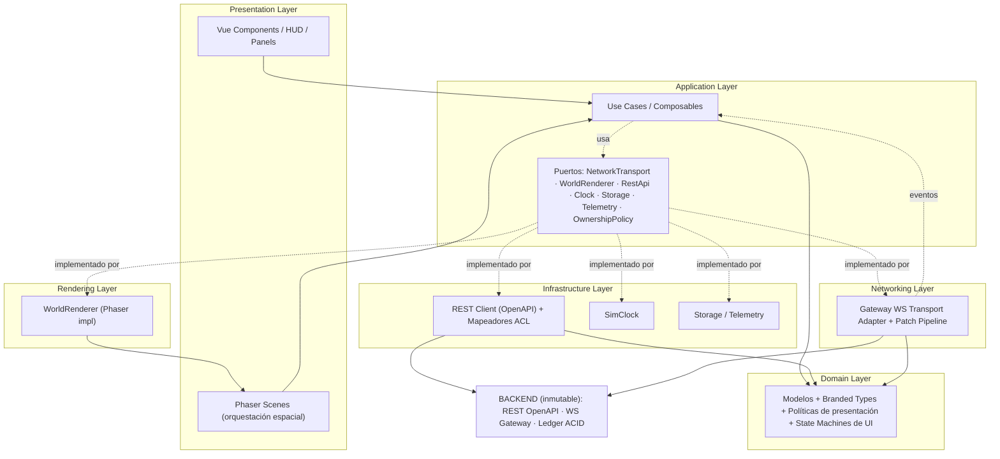

### 8.3 Estado central: Pinia como *hub* transversal

Pinia no es una capa; es el **medio de reconciliación** que atraviesa Application↔Presentation. La regla:

- La **Networking Layer** entrega eventos crudos a la **Application Layer**.
- La Application Layer **aplica** esos eventos a las **stores Pinia** (traducidos a modelos de dominio), de forma **idempotente y ordenada**.
- La **Presentation Layer** (Vue) **lee** stores reactivamente.
- La **Rendering Layer** (Phaser) **se suscribe** a porciones espaciales de las stores (§11.6) y recibe *view-models* derivados.

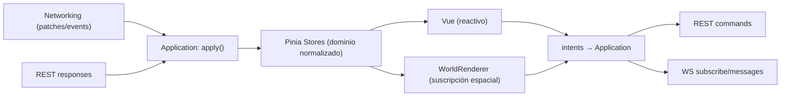

---

## 9. Arquitectura por módulos (bounded contexts + Feature-Sliced Design)

La organización *lógica* (qué conceptos existen y cómo se agrupan) sigue **DDD**: bounded contexts alineados con el lenguaje del GDD. La organización *física* (dónde vive el código) sigue **Feature-Sliced Design** (§10). Aquí se definen los contexts; en §10 se mapean a carpetas.

### 9.1 Mapa de bounded contexts del cliente

Cada context espeja un dominio del backend, pero contiene **solo** la representación, el estado sincronizado y la UX — nunca la lógica autoritativa.

| Context (cliente) | Espeja (backend) | Responsabilidad de cliente | Entidades clave |
|---|---|---|---|
| **Session & Identity** | Auth/Identity | Login, sesión, cuenta/corporación activa, token, presencia | `Account`, `Corporation`, `Session` |
| **World & Map** | World Simulation (espacial) | Render y estado del mapa, regiones, biomas, chunks, cámara, overlays base | `Region`, `Tile`, `Chunk`, `Biome` |
| **Buildings & Industry** | World Simulation (edificios) | Edificios, tipos, niveles, recetas, colas de producción, buffers, estados | `Building`, `BuildingType`, `Recipe`, `ProductionBatch` |
| **Fleet & Vehicles** | World Simulation (tránsito) | Vehículos, interpolación de movimiento, desgaste, combustible, asignación | `Vehicle`, `VehicleType` |
| **Logistics & Routes** | Logistics Service | Grafo de red (nodos/enlaces), rutas, ETAs, congestión, terminales, slots | `Link`, `Node`, `Route`, `Terminal`, `RoutePlan` |
| **Shipments** | World Simulation (cargamentos) | Cargamentos, ubicación física, estado en tránsito, vínculo a contrato | `Shipment` |
| **Market & Contracts** | Contract Service | Tablón (pull), publicaciones, aceptaciones, ventana de sorteo, contratos, fletes, OHLC | `Publication`, `Acceptance`, `Contract`, `FreightContract`, `OhlcCandle` |
| **Cities & Demand** | Economy Balancer (ciudades) | Ciudades, nivel, demanda por producto, radio de influencia, crecimiento | `City`, `CityDemand` |
| **Cadastre & Concessions** | World (concesiones) | Concesiones de suelo, canon, vencimientos, traspasos, estados | `Concession`, `ConcessionTransfer` |
| **Ledger & Finance** | Contract/Ledger | Cuentas del ledger, asientos, saldos, garantías/escrow bloqueados, insolvencia | `LedgerAccount`, `LedgerEntry` |
| **Notifications & Alerts** | Notification Gateway | Alertas configurables, feed de eventos, toasts | `Alert`, `NotificationEvent` |
| **Diagnostics** | (cliente propio) | FPS, latencia, drift sim-time, desync, memoria — no espeja backend | `DiagnosticsSample` |

### 9.2 Módulos compartidos (kernel del cliente)

Transversales a todos los contexts, viven en `shared/` (§10):

- **Time**: `SimClock`, conversores sim↔wall, formateadores de plazo.
- **Money/Quantity**: aritmética de punto fijo, formateo, tipo `Money`/`Quantity`.
- **Ids**: `EntityId<T>` branded (UUIDv7 plano; brand derivado de los schemas nominales del contrato), validación de formato `uuid`.
- **Event Bus**: bus tipado inter-subsistema (§19).
- **Result/Error**: tipo `Result<T,E>` y taxonomía de errores del backend (mapeo de `error.code`).
- **Geometry**: proyección ortogonal top-down (`GridProjection`), coordenadas planas en metros de mundo, culling helpers.
- **UI Kit**: componentes base Sass (botón, modal, tabla, tooltip, panel…).
- **Ports**: definiciones de interfaces (puertos) que las infraestructuras implementan.

### 9.3 Reglas de dependencia entre contexts

1. **Un context no importa el interior de otro.** La comunicación cruzada ocurre por (a) el **Event Bus** tipado, (b) **getters públicos** de stores expuestos como API del context, o (c) **casos de uso** de la Application Layer que orquestan varios contexts.
2. **Sentido de dependencia permitido:** los contexts de *gameplay* (Buildings, Fleet, Shipments, Market…) pueden depender de *World & Map* y del *kernel compartido*; ninguno depende de *Session* salvo por la corporación activa (leída como valor, no como acoplamiento).
3. **Los contexts no conocen la Infraestructura concreta.** Consumen puertos.
4. **Prohibición de ciclos.** Verificada en CI (linter de fronteras, §23.3). Si dos contexts necesitan colaborar bidireccionalmente, se introduce un **caso de uso orquestador** en Application, no un import mutuo.

### 9.4 Ejemplo de colaboración cross-context: "Publicar una oferta de venta"

Ilustra cómo colaboran contexts sin acoplarse (todo el flujo es *presentación + comando*, la validación es del servidor):

```mermaid
sequenceDiagram
    participant UI as Vue: PublishOfferPanel (Market)
    participant UC as App: PublishOfferUseCase
    participant OWN as OwnershipPolicy (Session)
    participant INV as Store: Buildings/Ledger (stock disponible)
    participant REST as Infra: RestApi
    participant BE as Backend (Contract Service)

    UI->>UC: intent PublishOffer(product, qty, price, origin, deadline)
    UC->>OWN: ¿origin es un almacén propio? (UX preventiva)
    OWN-->>UC: sí (o deshabilita en UI si no)
    UC->>INV: ¿hay stock libre suficiente? (solo UX, no autoritativo)
    INV-->>UC: muestra disponible (del último estado conocido)
    UC->>REST: POST /contracts/publications (idempotency-key)
    REST->>BE: crea publicación (garantía bloqueada server-side)
    BE-->>REST: 201 { data: Publication, meta: sim_time }
    REST-->>UC: Publication (mapeada a dominio)
    UC->>UC: aplica a store Market (confirmado); refleja bloqueo en Ledger al llegar su evento
    Note over UC,BE: si el server responde 422 (garantía insuficiente),<br/>la UI muestra el error tipado; nada se dio por válido en cliente
```

### 9.5 Anti-corrupción por context

Cada context define su propio *mapper* DTO↔dominio en su rebanada de infraestructura. Así, un cambio en un DTO del backend (dentro del contrato OpenAPI) se absorbe en **un** mapper, sin propagarse a la UI ni al render. Esta es la aplicación práctica de O5 y P3 a escala de módulo.
---

## 10. Organización del proyecto — estructura de carpetas completa

La estructura combina **Feature-Sliced Design (FSD)** para las features de UI, un **núcleo de dominio/aplicación** independiente del framework, y las **infraestructuras pesadas** (game, network) como subsistemas de primer nivel. El cliente vive en la carpeta raíz `/frontend` del monorepo (raíz fija, ADR-016), como **paquete Node autónomo sin workspaces de ningún tipo** (ADR-021).

### 10.1 Vista de alto nivel del monorepo

```
global-market/                      # monorepo con raíz fija (ADR-016)
├── backend/                        # todo el código de servidor (Go): gateway, engine, bots, SDK, migraciones (no se toca)
├── frontend/                       # ← EL CLIENTE (este documento); paquete Node autónomo (npm, sin workspaces)
├── infra/                          # Dockerfiles, Docker Compose, Caddy, Prometheus, Grafana
├── docs/                           # documentación viva; el contrato OpenAPI vive en docs/api/openapi.yaml
├── scripts/                        # scripts de apoyo invocados desde el Makefile
├── tools/                          # herramientas de desarrollo (lint de contrato, utilidades de generación)
├── Makefile                        # ÚNICO punto de entrada de tareas (make generate, make frontend, …)
└── README.md
```

> **Decisión (ADR-021):** los tipos del contrato REST se **generan localmente** desde `docs/api/openapi.yaml` con `npm run gen:api` (`openapi-typescript`, invocado por `make generate`) y se **versionan dentro de `/frontend`**. El frontend nunca escribe a mano un DTO del backend. La generación corre en CI; si `docs/api/openapi.yaml` cambia y los tipos generados divergen, `make generate` + typecheck fallan ruidosamente hasta reconciliar — frontera dura O5.

### 10.2 Estructura interna de `/frontend`

```
frontend/
├── nuxt.config.ts                  # config Nuxt (runtimeConfig, modules, vite, sass)
├── app.config.ts                   # config de app (tema por defecto, feature flags UI)
├── tsconfig.json                   # strict; paths a src/*
├── package.json
├── vitest.config.ts · playwright.config.ts
│
├── public/                         # estáticos servidos tal cual (favicon, og, robots)
│
├── assets/                         # assets PROCESADOS por el build (no game runtime)
│   ├── styles/                     # SISTEMA SASS (design system) — ver 10.4
│   │   ├── settings/               # tokens: colores, escalas, tipografía, z-index, motion
│   │   ├── tools/                  # mixins y funciones (media, punto-fijo-fmt, focus-ring)
│   │   ├── generic/                # reset, box-sizing, normalizaciones
│   │   ├── elements/               # estilos base de elementos HTML
│   │   ├── objects/                # layout primitives (grid, stack, cluster, panel)
│   │   ├── themes/                 # light / dark / high-contrast (mapas de tokens)
│   │   └── index.scss              # @use/@forward: punto de entrada global
│   ├── fonts/                      # fuentes propias (woff2) — ver 14.7
│   └── icons/                      # sprite SVG de UI (no confundir con game assets)
│
├── src/
│   ├── app/                        # CAPA "app" de FSD: composición raíz, providers
│   │   ├── providers/              # inyección de puertos (network, renderer, clock…)
│   │   ├── router-guards/          # auth guard, maintenance guard
│   │   └── bootstrap/              # orquestación de arranque (ver 11.2 / diagrama init)
│   │
│   ├── pages/                      # rutas Nuxt (file-based routing)
│   │   ├── index.vue               # portal / landing (SSG)
│   │   ├── login.vue               # auth (SSR)
│   │   ├── lobby.vue               # selección de corporación / estado del mundo
│   │   ├── play.vue                # ← EL JUEGO (client-only, monta Phaser + socket)
│   │   └── settings.vue
│   │
│   ├── layouts/                    # layouts Nuxt
│   │   ├── default.vue             # portal
│   │   ├── auth.vue
│   │   └── game.vue                # layout del juego: canvas + HUD overlay (ver 15.3)
│   │
│   ├── modules/                    # ← FEATURES (FSD "features/entities" por bounded context)
│   │   ├── session/
│   │   ├── world-map/
│   │   ├── buildings/
│   │   ├── fleet/
│   │   ├── logistics/
│   │   ├── shipments/
│   │   ├── market/                 # tablón, publicaciones, sorteo, OHLC
│   │   ├── cities/
│   │   ├── cadastre/               # concesiones
│   │   ├── finance/                # ledger, saldos, garantías
│   │   ├── notifications/
│   │   └── diagnostics/
│   │
│   ├── components/                 # UI KIT compartido (widgets/ de FSD) — sin dominio
│   │   ├── base/                   # Button, Modal, Tooltip, Panel, Tabs, DataTable…
│   │   ├── charts/                 # OHLC/candlestick, sparkline, gauge (Canvas/SVG propio)
│   │   ├── forms/                  # inputs tipados (MoneyInput, QuantityInput, SimTimeInput)
│   │   └── feedback/               # Toast, Banner, Skeleton, EmptyState
│   │
│   ├── game/                       # ← RENDERING LAYER (Phaser). No importa Vue/components.
│   │   ├── boot/                   # arranque de Phaser, config WebGL, escena Boot
│   │   ├── scenes/                 # BootScene, PreloadScene, WorldScene, OverlayScene…
│   │   ├── renderer/               # WorldRenderer (impl del puerto)
│   │   ├── map/                    # tilemap por chunks, culling, LOD, streaming
│   │   ├── entities/               # sprites: BuildingSprite, VehicleSprite, CitySprite…
│   │   ├── pools/                  # object pooling (sprites, labels, partículas)
│   │   ├── camera/                 # controlador de cámara (zoom/pan/follow/bounds)
│   │   ├── input/                  # picking, drag, selección, context menu espacial
│   │   ├── overlays/               # capas: congestión, propiedad, demanda, cobertura
│   │   ├── view-models/            # tipos de proyección estado→render + selectores
│   │   └── bridge/                 # puente Pinia↔Phaser (suscripción espacial) — ver 11.6
│   │
│   ├── network/                    # ← NETWORKING LAYER
│   │   ├── transport/              # puerto NetworkTransport + adapters
│   │   │   ├── gateway.adapter.ts  # ACL del Notification/Event Gateway (por defecto)
│   │   │   └── mock.adapter.ts     # transporte mock guionizado (dev/test, ver 4.4)
│   │   ├── rest/                   # cliente REST (OpenAPI), interceptores, idempotencia
│   │   ├── pipeline/               # ordenación/dedup/idempotencia de patches, resync
│   │   ├── reconnect/              # backoff, heartbeat, estado de conexión, recovery
│   │   └── mappers/               # DTO↔dominio (ACL por context, ver 9.5)
│   │
│   ├── stores/                     # ← PINIA (una store por bounded context)
│   │   ├── session.store.ts
│   │   ├── world.store.ts
│   │   ├── buildings.store.ts
│   │   ├── fleet.store.ts
│   │   ├── logistics.store.ts
│   │   ├── shipments.store.ts
│   │   ├── market.store.ts
│   │   ├── cities.store.ts
│   │   ├── cadastre.store.ts
│   │   ├── finance.store.ts
│   │   ├── notifications.store.ts
│   │   └── diagnostics.store.ts
│   │
│   ├── application/                # ← APPLICATION LAYER (casos de uso + puertos)
│   │   ├── ports/                  # NetworkTransport, WorldRenderer, Clock, RestApi…
│   │   ├── use-cases/              # PublishOffer, AcceptPublication, AssignRoute, Build…
│   │   └── policies/               # OwnershipPolicy, PredictionPolicy
│   │
│   ├── domain/                     # ← DOMAIN LAYER (modelos + tipos + state machines)
│   │   ├── model/                  # Building, Vehicle, Contract, City, Concession…
│   │   ├── value-objects/          # branded types de dominio (estados, enums del GDD)
│   │   └── state-machines/         # ciclos de vida de contrato/edificio/vehículo (UI)
│   │
│   ├── composables/                # ← puente Application↔Vue (Composition API)
│   │   ├── useMarketBoard.ts · useFleet.ts · useConstruction.ts · useSimClock.ts …
│   │
│   ├── shared/                     # ← KERNEL (framework-agnostic, ver 9.2)
│   │   ├── time/ · money/ · ids/ · geometry/ · result/ · event-bus/ · logger/
│   │
│   ├── plugins/                    # plugins Nuxt (orden de arranque)
│   │   ├── 01.pinia.ts
│   │   ├── 02.network.client.ts    # crea el transporte y lo provee (client-only)
│   │   ├── 03.sim-clock.client.ts
│   │   ├── 04.telemetry.client.ts
│   │   └── 05.error-handler.ts
│   │
│   └── config/                     # runtime config tipada, feature flags, endpoints
│
├── tests/
│   ├── unit/ · integration/ · e2e/ · contract/ · perf/ · chaos/
│   └── fixtures/                   # snapshots/patches de ejemplo, DTOs de contrato
│
└── env/                            # .env.example, esquema zod de variables de entorno
```

### 10.3 Justificación de la organización

- **`modules/` (features por context) vs `game/`, `network/`, `stores/`, `application/`, `domain/`.** Las *features de UI* se agrupan por bounded context (FSD): cada `modules/<context>/` contiene sus componentes Vue, sus composables y sus vistas. El **estado** (`stores/`), la **lógica de aplicación** (`application/`) y el **dominio** (`domain/`) se extraen a raíces propias porque son *transversales* y deben permanecer **framework-agnostic** y testeables sin montar Vue. Esto materializa la regla de dependencias del §8: `modules/` (presentation) → `composables/`/`application/` → `domain/`; `game/` y `network/` implementan puertos de `application/`.

- **`game/` totalmente separado de `components/`.** Regla física que hace cumplir O2: el linter prohíbe que `game/**` importe de `components/**` o `modules/**`, y viceversa que `components/**`/`modules/**` importen de `game/scenes/**` o `game/renderer/**`. El único puente permitido es `game/bridge/` (suscripción a stores) y el `WorldRenderer` (puerto).

- **`shared/` como kernel puro.** Nada de Vue, Phaser ni red. Solo tipos y utilidades de dominio universal (tiempo, dinero, ids, geometría, bus). Es el antiguo `packages/domain-kernel`, internalizado aquí por ADR-021 (§10.7).

### 10.4 Arquitectura de estilos (Sass 7-1 / ITCSS adaptado)

`assets/styles/` sigue una variante de **ITCSS** (capas de especificidad creciente) con `@use`/`@forward` (nunca `@import`, deprecado):

```
settings/  → tokens puros (sin salida CSS): $color-*, $space-*, $font-*, $z-*, $motion-*
tools/     → mixins/funciones (sin salida CSS): @mixin media(), @function fixed-fmt()
generic/   → reset, box-sizing (primera salida CSS)
elements/  → html, body, headings, a, form base
objects/   → layout sin cosmética: .o-stack, .o-cluster, .o-grid, .o-panel
themes/    → mapas de tokens por tema (light/dark/high-contrast) vía custom properties
```

Los **componentes** no usan estas capas globales para su cosmética propia: usan **CSS Modules** (`Component.module.scss`) que *consumen* `settings`/`tools` vía `@use`. Así, lo global es solo *tokens + layout*, y lo local (cosmética de cada componente) queda **encapsulado**. Ver §15.2.

### 10.5 Convenciones de nombres y archivos

| Elemento | Convención | Ejemplo |
|---|---|---|
| Componentes Vue | PascalCase `.vue` | `PublishOfferPanel.vue` |
| Composables | camelCase `use*` | `useMarketBoard.ts` |
| Stores Pinia | `<context>.store.ts`, `useXStore` | `market.store.ts` → `useMarketStore` |
| Casos de uso | PascalCase `*UseCase` | `AcceptPublicationUseCase.ts` |
| Modelos de dominio | PascalCase | `Contract.ts` |
| Puertos | PascalCase interface | `NetworkTransport.ts` |
| Adaptadores | `*.adapter.ts` | `gateway.adapter.ts` |
| Mappers | `*.mapper.ts` | `contract.mapper.ts` |
| Sprites Phaser | `*Sprite.ts` | `VehicleSprite.ts` |
| Escenas Phaser | `*Scene.ts` | `WorldScene.ts` |
| CSS Modules | `*.module.scss` | `Panel.module.scss` |
| Tests | `*.spec.ts` / `*.e2e.ts` | `AcceptPublication.spec.ts` |

### 10.6 Nuxt: qué se renderiza dónde

| Ruta | Modo | Razón |
|---|---|---|
| `/` (portal) | **SSG** | Estático, SEO, TTFB mínimo |
| `/login` | **SSR** | Formulario, sin estado de juego |
| `/lobby` | **SSR + client fetch** | Estado del mundo (mantenimiento, corporación) por REST |
| `/play` | **client-only (`ssr: false` en la ruta)** | Monta Phaser + socket; nada de esto es hidratable desde SSR |
| `/settings` | **SSR** | Preferencias |

Regla dura (repite §6.2): **el estado de dominio en vivo nunca se hidrata desde SSR**. `/play` es una isla cliente; Nuxt entrega el shell y el arranque (§11.2) monta el mundo contra el socket.

### 10.7 Nota histórica: los antiguos `packages/` compartidos (derogados por ADR-021)

La v1.0 de este documento planteaba un workspace pnpm con `packages/api-types` y `packages/domain-kernel` compartibles con el gateway TypeScript. Con **ADR-017** (backend 100% Go) desapareció el único consumidor TS fuera del cliente, y **ADR-021** disolvió los workspaces: `domain-kernel` se internalizó en `src/shared/` (kernel puro, sin dependencias de framework) y `api-types` pasó a **generación local** (`npm run gen:api` desde `docs/api/openapi.yaml`, tipos versionados dentro de `/frontend`). La coherencia de tipos entre cliente y servidor la garantiza el **contrato**, no un paquete común. Ver ADR-021 para el detalle y las consecuencias.
---

## 11. Integración de Phaser en Nuxt/Vue

Esta sección responde, punto por punto, a cómo Phaser se integra en Nuxt, convive con Vue, se comunica con Pinia, comparte estado y se desacopla de la UI; y cómo administra escenas, assets, cámaras, mapas, sprites, vehículos, edificios, ciudades, overlays, zoom, selección y animaciones.

### 11.1 Principio rector de la integración

**Phaser es un ciudadano de la Rendering Layer, encapsulado tras el puerto `WorldRenderer`, que corre en un `<canvas>` montado por un único componente Vue "host" y que nunca conoce Vue ni el DOM de la UI.** Toda comunicación con el resto de la app ocurre por dos canales explícitos y tipados:

1. **Entrada de estado** (mundo → Phaser): *suscripción espacial* a stores Pinia, entregada como **view-models de render** (§11.6).
2. **Salida de intents** (Phaser → app): eventos espaciales (clic en tile, selección, drag-drop de un edificio) emitidos al **Event Bus** tipado (§19), consumidos por casos de uso.

No hay un tercer canal. Phaser no llama a `fetch`, no toca el socket, no importa componentes Vue, no lee el router. Esta disciplina es lo que hace a Phaser reemplazable y testeable en aislamiento (headless).

### 11.2 Montaje: el componente host y el arranque en Nuxt

El juego vive en la ruta **client-only** `/play` (§10.6). Un único componente `GameCanvasHost.vue` es responsable del ciclo de vida de la instancia Phaser:

- **`onMounted`**: crea la instancia `Phaser.Game` apuntando a un `<canvas>` propio, con la config WebGL (§11.3), e inyecta el `WorldRenderer` en los providers de la app (para que la Application Layer pueda ordenarle cosas por el puerto).
- **`onBeforeUnmount`**: `game.destroy(true)` — libera GL context, texturas, listeners, RAF. Crítico para evitar fugas de memoria WebGL al salir de `/play`.
- **`keepalive`**: `/play` **no** se mantiene vivo en background; salir destruye el mundo (el estado sobrevive en stores/servidor, se re-renderiza al volver).

El arranque de Phaser es **perezoso**: `import('phaser')` y el bundle de `game/` se cargan dinámicamente (`defineAsyncComponent` + dynamic import) **solo** al entrar en `/play`, manteniendo el portal/login ligeros (O7, §21.8).

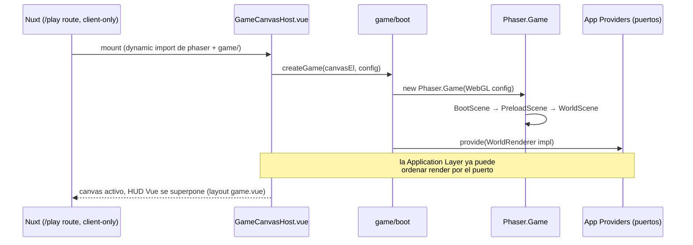

### 11.3 Configuración WebGL y del game-loop

- **Renderer**: `Phaser.WEBGL` (WebGL2 objetivo), con `Phaser.CANVAS` como *fallback* automático (`type: AUTO`) para navegadores sin WebGL2.
- **`fps`**: target 60; `forceSetTimeOut: false` (usa RAF). El game-loop de Phaser es **independiente** del ciclo de reactividad de Vue: Vue reacciona a stores en su microtask; Phaser interpola en su RAF. No se bloquean entre sí (§11.7).
- **`roundPixels: true`**, `antialias` según perfil de calidad (§21.6), `powerPreference: 'high-performance'`.
- **`scale`**: `Phaser.Scale.RESIZE` para ajustar el canvas al contenedor del layout `game.vue`; el HUD Vue se superpone por CSS (§15.3).
- **Un solo contexto WebGL** para todo el juego. El HUD no usa WebGL (es DOM/Sass); los charts de UI usan Canvas 2D/SVG propios, sin competir por el contexto GL.

### 11.4 Convivencia Phaser ↔ Vue (quién dibuja qué)

Regla de reparto **inequívoca**:

| Elemento visual | Lo dibuja | Motivo |
|---|---|---|
| Terreno, tiles, biomas, ríos | **Phaser** | Espacial, masivo, WebGL |
| Edificios, ciudades, vehículos, cargamentos | **Phaser** | Espacial, pooled |
| Rutas, enlaces, congestión, overlays de mapa | **Phaser** | Espacial, sobre el mundo |
| Etiquetas *ancladas al mundo* (nombre de ciudad, tooltip de sprite) | **Phaser** (BitmapText) o *DOM anclado* (§15.7) | Según densidad/legibilidad |
| HUD, barras, sidebar, minimapa (marco), inspector | **Vue/DOM/Sass** | UI de gestión, accesible, temable |
| Tablón, paneles, diálogos, formularios, tablas | **Vue/DOM/Sass** | Datos densos, teclado, i18n |
| Menú contextual | **Vue/DOM** (posicionado por coords de Phaser) | Accesible, estilable |
| Minimapa (contenido) | **Phaser** (render a textura) embebido en marco Vue | Vista del mundo a escala |

**El minimapa** es el caso interesante de convivencia: su *marco* y controles son Vue; su *contenido* es una segunda cámara/escena de Phaser que renderiza el mundo a baja resolución sobre una `RenderTexture`, mostrada dentro del componente Vue (§15.11, §16.9).

### 11.5 Gestión de escenas (Scenes)

Las escenas de Phaser mapean a **estados macro del render**, no a rutas ni a features de UI. Escenas previstas:

| Escena | Rol | Paralela a |
|---|---|---|
| **BootScene** | Configura GL, escala, plugins, carga mínima (loading UI). | — |
| **PreloadScene** | Carga assets del mundo (atlases, tilemaps, audio) con barra de progreso; ver §14. | — |
| **WorldScene** | Escena principal: tilemap por chunks, entidades, cámara principal, input espacial. | OverlayScene, MinimapScene |
| **OverlayScene** | Escena **paralela** (transparente) sobre WorldScene para overlays analíticos y selección/highlight, para no repintar el mundo al alternar overlays. | WorldScene |
| **MinimapScene** | Segunda cámara/escena que renderiza a `RenderTexture` para el minimapa. | WorldScene |
| **EffectsScene** | Partículas/animaciones puntuales (construcción, avería, entrega) por encima. | WorldScene |

**Escenas paralelas** (Phaser soporta múltiples escenas activas simultáneamente) permiten separar preocupaciones: la selección y los overlays viven en OverlayScene y se activan/desactivan sin tocar el pipeline del mundo. Las transiciones (Boot→Preload→World) usan `scene.start`/`scene.launch`; los cambios de estado dentro del mundo (activar overlay de congestión) son toggles de visibilidad de capas, no cambios de escena (§16.7).

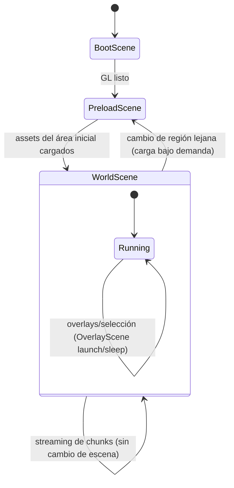

### 11.6 Comunicación con Pinia: el *bridge* y la suscripción espacial

Este es el corazón de "cómo Phaser se comunica con Pinia y comparte estado". La regla: **Phaser no lee stores arbitrariamente; se suscribe a proyecciones espaciales acotadas a lo visible.**

`game/bridge/` implementa un **WorldStateBridge** que:

1. **Observa** las stores de gameplay (buildings, fleet, shipments, logistics, cities) mediante `store.$subscribe` / `watch` sobre *getters espaciales* parametrizados por el **viewport actual** (la cámara define qué chunks son visibles).
2. **Deriva view-models de render**: estructuras planas y baratas (`BuildingVM`, `VehicleVM`, `CityVM`) que contienen solo lo que el sprite necesita (posición de mundo (celda), tipo, nivel, estado visual, flags de selección/propiedad), no la entidad de dominio completa.
3. **Difunde diffs, no snapshots**: entrega al `WorldRenderer` altas/bajas/updates de VMs (`upsert`, `remove`), para que el renderer haga *reconciliación de sprites* mínima (crear del pool, actualizar, devolver al pool) — coherente con P8.

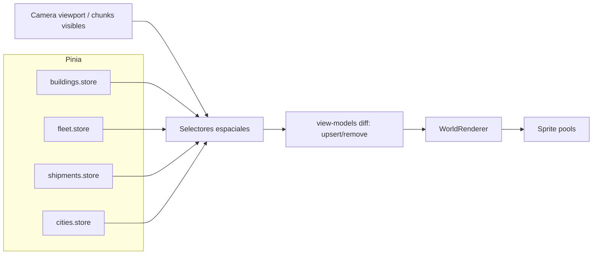

**Por qué view-models y no las entidades directas:** (a) desacopla el modelo de dominio del formato que Phaser consume (P4); (b) permite que el bridge aplique *culling* y *LOD* antes de tocar el renderer (P8); (c) hace el renderer testeable con VMs sintéticos sin stores reales.

**Frecuencia:** el bridge no corre en cada frame de Phaser ni en cada patch. Corre en dos disparadores: (i) cambios de store (nuevo estado del servidor) y (ii) cambios de viewport (pan/zoom que cambian los chunks visibles), con *coalescing* por RAF para no exceder ~1 recomputación de VMs por frame (§21.7).

### 11.7 Interpolación de movimiento (posición analítica del servidor)

Los vehículos llegan del servidor con **posición analítica** (`tramo + t_entrada + función de avance`, GDD §1.1/7.3) y **eventos de hito** (salida, llegada a nodo, avería, cambio de velocidad). El cliente **no** recibe posición por frame; la **deriva**:

- El store `fleet` guarda, por vehículo, el último *estado cinemático confirmado*: `{ linkId, tEnter (SimTime), speedProfile, fromNode, toNode }`.
- El **VehicleSprite** interpola su posición cada frame de Phaser evaluando la función de avance en `SimClock.now()` (P5): `progress = advance(simNow - tEnter, speedProfile)`.
- Al llegar un **evento de hito**, el store actualiza el estado cinemático; el sprite **reconcilia suavemente** (si hay salto por latencia, hace *snap* o *ease* corto, nunca teletransporte brusco — netcode básico, GDD §14.1).
- Si un vehículo *sale del viewport*, su sprite vuelve al pool; al reentrar, se recrea con la posición interpolada correcta (la verdad vive en el store, no en el sprite).

Esto implementa "coste ∝ eventos" también en el cliente: entre hitos, no hay tráfico de red por vehículo; solo interpolación local barata.

### 11.8 Representación de entidades

#### 11.8.1 Vehículos
- `VehicleSprite` desde atlas por tipo (camión/tren/barco) con orientación derivada del vector del tramo.
- Estados visuales: en ruta, detenido en terminal (cola), **averiado** (icono + tinte + partícula), cargando/descargando.
- Etiqueta opcional de carga/contrato al hover o selección.
- **Pooling** obligatorio: puede haber miles; nunca se crean/destruyen por frame (§21.4).

#### 11.8.2 Edificios
- `BuildingSprite` desde atlas por `BuildingType` y **nivel** (1–4, footprint y arte cambian con el nivel, GDD §6.3).
- **Footprint** ortogonal correcto (ocupa varias celdas); anclaje a la rejilla ortogonal del tilemap.
- Estados: operativa, en construcción (progreso visual), dañada, en mantenimiento, abandonada, **en embargo** (tinte/overlay del sistema, GDD §11.2).
- Indicadores flotantes: cola de producción activa, falta de combustible (icono de "apagón", GDD §5.8), sin trabajadores.

#### 11.8.3 Ciudades
- `CitySprite`/composición de sprites por **nivel** (huella crece con el nivel, GDD §5.6): distritos, población.
- **Radio de influencia** logística como overlay circular/hex al seleccionar.
- Indicador de **estado de demanda** (saturada/hambrienta) derivado de `cities.store` (color de aura).
- Etiqueta con nombre y nivel (BitmapText anclado o DOM anclado según zoom, §15.7).

#### 11.8.4 Cargamentos (shipments)
- Normalmente **no** tienen sprite propio: viajan *dentro* de un vehículo (se ven al inspeccionar el vehículo).
- Cuando están "en terminal" o "liberados in situ" (contrato fallido, GDD §5.3), se representan como *marcador de stock* en el nodo correspondiente.

### 11.9 Overlays

Overlays viven en **OverlayScene** (paralela) para alternarse sin repintar el mundo:

| Overlay | Fuente de datos | Representación |
|---|---|---|
| **Congestión** | `logistics.store` (EMA por enlace) | Enlaces coloreados por saturación (gradiente) |
| **Propiedad** | ownership por entidad | Tinte por corporación / propio vs ajeno |
| **Demanda urbana** | `cities.store` | Heatmap alrededor de ciudades |
| **Cobertura logística** | radios de influencia + nodos | Áreas alcanzables/no alcanzables |
| **Fiscalidad regional** | `world.store` (parámetros de región) | Coropleta por región |
| **Recursos** | `world.store` (yacimientos) | Iconos + agotamiento (GDD §10) |

Solo **un overlay analítico primario** activo a la vez (más selección/hover que son permanentes). Los overlays se dibujan con geometría vectorial de Phaser (`Graphics`) o tiles teñidos, con su propio presupuesto de draw calls (§21.3).

### 11.10 Selección, hover y menú contextual
- **Hover**: picking por frame limitado (throttle) que resalta el sprite bajo el puntero y muestra tooltip (DOM anclado, §15.7).
- **Selección**: single (clic) y **múltiple** (rubber-band / shift-clic) para operaciones de flota masiva (GDD §8). La selección vive en un `selection.store` (o slice de UI), leída por OverlayScene para dibujar el highlight y por la UI para poblar el inspector.
- **Menú contextual**: clic derecho sobre entidad → el input de Phaser emite un intent `ContextMenuRequested(entityId, screenPos)`; un componente Vue lo renderiza (DOM), filtrando acciones por `OwnershipPolicy` (comandable vs observable, §5.3).

### 11.11 Zoom, pan y cámara (resumen; detalle en §17)
- Rueda del ratón / pinch = zoom hacia el cursor; arrastre medio/espacio = pan; bordes/teclas = pan; doble clic en minimapa = jump.
- El **nivel de zoom** determina el **LOD** (§16.6): a lejano, sprites simplificados y etiquetas agrupadas; a cercano, detalle completo.
- La cámara define el **viewport** que alimenta el bridge (§11.6) y el culling (§16.5).

### 11.12 Animaciones
- **Tween-based** (Phaser Tweens) para transiciones discretas: aparición de edificio, pop de entrega, sacudida de avería, pulso de selección.
- **Spritesheet animations** para estados continuos ligeros (humo de fábrica activa, agua de ríos) — con **presupuesto**: se pausan fuera del viewport y bajan de framerate a lejano LOD (§21.6).
- **Interpolación de movimiento** (§11.7) no es un tween: es evaluación analítica por frame.
- Regla: **ninguna animación es autoritativa**. Si el servidor dice que un lote terminó, la animación de "producción" se detiene aunque estuviera a mitad; la animación *sigue* al estado, no lo lidera (P4).

### 11.13 Ciclo de vida y limpieza (anti-fugas WebGL)
- Toda textura/atlas cargada se registra para *unload* al cambiar de región lejana (§14.6).
- Los pools se vacían y las escenas se `shutdown` limpiamente al destruir el juego.
- Listeners del Event Bus se dan de baja en `shutdown` de cada escena.
- Test de humo: montar/desmontar `/play` N veces no debe crecer la memoria GL de forma monótona (§22.5).
---

## 12. Sistema de networking — WebSocket y el contrato real del backend

Esta capa implementa el puerto `NetworkTransport` (§4.4) y el cliente REST. Cubre conexión, reconexión, rooms, sincronización, snapshots, eventos, comandos, predicción, latencia, compensación, heartbeats, reintentos, desconexión y recuperación.

### 12.1 Las dos superficies del backend (recordatorio operativo)

| Superficie | Transporte | Naturaleza | Uso |
|---|---|---|---|
| **REST** (`openapi.yaml`) | HTTPS (Caddy) | request/response, `{data,meta}`/`{error}` | Comandos no urgentes, consultas pull (tablón, OHLC, detalles), bootstrap |
| **Notification/Event Gateway** | WebSocket (WSS) | push de eventos del *área de interés* | Movimiento/hitos de vehículos, alertas, cambios de estado, resultado de sorteo |

El puerto `NetworkTransport` abstrae **la superficie WebSocket** bajo el modelo de sincronización canónico (room/snapshot/patch/message). El **REST** vive tras un puerto hermano `RestApi`. La Application Layer usa ambos según la operación (§13).

### 12.2 El puerto `NetworkTransport` (contrato)

Contrato conceptual (pseudo-firma, no implementación):

```
interface NetworkTransport {
  connectionState$: Observable<ConnectionState>   // connecting|open|reconnecting|closed|frozen
  join(room: RoomSpec): Promise<RoomHandle>        // suscribe a un área de interés / tema
  leave(room: RoomHandle): void
  send(cmd: RealtimeCommand): void                 // mensajes puntuales por WS (raros; la mayoría van por REST)
  onSnapshot(room, handler): Unsub                 // estado autoritativo completo de la room
  onPatch(room, handler): Unsub                    // deltas ordenados (sim_time, sequence)
  onMessage(room, handler): Unsub                  // eventos puntuales (alertas, sorteo, notificaciones)
}
```

- `RoomSpec` describe **qué** se quiere observar: `world:region:<regionId>`, `fleet:corp:<corpId>`, `alerts:corp:<corpId>`, `viewport:<bbox>`. Es la expresión cliente del **interest management** del Gateway.
- `RoomHandle` es opaco; el adaptador lo mapea al mecanismo real del Gateway (una suscripción con filtros, no necesariamente una "sala" física).

**El adaptador real** (`GatewayTransportAdapter`) y el adaptador mock de pruebas implementan esto (§4.4). El resto de esta sección describe el *comportamiento* que el transporte debe garantizar; el `GatewayTransportAdapter` lo consigue como ACL sobre el WS real del backend.

### 12.3 Rooms = áreas de interés

El GDD (§14.2, §19) define **interest management**: el cliente solo recibe eventos de su *área de interés* (su base, sus rutas, su región de mercado). Se modelan como rooms lógicas:

| Room lógica | Contenido | Ciclo de vida |
|---|---|---|
| `viewport:<bbox>` | Entidades espaciales visibles (edificios/vehículos/ciudades ajenos y propios) dentro del rectángulo de cámara | Se re-negocia al hacer pan/zoom (debounced) |
| `corp:<corpId>` | Todo lo *propio* (edificios, flota, contratos, finanzas) allá donde esté | Toda la sesión |
| `alerts:<corpId>` | Alertas explícitas configuradas por el jugador (GDD §14.2) | Toda la sesión |
| `market:watch:<filter>` | *Opcional*: notificación de aparición de ofertas que casan un filtro guardado (push de alerta, no del tablón entero — C10) | Mientras el filtro esté activo |

**Regla dura (C10):** no existe una room "tablón global". El tablón se consulta por REST (`GET /contracts/board`). Solo se suscriben *alertas* de mercado, nunca el stream completo.

El **viewport room** es la pieza que conecta cámara ↔ red: al mover la cámara, el cliente actualiza su bbox de interés (con *hysteresis* y *debounce* para no renegociar en cada píxel, §12.11), y el Gateway ajusta qué eventos espaciales empuja.

### 12.4 Conexión y handshake

Secuencia de arranque de la sesión de tiempo real (tras login REST):

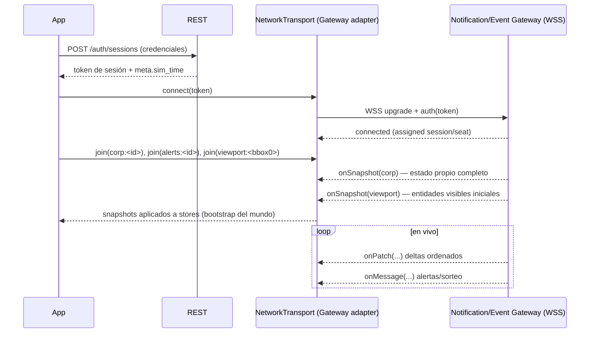

- El **token** proviene del login REST (`/auth/sessions`) y se pasa en el upgrade del WS.
- Tras conectar, el cliente hace `join` de sus rooms base y recibe **snapshots** iniciales (§12.6) que *bootstrappean* las stores antes de aplicar patches.
- El primer `meta.sim_time` (de la respuesta REST o del snapshot) **inicializa el `SimClock`**.

### 12.5 Sincronización: snapshots + patches

El modelo de sincronización es **snapshot inicial + patches incrementales ordenados**, idempotente y recuperable:

- **Snapshot**: estado completo y autoritativo de una room en un `sim_time` dado. Reemplaza (no fusiona parcialmente) el subárbol correspondiente en las stores. Se recibe al `join`, y de nuevo tras un *resync* (§12.13).
- **Patch**: delta con `{ sim_time, sequence, ops[] }`. Las `ops` son `upsert`/`remove`/`update-field` sobre entidades identificadas por UUID. Se aplican **en orden** `(sim_time, sequence)` (espejando el desempate del backend, GDD §1.1).
- **Message**: evento puntual sin estado persistente (resultado de sorteo, alerta, aviso de mantenimiento). No entra en el pipeline de patches; se enruta a los casos de uso correspondientes.

**Pipeline de aplicación de patches** (`network/pipeline/`):

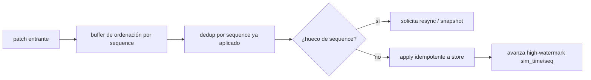

- **Ordenación**: un buffer reordena patches que llegan fuera de orden dentro de una ventana; pasado un umbral, se fuerza *resync*.
- **Dedup + idempotencia** (P6): reaplicar un patch ya visto es un no-op. Esto es lo que hace segura la reconexión.
- **Detección de huecos**: si falta un `sequence`, no se "adivina": se pide snapshot de esa room (barato y correcto, coherente con el backend que ya trabaja por snapshots + reconciliación).

### 12.6 Snapshots y bootstrap del estado

- Al entrar a `/play`, el cliente **no** consulta REST entidad por entidad para poblar el mundo: hace `join` de sus rooms y consume los **snapshots** del Gateway (una foto consistente por room).
- Datos **estáticos del mundo** (tipos de edificio, recetas, tipos de vehículo, definición de productos, geometría de regiones) se traen por **REST** una vez y se cachean versionados (§14.6, endpoints `/world/building-types`, `/world/recipes`, `/world/products`, `/world/regions`): no cambian en vivo, no necesitan socket.
- Datos **pull** (tablón, OHLC, detalle de un contrato ajeno) se consultan por REST bajo demanda.

Reparto de responsabilidad de bootstrap:

| Dato | Fuente inicial | Actualización en vivo |
|---|---|---|
| Catálogos estáticos (tipos, recetas, productos, geometría de regiones) | REST (cacheado, versionado) | Solo tras despliegue (ventana mantenimiento) |
| Estado propio (edificios, flota, finanzas) | Snapshot `corp:` | Patches |
| Entidades visibles ajenas | Snapshot `viewport:` | Patches (al mover cámara, nuevos snapshots parciales) |
| Tablón / OHLC | REST pull | Re-consulta / alertas |

### 12.7 Sim-time, latencia y compensación

El cliente **no** hace *lag compensation* al estilo FPS (rewind de hitboxes): no hay combate ni acciones sub-segundo con ventaja por latencia — el diseño lo elimina deliberadamente (ventana de sorteo, GDD §5.3.1/ADR-011). Lo que sí hace:

- **Estimación de RTT y offset de sim-time**: el `SimClock` estima el *offset* entre el sim-time del servidor y el reloj local a partir de los `meta.sim_time`/timestamps de snapshots y de heartbeats, y aplica una **deriva monotónica** local entre actualizaciones (nunca retrocede el reloj visible; corrige suavemente). Ratio 24× aplicado.
- **Interpolación (no extrapolación agresiva)** de vehículos: como la posición es analítica y el servidor manda hitos, el cliente **interpola dentro del tramo conocido**; solo extrapola brevemente si un hito llega tarde, con corrección suave al confirmarse (§11.7).
- **Compensación de la ventana de sorteo**: el countdown de 30–60 s (GDD §5.3.1) se muestra en **wall-clock** derivado del sim-time del servidor; el cliente **no** decide el cierre — muestra el tiempo y **recibe** el resultado por `onMessage`. Si el reloj local difiere, el countdown se re-sincroniza con cada heartbeat para no mentir al jugador en una mecánica sensible al tiempo real.
- **Presupuesto de latencia percibida**: comandos por REST se acompañan de **predicción optimista marcada** (§13.6) para respuesta inmediata en UI; el estado real llega por patch. La latencia de red nunca da ventaja de juego (el backend lo garantiza), solo afecta el *feedback* visual, que se cubre con predicción.

### 12.8 Comandos: REST primero, WS excepcional

**La mayoría de comandos van por REST** (coherente con `openapi.yaml`: construir, publicar, aceptar, asignar ruta, comprar slot, renovar concesión…). El WS se reserva para *mensajes* de tiempo real que el Gateway acepte (si los hay); por defecto, el cliente **no** asume comandos por WS.

Cada comando REST:
- Lleva una **`Idempotency-Key`** (UUIDv7 de cliente) para tolerar reintentos sin doble ejecución (P6) — el backend, siendo autoritativo y transaccional, es el árbitro; la clave evita duplicar una publicación por un reintento de red.
- Es **idempotente en efecto** desde la perspectiva del cliente: si la respuesta se pierde pero el comando se aplicó, el reintento con la misma clave no crea un segundo efecto.
- Devuelve `{data, meta}` en éxito o `{error:{code,message,details}}` tipado; el cliente **mapea `error.code`** a UX (§13.7). Nunca inventa el resultado.

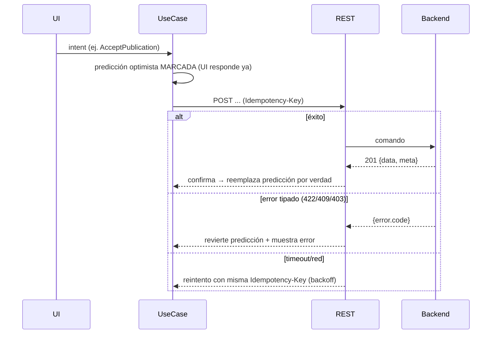

### 12.9 Ventana de mantenimiento diaria (estado `frozen`)

C9/GDD §1.1: el mundo pausa 10–30 min con sim-time congelado; REST responde `503 Retry-After`.

- El `SimClock` entra en estado **`frozen`**: deja de avanzar el sim-time visible; toda animación dependiente de sim-time (vehículos) **se detiene** coherentemente (nada llega tarde, GDD garantiza transparencia económica).
- La UI muestra un **overlay de mantenimiento** de primera clase (no un error) con countdown basado en el horario UTC anunciado y en `Retry-After`.
- Comandos se **deshabilitan** (no se encolan silenciosamente para disparar al reabrir salvo que el jugador lo confirme). Las consultas pull muestran el último dato con marca de *stale*.
- Al reabrir: el cliente **resync** por snapshot (§12.13) y reanuda el reloj y el streaming.

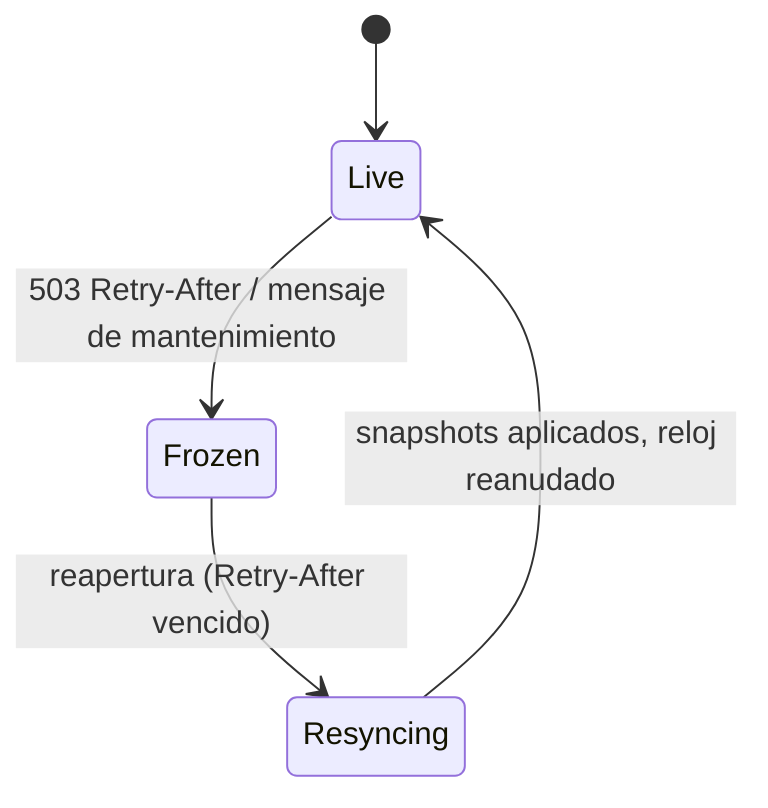

### 12.10 Backpressure y coalescing de comandos (C17)

El backend tiene un techo de capacidad consciente. El cliente coopera:

- **Coalescing**: intents repetidos/redundantes del mismo tipo (p. ej. arrastrar un slider de cantidad) se *debouncean* antes de convertirse en comando.
- **Cola con límite**: los comandos en vuelo tienen un límite; si se excede (red lenta), la UI muestra "procesando" en vez de disparar N peticiones.
- **Rate-limit awareness**: ante `429` (rate limit, idéntico para humanos y bots, GDD §9), el cliente respeta el backoff que indique el servidor y comunica al jugador que vaya más despacio, sin reintentar en tromba.

### 12.11 Heartbeats y salud de conexión

- **Heartbeat**: ping/pong periódico por WS (intervalo objetivo ~15–30 s, ajustable). Sirve para (a) detectar caídas silenciosas (half-open), (b) estimar RTT, (c) re-sincronizar el offset de sim-time.
- **Watchdog**: si no llega pong en `2×intervalo`, se considera la conexión muerta y se dispara reconexión (§12.12) — sin esperar al TCP timeout del SO.
- El estado de salud alimenta `diagnostics.store` (latencia, jitter, última recepción) y el HUD de diagnóstico (§21.10).

### 12.12 Reconexión (backoff + recuperación)

Estrategia de reconexión robusta, coherente con un mundo persistente donde reconectar es normal (ventana de mantenimiento, red móvil, sleep del portátil):

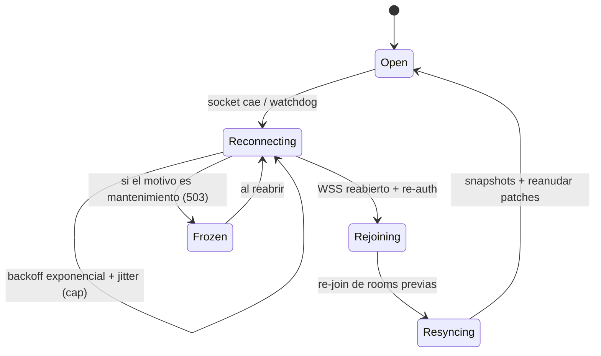

- **Backoff exponencial con jitter** y tope (p. ej. 1s→2s→4s→…→máx 30s) para no martillar el Gateway (respeta C17).
- **Re-auth**: si el token expiró durante la caída, se refresca vía REST (`/auth/...`) antes de reintentar el WS.
- **Re-join idempotente**: se re-solicitan exactamente las rooms que estaban activas (persistidas en memoria de la capa de red).
- **Recuperación por snapshot**: tras re-join, el Gateway envía snapshots; el pipeline (§12.5) los aplica reemplazando el subárbol, y como la aplicación de patches es idempotente (P6), no hay doble contabilidad. **El estado local converge al del servidor sin recargar la página.**
- **UX**: durante `Reconnecting`, banner discreto "reconectando…"; el mundo queda en *lectura del último estado* (marcado stale, §13.9), comandos deshabilitados.

### 12.13 Resync explícito

Se dispara resync (snapshot bajo demanda de una room) cuando:
- Hay **hueco de sequence** irrecuperable (§12.5).
- Se **reabre** tras mantenimiento o reconexión.
- El **drift de sim-time** supera un umbral (indica desincronización).
- El jugador pulsa "resincronizar" (escape hatch de diagnóstico).

El resync es barato y correcto por construcción del backend (que ya vive de snapshots + reconciliación), y es preferible a intentar "parchear el parche perdido".

### 12.14 Desconexión final y cierre limpio
- Al salir de `/play` o cerrar sesión: `leave` de todas las rooms, cierre ordenado del WS, `game.destroy` (§11.13), y limpieza de timers/heartbeats.
- Al `logout`: además, `DELETE /auth/sessions/current` (REST) y purga de estado sensible en memoria (el estado de dominio no se persiste localmente salvo caché no sensible).

### 12.15 Contract-tests de red (garantía de la ACL)
La corrección del `GatewayTransportAdapter` (que traduce el protocolo real a room/snapshot/patch/message) se garantiza con **contract-tests** (§22.6) que ejecutan grabaciones/fixtures reales del Gateway contra el adaptador y verifican que emite los snapshots/patches/messages esperados. Esta es la red de seguridad de ADR-FE-004.

---

## 13. Flujo completo de datos (end-to-end)

Aquí se traza el recorrido del dato en ambos sentidos: del **servidor al píxel** y del **intent del jugador al servidor**, con los puntos de transformación explícitos. Es la síntesis operativa de todo lo anterior.

### 13.1 Flujo descendente: Servidor → Gateway → Store → Vue → Phaser

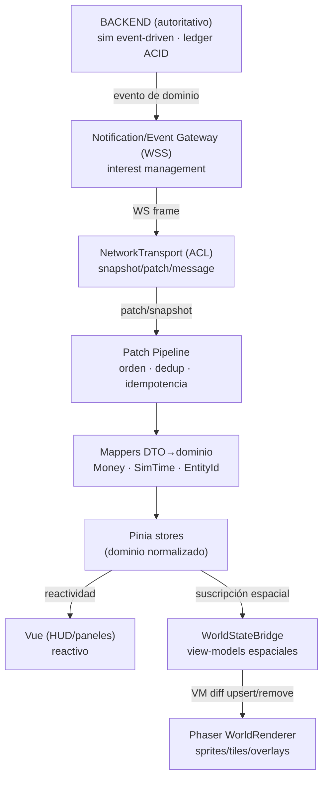

**Puntos de transformación (de servidor a píxel):**

1. **Gateway → NT**: el frame WS crudo del Gateway se traduce al modelo `snapshot|patch|message` (ACL, §4.4/§12.2).
2. **NT → Pipeline**: ordenación por `(sim_time, sequence)`, dedup, detección de huecos (§12.5).
3. **Pipeline → Mappers**: los DTO crudos (strings de punto fijo, UUID, sim-time en segundos) se convierten a **tipos de dominio branded** (`Money`, `Quantity`, `SimTime`, `EntityId<T>`). Aquí, y **solo aquí**, se cruza la frontera de infraestructura (§9.5).
4. **Mappers → Store**: aplicación **idempotente** a la store dueña, normalizada por UUID (P2, §20.5).
5. **Store → Vue**: reactividad de grano fino; los componentes que leen los getters afectados se re-renderizan.
6. **Store → Bridge → Phaser**: el bridge deriva view-models espaciales acotados al viewport y emite diffs al renderer (§11.6), que reconcilia sprites desde el pool.

**Ejemplo concreto — un vehículo cruza un nodo:**

```mermaid
sequenceDiagram
    participant Shard as Backend shard
    participant GW as Gateway
    participant NT
    participant Store as fleet.store
    participant Sprite as VehicleSprite
    Shard->>GW: evento hito: vehículo V llega a nodo N (sim_time, seq)
    GW->>NT: patch { upsert vehículo V: {link, tEnter, speedProfile} }
    NT->>Store: apply idempotente (mapeado a dominio)
    Note over Store: verdad cinemática actualizada
    loop cada frame de Phaser
        Sprite->>Store: (bridge) lee estado cinemático confirmado
        Sprite->>Sprite: pos = advance(SimClock.now() - tEnter)
    end
    Note over Sprite: entre hitos NO hay tráfico de red;<br/>solo interpolación local
```

### 13.2 Flujo ascendente: Intent (Vue/Phaser) → Application → REST/WS → Backend

```mermaid
flowchart TD
    subgraph Origen del intent
      VUEI["Vue: clic en 'Aceptar oferta'"]
      PHI["Phaser: clic en tile para construir"]
    end
    BUS["Event Bus / composable"]
    UC["UseCase (Application)"]
    OWN["OwnershipPolicy (¿comandable?)"]
    PRED["Predicción optimista MARCADA"]
    REST["RestApi (Idempotency-Key)"]
    BE["Backend (valida autoritativo)"]
    RESULT{"Resultado"}

    VUEI --> BUS
    PHI --> BUS
    BUS --> UC
    UC --> OWN
    OWN -->|permitido en UI| PRED
    PRED --> REST
    REST --> BE
    BE --> RESULT
    RESULT -->|éxito {data,meta}| CONF["reemplaza predicción por verdad + evento llega por WS"]
    RESULT -->|error tipado| REV["revierte predicción + UX de error.code"]
    RESULT -->|timeout| RETRY["reintento con misma Idempotency-Key (backoff)"]
```

**Puntos clave del ascendente:**

1. **Origen unificado**: tanto un clic en el DOM (Vue) como un clic espacial (Phaser) producen el **mismo tipo de intent** que consume el mismo caso de uso. Phaser y Vue son *fuentes intercambiables de intents*.
2. **OwnershipPolicy** (UX preventiva, §5.3): si no es comandable, el intent ni siquiera se ofrece (control deshabilitado); es una segunda red, no la principal.
3. **Predicción marcada** (§13.6): la UI responde ya, con el cambio etiquetado como *no confirmado*.
4. **REST autoritativo**: el backend valida (fondos, stock, espacio, plazos). El cliente **nunca** dio nada por válido.
5. **Confirmación**: el éxito trae `{data,meta}` y, poco después, el **evento** por WS que hace canónico el cambio (y borra la marca de predicción). El error trae `error.code` tipado que se mapea a UX.

### 13.3 Flujo pull (tablón / OHLC): petición explícita, no stream

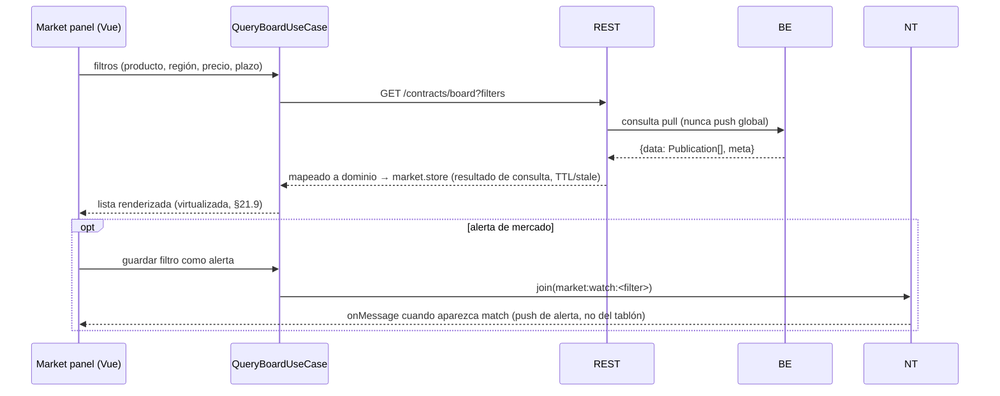

Esto respeta C10 al pie de la letra: el tablón es **pull**; solo las **alertas explícitas** generan push.

### 13.4 Coreografía completa de un caso de uso crítico: aceptar una publicación con ventana de sorteo

Combina REST (comando), WS (resultado del sorteo) y sim-time (countdown). Es el flujo más rico del juego (GDD §5.3.1):

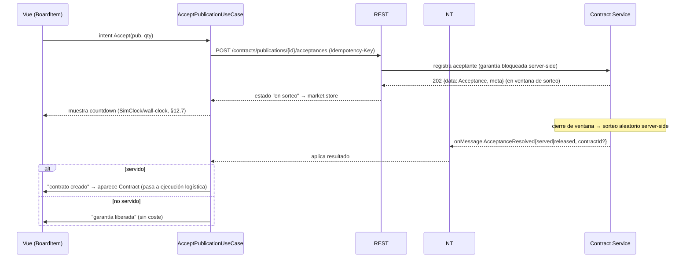

El cliente **no** implementa el sorteo ni el bloqueo de garantías: los **muestra** y **reacciona** al resultado. Pura presentación (P1).

### 13.5 Diagrama consolidado bidireccional

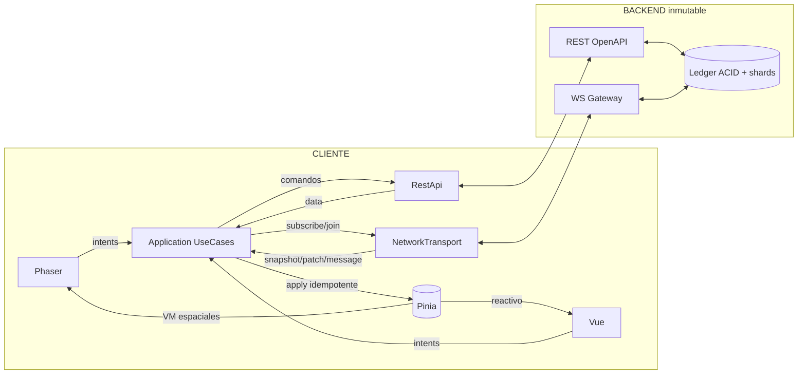

### 13.6 Predicción optimista: reglas duras

La predicción existe **solo** para latencia percibida y está gobernada por `PredictionPolicy`:

1. **Siempre marcada.** Toda entidad/campo predicho lleva un flag `pending: PredictionId`. La UI lo pinta distinto (opacidad, spinner, borde punteado). Nunca se confunde con confirmado.
2. **Solo para efectos localmente inequívocos.** Se predice lo que casi seguro ocurrirá y cuya forma se conoce: "publicación enviada" (aparece en *mis publicaciones* como pending), "ruta asignada", "cola de producción encolada". **No** se predice nada que dependa de resolución server-side incierta: **jamás** se predice ganar un sorteo, ni un precio de ciudad, ni una liquidación.
3. **Reversible siempre.** Cada predicción guarda su *inverso*. Si llega `error.code`, se revierte exactamente (P6). Si llega la confirmación (por REST y/o por el evento WS), se *promueve* a confirmado y se borra la marca.
4. **Reconciliación por identidad.** La confirmación se casa con la predicción por la `Idempotency-Key`/`PredictionId`, no por heurística.
5. **Presupuesto de vida.** Una predicción sin confirmar más de `T` (p. ej. 10 s) se marca *en duda* y dispara consulta/resync; nunca queda colgada indefinidamente.

### 13.7 Mapeo de errores del backend a UX

El backend define una taxonomía de `error.code` (SAD §10: `INSUFFICIENT_COLLATERAL`, y HTTP 400/401/403/404/409/422/429/503). El cliente mantiene un **diccionario único** `error.code → { mensaje i18n, severidad, acción sugerida, ¿revierte predicción? }`:

| `error`/HTTP | Significado (dominio) | UX del cliente |
|---|---|---|
| `422 INSUFFICIENT_COLLATERAL` | Garantía insuficiente | Revertir predicción; señalar el campo; sugerir capital/menor cantidad |
| `409` | Conflicto (publicación agotada, cooldown, stock ya reservado) | Revertir; refrescar el ítem del tablón; explicar |
| `403` | Recurso ajeno / vehículo SELLADO | No debería ocurrir si `OwnershipPolicy` funcionó; log de discrepancia + revertir |
| `404` | UUID no resuelto | Entidad desapareció; refrescar vista |
| `429` | Rate limit | Backoff, "ve más despacio" (§12.10) |
| `503 Retry-After` | Ventana de mantenimiento | Estado `frozen` (§12.9), no error |
| `401` | Sesión expirada | Refresh de token o re-login |
| `400`/`422` (forma) | Comando malformado | Bug de cliente: capturar en dev, telemetría |

Regla: **ningún `error.code` produce un estado local inconsistente**; siempre revierte la predicción asociada y deja el estado igual al del servidor.

### 13.8 Consistencia y convergencia (garantía O10)

Dado que (a) los patches se aplican ordenados e idempotentes, (b) los huecos disparan snapshot, (c) las predicciones son reversibles y (d) el resync reemplaza subárboles, el cliente **converge** siempre al estado del servidor: dos clientes con la misma secuencia de eventos muestran el mismo mundo. No se requiere replay determinista numérico (el backend lo rebajó a aspiración, ADR-012 SAD); basta la convergencia visual.

### 13.9 Marcado de *staleness*

Todo dato que pueda estar desactualizado se marca:
- **`live`**: proviene de patches recientes con socket sano.
- **`stale`**: socket caído/reconectando, o dato pull con TTL vencido → la UI lo atenúa y muestra "actualizando…".
- **`frozen`**: ventana de mantenimiento → overlay dedicado.
- **`pending`**: predicción no confirmada.

Estos cuatro estados son de primera clase en el modelo de vista (§20.7) y se pintan de forma consistente en toda la UI (P10, honestidad con el jugador).
---

## 14. Gestión de assets

Los assets del cliente se dividen en dos universos que **no deben mezclarse**: (a) **assets de UI** (fuentes, iconos SVG, imágenes de portal) procesados por el build de Nuxt/Vite; y (b) **assets de juego** (spritesheets, atlases, tilemaps, audio) cargados en runtime por el **Loader de Phaser**. Esta sección cubre spritesheets, tilemaps, audio, fuentes, lazy loading, caché y versionado.

### 14.1 Taxonomía de assets

| Clase | Ejemplos | Pipeline | Cargador |
|---|---|---|---|
| **Atlases de sprites** | edificios (por tipo/nivel), vehículos (por tipo/orientación), ciudades (por nivel), iconos de estado espacial | Empaquetado en *texture atlases* (§14.2) | Phaser Loader (Preload) |
| **Tilesets / Tilemaps** | terreno top-down, biomas, ríos, red logística | Tiled JSON + tileset atlas | Phaser Loader |
| **Audio** | ambiente, UI sfx, avisos (avería, entrega) | sprites de audio (audio sprite) | Phaser Sound / HTMLAudio |
| **Fuentes de UI** | tipografía del design system | woff2 subset | CSS `@font-face` (build) |
| **Bitmap fonts** | etiquetas ancladas al mundo (nombres, contadores) en WebGL | fnt + atlas | Phaser Loader |
| **Iconos de UI** | iconos de HUD/paneles | sprite SVG (build) | DOM/CSS |
| **Datos estáticos** | catálogos (tipos, recetas, productos, geometría de región) | JSON vía REST (§12.6) | RestApi (cacheado) |

Regla: **nada espacial se carga como asset de build; nada de UI se carga por el Loader de Phaser.** Mantener los dos pipelines separados evita bloquear el arranque del portal con megabytes de atlases del mundo (O7).

### 14.2 Spritesheets y texture atlases

- Todo sprite del mundo vive en **texture atlases** (páginas de textura empaquetadas) para maximizar el **batching** WebGL: sprites que comparten atlas se dibujan en una sola draw call (§21.3, P8).
- **Organización por dominio de atlas**, no monolítica: `atlas-buildings`, `atlas-vehicles`, `atlas-cities`, `atlas-terrain`, `atlas-overlays`. Esto permite cargar/descargar por relevancia (p. ej. atlas de terrenos de un bioma solo cuando se visita esa región).
- **Presupuesto de textura**: cada atlas ≤ tamaño máx seguro (p. ej. 2048² o 4096² según perfil, §21.6); si un dominio excede, se pagina (`atlas-buildings-0`, `-1`).
- **Nivel/estado en el atlas**: las variantes por nivel (edificios 1–4) y estado (operativa/dañada/embargo) son *frames* del mismo atlas para conmutar sin recargar textura.
- **Mipmaps** para sprites que se ven a distintos zooms (reduce aliasing y coste de muestreo al alejar, §21.6).

### 14.3 Tilemaps (terreno top-down por chunks)

- El terreno se define como **tilemap ortogonal (top-down)** troceado en **chunks** (§16.3). Cada chunk es un tilemap (o capa) cargado bajo demanda según el viewport (streaming, §16.8).
- **Fuente de la geometría**: el mundo es procedural pero **ya persistido** en el servidor (GDD §9). El cliente **no** genera terreno; recibe la definición de la región (biomas, elevación, ríos, red) por REST/snapshot y la materializa en tiles. Para el *arte*, usa tilesets locales; para la *disposición*, los datos del servidor.
- **Capas de tilemap**: base (terreno/bioma), agua/ríos, red logística (enlaces), decoración. Culling por capa (§16.5).

### 14.4 Audio

- **Audio sprites** (un archivo con múltiples clips indexados) para SFX de UI y de mundo, minimizando peticiones.
- **Buses**: `ambient`, `sfx-world`, `sfx-ui`, con volúmenes independientes y respeto del *mute* del navegador/preferencias (§15).
- **Espacialidad ligera**: SFX de mundo (avería, entrega) con volumen atenuado por distancia al centro de cámara; sin audio 3D real (no aporta a un juego de gestión top-down).
- **Política de autoplay**: el audio se arma tras el primer gesto del usuario (requisito de navegadores); antes, silencio sin error.
- **Presupuesto**: audio es *nice-to-have*; se carga con baja prioridad y puede diferirse (§14.5) sin bloquear el juego.

### 14.5 Lazy loading y prioridad de carga

Estrategia de carga escalonada para minimizar *time-to-first-interaction* (O7):

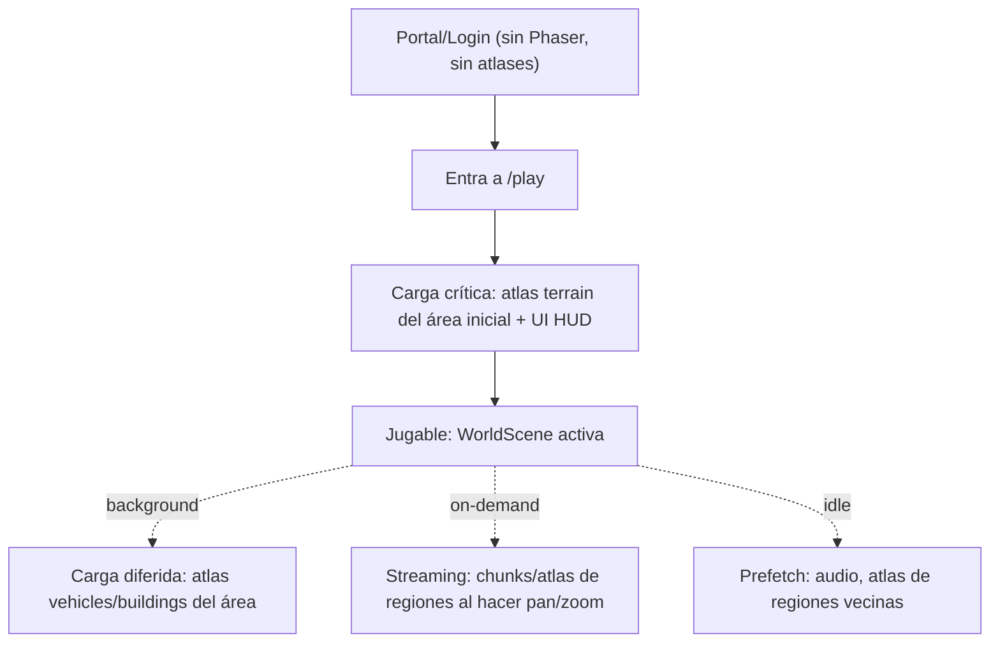

- **Crítico** (bloquea "jugable"): terreno del área inicial + assets de HUD.
- **Diferido** (background tras jugable): atlases de entidades del área visible.
- **On-demand** (streaming): chunks y atlases de regiones a las que el jugador navega (§16.8).
- **Prefetch idle**: durante inactividad, precargar regiones vecinas y audio.
- **Priorización dinámica**: la cola del Loader se reordena según el viewport; lo que el jugador está a punto de ver sube de prioridad.

### 14.6 Caché y versionado

- **Versionado por content-hash**: cada asset (atlas, tileset, audio, catálogo) se sirve con un hash en el nombre/URL. Un cambio de arte cambia el hash → invalidación limpia sin *cache busting* manual.
- **Manifiesto de assets versionado**: un `asset-manifest.json` (generado en build) mapea *lógico → URL con hash*. El cliente resuelve nombres lógicos contra el manifiesto de la versión activa. Coherente con la **ventana de mantenimiento**: los despliegues (nuevos assets) coinciden con la pausa diaria (GDD §1.1), así el cliente en vivo no ve mezclas de versiones.
- **HTTP caching**: assets con hash → `Cache-Control: immutable, max-age` largo (los sirve Caddy, C16). El `index`/manifiesto → sin caché o corta.
- **Caché de catálogos estáticos**: los catálogos REST (tipos, recetas, productos) se cachean en `Storage` (IndexedDB) con su **versión de mundo**; se revalidan al arrancar (`ETag`/versión). No cambian en vivo (solo tras despliegue), así que la caché es muy efectiva.
- **Descarga de assets del mundo** (unload): al alejarse definitivamente de una región, sus atlases/chunks se liberan de memoria GL (§11.13, §16.8) respetando un presupuesto de VRAM (§21.6). El navegador conserva el archivo en HTTP cache; recargarlo es barato.
- **Presupuesto de caché local**: `Storage` respeta cuotas; política LRU para catálogos y datos pull; los assets binarios los gestiona el HTTP cache, no IndexedDB.

### 14.7 Fuentes

- **Tipografía de UI**: 1–2 familias propias en **woff2 subset** (solo glifos usados + números tabulares para columnas monetarias), con `font-display: swap` y precarga (`<link rel=preload>`) de la variante crítica.
- **Números tabulares** (variant-numeric) obligatorios en toda columna de dinero/cantidad para alineación en tablas densas (§15.8).
- **Bitmap fonts** para etiquetas ancladas al mundo en WebGL (rendimiento; el texto DOM anclado se reserva para tooltips y densidades bajas, §15.7).

### 14.8 Pipeline de assets (build-time)

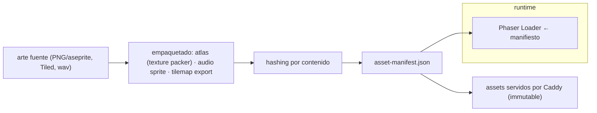

- El empaquetado (texture packing, audio sprite, export de tilemaps) es un **paso de build reproducible** (script `npm run build:assets`), versionado en el repo o en un pipeline de arte. El resultado (atlases + manifiesto) es lo que consume el runtime, nunca el arte crudo.
- **Validación en CI**: presupuestos de tamaño de atlas y de peso total de assets críticos se verifican en CI; un atlas que exceda el presupuesto rompe el build (§21.6, §23.6).
---

## 15. Sistema de UI

La UI de gestión es tan crítica como el mundo: un MMO económico se juega tanto en los paneles como en el mapa. Se construye 100% en Vue + Sass/CSS Modules (C5/C6), como un **design system propio**. Cubre ventanas, diálogos, modales, paneles, tooltips, notificaciones, HUD, barra superior/inferior, sidebar, inspector y minimapa.

### 15.1 Principios de la UI

- **Densidad legible**: es una UI de datos (tablas, cifras, plazos). Prioriza densidad y escaneabilidad sobre decoración. Números tabulares, alineación a la derecha para importes, unidades siempre visibles.
- **Sim-time y wall-clock siempre juntos** donde hay plazos (P5): "vence en 3h 12m (día 361-042)". Un único formateador (§17.5).
- **Honestidad de estado** (§13.9): `live`/`stale`/`frozen`/`pending` se pintan consistentemente.
- **Observable vs comandable** (§5.3): los controles de mando se deshabilitan sobre lo ajeno, con explicación.
- **Teclado de primera clase**: navegación, atajos y focus visibles para sesiones largas (§18.3, accesibilidad).
- **Cero librerías de componentes** (C6): todo componente base es propio.

### 15.2 Arquitectura de estilos (recordatorio operativo, detalle en §10.4)

- **Global**: solo *tokens* (`settings/`) y *layout objects* (`objects/`) + reset (`generic/`). Sin cosmética global.
- **Local**: cada componente trae su `*.module.scss` que `@use` los tokens/mixins y encapsula su cosmética (CSS Modules → clases con hash, sin colisiones ni *specificity wars*).
- **Theming**: los temas (claro/oscuro/alto-contraste) se implementan con **custom properties** mapeadas desde tokens Sass; cambiar de tema es cambiar el mapa activo en `:root`, sin recompilar ni recargar (§15.12).

### 15.3 Layout del juego: canvas + HUD superpuesto

El layout `game.vue` compone el mundo y la UI en capas z:

```
┌───────────────────────────────────────────────────────────┐
│  [TOP BAR]  saldo · sim-time/wall · región · alertas · menú │  z=30 (DOM)
├───────┬───────────────────────────────────────────┬───────┤
│       │                                           │       │
│ SIDE  │            <canvas> PHASER (mundo)          │ INSPEC│  z=0 canvas
│ BAR   │            (pan/zoom/selección)             │ TOR   │  z=20 (DOM)
│ z=20  │                                           │ z=20  │
│       │                                           │       │
├───────┴───────────────────────────────────────────┴───────┤
│  [BOTTOM BAR] flota · producción · notificaciones · minimapa│  z=30 (DOM)
└───────────────────────────────────────────────────────────┘
```

- El `<canvas>` de Phaser ocupa el área central (o todo el viewport, con el HUD flotando encima con `pointer-events` selectivos).
- El HUD (top/bottom/side/inspector) es **DOM/Vue/Sass**, superpuesto por CSS grid + z-index. Las zonas de HUD capturan sus propios eventos; el resto pasa al canvas (pan/zoom/selección).
- **Coordinación de input**: un `pointer-events: none` en contenedores transparentes del HUD deja pasar el input al canvas salvo en los widgets reales (§18.6).

### 15.4 Taxonomía de superficies de UI

| Superficie | Definición | Modal | Anclaje | Ejemplos |
|---|---|---|---|---|
| **HUD** | Marco persistente siempre visible | No | Bordes de pantalla | Top/bottom/side bar, minimapa |
| **Panel** | Contenedor de feature acoplable/desacoplable | No | Sidebar o flotante | Tablón, flota, industria, finanzas |
| **Inspector** | Panel contextual de la entidad seleccionada | No | Lateral derecho | Detalle de edificio/vehículo/ciudad/contrato |
| **Ventana** | Panel flotante movible/redimensionable | No | Libre, apilable | Diseñador de rutas, comparador de mercado |
| **Modal** | Interacción que bloquea el fondo | Sí | Centro, overlay | Confirmaciones críticas, publicación de contrato |
| **Diálogo** | Modal pequeño de decisión | Sí | Centro | "¿Cancelar publicación?" |
| **Tooltip** | Info efímera al hover/focus | No | Anclado al target | Detalle de sprite, ayuda de campo |
| **Toast/Notificación** | Aviso no bloqueante | No | Esquina | "Contrato liquidado", "Avería en vehículo V" |
| **Popover/Menú** | Acciones contextuales | No | Anclado | Menú contextual espacial, dropdowns |

### 15.5 Gestión de ventanas y paneles (window manager)

Un **WindowManager** (composable + slice de UI store) gestiona el estado de paneles/ventanas: abiertos, posición, tamaño, z-order, acoplado/flotante, colapsado.

- **Acoplables**: paneles pueden vivir acoplados en la sidebar o desprenderse como ventanas flotantes (para multi-monitor / power users con muchas corporaciones que gestionar).
- **Persistencia de layout**: la disposición se guarda en `Storage` por usuario (§20.8); al reabrir, el jugador recupera su workspace.
- **Z-order y foco**: clic trae al frente; `Esc` cierra la superficie superior (modal → ventana → popover).
- **Límite de superficies**: un tope razonable de ventanas abiertas evita el caos; el manager sugiere reusar.

### 15.6 Modales y diálogos

- **Un solo modal a la vez** (stack, pero solo el superior es interactivo). El resto del HUD queda inerte (`inert`) para accesibilidad y evitar clics fantasma.
- **Confirmaciones con contexto económico**: publicar/aceptar contratos, cancelar (con aviso del cooldown anti-parpadeo, GDD §5.3.1), acciones que bloquean garantías → el modal muestra **exactamente** qué se bloqueará (stock, garantía, escrow) según el último estado conocido, con la advertencia de que el servidor es autoritativo.
- **Focus trap** y retorno de foco al cerrar; teclado (`Enter`/`Esc`) mapeado.

### 15.7 Tooltips y etiquetas ancladas al mundo

Dos mecanismos según densidad:
- **Tooltip DOM anclado** (Vue): para hover sobre un sprite o un campo. El origen viene de Phaser (coord de pantalla del sprite) → un componente Vue se posiciona ahí (con *collision detection* de bordes). Rico, estilable, accesible. Se usa cuando hay **pocos** targets simultáneos (hover, selección).
- **BitmapText en WebGL** (Phaser): para etiquetas **masivas** ancladas al mundo (nombres de ciudad, contadores sobre edificios) que deben escalar con miles de entidades. Barato, batched, pero menos flexible.
- **Regla**: hover/selección → DOM; etiquetas persistentes masivas → BitmapText, agrupadas/ocultadas por LOD (§16.6).

### 15.8 Componentes de datos (el núcleo de un juego económico)

- **DataTable virtualizada** (§21.9): base del tablón, historial de contratos, lista de flota, inventarios. Ordenación, filtrado, columnas configurables, selección múltiple. Virtualiza filas para listas de miles.
- **MoneyCell / QuantityCell**: renderizan `Money`/`Quantity` (punto fijo) con formateo localizado, números tabulares, signo y color; **nunca** hacen aritmética de float (P10, C11).
- **SimTimeCell / DeadlineCell**: muestran plazos en sim-time + wall-clock + countdown vivo (suscrito al `SimClock`).
- **OHLC/Candlestick chart** (§15.13): historial de precios por producto/región (GDD §5.2), Canvas/SVG propio.
- **StatusBadge**: pinta estados de dominio (contrato: aceptado/en ejecución/liquidado; edificio: operativa/embargo; etc.) con la máquina de estados de UI (§20.9).

### 15.9 HUD — barra superior (top bar)

Información siempre visible, densidad alta:
- **Saldo** de la corporación (Money, live/stale marcado).
- **Sim-time** actual + wall-clock + indicador de ritmo (24×) y **estado del reloj** (`live`/`frozen`).
- **Región activa** / contexto de cámara.
- **Indicador de conexión** (verde/ámbar/rojo) con latencia (link a diagnóstico, §21.10).
- **Alertas** (badge con contador; abre el centro de notificaciones).
- **Menú** de cuenta/ajustes/logout.

### 15.10 HUD — barra inferior (bottom bar) y sidebar

- **Bottom bar**: accesos rápidos y *summaries*: estado agregado de flota (en ruta / averiadas / ociosas), producción global (líneas activas / paradas por combustible o trabajadores), feed corto de notificaciones, y el **minimapa** (§15.11).
- **Sidebar**: lanzador de paneles/herramientas (construir, mercado, flota, logística, ciudades, concesiones, finanzas), con estados (panel abierto/cerrado) y **herramienta activa** (p. ej. modo construcción, §18).

### 15.11 Minimapa

- **Marco Vue** (bordes, controles, toggles de overlay) + **contenido Phaser** (MinimapScene → `RenderTexture` del mundo a baja resolución, §16.9).
- Muestra: regiones, ciudades, entidades propias (destacadas), rutas activas, y el **rectángulo del viewport** actual.
- **Interacción**: clic/arrastre para saltar la cámara (jump/pan); overlays conmutable (congestión, propiedad) a escala.
- **Rendimiento**: se re-renderiza a baja frecuencia (no cada frame), solo cuando cambia el estado relevante o el viewport (§21.7).

### 15.12 Inspector contextual

- Panel que refleja la **selección actual** (single o múltiple, §11.10).
- **Polimórfico por tipo**: edificio (receta, cola, nivel, estado, buffers, acciones de mando si es propio), vehículo (ruta, carga, combustible, desgaste, ETA), ciudad (nivel, demanda por producto, radio, crecimiento), contrato (fill, plazo, partes, garantías), concesión (canon, vencimiento, traspaso).
- **Acciones de mando** filtradas por `OwnershipPolicy` (§5.3): sobre entidad propia → controles activos; ajena → solo lectura con nota "no es tuyo".
- **Selección múltiple**: acciones masivas (reasignar rutas de N vehículos, GDD §8) con confirmación agregada.

### 15.13 Notificaciones y alertas

- **Toasts**: eventos transitorios (liquidación de contrato, avería, entrega, subida de nivel de ciudad). No bloquean; se apilan y auto-descartan; clic lleva a la entidad.
- **Centro de notificaciones**: historial filtrable de eventos de la sesión (persistido en `notifications.store`).
- **Alertas configurables** (GDD §14.2): el jugador define condiciones ("acero < X en región D", "combustible bajo en fábrica F"); se registran como *market watch*/reglas y llegan por `onMessage` (push de alerta, §12.3). La UI de configuración de alertas vive aquí; la evaluación es server-side (pull/alertas, C10).

### 15.14 Theming y accesibilidad

- **Temas**: claro, oscuro (por defecto para sesiones largas), alto contraste. Cambio en caliente (§15.2).
- **Accesibilidad**: navegación completa por teclado, roles ARIA en componentes base, focus visible, contraste AA mínimo en texto de datos, `prefers-reduced-motion` respetado (desactiva animaciones no esenciales, también en overlays de Phaser cuando sea posible).
- **Escalado de UI**: densidad ajustable (compacta/cómoda) y escala de fuente, independiente del zoom del mundo (que es de cámara, §17).
- **i18n**: textos externalizados desde el día 1 (aunque la Fase 1 sea monolingüe); nunca strings hardcodeados en componentes.

### 15.15 Relación UI ↔ mundo (coherencia visual)

Aunque son dos motores de render (DOM y WebGL), comparten el **mismo lenguaje visual**: los tokens Sass (paleta, tipografía de datos, colores de estado) se exponen también a Phaser (como constantes de tema para tintes de sprites, colores de overlay, BitmapText), de modo que "propio vs ajeno", "en riesgo", "saturado" tienen **el mismo color** en el inspector (DOM) y en el mapa (WebGL). Una sola fuente de verdad de diseño para ambos mundos.
---

## 16. Sistema de mapas

El mundo es un **único mapa top-down cenital, persistente, enorme y compartido** (GDD §1, §9). El cliente nunca lo tiene entero en memoria: lo **transmite por chunks** según lo que la cámara ve. Cubre mapa mundial, capas, chunks, tilemaps, culling, render parcial, LOD y streaming.

### 16.1 Modelo del mundo en cliente

- El mundo se particiona en **macro-regiones** (grilla gruesa, p. ej. 500×500 celdas cada una, GDD §9), que además son la **unidad de sharding** del backend (GDD §15.1) y la jurisdicción de juego (impuestos, estadísticas).
- El cliente representa: **regiones** (contexto fiscal/visual), y dentro de cada región, **chunks** de tiles (unidad de streaming y render, más fina que la región).
- **La geometría es autoritativa del servidor** (procedural persistida): el cliente recibe la definición de cada región/chunk (bioma, elevación, ríos, red logística, yacimientos) por REST/snapshot y la materializa con sus tilesets locales. **No** genera terreno (P1).
- **Las formas llegan de la API como GeoJSON-like con coordenadas planas `[x_m, y_m]` en metros de mundo** (SRID 0 cartesiano, ADR-019; desviación documentada de RFC 7946): el cliente las convierte a celdas/píxeles vía `GridProjection` (§16.2), sin ninguna matemática geográfica (lon/lat).

### 16.2 Proyección ortogonal (top-down)

- Vista **top-down cenital estricta (90°)** (ADR-019): tilemaps ortogonales de Phaser, sin proyección isométrica. Una **`GridProjection` ortogonal** en `shared/geometry` convierte **coordenadas de mundo (celda) ↔ coordenadas de pantalla** de forma centralizada (multiplicación/división por el tamaño de tile). Sigue siendo el **único punto de conversión** de coordenadas del cliente (no hay math de proyección disperso).
- **Orden de dibujo por capas**, no por depth sorting por entidad: terreno → agua → red logística → recursos → edificios → vehículos → efectos → overlays → etiquetas (§16.4). En cenital estricto no hay oclusión entre entidades que exija ordenación por `y`; Phaser asigna un `depth` fijo por capa.
- **Footprints** de edificios ocupan varias celdas; su anclaje se calcula desde la celda base sobre la **rejilla ortogonal**.

### 16.3 Chunks

- Un **chunk** es un bloque fijo de celdas (p. ej. 32×32 o 64×64) que se carga, dibuja y descarga como unidad.
- Cada chunk tiene: sus **tiles de terreno** (varias capas, §16.4), y una **lista de entidades** cuya celda base cae dentro (edificios, ciudades; los vehículos se gestionan aparte por ser móviles, §16.10).
- **Ciclo de vida del chunk**: `unloaded → loading (assets+datos) → active (visible) → cached (fuera de viewport pero cerca) → unloaded (lejos)`. Gestionado por el **ChunkManager** (§16.8).

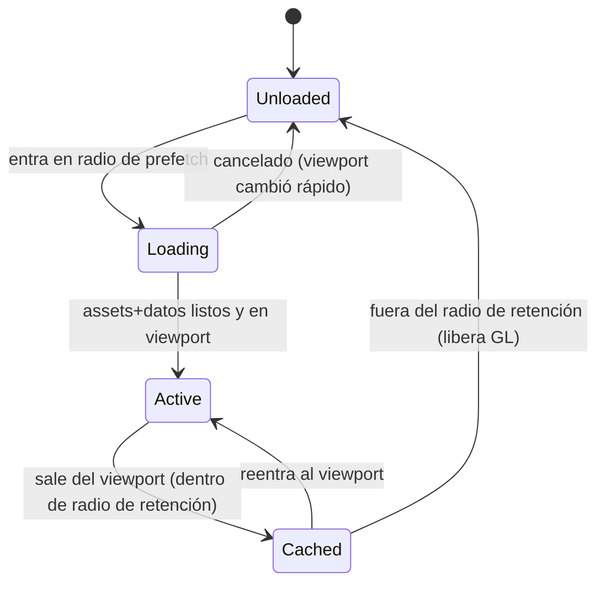

### 16.4 Capas del mapa (layers)

Cada chunk se compone de capas con orden de dibujo fijo (§16.2) y culling independientes:

| Capa | Contenido | Frecuencia de cambio |
|---|---|---|
| **Terreno base** | bioma, elevación (tiles) | Estática (solo tras despliegue) |
| **Agua/ríos** | ríos, costa, mar (animación ligera) | Estática (anim decorativa) |
| **Red logística** | enlaces (carretera/vía/marítima) | Semi-estática (construcción de infraestructura) |
| **Recursos** | yacimientos, agotamiento (GDD §10) | Semi-estática (agotamiento) |
| **Edificios/ciudades** | entidades fijas (sprites) | Dinámica (estado, nivel) |
| **Vehículos** | móviles, marcadores de cargamento | Cada frame (interpolación) |
| **Efectos** | partículas/animaciones puntuales (EffectsScene) | Puntual |
| **Overlays** | congestión, propiedad, demanda (OverlayScene) | Muy dinámica (toggle + datos en vivo) |
| **Etiquetas** | nombres, contadores (BitmapText/DOM) | Según LOD/zoom |

### 16.5 Culling (coste ∝ visible)

- **Culling por viewport**: solo se instancian/actualizan sprites y tiles cuyos chunks intersectan el rectángulo de cámara (más un margen). Phaser hace culling de tilemap; el renderer replica la política para entidades.
- **Culling por capa**: una capa oculta (overlay desactivado) no consume draw calls.
- **Frustum margin (hysteresis)**: se mantiene activo un anillo de chunks alrededor del viewport para que un pan corto no dispare carga/descarga (evita *thrashing*).
- Esta es la materialización directa de P8 en el mapa.

### 16.6 LOD (Level of Detail) por zoom

El nivel de zoom (§17.2) selecciona un **perfil de detalle**:

| Zoom | LOD | Terreno | Entidades | Etiquetas | Animaciones |
|---|---|---|---|---|---|
| **Muy cercano** | 0 (máx) | tiles detallados | sprites completos + detalles | tooltips/DOM | completas |
| **Cercano** | 1 | tiles detallados | sprites completos | BitmapText por entidad | completas |
| **Medio** | 2 | tiles simplificados | sprites base (sin detalles) | etiquetas agrupadas por cluster | reducidas |
| **Lejano** | 3 | tiles agregados / color por bioma | *iconos* de entidad o *dots* | solo ciudades/regiones | pausadas |
| **Región/mundo** | 4 (mín) | coropleta por región (como minimapa) | agregados (nº de edificios, calor) | nombres de región | ninguna |

- A LOD alto (lejano), las entidades se **agregan** (clustering): en vez de 500 sprites de edificio, un indicador de densidad por chunk/región. Esto mantiene el frame budget al ver el mundo entero.
- La transición entre LOD es **con hysteresis** en el umbral de zoom para evitar parpadeo al oscilar el zoom.

### 16.7 Render parcial (partial redraw) y overlays

- El **terreno** de un chunk se rasteriza una vez (o a `RenderTexture` por chunk) y no se repinta salvo cambio de infraestructura → repintado **parcial** solo del chunk afectado.
- Los **overlays** viven en OverlayScene (§11.5) y se activan/desactivan sin tocar el pipeline del mundo: alternar el overlay de congestión no repinta el terreno ni las entidades, solo la capa de overlay.
- Los **móviles** se redibujan cada frame (interpolación), pero son pocos comparados con lo estático y están pooled.

### 16.8 Streaming del mundo

El **ChunkManager** decide qué cargar/descargar según cámara y red:

```mermaid
flowchart TD
    CAM["Cámara: viewport + zoom + velocidad de pan"] --> CALC["calcula chunks: visibles + anillo prefetch + dirección de movimiento"]
    CALC --> DIFF["diff contra chunks activos/cached"]
    DIFF --> LOAD["encola carga: datos (REST/snapshot) + assets (Loader) por prioridad"]
    DIFF --> UNLOAD["encola descarga de chunks fuera de radio de retención"]
    LOAD --> BUDGET{"¿dentro de presupuesto VRAM/mem?"}
    BUDGET -- no --> EVICT["evict LRU de chunks cached"]
    BUDGET -- sí --> ACTIVE["chunk activo"]
```

- **Datos** del chunk: geometría/entidades vienen del servidor. Lo estático (terreno) por REST cacheado (§14.6); lo dinámico (entidades y su estado) por el **viewport room** (snapshot al entrar, patches mientras es visible, §12.3/§12.6).
- **Assets** del chunk: atlases/tilesets por el Loader, priorizados por el viewport (§14.5).
- **Predicción de dirección**: si el jugador hace pan sostenido hacia el este, se prefetch de chunks al este antes de que entren en viewport.
- **Presupuesto**: VRAM y memoria acotadas (§21.6); al excederse, *evict* LRU de chunks `cached`.
- **Cancelación**: si el viewport cambia rápido (salto por minimapa), las cargas en vuelo de chunks ya irrelevantes se cancelan.

### 16.9 Minimapa (vista global)

- El minimapa (§15.11) es una **vista agregada del mundo entero** a LOD máximo (coropleta por región + puntos de interés propios), renderizada por MinimapScene a una `RenderTexture` de baja resolución.
- **No** carga todos los chunks reales: usa un **modelo agregado** (por región) que el cliente mantiene barato (nº de entidades, propiedad, congestión media) a partir de datos de bajo detalle (catálogo de regiones + resúmenes). Esto evita que "ver el minimapa" implique cargar el mundo.

### 16.10 Vehículos y entidades móviles en el mapa

- Los vehículos **no** pertenecen a un chunk fijo (se mueven entre chunks/regiones). El renderer los gestiona en la capa "móviles" con su propio culling por viewport (§11.7).
- Un vehículo cuya ruta cruza un borde de chunk/región se interpola con continuidad; su verdad vive en `fleet.store`, no en el chunk. El cruce de frontera de shard es transparente para el cliente (el backend lo resuelve, GDD §15.2).

### 16.11 Coordenadas, picking y consistencia
- Todo el sistema comparte la `GridProjection` (§16.2) para picking (pantalla→celda, §18.4) y para posicionar tooltips/menús DOM sobre el mundo. Una sola matemática de proyección evita desalineaciones entre el clic, el sprite y el tooltip.

---

## 17. Sistema de cámaras

La cámara es el instrumento principal de navegación de un mundo enorme. Se construye sobre la `Camera` de Phaser, encapsulada en un **CameraController** (parte del `WorldRenderer`). Cubre zoom, pan, follow, animaciones y límites.

### 17.1 Modelo de cámara

- **Una cámara principal** (WorldScene) define el viewport que gobierna culling, streaming y el bridge (§11.6, §16.5, §16.8).
- **Cámara de minimapa** (MinimapScene) independiente, a escala de mundo (§16.9).
- El estado de cámara (`{ center, zoom, bounds }`) vive en un slice de UI (`camera` en world/ui store) para poder **persistirlo** (volver donde estabas) y **compartirlo** con el bridge y el interest management (viewport room).

### 17.2 Zoom

- **Rango de zoom discreto-continuo**: continuo para suavidad, pero con **niveles ancla** que mapean a LOD (§16.6). El zoom hacia el **cursor** (no al centro): el punto bajo el puntero permanece fijo, comportamiento estándar de mapas.
- **Fuentes**: rueda del ratón, pinch táctil (§18.2), botones +/− del HUD, atajos de teclado.
- **Zoom → LOD → interest**: un cambio de zoom recalcula LOD (con hysteresis) y puede cambiar el bbox de interés (al alejar, más mundo visible → renegociación debounced del viewport room, §12.3).
- **Límites de zoom**: mínimo (mundo/región) y máximo (detalle de edificio) definidos por el arte y el presupuesto de render.

### 17.3 Pan

- **Métodos**: arrastre (botón medio o espacio+arrastre para no colisionar con selección de botón izquierdo), *edge scrolling* (borde de pantalla), teclas (WASD/flechas), arrastre táctil, y salto por minimapa.
- **Inercia** opcional (momentum) para pan fluido, con desaceleración; respeta `prefers-reduced-motion`.
- **Coalescing con streaming**: el pan alimenta el ChunkManager con dirección/velocidad para prefetch (§16.8).

### 17.4 Follow (seguimiento)

- **Seguir una entidad**: seleccionar un vehículo/edificio y "seguir" centra la cámara y la mantiene sobre la entidad (útil para vigilar un envío crítico). Phaser `startFollow` con *lerp* (suavizado) y *deadzone* (la entidad puede moverse dentro de una zona central sin mover la cámara).
- **Follow de flota**: encuadrar múltiples entidades seleccionadas (fit-to-selection) ajustando center+zoom para que todas quepan.
- **Salir de follow**: cualquier pan manual libera el seguimiento.

### 17.5 Animaciones de cámara y el servicio de tiempo

- **Transiciones**: `pan`/`zoomTo` con easing para saltos (ir a una ciudad desde el inspector, "ver esta ruta", saltar a una alerta). Duración corta y saltable.
- **Cinemática de alertas**: al clicar una notificación ("avería en un vehículo"), la cámara hace un *fly-to* animado a la entidad y la resalta.
- Las animaciones de cámara usan el **RAF de Phaser**, no el `SimClock` (son wall-clock puro, presentación), a diferencia de la interpolación de vehículos que sí usa sim-time (§11.7). Esta distinción es deliberada: mover la cámara no es un evento de dominio.

### 17.6 Límites (bounds)

- **Bounds del mundo**: la cámara no se sale del rectángulo del mundo (o del área generada). Al alejar al máximo, se encuadra el mundo/región.
- **Clamping**: pan y zoom se *clampean* a los bounds; el follow respeta los bounds (no persigue fuera del mundo).
- **Bounds dinámicos**: si el mundo se expande (nuevas regiones, GDD §10/Fase 4), los bounds se actualizan con el catálogo de regiones sin recompilar.

### 17.7 Relación cámara ↔ interest management (cierre del bucle)

```mermaid
flowchart LR
    INPUT["input: zoom/pan/follow"] --> CAM["CameraController: center/zoom/bounds"]
    CAM --> VP["viewport bbox + chunks visibles"]
    VP --> CULL["culling + LOD (render)"]
    VP --> STREAM["ChunkManager (assets/datos)"]
    VP --> IM["viewport room (debounced) → Gateway interest mgmt"]
    IM --> PATCH["patches de entidades visibles"]
    PATCH --> STORE[(stores)] --> BRIDGE[bridge] --> CAM2["sprites en el viewport"]
```

La cámara es, por tanto, el **director de orquesta** del cliente: qué se renderiza, qué se transmite y qué se suscribe se derivan todos de su estado. Por eso su estado es de primera clase y está centralizado.
---

## 18. Sistema de input

El input es compartido entre dos consumidores (el mundo Phaser y la UI DOM) y debe repartirse sin conflictos. Cubre mouse, touch, teclado, shortcuts, drag, drop, selección múltiple, hover y menú contextual.

### 18.1 Arquitectura de input

- **Dos dominios de input coexisten**: el **HUD/DOM** (Vue) y el **mundo/WebGL** (Phaser). El reparto lo gobierna el CSS (`pointer-events`) del layout (§15.3): los widgets de HUD capturan su propio input; el resto del área pasa al canvas.
- **Todo input produce un `intent`**, no una acción directa: un clic espacial no "construye" — emite `WorldPointerDown(cell)` que un caso de uso (según la herramienta activa) interpreta. Esto mantiene P1/P4: el input es una fuente de intents, la decisión es de la Application Layer.
- **Modelo de herramienta activa** (`InputMode`): la interacción con el mundo depende del *modo* actual — `select` (por defecto), `build`, `route`, `measure`, `inspect`. El modo vive en un slice de UI; determina cómo se interpretan los gestos espaciales.

### 18.2 Mouse y touch

| Gesto | Mouse | Touch | Efecto (modo `select`) |
|---|---|---|---|
| Tap/clic izq | clic izq | tap | seleccionar entidad / deseleccionar |
| Arrastre izq | drag izq | drag 1 dedo | rubber-band (selección múltiple) o pan (config) |
| Pan | drag medio / espacio+drag / edge | drag 1–2 dedos | mover cámara |
| Zoom | rueda | pinch | zoom al cursor/centro del pinch |
| Clic der | clic der | long-press | menú contextual |
| Hover | move | — (sin hover en touch) | resaltar + tooltip |
| Doble clic | doble clic | doble tap | follow / zoom-in a entidad |

- **Touch como entrada secundaria** (C18): soportado para tablet, con *hit targets* agrandados y sin depender de hover (los tooltips de hover tienen equivalente de tap-to-inspect).
- **Pointer Events API** unificada (mouse+touch+pen) donde sea posible, con normalización en un `PointerAdapter`.

### 18.3 Teclado y shortcuts

- **Sistema de shortcuts** centralizado (`KeybindingService`) con: mapa configurable por el usuario (persistido en `Storage`), *scopes* (global, mundo, panel activo, modal), y prevención de conflictos.
- **Atajos base**: navegación de cámara (WASD/flechas), zoom (+/−), toggles de overlay (teclas 1–5), abrir paneles (m=mercado, f=flota, b=construir…), `Esc` (cerrar superficie / salir de modo), `Space` (pan/pausa de foco), `Ctrl+Z` no aplica (no hay undo local de dominio — el servidor es autoritativo; sí hay cancelar-modo).
- **Scope-aware**: cuando un modal o input de texto tiene foco, los shortcuts de mundo se **suspenden** (no mover la cámara al escribir en un campo). El `KeybindingService` respeta el foco DOM.
- **Accesibilidad**: toda acción disponible por ratón debe tener ruta por teclado (§15.14).

### 18.4 Picking espacial (pantalla → entidad)

- El clic en el canvas se convierte de **coordenada de pantalla → celda de mundo** vía `GridProjection` (§16.2), y de ahí a **entidad** consultando el índice espacial del renderer (qué sprite/footprint ocupa esa celda, resolviendo lo superpuesto por prioridad de capa, §16.2).
- **Prioridad de picking**: entidad móvil > edificio > tile de terreno (se selecciona lo más "arriba" y accionable).
- **Tolerancia**: para sprites pequeños a lejano LOD, un radio de picking evita exigir precisión de píxel.

### 18.5 Drag & drop

Dos usos distintos:
1. **Colocación (build mode)**: arrastrar un tipo de edificio desde el panel de construcción (DOM) al mundo (Phaser). El *drag* empieza en DOM y termina en canvas → un `DragBridge` traduce el drop a una celda de mundo. Durante el arrastre, un **fantasma** (ghost) del edificio sigue el cursor sobre el mapa, mostrando validez *aparente* (footprint libre según último estado conocido) — pero la validación real es del servidor (P1): el drop emite `RequestBuildAt(cell, type)` y el resultado (éxito/error) llega del backend.
2. **Reasignación**: arrastrar un vehículo a una ruta, o reordenar la cola de producción (dentro de un panel DOM). Estos son drags DOM puros.

### 18.6 Coordinación HUD ↔ canvas (evitar conflictos)

- **Captura por zonas**: los contenedores de HUD con contenido interactivo tienen `pointer-events: auto`; los transparentes, `pointer-events: none` (dejan pasar al canvas).
- **Modales/ventanas** capturan todo el input mientras están abiertos (el mundo no recibe gestos detrás de un modal).
- **Foco de teclado**: un único elemento tiene foco; el `KeybindingService` enruta según scope (§18.3).
- **Gestos ambiguos**: arrastre con botón izquierdo sobre el canvas = selección; sobre un widget = su comportamiento. El reparto por `pointer-events` lo resuelve sin lógica especial.

### 18.7 Hover y feedback
- **Hover en mundo**: throttled (no cada mousemove) → resalta el sprite bajo el cursor (OverlayScene) + tooltip DOM anclado (§15.7). En build mode, hover muestra el ghost.
- **Hover en UI**: tooltips de ayuda de campo, previews de valores.
- **Cursor contextual**: el cursor cambia según modo/target (cruz en build, mano en pan, prohibido sobre lo no comandable).

### 18.8 Menú contextual (context menu)
- Clic derecho / long-press sobre una entidad → `ContextMenuRequested(entityId, screenPos)` (§11.10).
- Un componente Vue lo renderiza (DOM, estilable, accesible), poblando acciones **filtradas por `OwnershipPolicy`** (§5.3): sobre entidad propia, acciones de mando; sobre ajena, solo "inspeccionar"/"seguir"/"ver en mercado".
- Se cierra con `Esc`, clic fuera, o selección de acción.

### 18.9 Input y predicción
- Acciones de input que disparan comandos usan **predicción optimista marcada** (§13.6) para feedback inmediato (el ghost de construcción se queda como "pending" hasta confirmación), pero **nunca** dan el resultado por hecho.

---

## 19. Sistema de eventos (Event Bus)

El cliente es internamente **event-driven** (coherente con el backend, P y §3.2). Coexisten varios "buses" con responsabilidades y alcances distintos; mezclarlos es un antipatrón que esta sección previene.

### 19.1 Los cuatro planos de eventos (y cómo NO mezclarlos)

| Plano | Mecanismo | Alcance | Ejemplos | Regla |
|---|---|---|---|---|
| **Eventos de red (dominio)** | `NetworkTransport` → Pipeline → stores | Servidor → cliente | patch de vehículo, resultado de sorteo | **No** se exponen crudos a la UI; se aplican a stores y la UI reacciona a las stores |
| **Reactividad de estado** | Pinia + Vue reactivity | stores → Vue/bridge | saldo cambió → top bar se actualiza | Preferido para "algo cambió en el estado"; **no** usar un bus para esto |
| **Eventos de Phaser** | `EventEmitter` interno de Phaser/escena | dentro del render | input espacial, ciclo de escena | Se **traducen** a intents en la frontera (bridge/input), no se propagan a Vue directamente |
| **Bus de aplicación (intents/UX)** | `AppEventBus` tipado | inter-subsistema desacoplado | `SelectEntity`, `OpenPanel`, `ContextMenuRequested`, `FlyToEntity` | Para acciones/coordinación que **no** son estado ni red |

**Principio rector (P sobre eventos):** *si es estado, va a una store (reactividad); si es una acción de coordinación entre subsistemas desacoplados, va al AppEventBus; si es red, va por el pipeline a stores.* El AppEventBus **no** transporta estado de dominio ni reemplaza a Pinia.

### 19.2 El AppEventBus (tipado)

- **Tipado exhaustivo**: un mapa `EventName → Payload` con discriminación; `emit`/`on` type-safe. Nada de strings mágicos sueltos.
- **Namespacing por dominio**: `world:*`, `ui:*`, `market:*`, `camera:*`.
- **Sin acoplamiento de identidad**: emisor y receptor no se conocen; el bus desacopla (p. ej. el input de Phaser emite `camera:flyTo` y el CameraController escucha, sin referencia directa).
- **Ciclo de vida**: los suscriptores se dan de baja en `onUnmounted`/`scene.shutdown` (§11.13). Fugas de listeners son un bug de CI (test de humo, §22.5).

### 19.3 Traducción Phaser → intents (la frontera de eventos del render)

Los eventos internos de Phaser (`pointerdown`, `dragstart`, `wheel`, colisiones de picking) **no** salen crudos de la Rendering Layer. El módulo `game/input/` y `game/bridge/` los **traducen** a:
- **Intents de dominio** (`RequestBuildAt`, `AssignRouteTo`) → casos de uso.
- **Eventos de UX** (`SelectEntity`, `ContextMenuRequested`, `camera:flyTo`) → AppEventBus.

Así, cambiar de motor de render (hipotético) no rompe la app: solo se reescribe esta frontera de traducción.

### 19.4 Traducción red → estado (recordatorio)

Los eventos de red se aplican a stores (§13.1). La UI y el render reaccionan a las stores, **no** se suscriben al socket. Excepción: *mensajes* puntuales sin estado (sorteo resuelto, alerta) que un caso de uso enruta —posiblemente re-emitiéndolos como evento de UX (`ui:notify`)— pero incluso esos suelen dejar rastro en `notifications.store`.

### 19.5 Diagrama del flujo de eventos del cliente

```mermaid
flowchart TD
    subgraph Red
      NT[NetworkTransport] --> PIPE[Pipeline] --> STORES[(Pinia)]
    end
    subgraph Render
      PH[Phaser events] --> TRANS[input/bridge translation]
    end
    TRANS -->|intents dominio| UC[UseCases]
    TRANS -->|eventos UX| BUS[AppEventBus]
    UI[Vue components] -->|intents dominio| UC
    UI -->|eventos UX| BUS
    UC --> STORES
    UC --> REST[RestApi]
    STORES -->|reactividad| UI
    STORES -->|VM espaciales| PH
    BUS --> UI
    BUS --> CAM[CameraController]
    BUS --> WM[WindowManager]
```

### 19.6 Buenas prácticas (checklist de revisión)

1. **No** usar el AppEventBus para pasar estado que otra parte necesita leer más tarde → eso es una store.
2. **No** suscribir componentes Vue directamente al `NetworkTransport` → siempre vía stores/casos de uso.
3. **No** emitir eventos de Phaser hacia Vue sin traducir → pasar por `input/bridge`.
4. **Tipar** todos los eventos; prohibido `emit('algo', anyPayload)`.
5. **Dar de baja** todo listener en el teardown del owner.
6. **Idempotencia** en handlers de red (P6); los handlers de UX pueden asumir orden pero no exactamente-una-vez.
7. **Un evento, un propósito**: no reutilizar un nombre de evento para dos semánticas.
8. **Evitar cadenas de eventos** largas (evento→evento→evento): si aparece, probablemente falta un caso de uso que orqueste explícitamente.
---

## 20. Gestión de estado (Pinia)

Pinia es la única frontera de estado compartido (ADR-FE-005). Esta sección define stores, datos persistentes vs temporales, estado derivado, sincronización, normalización y los tipos que hacen el estado seguro.

### 20.1 Modelo mental del estado

El estado del cliente es una **proyección local del estado autoritativo del servidor**, más un poco de estado propio de UI. Se clasifica en tres tipos, con reglas distintas:

| Tipo | Origen | Autoridad | Persistencia | Ejemplos |
|---|---|---|---|---|
| **Estado replicado** | servidor (snapshot/patch/REST) | **servidor** | memoria (no persiste entre sesiones) | edificios, flota, contratos, saldo, ciudades |
| **Estado derivado** | computado de replicado | — (getter) | memoria | agregados de flota, cobertura, precios formateados |
| **Estado de UI** | cliente | cliente | `Storage` (persiste) | layout de paneles, tema, keybindings, cámara, filtros guardados |

Regla dura (O1/P1): **el estado replicado nunca se escribe salvo por aplicación de un evento/response del servidor o por predicción marcada.** No hay "setState" arbitrario de dominio desde la UI.

### 20.2 Una store por bounded context

Las stores mapean 1:1 a los contexts (§9.1, §10.2): `session`, `world`, `buildings`, `fleet`, `logistics`, `shipments`, `market`, `cities`, `cadastre`, `finance`, `notifications`, `diagnostics`. Cada store:
- Es **dueña** de su porción de estado (P2). Nadie más la muta.
- Expone **getters** (estado derivado) como su API de lectura pública.
- Expone **acciones de aplicación** (`applySnapshot`, `applyPatch`, `applyCommandResult`) usadas por la Application Layer — **no** por la UI directamente.
- **No** contiene reglas de dominio autoritativas (P1); a lo sumo, *políticas de presentación* puras (formateo, clasificación visual).

### 20.3 Normalización

Las colecciones de entidades con identidad (UUID) se guardan **normalizadas** (P2):

```
buildings.store = {
  byId: Record<BuildingId, Building>,
  idsByRegion: Record<RegionId, BuildingId[]>,   // índices para consultas espaciales
  idsByType: Record<BuildingType, BuildingId[]>,
  // sin duplicar entidades; las listas son índices de ids
}
```

- **Fuente única por entidad**: una entidad vive en `byId` de su store dueña; cualquier otra referencia es por UUID, nunca por copia.
- **Índices** (`idsByRegion`, `idsByType`, `idsByOwner`) se mantienen al aplicar patches, para consultas O(1)/O(k) sin recorrer todo.
- **Referencias cross-store por UUID**: un `Contract` referencia `shipmentId`, `buildingId`; se resuelven por getter contra la store dueña, no se embeben.

### 20.4 Aplicación de eventos (la única vía de escritura de dominio)

Las acciones `applyPatch`/`applySnapshot` implementan las reglas de §12.5/§13.1:
- **Idempotencia** (P6): reaplicar un patch ya visto (por `sequence`) es no-op.
- **Orden**: se aplican en orden `(sim_time, sequence)`; el pipeline garantiza el orden antes de llamar a la store.
- **Snapshot reemplaza subárbol**: `applySnapshot(room)` sustituye la porción correspondiente (no fusiona ciegamente), para converger tras resync.
- **Marcado de origen**: cada entidad puede llevar meta (`lastSeq`, `staleness`) para diagnóstico y para el marcado `live/stale` (§13.9).

### 20.5 Estado derivado (getters memoizados)

Todo lo que se puede **computar** del estado replicado se expone como **getter**, nunca se almacena duplicado (P2):
- `finance`: saldo disponible, garantías bloqueadas totales, exposición por contrato.
- `fleet`: nº en ruta / averiados / ociosos, ETA agregada, consumo estimado.
- `logistics`: cobertura logística (qué ciudades son alcanzables), congestión media por región.
- `market`: mejores ofertas por producto (de la última consulta), spread, tendencia OHLC.
- `cities`: estado de demanda (saturada/hambrienta) por producto.

Los getters son **puros** y memoizados por la reactividad de Vue/Pinia; se recomputan solo cuando cambian sus dependencias. Los view-models espaciales para Phaser (§11.6) son un caso especial de estado derivado, acotado por viewport.

### 20.6 Tipos que hacen el estado seguro (branded types)

El dominio usa **branded types** (P9/P10) para que el compilador impida errores de unidad:

```
type Money    = string & { readonly __brand: 'Money' }      // punto fijo, del servidor
type Quantity = string & { readonly __brand: 'Quantity' }
type SimTime  = number & { readonly __brand: 'SimTime' }     // segundos desde génesis
type EntityId<T extends string> = string & { readonly __brand: `id:${T}` }  // string uuid (UUIDv7, ADR-018)
type BuildingId = EntityId<'Building'>   // derivados de los schemas nominales del contrato
type VehicleId  = EntityId<'Vehicle'>
type RegionId   = EntityId<'Region'>
```

- **`Money`/`Quantity`** solo se manipulan con helpers de `shared/money` (suma/resta/comparación en punto fijo); **prohibido** `Number(money)` para aritmética (C11). El formateo a texto es la única salida.
- **`EntityId<T>`** impide pasar un `BuildingId` donde se espera un `VehicleId`: el UUID es plano y sin prefijo (ADR-018), así que el tipado por entidad vive en el brand, derivado de los **schemas nominales** del contrato (`AccountId`, `ContractId`, `VehicleId`, …); los mappers validan el formato `uuid` al entrar (§9.5).
- **`SimTime`** solo se convierte a wall-clock por el `SimClock` (P5). Nunca se hace `new Date(simTime)` directo.

### 20.7 Estados de vista (staleness) de primera clase

Cada porción de estado replicado expone su **estado de frescura** (§13.9): `live | stale | frozen | pending`. La UI (y el render, con tintes) lo consumen para pintar honestamente. Se deriva de: salud del socket (`connectionState$`), TTL de datos pull, estado del `SimClock` (frozen), y flags de predicción.

### 20.8 Persistencia local (Storage)

Solo el **estado de UI** persiste, tras el puerto `Storage` (IndexedDB/localStorage):
- **Preferencias**: tema, densidad, escala, idioma, volúmenes de audio, `prefers-reduced-motion` override.
- **Layout**: posición/tamaño/acople de paneles y ventanas (§15.5), cámara (last view).
- **Keybindings** personalizados (§18.3).
- **Filtros guardados / alertas** de mercado (los criterios; la evaluación es server-side).
- **Caché de catálogos estáticos** versionada (§14.6).

**Nunca** se persiste estado de dominio en vivo ni nada sensible (tokens en memoria/secure storage según política de sesión, §24.2). Al arrancar, el mundo se rehidrata del servidor, no del disco.

### 20.9 Máquinas de estado de UI (espejo, no cálculo)

Los ciclos de vida del dominio (contrato: publicado→aceptado→en ejecución→liquidado; edificio: operativa→dañada→abandonada→embargo→subasta; vehículo: en ruta→averiado→reparando) se modelan como **máquinas de estado de UI** en `domain/state-machines/`. **Espejan** los estados del backend para: (a) pintar `StatusBadge` correctos, (b) habilitar/deshabilitar acciones según estado, (c) validar *forma* de transiciones en UI antes de enviar el comando. **No** deciden transiciones autoritativas (P1): el servidor las dicta; la máquina de cliente solo refleja y anticipa (predicción marcada).

### 20.10 Sincronización entre stores

- **Sin acoplamiento directo**: una store no importa otra. La coordinación cross-store ocurre en **casos de uso** (Application) que leen varias stores y las actualizan de forma consistente, o por **getters** que resuelven referencias por UUID.
- **Consistencia transaccional local**: cuando un evento afecta varias stores (una liquidación toca `market`, `finance`, `shipments`), el caso de uso las aplica en un mismo *tick* para evitar estados intermedios visibles incoherentes (un contrato "liquidado" pero el saldo aún sin reflejar). Si el backend envía esas mutaciones en patches separados, el cliente las aplica idempotentemente y converge; la UI tolera el instante intermedio con marcado `pending`/`stale` si hiciera falta.

### 20.11 Reglas de oro de las stores (checklist)

1. El estado replicado se escribe **solo** por `apply*` desde Application (P1).
2. Colecciones **normalizadas** por UUID; referencias por id (P2).
3. Lo computable es **getter**, no campo (P2).
4. Importes con `Money`, tiempos con `SimTime`; **sin floats** (C11).
5. Aplicación **idempotente y ordenada** (P6).
6. **Sin reglas económicas** en la store (P1).
7. Solo **UI-state** persiste (§20.8).
8. Una store **no importa** otra (§20.10).
---

## 21. Rendimiento y optimización WebGL

El rendimiento no es una fase final: es una restricción de diseño (O3, P8) presente en cada capa. Esta sección fija **presupuestos medibles** y las técnicas para cumplirlos: FPS, batch rendering, texture atlases, object pooling, virtualización, memoización, render selectivo, code splitting, tree shaking, lazy loading y optimización WebGL.

### 21.1 Presupuestos de rendimiento (metas verificables)

| Métrica | Objetivo | Degradado aceptable | Se mide en |
|---|---|---|---|
| **FPS del mundo** (pan/zoom con carga típica) | 60 | ≥ 45 bajo estrés | HUD diag + perf CI |
| **Frame time** | ≤ 16.6 ms | ≤ 22 ms | Phaser step time |
| **Draw calls** (WorldScene) | ≤ ~50–100 | ≤ 200 | GL profiler |
| **Sprites activos** (viewport) | ≤ ~2–3k visibles | culling agresivo | bridge counters |
| **VRAM texturas** | dentro del presupuesto por perfil (§21.6) | evict LRU | GL memory estimate |
| **JS heap** (sesión larga, sin fugas) | plano tras estabilizar | — | memory profiler |
| **TTI a `/play`** (jugable) | ≤ objetivo (p. ej. 3–5 s en red buena) | — | Lighthouse/synthetic |
| **Bundle inicial** (portal/login, sin Phaser) | pequeño (p. ej. < 200 KB gz) | — | bundle analyzer CI |
| **Latencia de aplicación de patch** | ≤ 1 frame | — | pipeline timing |

Estos números son *objetivos de arranque* a calibrar con hardware real; lo esencial es que **existen, se miden y rompen el CI si se degradan** (§21.11, §23.6).

### 21.2 FPS y el game-loop

- Phaser corre su loop en RAF a 60 Hz. El trabajo por frame se acota: interpolación de móviles visibles + reconciliación de sprites (diffs del bridge) + overlays activos. **Nada** de red, mapeo de DTO o cómputo pesado ocurre en el frame (se hace en el pipeline/casos de uso, fuera del RAF de render).
- **Presupuesto por frame** repartido: input+cámara < 2 ms, bridge/reconciliación < 4 ms, interpolación < 4 ms, draw < 6 ms. Si se excede, baja LOD (§21.6).
- **Desacople de Vue**: la reactividad de la UI corre en microtasks, no en el RAF de Phaser; una tormenta de patches actualiza stores → Vue re-renderiza su parte sin bloquear el frame del mundo (y viceversa).

### 21.3 Batch rendering y texture atlases

- **Batching por textura** (P8): sprites del mismo atlas se dibujan en una sola draw call. De ahí la organización de atlases por dominio (§14.2) y el objetivo de mantener el número de atlases activos bajo.
- **Minimizar cambios de textura**: ordenar el render por atlas donde sea posible; evitar intercalar sprites de atlases distintos innecesariamente.
- **Evitar blend/tint costosos por sprite**: los tintes de estado (propio/ajeno, en riesgo) usan una paleta acotada; se prefieren *frames* distintos en el atlas a shaders por sprite cuando el coste lo justifique.
- **Graphics/overlays**: los overlays vectoriales (`Graphics`) se rasterizan a textura cuando son estáticos por frame (congestión no cambia cada frame) en vez de re-emitir geometría continuamente.

### 21.4 Object pooling

- **Pools obligatorios** (P8) para todo lo que aparece/desaparece con frecuencia: `VehicleSprite`, etiquetas, marcadores, partículas, incluso tooltips DOM anclados.
- Al salir del viewport, el sprite **vuelve al pool** (se resetea, no se destruye); al entrar otro, se **reutiliza**. Cero `new Sprite()` por frame.
- **Pre-warm** de pools al cargar una región (crear N sprites inactivos) para evitar hitches de asignación al primer uso.
- Los edificios (más estables) también se poolean a nivel de chunk (§16.3).

### 21.5 Render selectivo (culling + partial redraw)

- **Culling por viewport y por capa** (§16.5): coste ∝ visible.
- **Partial redraw** (§16.7): terreno de chunk cacheado a textura; overlays en escena aparte; solo móviles se repintan cada frame.
- **Dirty tracking**: un chunk/entidad sin cambios no se reprocesa; el bridge solo emite diffs (§11.6).
- **Pausa fuera de foco**: si la pestaña pierde visibilidad (`document.hidden`), el loop baja a *tick* mínimo o se pausa (RAF ya no dispara); al volver, resync + reanudar.

### 21.6 Optimización WebGL específica

- **WebGL2** objetivo; fallback Canvas (Phaser AUTO) para compatibilidad mínima, con perfil de calidad reducido.
- **Perfiles de calidad** (auto-detectados + ajustables): `alto` (antialias, mipmaps, animaciones plenas, atlas 4096²), `medio`, `bajo` (sin antialias, atlas 2048², animaciones reducidas, LOD más agresivo). Se elige por capacidad de GPU y por FPS observado (degradación dinámica).
- **Presupuesto de VRAM**: estimación de memoria de texturas activas; al acercarse al techo del perfil, *evict* LRU de atlases/chunks lejanos (§16.8, §14.6).
- **Mipmaps** para sprites vistos a múltiples zooms (menos aliasing y menos coste de muestreo al alejar).
- **Power preference** `high-performance`; respetar `prefers-reduced-motion` para pausar animaciones no esenciales.
- **Un solo contexto GL**; el minimapa comparte contexto (segunda cámara/RenderTexture), no crea otro.
- **Evitar reads del GPU** (getImageData/readPixels) en caliente: son *stalls*; el picking es matemático (GridProjection + índice espacial, §18.4), no por lectura de píxeles.

### 21.7 Memoización y coalescing

- **Getters memoizados** (§20.5): el estado derivado se recomputa solo ante cambios de dependencias.
- **Coalescing por RAF**: el bridge recomputa VMs como máximo una vez por frame aunque lleguen 100 patches (§11.6). El streaming de chunks se evalúa en cambios de viewport debounced, no por píxel (§16.8).
- **Debounce de interest management**: la renegociación del viewport room es debounced (§12.3) para no spamear el Gateway durante un pan continuo (respeta C17).
- **`computed` vs `watch`**: preferir `computed` (pull, memoizado) a `watch` (push, efecto) para estado derivado; `watch` solo para efectos (disparar streaming, telemetría).

### 21.8 Code splitting y lazy loading

- **Split por ruta**: portal/login/lobby **no** cargan Phaser ni `game/` ni atlases (O7). El chunk de `/play` (Phaser + game + red en vivo) se carga dinámicamente al navegar (§10.6, §11.2).
- **Split por feature/panel**: paneles pesados (diseñador de rutas, comparador de mercado, charts OHLC) se cargan bajo demanda al abrirlos (`defineAsyncComponent`).
- **Split de stores**: stores de features poco usadas se registran perezosamente.
- **Phaser en su propio chunk**: `import('phaser')` dinámico; no entra en el vendor inicial.

### 21.9 Virtualización de listas

- **Toda lista potencialmente grande se virtualiza** (P8): tablón (miles de publicaciones), historial de contratos, flota (cientos de vehículos, GDD §8), inventarios, notificaciones. Solo se montan las filas visibles + margen.
- Implementación propia (sin librería de UI, C6) sobre `IntersectionObserver`/scroll + altura de fila conocida o estimada, integrada en el `DataTable` base (§15.8).

### 21.10 Observabilidad de rendimiento en cliente (HUD de diagnóstico)

- Un **HUD de diagnóstico** (toggle dev/QA) muestra en vivo: FPS, frame time, draw calls, sprites activos, VRAM estimada, JS heap, latencia de red/jitter, drift de sim-time, tasa de patches/s, tasa de desync/resync, tamaño de pools.
- Estos datos viven en `diagnostics.store` y pueden **enviarse como telemetría** (muestreada, anónima) para detectar regresiones en producción (§24.6).

### 21.11 Tree shaking y peso del bundle

- **Tree shaking** (Vite/Rollup): imports nombrados, sin *side-effect imports* salvo los estrictamente necesarios (marcados en `package.json` `sideEffects`).
- **Análisis de bundle en CI**: `bundle analyzer` con **presupuestos** por chunk; superar el presupuesto **rompe el CI** (§23.6). Evita el "creep" de peso.
- **Dependencias auditadas**: cada dependencia nueva se justifica (el mandato C6 ya elimina las CSS/UI libs pesadas); preferir utilidades pequeñas o propias del `shared/` kernel.
- **Assets con hash + immutable cache** (§14.6): el peso se descarga una vez por versión.

### 21.12 Estrategia de degradación (resumen)

Cuando el FPS cae, el cliente degrada en este orden (automático), comunicándolo discretamente:
1. Pausar animaciones no esenciales (humo, agua) y respetar reduced-motion.
2. Subir el umbral de LOD (menos detalle, más clustering, §16.6).
3. Reducir framerate de overlays y de re-render del minimapa.
4. Reducir el margen de culling (menos sprites fuera de viewport).
5. Bajar el perfil de calidad WebGL (§21.6).
6. Cap de sprites por frame con encolado (los menos relevantes esperan un frame).

Nunca se degrada la **corrección del estado** (los datos siguen siendo los del servidor); solo la *fidelidad visual*. P7.
---

## 22. Testing

La estrategia de testing sigue la **pirámide** adaptada a un cliente con dos motores (Vue + Phaser) y una capa de red compleja. La testabilidad **es** la razón de tantos puertos: cada frontera es un punto de sustitución por dobles.

### 22.1 Niveles y herramientas

| Nivel | Alcance | Herramienta | Doble de test |
|---|---|---|---|
| **Unitario** | dominio, casos de uso, mappers, money/time, stores | Vitest | puertos mockeados |
| **Componente (Vue)** | componentes UI en aislamiento | Vitest + Vue Test Utils / Testing Library | stores/props stub |
| **Integración** | caso de uso ↔ store ↔ puerto (fake) | Vitest | fakes de RestApi/NetworkTransport |
| **Contract (red)** | adaptador del Gateway vs protocolo real | Vitest + fixtures/grabaciones del Gateway | backend grabado |
| **Render (Phaser)** | escenas/renderer headless | Vitest + Phaser headless (canvas mock) | VMs sintéticos |
| **E2E** | flujos completos en navegador | Playwright | backend mock/staging |
| **Perf** | presupuestos §21 | Playwright + trazas / benchmark | escenas sintéticas grandes |
| **Chaos/red** | reconexión, latencia, mantenimiento | Vitest/Playwright + transporte falible | transporte inyectado |

### 22.2 Testing del dominio y la aplicación (el corazón)

- El **dominio** es framework-agnostic y puro (§8): se testea sin montar Vue ni Phaser. Money/time/ids, políticas de presentación, máquinas de estado de UI → tests unitarios rápidos y exhaustivos.
- Los **casos de uso** se testean con **fakes de puertos** (`FakeRestApi`, `FakeNetworkTransport`, `FakeClock`): se verifica que un intent produce el comando correcto, aplica la predicción correcta, revierte ante `error.code`, y reconcilia ante el evento de confirmación.
- Los **mappers** (ACL) se testean con **DTOs reales** tomados de `docs/api/openapi.yaml` (fixtures generadas): un DTO crudo entra, un modelo de dominio branded sale, con validación de UUID/punto fijo/sim-time.

### 22.3 Testing de Vue (UI)

- **Componentes base** (UI kit): render, accesibilidad (roles/teclado), estados (`live/stale/frozen/pending`), theming.
- **Paneles de feature**: con stores stub, verificar que muestran el estado correcto y **emiten los intents correctos** (no que "hacen" la acción — eso es del caso de uso).
- **Snapshot testing** con moderación (solo para estructura estable), preferir aserciones semánticas.
- **Testing de `OwnershipPolicy` en UI**: los controles de mando se deshabilitan sobre lo ajeno (§5.3).

### 22.4 Testing de Phaser (render)

Phaser es notoriamente difícil de testear; la arquitectura lo mitiga porque el render está tras el puerto `WorldRenderer` y consume **view-models**, no stores:

- **Renderer headless**: Phaser en modo headless (canvas mockeado) permite instanciar escenas y verificar *lógica de render* sin GPU: que un `upsert` de VM crea/actualiza un sprite del pool, que un `remove` lo devuelve, que el culling excluye lo fuera de viewport, que el LOD selecciona el frame correcto por zoom, que la interpolación evalúa la posición correcta para un `SimClock` dado.
- **Tests de proyección** (`GridProjection`): pantalla↔celda es matemática pura → tests exhaustivos de picking (§18.4) y anclaje.
- **Tests del bridge**: dado un cambio de store + viewport, verificar los diffs de VM emitidos (§11.6).
- **No** se testea "que se vea bonito" en unitario; eso es E2E visual (§22.7) o QA manual.

### 22.5 Testing de caos, red y ciclo de vida

- **Reconexión** (§12.12): inyectar caída de socket → verificar backoff, re-join de rooms exactas, resync por snapshot, convergencia de stores, comandos deshabilitados durante `reconnecting`.
- **Ventana de mantenimiento** (§12.9): inyectar `503 Retry-After` → estado `frozen`, reloj pausado, overlay, resync al reabrir.
- **Pérdida/reordenación de patches** (§12.5): inyectar huecos de sequence → dispara resync; patches fuera de orden → se reordenan; duplicados → no-op (idempotencia).
- **Fugas**: montar/desmontar `/play` N veces → JS heap y memoria GL no crecen monótonamente (§11.13); listeners del bus dados de baja (§19.6).
- **Latencia**: inyectar RTT alto → predicción marcada cubre el feedback; el reloj no retrocede.

### 22.6 Contract-tests de red (la red de seguridad de ADR-FE-004)

Es el conjunto de tests **más crítico** del frontend por el riesgo de la §4.4:
- **`GatewayTransportAdapter`**: se alimenta con **grabaciones/fixtures del protocolo real** del Notification/Event Gateway (obtenidas del equipo de backend / de un entorno de staging) y se verifica que emite los `snapshot`/`patch`/`message` esperados por el puerto. Cualquier cambio del protocolo del Gateway que rompa la ACL **falla aquí**, no en producción.
- **`MockTransportAdapter`**: se verifica que cumple el mismo contrato del puerto que el adaptador real, para que los tests de aplicación/UI que lo usan sean representativos.
- Estos tests se ejecutan en cada PR que toque `network/` y forman parte del *gate* de la Fase 4 del roadmap.

### 22.7 E2E y visual

- **Playwright** cubre los flujos de oro: login → lobby → entrar al mundo → construir → configurar producción → publicar/aceptar contrato (con ventana de sorteo simulada) → ver liquidación; reconexión durante un flujo; mantenimiento.
- Se ejecutan contra un **backend mock** (que sirve `openapi.yaml` con respuestas deterministas + un Gateway falso guionizado) y, en un job aparte, contra **staging** real cuando exista.
- **Regresión visual** (opcional, screenshots de UI DOM; el mundo WebGL es más difícil y se cubre con QA + tests de render headless).

### 22.8 Datos de prueba y fixtures

- **Fixtures derivadas del contrato**: DTOs, snapshots y secuencias de patches generados desde `docs/api/openapi.yaml` y de escenarios de dominio (un ciclo CCRI completo, una avería, una subida de nivel de ciudad).
- **Escenas sintéticas grandes** para perf: generar 10k entidades y medir culling/FPS.
- Fixtures versionadas junto al contrato; si el contrato cambia, las fixtures se regeneran (§10.1).

### 22.9 Cobertura y gates

- **Cobertura mínima** exigida en dominio/aplicación/mappers (lo crítico y puro): objetivo alto (p. ej. ≥ 85%). UI y render con cobertura razonable (menos exhaustiva).
- **Gates de CI** (§23.6): unit+component+integration+contract en cada PR; E2E y perf en `main`/nightly; chaos en nightly.

---

## 23. Pipeline de desarrollo (DX, lint, CI/CD)

### 23.1 Gestor de paquetes y monorepo

- **npm sin workspaces de ningún tipo** (ADR-021): `/frontend` es un paquete Node autónomo; lockfile `package-lock.json` versionado. El Makefile de la raíz del monorepo es el punto de entrada único (`make frontend`, `make generate`, …) y delega en los scripts npm.
- Scripts unificados: `npm run dev` (Nuxt), `npm run gen:api` (tipos desde `docs/api/openapi.yaml`), `npm run build:assets` (atlases/tilemaps), `npm run test`, `npm run lint`, `npm run typecheck`, `npm run build`.

### 23.2 TypeScript estricto

- `strict: true` + `noUncheckedIndexedAccess`, `exactOptionalPropertyTypes`, `noImplicitOverride`, `noFallthroughCasesInSwitch`.
- `npm run typecheck` (vue-tsc) en CI; **cero errores** de tipos es gate de merge.
- Tipos del contrato **generados** desde `docs/api/openapi.yaml` (§10.1); no se editan a mano.

### 23.3 ESLint + reglas de fronteras (lo que hace cumplir la arquitectura)

- **ESLint** (config plana) con `@typescript-eslint`, plugin Vue, plugin de imports.
- **Reglas de fronteras de capa/módulo** (p. ej. `eslint-plugin-boundaries` o `import/no-restricted-paths`) que **codifican §8/§9/§10**:
  - `game/**` no importa de `components/**` ni `modules/**` (O2).
  - `components/**`/`modules/**` no importan de `game/scenes/**` ni `game/renderer/**`.
  - `domain/**` no importa de `application/**`, `infrastructure/**`, `network/**`, `game/**`, Vue ni Phaser (dominio puro, §8).
  - `application/**` no importa adaptadores concretos, solo puertos.
  - una store no importa otra store (§20.10).
  - prohibido `Date.now()`/`new Date()` en dominio/aplicación fuera del `SimClock` (P5) — regla custom.
  - prohibido `parseFloat`/`Number()` sobre tipos `Money`/`Quantity` (C11) — regla custom.
- **Violación de frontera = build roto.** Esta es la garantía mecánica de que la arquitectura no se erosiona.

### 23.4 Prettier, EditorConfig, Sass lint

- **Prettier** (formato) + **Stylelint** (Sass/CSS Modules) con orden de propiedades y prohibición de `@import` (usar `@use`/`@forward`) y de valores mágicos fuera de tokens.
- **EditorConfig** para consistencia entre editores.

### 23.5 Git hooks: Husky + lint-staged + Commitlint

- **Husky** `pre-commit`: `lint-staged` (ESLint/Stylelint/Prettier solo en lo tocado) + `typecheck` incremental si es viable.
- **Husky** `pre-push`: suite unitaria rápida + typecheck completo.
- **Commitlint** con **Conventional Commits** (`feat:`, `fix:`, `refactor:`, `perf:`, `test:`, `docs:`, `build:`, `ci:`, `chore:`), con *scopes* alineados a los contexts (`feat(market): …`, `perf(render): …`). Habilita changelog automático y versionado semántico.

### 23.6 CI/CD

Pipeline por etapas (en cada PR salvo lo indicado):

```mermaid
flowchart LR
    PR[Pull Request] --> INSTALL[npm ci]
    INSTALL --> GEN[gen:api + build:assets]
    GEN --> LINT[eslint + stylelint + prettier check]
    GEN --> TYPE[typecheck vue-tsc]
    GEN --> UNIT[unit + component + integration + contract]
    LINT --> BUILD[build Nuxt]
    TYPE --> BUILD
    UNIT --> BUILD
    BUILD --> BUDGET[bundle budgets + asset budgets]
    BUDGET --> ART[artefacto desplegable]
    ART -->|main/nightly| E2E[Playwright E2E]
    ART -->|nightly| PERF[perf budgets §21]
    ART -->|nightly| CHAOS[chaos/red §22.5]
    ART -->|tag| DEPLOY[deploy tras Caddy]
```

- **Gates de merge**: lint + typecheck + unit/component/integration/contract + build + presupuestos de bundle/assets. Todo verde o no entra.
- **Presupuestos** (§21.1, §21.11, §14.8) como *gates*: superar peso de bundle o de atlas rompe el CI.
- **E2E/perf/chaos** en `main`/nightly (más lentos), con alertas si regresan.
- **Despliegue**: build estático/SSR de Nuxt servido tras **Caddy** (C16), **coordinado con la ventana de mantenimiento** para que los cambios de assets/manifiesto coincidan con la pausa (§14.6) y no haya mezcla de versiones en vivo.
- **Versionado de contrato**: el CI verifica que los tipos generados están sincronizados con `docs/api/openapi.yaml`; si el contrato del backend cambió, el frontend falla ruidosamente hasta reconciliar (O5).

### 23.7 Entornos y configuración

- **Runtime config tipada** (Nuxt `runtimeConfig`) validada con **zod** al arranque: `API_BASE`, `WS_URL`, `ASSET_BASE`, feature flags. Un entorno mal configurado falla al iniciar, no a mitad de sesión.
- **Entornos**: `local` (backend mock o compose local), `staging`, `stress` (contra el cluster de stress test del backend, §backend), `prod`.
- **Feature flags** para activar features por fase (p. ej. `freight`, `electricity` diferidos a fases posteriores, alineado con el roadmap del GDD §21).

### 23.8 Developer Experience

- **Storybook** (o equivalente ligero) para el UI kit: desarrollar/documentar componentes base en aislamiento con sus estados.
- **Playground de escenas** (`/dev/world-sandbox`): una escena Phaser con datos sintéticos para iterar render/cámara/overlays sin backend.
- **Mock server** del backend (sirve `openapi.yaml` + Gateway guionizado) para desarrollar sin depender del backend real.
- **Documentación viva**: este FAD + ADRs en `docs/`; diagramas Mermaid versionados; convenciones en el README de `/frontend`.
---

## 24. Seguridad del cliente

El principio de seguridad es el mismo que el del backend, visto desde el cliente: **nunca se confía en el cliente**. La seguridad real es server-side (autoritativo, GDD §9, SAD §9). El frontend hace *higiene* y *UX honesta*, sabiendo que puede ser inspeccionado, modificado y suplantado.

### 24.1 Postura: el cliente es hostil por defecto

- Todo el código del cliente es **público e inspeccionable** (se ejecuta en la máquina del jugador). No hay secretos en el bundle: ni claves, ni lógica de validación que "proteja" nada, ni reglas económicas ocultas.
- **Ninguna decisión de seguridad depende del cliente.** El backend revalida *todo* (fondos, stock, propiedad, plazos, rate limits). El cliente puede mentir; el servidor no le cree (P1).
- Consecuencia de diseño: el cliente **no** implementa anti-cheat propio ni ofuscación como defensa. El propio diseño del juego elimina los vectores clásicos (ventana de sorteo → la latencia/automatización no da ventaja, GDD §5.3.1/ADR-011; garantías bloqueadas desde publicación → sin spoofing; garantía fija → sin wash-trading). El anti-abuso es **por diseño, no por vigilancia** (SAD §9).

### 24.2 Autenticación y sesión

- **Login** por REST (`POST /auth/sessions`); el token de sesión se maneja según la política del backend. **Preferencia**: cookies `HttpOnly`+`Secure`+`SameSite` gestionadas por el gateway/Caddy (el token no es accesible por JS → inmune a XSS-robo-de-token). Si el backend usa token en cuerpo, se guarda en memoria (no en `localStorage`) y se pasa en el upgrade del WS; nunca se persiste en disco.
- **Renovación**: refresh de token vía REST antes de expirar; si expira durante una caída, se refresca en la reconexión (§12.12).
- **Logout**: `DELETE /auth/sessions/current` + purga de memoria + cierre de WS + destrucción del juego (§12.14).
- **Una sesión por pestaña** (no-objetivo multi-cuenta, §2.3).

### 24.3 Autorización (UX preventiva, no barrera)

- **`OwnershipPolicy`** (§5.3): la UI solo *ofrece* mando sobre lo propio; deshabilita el resto. Esto es **UX**, no seguridad: el servidor responde `403` si el cliente lo intenta igualmente (C13). La política de cliente reduce fricción y errores, no protege nada.
- Cualquier `403` inesperado (el cliente creyó comandable algo ajeno) se **loguea como discrepancia** (posible bug de sincronización de ownership) y se revierte la predicción (§13.7).

### 24.4 Validación de entrada (higiene, doble red)

- **Validación de forma en cliente** con **zod** (o equivalente) antes de enviar: campos requeridos, rangos de UI, formato de `Money`/`Quantity`/`SimTime`. Objetivo: buena UX y evitar viajes obviamente inútiles. **No** es validación de reglas de negocio (eso es del servidor).
- **El servidor revalida todo** y es el árbitro; la validación de cliente **nunca** se asume suficiente.
- **Sanitización de salida**: todo texto de origen no confiable (nombres de corporaciones/ciudades de otros jugadores, mensajes) se renderiza como **texto**, nunca como HTML. Vue escapa por defecto; se **prohíbe `v-html`** con contenido de datos (regla de linter). Previene XSS almacenado vía nombres.

### 24.5 Endurecimiento del frontend (web hardening)

- **CSP** estricta (servida por Caddy, C16): `script-src 'self'` (sin inline salvo hashes/nonces), `connect-src` limitado a API/WS, `img-src`/`font-src` a los orígenes de assets, `object-src 'none'`, `frame-ancestors 'none'`. Mitiga XSS e inyección.
- **Cabeceras**: `Strict-Transport-Security`, `X-Content-Type-Options: nosniff`, `Referrer-Policy`, `Permissions-Policy` restrictiva.
- **Subresource Integrity** donde aplique; preferencia por *self-host* de todo (sin CDNs de terceros en el camino crítico) — coherente con "economía cerrada, sin dependencias externas en el camino de juego" (SAD §3.1).
- **Sin dependencias de terceros no auditadas** en runtime (superficie de supply-chain mínima; el mandato C6 ya elimina varias).
- **WSS/HTTPS obligatorio** (Caddy termina TLS); nunca WS/HTTP en claro.

### 24.6 Telemetría y privacidad

- La telemetría de cliente (FPS, latencia, desync, errores) es **muestreada y anónima**; no incluye PII ni contenido económico sensible. El jugador puede desactivarla (preferencia).
- Los **logs de error** (§23) no exponen tokens ni datos de sesión; se scrubbing antes de enviar.
- Cumplimiento de la política de privacidad del estudio (consentimiento, retención) — coordinar con backend/legal; fuera del alcance técnico de este FAD, pero el cliente **no** recolecta más de lo declarado.

### 24.7 Protección contra manipulación y bots (perspectiva de cliente)

- **No es responsabilidad del cliente** detectar bots ni impedir automatización: el backend trata a humanos y bots por **la misma API con los mismos rate limits** (GDD §9/§13.1), y el diseño elimina la ventaja de automatizar (§24.1). Un jugador que scripta el cliente **no obtiene ventaja** que el servidor no conceda a cualquiera.
- El cliente **respeta `429`** (rate limit) y no intenta evadirlo (§12.10); hacerlo sería inútil (el servidor es el que cuenta) y perjudicial (backpressure, C17).
- **Integridad económica**: garantizada por el ledger ACID del backend (SAD §9); el cliente solo refleja asientos. Ninguna manipulación de cliente puede duplicar valor.

### 24.8 Resumen de la doctrina de seguridad del cliente

| Amenaza | Quién protege | Rol del cliente |
|---|---|---|
| Comando ilegítimo (fondos/stock/propiedad) | **Backend** (revalida, 403/422) | UX preventiva (OwnershipPolicy), no barrera |
| Robo de token (XSS) | CSP + cookies HttpOnly | No guardar token en disco; escapar salida; sin `v-html` |
| Manipulación del estado local | Irrelevante (servidor autoritativo) | Converger al servidor; nada crítico vive solo en cliente |
| Automatización/bots | **Diseño del juego** (sorteo, garantías) | Ninguno; misma API, respetar rate limits |
| Duplicación de valor | **Ledger ACID** | Reflejar, no mover |
| Inyección de contenido (nombres) | Escape de Vue + CSP | Renderizar como texto, prohibir `v-html` |
| DoS al backend | Rate limit backend + backpressure cliente | Coalescing, backoff, respetar 429 (C17) |

---

## 25. Catálogo consolidado de diagramas

Además de los diagramas embebidos en cada sección, se consolidan aquí los flujos macro pedidos explícitamente: inicialización del juego, carga de assets, cambio de escena y comunicación con backend. (Arquitectura general §8.2; capas §8.2; flujo de eventos §19.5; flujo de render §13.1; flujo de networking §12; comunicación §13.5.)

### 25.1 Inicialización del juego (bootstrap end-to-end)

```mermaid
sequenceDiagram
    participant U as Usuario
    participant Nuxt
    participant Plugins as Plugins (pinia, network, sim-clock)
    participant REST
    participant NT as NetworkTransport
    participant GW as Gateway
    participant Host as GameCanvasHost
    participant Ph as Phaser

    U->>Nuxt: navega a /login
    Nuxt->>REST: POST /auth/sessions
    REST-->>Nuxt: token + meta.sim_time
    Nuxt->>Plugins: init (pinia, sim-clock con sim_time inicial)
    U->>Nuxt: entra a /lobby → /play (client-only)
    Nuxt->>Host: mount (dynamic import phaser + game/)
    Host->>Ph: new Game (BootScene)
    Ph->>Ph: Boot → Preload (assets críticos del área)
    Host->>NT: connect(token)
    NT->>GW: WSS + auth
    NT->>GW: join(corp, alerts, viewport0)
    GW-->>NT: snapshots (corp, viewport)
    NT-->>Plugins: apply → stores (bootstrap del mundo)
    Ph->>Ph: Preload listo → WorldScene
    Note over Host,Ph: bridge conecta stores↔renderer; HUD Vue se superpone
    U-->>U: mundo jugable
```

### 25.2 Carga de assets (escalonada)

```mermaid
sequenceDiagram
    participant WS as WorldScene
    participant CM as ChunkManager
    participant L as Phaser Loader
    participant MAN as asset-manifest (hashed)
    participant Caddy

    WS->>CM: viewport inicial
    CM->>MAN: resuelve atlases/tilesets del área (nombres lógicos→URL hash)
    CM->>L: encola CRÍTICOS (terrain área inicial)
    L->>Caddy: GET assets (immutable cache)
    Caddy-->>L: atlases/tilesets
    L-->>WS: complete → render inicial
    par diferido
      CM->>L: atlas vehicles/buildings (background)
    and streaming
      Note over CM: al hacer pan → nuevos chunks: datos (REST/snapshot) + assets on-demand
    and idle prefetch
      CM->>L: regiones vecinas + audio (baja prioridad)
    end
```

### 25.3 Cambio de escena

```mermaid
stateDiagram-v2
    [*] --> Boot: createGame
    Boot --> Preload: GL/config listo
    Preload --> World: assets críticos cargados
    World --> World: streaming de chunks (sin cambio de escena)
    World --> Preload: viaje a región muy lejana sin assets (carga bajo demanda)
    note right of World
      OverlayScene / MinimapScene / EffectsScene
      corren en PARALELO (launch/sleep), no reemplazan World
    end note
    World --> [*]: game.destroy al salir de /play
```

### 25.4 Comunicación con backend (dos superficies)

```mermaid
flowchart TB
    subgraph CLIENTE
      UC[Application UseCases]
      RESTC[RestApi]
      NTC[NetworkTransport]
    end
    subgraph EDGE[Caddy - TLS]
      direction LR
    end
    subgraph BACKEND [BACKEND inmutable]
      API[REST API - OpenAPI]
      GW[Notification/Event Gateway - WSS]
      ENG[Motor Go + Contract Service]
      LED[(Ledger ACID + shards + PostGIS)]
    end
    UC -->|comandos no urgentes + pull| RESTC --> EDGE --> API
    UC -->|join/subscribe + messages| NTC --> EDGE --> GW
    API --> ENG --> LED
    GW -->|interest mgmt| ENG
    API -. data+meta .-> RESTC
    GW -. snapshot/patch/message .-> NTC
```

### 25.5 Índice de diagramas del documento

| Diagrama | Sección |
|---|---|
| Contexto/capas de dependencia | §8.2 |
| Hub de estado (Pinia transversal) | §8.3 |
| Colaboración cross-context (publicar oferta) | §9.4 |
| Montaje de Phaser | §11.2 |
| Estados de escena | §11.5, §25.3 |
| Bridge Pinia↔Phaser | §11.6 |
| Interpolación de vehículo | §13.1 |
| Pipeline de patches | §12.5 |
| Conexión/handshake | §12.4 |
| Ventana de mantenimiento | §12.9 |
| Reconexión | §12.12 |
| Flujo descendente (server→píxel) | §13.1 |
| Flujo ascendente (intent→server) | §13.2 |
| Flujo pull (tablón) | §13.3 |
| Aceptación con sorteo | §13.4 |
| Bidireccional consolidado | §13.5 |
| Streaming de chunks | §16.8 |
| Cámara↔interest | §17.7 |
| Flujo de eventos del cliente | §19.5 |
| CI/CD | §23.6 |
| Inicialización / assets / escena / backend | §25.1–§25.4 |
| Roadmap (Gantt) | §26.2 |
---

## 26. Hoja de ruta del frontend por fases

Estas son **fases de construcción del frontend** (entregables internos del equipo cliente), distintas de las fases de producto del GDD (§21: Fase 0 prototipo → Fase 4 meta-juego). Se alinean así: las Fases FE 1–5 sostienen el **vertical slice jugable** del GDD (su Fase 1); las Fases FE 6–7 acompañan el multi-región y gameplay ampliado (GDD Fase 2); las FE 8–10 escalan y pulen (GDD Fases 3–4). El orden es incremental y cada fase deja algo **verificable**.

> **Nota de secuencia sobre Networking (Fase FE 4).** Aunque Networking es la Fase FE 4, la **validación con el equipo de backend de ADR-FE-004** (§4.4) debe ocurrir *antes*, idealmente durante la Fase FE 1: es la dependencia inter-equipo de mayor riesgo. Las Fases FE 3–4 pueden desarrollarse contra el **mock server** (§23.8) en paralelo, pero no se consideran "hechas" hasta pasar los contract-tests (§22.6) contra el protocolo real.

### 26.1 Fases

#### Fase FE 1 — Infraestructura
- `/frontend` autónomo en el monorepo de raíz fija (ADR-016/ADR-021), npm sin workspaces, TypeScript estricto, ESLint + reglas de fronteras (§23.3), Prettier/Stylelint, Husky/Commitlint.
- Generación de tipos desde `docs/api/openapi.yaml` (`gen:api`, vía `make generate`); pipeline de assets (`build:assets`) esqueleto.
- CI base (lint/typecheck/unit/build + presupuestos de bundle).
- `shared/` kernel: `Money`, `Quantity`, `SimTime`, `EntityId`, `Result`, `EventBus`, `GridProjection` (con tests exhaustivos).
- Runtime config tipada (zod), entornos, mock server del backend.
- **Validación inter-equipo de ADR-FE-004** con backend (protocolo real del Gateway).
- *Entregable:* andamiaje verde en CI, kernel probado, contrato de red acordado.

#### Fase FE 2 — Framework (Nuxt/Vue/Pinia base)
- Nuxt 4 configurado; rutas `index/login/lobby/play/settings`; layouts; SSR/SSG selectivo (§10.6).
- Plugins de arranque (pinia, sim-clock, error-handler); providers de puertos.
- Pinia: stores esqueleto por context; patrón `apply*`; normalización base (§20).
- UI kit mínimo (Button, Panel, Modal, Toast, DataTable base) en Sass/CSS Modules + design tokens + temas claro/oscuro (§15.2).
- Login/lobby funcionales contra REST (auth), `SimClock` inicializado desde `meta.sim_time`.
- *Entregable:* app navegable, login real, shell de `/play` (aún sin mundo).

#### Fase FE 3 — Motor Phaser
- Bootstrap de Phaser client-only en `/play` (§11.2); BootScene/PreloadScene/WorldScene.
- Puerto `WorldRenderer`; renderer headless-testable; pools; `GridProjection` en render.
- Tilemap ortogonal top-down básico + chunks + culling + cámara (zoom/pan/bounds) (§16, §17).
- Sprites base (edificio/vehículo/ciudad) desde atlases; bridge Pinia↔Phaser con VMs sintéticos (§11.6).
- Playground de escenas (`/dev/world-sandbox`).
- *Entregable:* un mundo navegable con datos **sintéticos**, 60 FPS con culling, render testeado headless.

#### Fase FE 4 — Networking
- Puerto `NetworkTransport`; `GatewayTransportAdapter` (ACL sobre el WS real) + `MockTransportAdapter` (dev/test).
- Pipeline de patches (orden/dedup/idempotencia/resync); snapshots; rooms (viewport/corp/alerts).
- Conexión, heartbeat, reconexión con backoff, estado `frozen` (mantenimiento) (§12).
- Cliente REST completo (comandos + pull) con idempotencia y mapeo de errores (§13.7).
- **Contract-tests** verdes (§22.6). Interpolación de vehículos desde eventos reales (§11.7).
- *Entregable:* el mundo se puebla con **estado real del servidor**; reconexión/mantenimiento manejados; el mundo sintético de FE 3 pasa a datos reales.

#### Fase FE 5 — UI (sistema de gestión)
- HUD completo (top/bottom/side bar, inspector, minimapa) (§15).
- WindowManager (paneles acoplables/flotantes, persistencia de layout).
- Paneles de feature del vertical slice: construcción, industria/recetas/cola, flota, finanzas/ledger, y **mercado** (tablón pull + publicar/aceptar + ventana de sorteo + OHLC) (§13.3, §13.4).
- Notificaciones y alertas configurables; tooltips; menú contextual; drag-drop de construcción (§18.5).
- Accesibilidad, teclado, i18n scaffolding, temas.
- *Entregable:* **loop completo jugable** (construir → producir → publicar/aceptar → ver liquidación) — cubre el vertical slice del GDD Fase 1.

#### Fase FE 6 — Mapa (mundo a escala)
- Streaming completo de chunks (datos + assets on-demand, prefetch por dirección) (§16.8).
- LOD por zoom con clustering a lejano; render parcial; overlays analíticos (congestión, propiedad, demanda, cobertura, fiscalidad, recursos) (§16.6, §11.9).
- Minimapa con RenderTexture del mundo agregado; modelo agregado por región (§16.9).
- Bounds dinámicos para expansión de mundo (GDD Fase 4).
- *Entregable:* mundo multi-región navegable a cualquier escala dentro de presupuesto (acompaña GDD Fase 2).

#### Fase FE 7 — Gameplay (ampliación de features)
- Logística avanzada: diseñador de rutas, ETAs (`/logistics/route-plans`), multimodal, terminales y **slots de prioridad**; congestión en overlay y en decisiones de UI.
- **CCRI-Flete** (contratos de transporte) y contratos privados (GDD §5.3.2) cuando el backend los exponga (feature flags).
- Ciudades: panel de demanda/crecimiento; concesiones (canon, vencimiento, traspaso, embargo/subasta, GDD §11).
- Insolvencia/embargo visual (estados de edificio, GDD §5.9/§11.2).
- Selección múltiple y acciones masivas de flota (GDD §8).
- *Entregable:* superficie de gameplay completa del núcleo v1 (acompaña GDD Fase 2→3).

#### Fase FE 8 — Optimización
- Cumplimiento de todos los presupuestos §21 en hardware objetivo; perfiles de calidad y degradación dinámica (§21.6, §21.12).
- Object pooling exhaustivo, virtualización de todas las listas, memoización/coalescing afinados.
- Presupuesto de VRAM y evicción LRU de chunks/atlases; anti-fugas verificado (§11.13).
- Code splitting/tree shaking afinados; TTI a `/play` dentro de objetivo; perf CI con gates.
- HUD de diagnóstico + telemetría de rendimiento (§21.10, §24.6).
- *Entregable:* rendimiento AAA sostenido; perf gates en CI.

#### Fase FE 9 — Testing (endurecimiento)
- Cobertura objetivo en dominio/aplicación/mappers; suite de componentes; render headless; E2E de flujos de oro.
- **Caos de red** completo (reconexión, mantenimiento, huecos, fugas) (§22.5); contract-tests como gate permanente.
- Regresión visual de UI; escenas sintéticas grandes para perf.
- Endurecimiento de seguridad (CSP, cabeceras, escape/`v-html` prohibido, auditoría de deps) (§24).
- *Entregable:* suite completa verde y estable; confianza para producción.

#### Fase FE 10 — Release
- Build de producción tras Caddy; despliegue **coordinado con la ventana de mantenimiento** (§14.6, §23.6); versionado de assets/manifiesto.
- Observabilidad en producción (telemetría, alertas de FPS/desync); runbook de cliente.
- Feature flags de fase; i18n de lanzamiento; pulido de UX y accesibilidad final.
- Soporte a rankings/temporadas y dashboards de análisis (GDD Fase 4) según disponibilidad de backend.
- *Entregable:* cliente en producción, observable, mantenible y alineado con las fases de producto del GDD.

### 26.2 Vista temporal (dependencias)

```mermaid
gantt
    title Roadmap del frontend (fases FE, relativo)
    dateFormat  X
    axisFormat %s
    section Fundacion
    FE1 Infraestructura        :f1, 0, 2
    FE2 Framework              :f2, after f1, 2
    section Motor y red
    FE3 Motor Phaser           :f3, after f2, 3
    FE4 Networking             :f4, after f2, 3
    section Jugable
    FE5 UI                     :f5, after f3, 3
    FE6 Mapa                   :f6, after f4, 3
    FE7 Gameplay               :f7, after f5, 4
    section Calidad
    FE8 Optimizacion           :f8, after f6, 3
    FE9 Testing                :f9, after f7, 3
    FE10 Release               :f10, after f9, 2
```

- **FE3 y FE4 en paralelo** tras FE2 (render con datos sintéticos ‖ red contra mock), convergen en FE5 (UI sobre estado real).
- **FE5 depende de FE3+FE4** (UI necesita render y estado real).
- Validación de ADR-FE-004 es **precondición** de FE4 (marcada en FE1).

### 26.3 Hitos verificables (definition of done por hito)

| Hito | Criterio objetivo |
|---|---|
| Kernel probado (FE1) | `Money`/`SimTime`/`EntityId`/`GridProjection` con tests; CI verde; contrato de red acordado |
| Login real (FE2) | Autenticación REST + `SimClock` corriendo desde `meta.sim_time` |
| Mundo sintético 60 FPS (FE3) | Culling + pooling + cámara; render headless testeado |
| Estado real en el mundo (FE4) | Snapshots/patches pueblan stores; reconexión y mantenimiento OK; contract-tests verdes |
| Loop jugable (FE5) | Construir→producir→publicar/aceptar→liquidar, con sorteo y OHLC |
| Mundo a escala (FE6) | Streaming + LOD + overlays + minimapa dentro de presupuesto |
| Gameplay v1 (FE7) | Logística/fletes/ciudades/concesiones/insolvencia |
| Perf AAA (FE8) | Todos los presupuestos §21 en CI |
| Suite estable (FE9) | Caos/contract/E2E verdes; seguridad endurecida |
| Producción (FE10) | Desplegado tras Caddy, observable, versionado |

---

## 27. Apéndices

### 27.1 Glosario (lenguaje ubicuo, cliente)

| Término | Significado en el cliente |
|---|---|
| **Thin client** | Cliente que solo envía intenciones, recibe eventos y renderiza; no ejecuta lógica de negocio (§5). |
| **Sim-time** | Reloj de dominio (segundos desde génesis, 24×). Único servicio de conversión: `SimClock` (§12.7). |
| **CCRI** | Contrato de Compraventa Respaldado por Inventario. El cliente lo publica/acepta y muestra su ciclo (GDD §5.3). |
| **Ventana de sorteo** | Ventana anti-sniping; el cliente muestra countdown y recibe el resultado (GDD §5.3.1). |
| **Interest management** | El servidor empuja solo eventos del área de interés; el cliente lo expresa como *rooms* (§12.3). |
| **Room** | Abstracción del puerto de red (área de interés/tema); una suscripción temática, no una sala de servidor física (§4.4). |
| **Patch / Snapshot** | Delta ordenado / foto completa de estado; base de la sincronización (§12.5). |
| **Predicción marcada** | Cambio local optimista, etiquetado como no confirmado, reversible (§13.6). |
| **Staleness** | Estado de frescura de un dato: `live/stale/frozen/pending` (§13.9). |
| **Observable vs Comandable** | Se ve todo lo del área; solo se comanda lo propio (§5.3). |
| **View-model de render** | Proyección espacial barata del estado que consume Phaser (§11.6). |
| **Bridge** | Puente que deriva VMs desde stores hacia el renderer (§11.6). |
| **ACL (Anti-Corruption Layer)** | Adaptador que absorbe el protocolo del backend sin filtrarlo (§4.4, §9.5). |
| **LOD** | Nivel de detalle según zoom (§16.6). |
| **Chunk** | Bloque de tiles, unidad de streaming/render (§16.3). |
| **Top-down cenital** | Vista del mundo a 90° (ADR-019); sin proyección isométrica ni depth sorting por entidad: el orden de dibujo es por capas (§16.2). |
| **GridProjection** | Conversión ortogonal celda ↔ píxel (por tamaño de tile); único punto de conversión de coordenadas del cliente (§16.2). |

### 27.2 Puertos del cliente (contratos, resumen)

| Puerto | Responsabilidad | Adaptador(es) |
|---|---|---|
| `NetworkTransport` | Tiempo real (room/snapshot/patch/message) | `GatewayTransportAdapter` (real), `MockTransportAdapter` (dev/test) |
| `RestApi` | Comandos/consultas REST (OpenAPI) | cliente generado + interceptores |
| `WorldRenderer` | Render del mundo | impl. Phaser (`game/renderer`) |
| `Clock` | Sim-time ↔ wall-clock, freeze | `SimClock` |
| `Storage` | Persistencia de UI-state | IndexedDB/localStorage |
| `Telemetry` | Métricas/errores | sink de telemetría |
| `OwnershipPolicy` | Comandable vs observable | derivada de session/ownership |
| `PredictionPolicy` | Qué/ cómo predecir y revertir | política de aplicación |

### 27.3 Matriz de trazabilidad (requisito del prompt → sección)

| Requisito solicitado | Sección(es) |
|---|---|
| Objetivos arquitectónicos | §2 |
| Principios de diseño | §3 |
| Restricciones | §4 (incl. contrato de red del backend §4.4) |
| Responsabilidades del cliente (thin) | §5 |
| Tecnologías elegidas + justificación | §6 |
| Arquitectura general (6 capas) | §8 |
| Arquitectura por módulos | §9 |
| Organización del proyecto + carpetas | §10 |
| Phaser (integración, Vue, Pinia, escenas, assets, cámaras, mapas, sprites, vehículos, edificios, ciudades, overlays, zoom, selección, animaciones) | §11 (+ §16, §17, §18) |
| WebSocket (conexión, reconexión, rooms, sync, snapshots, eventos, comandos, predicción, latencia, compensación, heartbeats, reintentos, desconexión, recuperación) | §12 (+ §13) |
| Flujo completo de datos + diagramas | §13, §25 |
| Gestión de assets (spritesheets, tilemaps, audio, fuentes, lazy, cache, versionado) | §14 |
| Sistema de UI (ventanas, diálogos, modales, paneles, tooltips, notificaciones, HUD, barras, sidebar, inspector, minimapa) | §15 |
| Sistema de mapas (mundial, capas, chunks, tilemaps, culling, parcial, LOD, streaming) | §16 |
| Sistema de cámaras (zoom, pan, follow, animaciones, límites) | §17 |
| Sistema de input (mouse, touch, teclado, shortcuts, drag, drop, selección múltiple, hover, context menu) | §18 |
| Sistema de eventos (bus; UI/Phaser/red/Vue; buenas prácticas) | §19 |
| Gestión de estado (Pinia; persistente/temporal; derivado; sync; normalización) | §20 |
| Rendimiento (FPS, batch, atlases, pooling, virtualización, memoización, render selectivo, splitting, tree shaking, lazy, WebGL) | §21 |
| Testing (unitario, integración, E2E, Phaser, Vue) | §22 |
| Pipeline (lint, ESLint, Prettier, Husky, Commitlint, Conventional Commits, CI/CD) | §23 |
| Seguridad (no confiar en cliente, validaciones, auth, authz, manipulación, bots) | §24 |
| Diagramas Mermaid (general, comunicación, capas, eventos, render, networking, init, assets, escena, backend) | §8, §12, §13, §16, §17, §19, §25 |
| ADR (Vue, Nuxt, Phaser, WebSocket/red, Pinia, Sass; descartes React, PixiJS, Tailwind, Redux, Unity, Godot) | §7 |
| Roadmap por fases (1–10) | §26 |

### 27.4 Riesgos del frontend (registro)

| Riesgo | Prob. | Impacto | Mitigación |
|---|---|---|---|
| **Divergencia con el protocolo real del Gateway** (fuera del OpenAPI, ADR-FE-004) | Media | Alto | ACL en un solo adaptador; contract-tests (§22.6); acuerdo inter-equipo en FE1; mock server |
| **Deriva del contrato REST** sin avisar al cliente | Media | Alto | Tipos generados desde OpenAPI; CI falla si desincroniza (§10.1, §23.6) |
| **Presupuesto de rendimiento no alcanzado** en hardware bajo | Media | Medio | Perfiles de calidad + degradación dinámica (§21.6/§21.12); perf gates |
| **Fugas de memoria WebGL** en sesiones largas | Media | Alto | Pooling, unload de chunks, teardown estricto, test de fugas (§11.13, §22.5) |
| **Erosión de fronteras arquitectónicas** con el tiempo | Alta | Medio | Reglas de linter de fronteras como gate (§23.3) |
| **Peso del bundle (Phaser)** degrada TTI | Media | Medio | Lazy en `/play`, splitting, presupuestos de bundle (§21.8/§21.11) |
| **Coste de construir UI kit desde cero** (sin libs) | Media | Medio | Planificado en FE2/FE5; Storybook; UI kit incremental (§26) |
| **Ventana de mantenimiento mal manejada** (UX rota al pausar) | Baja | Medio | Estado `frozen` de primera clase; tests de caos (§12.9, §22.5) |
| **Desincronización de estado** (huecos de patches) | Media | Medio | Resync por snapshot, idempotencia, marcado stale (§12.13, §13.8) |

### 27.5 Cuestiones abiertas para el equipo de backend (sincronización requerida)

1. ~~**Protocolo exacto del Notification/Event Gateway** (formato de frame, autenticación del WS, semántica de suscripción/interest, forma de snapshots vs deltas, heartbeats). *Bloqueante para ADR-FE-004 / FE4.*~~ **CERRADA (Incremento 4 del backend):** el protocolo quedó acordado e implementado en el **ADR-023** del backend y documentado en **`docs/api/ws-protocol.md`** — frames JSON, auth en banda (primer frame `auth`, cierre `4401`), room `corp`, `joined` con watermark + bootstrap por REST, deltas at-least-once, heartbeat ping/pong. Ver la nota de §4.4.
2. **Estabilidad de `meta.sim_time`** y de los timestamps para calibrar el `SimClock` (frecuencia, monotonicidad).
3. **Rooms/interest disponibles**: ¿el Gateway soporta suscripción por bbox de viewport, o el interest se define por región? Afecta §12.3/§16.
4. **Rate limits concretos** (valores de `429`, cabeceras de backoff) para calibrar coalescing/backpressure (§12.10).
5. **Endpoints de detalle** aún no en el OpenAPI que la UI necesite (p. ej. inventario de edificio ajeno observable, detalle de ciudad para overlay de demanda) — confirmar cobertura de `openapi.yaml`.

---

*Fin del Frontend Architecture Document (FAD) v1.1. Documento vivo: toda decisión estructural nueva se incorpora vía ADR (§7). Ante discrepancia con el GDD/SAD o `docs/api/openapi.yaml`, prevalece el backend y este documento se corrige.*
